# 弊害検証計画

## 概要

| 項目       | 内容                                                  |
| ---------- | ----------------------------------------------------- |
| チケットID | FRONTEND-001                                          |
| タスク名   | floci-apigateway-csharp に Angular フロントエンド追加 |
| 作成日     | 2026-04-29                                            |

本書では、フロント追加 / CORS 追加 / OPTIONS 追加 / floci S3 利用 / `JsonHeaders` 拡張 / CI ジョブ追加 によって発生し得る副作用を網羅的に検証する。

---

## 1. 副作用分析

### 1.1 副作用が発生しやすい箇所

| 箇所                                         | 影響度 | 発生可能性 | 検証方法                                                                                | 優先度 |
| -------------------------------------------- | ------ | ---------- | --------------------------------------------------------------------------------------- | ------ |
| `src/TodoApi.Lambda/Function.cs` の `JsonHeaders` | 高     | 中         | 既存 `TodoApi.UnitTests` 全件 pass + 期待値に CORS 追加（TDD） + .NET E2E 全件 pass     | 高     |
| `infra/main.tf`（OPTIONS + S3 追加）         | 高     | 中         | `terraform plan` の差分レビュー + `terraform apply` 後に `curl -X OPTIONS` で 204 検証 | 高     |
| `compose/docker-compose.yml`（s3, nginx 追加）| 中     | 中         | 既存 IntegrationTests が起動できる / `compose up -d` の再現性確認                       | 高     |
| `.gitlab-ci.yml`（`web-*` 追加）             | 高     | 低         | 既存 `lint/unit/integration/e2e` ジョブの YAML 差分が機能変更を伴わないこと             | 高     |
| `scripts/verify-readme-sections.sh`          | 中     | 中         | README に新セクション追加した上で verify が pass、既存セクションを誤検知しない          | 中     |
| `frontend/` の存在による `dotnet format`     | 低     | 低         | `dotnet format --verify-no-changes` がローカル/CI で pass                              | 中     |
| floci `SERVICES` 拡張（`s3` 追加）           | 中     | 低         | 既存 IntegrationTests / E2ETests が S3 追加後も全て pass                                | 高     |
| Playwright によるリソース消費                | 中     | 中         | CI runner の memory/disk 監視。`down -v` の確実な実行                                   | 中     |

### 1.2 影響範囲マップ

```mermaid
flowchart TD
    A[本タスク変更] --> F[frontend/ 新規]
    A --> CI[.gitlab-ci.yml 追加]
    A --> CMP[compose 修正 (s3, nginx)]
    A --> INF[infra 追加 (OPTIONS, S3)]
    A --> LMB[Function.cs CORS]
    A --> RD[README + verify script]
    A --> SC[scripts 追加]

    LMB -.既存テスト影響.-> UT[TodoApi.UnitTests]
    LMB -.既存テスト影響.-> ETN[TodoApi.E2ETests]
    INF -.terraform plan更新.-> ETN
    INF -.terraform plan更新.-> ITN[TodoApi.IntegrationTests]
    CMP -.compose 変更.-> ITN
    CMP -.compose 変更.-> ETN
    RD -.セクション増.-> VERIFY[scripts/verify-readme-*.sh]
    CI -.YAML 差分.-> CIJobs[既存 lint/unit/integration/e2e]

    style A fill:#f96
    style LMB fill:#ff9
    style INF fill:#ff9
    style UT fill:#fcc
    style ETN fill:#fcc
    style ITN fill:#fcc
    style VERIFY fill:#fcc
    style CIJobs fill:#fcc
```

---

## 2. 弊害検証項目

### 2.1 機能リグレッション検証

| # | 項目                                                                                  | 判定基準                                                            |
| - | ------------------------------------------------------------------------------------- | ------------------------------------------------------------------- |
| 1 | 既存 `lint` ジョブが pass                                                              | `dotnet format --verify-no-changes` が exit 0                       |
| 2 | 既存 `unit` ジョブが pass                                                              | `TodoApi.UnitTests` 全件 pass（CORS 期待値更新後）                  |
| 3 | 既存 `integration` ジョブが pass                                                       | floci + s3 追加状態で `TodoApi.IntegrationTests` 全件 pass          |
| 4 | 既存 `e2e` ジョブが pass                                                               | OPTIONS + S3 + CORS 追加後の APIGW で `TodoApi.E2ETests` 全件 pass  |
| 5 | `POST /todos` の本来応答（201 + Todo JSON）が変わらない                               | スキーマ差分無し、追加ヘッダのみ                                    |
| 6 | `GET /todos/{id}` の応答（200/404）が変わらない                                       | 同上                                                                |
| 7 | Step Functions（ValidateTodo → PersistTodo）の挙動が変わらない                         | 既存 IntegrationTests / E2ETests で担保                              |
| 8 | DynamoDB スキーマ・データ整合性                                                       | スキーマ無変更、テストデータも既存維持                              |

### 2.2 CORS / OPTIONS 検証

| # | 項目                                                              | 判定基準                                                  |
| - | ----------------------------------------------------------------- | --------------------------------------------------------- |
| 1 | `OPTIONS /todos` が 204 + 必須 CORS ヘッダ                        | `curl -i -X OPTIONS` で確認                              |
| 2 | `OPTIONS /todos/{id}` が 204 + 必須 CORS ヘッダ                   | 同上                                                      |
| 3 | `POST /todos` が `Access-Control-Allow-Origin: *` を含む         | `curl -i -X POST` で確認                                 |
| 4 | `GET /todos/{id}` が `Access-Control-Allow-Origin: *` を含む     | `curl -i -X GET` で確認                                  |
| 5 | エラー応答（4xx / 5xx）にも CORS ヘッダが付く                     | Lambda の例外パスでも `JsonHeaders` 経由で付与            |
| 6 | ブラウザから preflight → 本リクエストが連続で成功する             | Playwright E2E-3 で必須アサート                           |
| 7 | R1 fallback（Lambda OPTIONS）が必要になった場合の切替コストが小さい | Terraform の OPTIONS integration を MOCK ↔ AWS_PROXY 切替で対応可能な構造 |

### 2.3 パフォーマンス検証

| 項目                              | 目標                                                          | 計測方法                                              |
| --------------------------------- | ------------------------------------------------------------- | ----------------------------------------------------- |
| `web-e2e` ジョブ所要時間          | 15 分以内（npm/Playwright/docker キャッシュ有効時 8–10 分目安） | GitLab CI の duration を計測                          |
| Angular 初回ロード bundle         | 1 MB 程度（gzip 後）                                          | `ng build --stats-json` または webpack-bundle-analyzer |
| Lambda レスポンス時間             | 既存と同等（CORS ヘッダ追加分の差は無視可能）                 | 既存 E2E 計測値との比較                               |
| Playwright `workers`              | CI では 1                                                     | `playwright.config.ts`                                |

### 2.4 セキュリティ検証

| 項目                                | 確認内容                                                                       |
| ----------------------------------- | ------------------------------------------------------------------------------ |
| `Access-Control-Allow-Origin: *`    | 認証無し API のため許容（DR-001 範囲）。本番化時は限定 Origin に変更（外部）   |
| シークレット混入                    | `assets/config.json` に floci 内 URL のみ。実 AWS 鍵を含めない                 |
| 実 AWS 到達防止                     | `AWS_ENDPOINT_URL` 未設定時に shell / Playwright が fail-fast                  |
| XSS                                 | Angular 既定エスケープを利用、`[innerHTML]` 不使用                             |
| CSRF                                | クッキー認証無しのため非該当                                                   |
| 依存脆弱性スキャン                  | 本タスクでは追加しない（out_of_scope）。導入余地のみ memo                      |

### 2.5 互換性検証

| 項目                                  | 確認内容                                                                                       |
| ------------------------------------- | ---------------------------------------------------------------------------------------------- |
| ブラウザ                              | Chromium（Playwright 標準）で OK。Firefox/Webkit は将来追加余地                                |
| floci バージョン                      | 既存 `floci/floci:latest` を継続使用。`SERVICES` への `s3` 追加が許容されること                |
| Terraform バージョン                  | 既存 1.6.6 で OPTIONS / MOCK / S3 リソースが apply 可能であること                              |
| Node.js / Angular                     | Node 20 LTS / Angular 18 LTS の `engines` を満たすこと                                         |
| 既存 README 構造                      | 追加セクションは末尾追記とし、既存セクションのアンカー / 順序を変えない                        |
| 後方互換（API レスポンス）            | 既存クライアント（CLI / .NET E2E）にとって追加ヘッダは透過、ボディ無変更                       |
| データマイグレーション                | DDB / SFN 共に不要                                                                             |

### 2.6 インフラ・運用検証

| 項目                                          | 確認内容                                                                            |
| --------------------------------------------- | ----------------------------------------------------------------------------------- |
| `docker compose down -v` での後片付け         | nginx + floci(s3 含む) のボリュームが残らない                                       |
| ローカル devcontainer / dood / DinD           | いずれの実行環境でも `web-e2e.sh` が成立する                                        |
| ロールバック手順                              | `frontend/`, compose nginx, infra OPTIONS+S3, web-* ジョブを独立コミットで revert 可 |
| `verify-readme-sections.sh`                   | 既存セクション + 追加 Frontend セクションを両方検証                                 |

---

## 3. 検証実施順序

```mermaid
flowchart LR
    Pre[(変更前ベースライン取得)] --> A[既存 lint/unit/integration/e2e 実行]
    A --> B[フロント追加実装]
    B --> C[Angular 単体/結合 実行]
    C --> D[Terraform plan + apply]
    D --> E[curl で OPTIONS / CORS 検証]
    E --> F[Playwright E2E 実行]
    F --> G[既存 .NET 全テスト再実行（リグレッション）]
    G --> H[CI 全 stage グリーン確認]
    H --> I[README + verify-readme-sections 確認]
```



各段階で fail した場合は次工程に進まず、対応 → 再実行する。

---

## 4. ロールバック計画

| フェーズ                 | ロールバック手段                                                                                          | 所要時間 |
| ------------------------ | --------------------------------------------------------------------------------------------------------- | -------- |
| マージ前                 | `feature/FRONTEND-001` ブランチ破棄                                                                       | <1 分    |
| マージ後（部分）         | `frontend/` 削除コミットを revert                                                                         | <5 分    |
| マージ後（CI）           | `.gitlab-ci.yml` の `web-*` ジョブブロックを revert                                                        | <5 分    |
| マージ後（インフラ）     | `infra/` の OPTIONS + S3 リソースを revert → `terraform apply`                                            | 5–10 分  |
| マージ後（Lambda CORS）  | `Function.cs` の `JsonHeaders` を revert → `dotnet lambda package` → `terraform apply`                    | 5–10 分  |
| 既存ジョブが落ちた場合   | 当該変更コミットのみ revert（フロント追加とインフラ追加は独立コミットに分離）                             | <10 分   |

---

## 5. リスクとの対応（再掲）

| リスク ID | 検証で担保する項目                                              |
| --------- | --------------------------------------------------------------- |
| R1        | 2.2 OPTIONS 検証 #1〜#2、E2E-3、Lambda fallback 切替コスト #7   |
| R2        | 2.6 ロールバック、§3 検証順序の D（terraform plan）             |
| R3        | 2.2 全項目（特に E2E-3 のブラウザ起点 preflight 成立）          |
| R4        | 2.3 `web-e2e` 所要時間目標 + キャッシュ設定確認                |
| R5        | 2.5 Node/Angular engines 検証                                   |
| R6        | 2.3 `playwright install` を Chromium のみに限定                |
| R7        | 2.5 既存 README / 2.1 #1 lint pass                             |
| R8        | 2.1 #2 unit pass（TDD で期待値先更新）                         |

---

## 6. 完了条件

- 上記 §2 全項目に対する検証結果が「pass」となること
- §3 順序の `H[CI 全 stage グリーン確認]` が達成されること
- §4 ロールバック手順が dry-run で再現可能であることをドキュメントで明記
- `acceptance_criteria` 全 7 項目について、`05_test-plan.md` §5 対応表のテストが実通過していること
- 本書 §1 影響範囲マップに挙げた既存テストファイル（赤色ノード）の 100% pass
