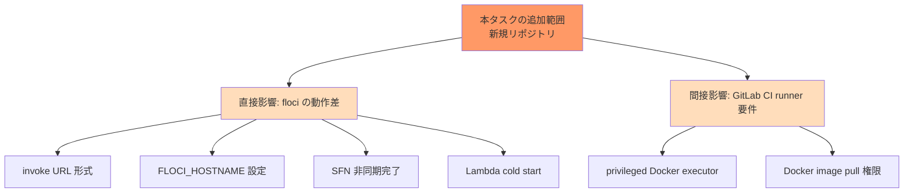

# 弊害検証計画

## 概要

| 項目 | 内容 |
|------|------|
| チケットID | floci-apigateway-csharp-001 |
| タスク名 | API Gateway + Lambda(.NET) + Step Functions サンプルアプリと CI/CD 基盤の構築 |
| 作成日 | 2026-04-25 |

> **位置付け**: 新規リポジトリのため「既存機能への副作用」は基本的に発生しない。
> 本ドキュメントでは **「floci 上で意図通りに動かない可能性のある箇所」「サンプルとして利用者が誤解しやすい挙動」** を副作用相当として扱う。

---

## 1. 副作用分析

### 1.1 副作用が発生しやすい箇所

| 箇所 | 影響度 | 発生可能性 | 検証方法 | 優先度 |
|------|--------|------------|----------|--------|
| API Gateway invoke URL 形式（floci 固有 `/restapis/{id}/{stage}/_user_request_/...`）が AWS と異なる | 中 | 高 | E2E で `terraform output -raw invoke_url` を読み出し、`HttpClient` で 200/201 を確認 | 高 |
| `FLOCI_HOSTNAME` 未設定時、CI 内 invoke URL に `localhost` が混入し他コンテナから到達不能 | 高 | 中 | (1) CI で `docker compose exec floci env` に `FLOCI_HOSTNAME=floci` が含まれるか確認 / (2) **E2E 先頭で `Assert.DoesNotContain("localhost", apiBaseUrl)` を実行**、CI 環境（`Environment.GetEnvironmentVariable("CI") == "true"`）では URL の host が `floci` であることをアサート（DR-016、E2E-5） | 高 |
| Step Functions 実行が SUCCEEDED になる前に E2E が判定 | 中 | 高 | E2E で `DescribeExecution` を 1 秒間隔最大 30 秒 polling し、SUCCEEDED 確認後にのみ GET を実行 | 高 |
| .NET 8 Lambda コールドスタートで API GW タイムアウト（30s）超過 | 中 | 中 | E2E に warmup invoke を追加（E2E-4）、API GW タイムアウトを既定（29s）超過しないか測定 | 中 |
| Docker socket / DinD 不可な runner で `e2e` ジョブが起動失敗 | 高 | 中 | README に runner 要件を明記、`.gitlab-ci.yml` の `before_script` で `docker info` の成否を出力 | 高 |
| Terraform AWS provider v6 の breaking change（v5 から） | 中 | 中 | `required_providers` で `~> 6.0` を固定、`terraform validate` を CI 必須 | 中 |
| `dotnet lambda package` が CI image に存在しない | 中 | 中 | CI ジョブ先頭で `dotnet tool install -g Amazon.Lambda.Tools` を実行、PATH に `~/.dotnet/tools` を追加 | 中 |
| floci の API Gateway v1 で `aws_api_gateway_deployment` の lifecycle 不整合 | 低 | 中 | `lifecycle { create_before_destroy = true }` を予防適用、apply で警告/エラーが出ないか確認 | 中 |
| AWS SDK v4 と Terraform provider v6 の挙動差により Step Functions が作成不能 | 中 | 低 | 設計初期の PoC（最小 SFN 1 つを `terraform apply` してみる）で確認、不可なら ASL 定義のみを `aws_sfn_state_machine` 外で作成する代替案へ | 中 |
| `JsonStringEnumConverter` + camelCase 設定漏れで `status` が `"Pending"` で出力 | 低 | 中 | UT-8 で確認 | 低 |

### 1.2 影響範囲マップ

---

## 2. 回帰テスト

### 2.1 実行すべき回帰テスト

新規リポジトリのため「既存機能の回帰」は対象外。
ただし、開発進行中の **設計変更時の自テスト再走** をここで規定する。

| テストスイート | 対象機能 | 優先度 | 必須/推奨 |
|----------------|----------|--------|-----------|
| `TodoApi.UnitTests` | 全 UT | 高 | 必須（毎コミット） |
| `TodoApi.IntegrationTests` | 全 IT | 高 | 必須（PR） |
| `TodoApi.E2ETests` | 全 E2E | 高 | 必須（PR、main マージ前） |

### 2.2 回帰テストチェックリスト

- [ ] UT-1〜UT-10 が全て PASS
- [ ] IT-1〜IT-7 が全て PASS
- [ ] E2E-PRE-1, E2E-1, E2E-2, E2E-3 が PASS
- [ ] `dotnet format --verify-no-changes` が PASS
- [ ] `terraform fmt -check` / `terraform validate` が PASS
- [ ] `terraform destroy` が `after_script` で常に実行されている（CI ログで確認）

---

## 3. パフォーマンス検証

### 3.1 検証項目

サンプル用途のため厳密な SLO は設けず、E2E が CI タイムアウト（10 分目安）に収まることを確認する。

| 項目 | 目標値 | 許容値 | 測定方法 |
|------|--------|--------|----------|
| Lambda コールドスタート (.NET 8) | 1〜3 秒 | 5 秒 | E2E ログの `Duration`、warmup invoke 後の差分を観察 |
| `POST /todos` レスポンス（warm） | < 500ms | < 2s | E2E 内の `Stopwatch` |
| `GET /todos/{id}` レスポンス（warm） | < 200ms | < 1s | 同上 |
| Step Functions SUCCEEDED 到達時間 | < 5s | < 30s | `DescribeExecution` polling 経過時間 |
| E2E ジョブ全体時間 | < 8 分 | < 10 分 | GitLab CI ジョブ実時間 |

### 3.2 負荷テストシナリオ

サンプル用途のため負荷テストは実施しない（out_of_scope、README で明記）。

| シナリオ | 条件 | 期待結果 | 実行時間 |
|----------|------|----------|----------|
| 通常負荷 | — | — | 実施せず |

---

## 4. セキュリティ検証

### 4.1 検証項目

| 項目 | 確認内容 | 検証方法 | チェック |
|------|----------|----------|----------|
| 認証 | サンプルとして `authorization=NONE` を意図通りに設定（誤って authorizer を有効化しない） | Terraform `aws_api_gateway_method.authorization` が "NONE" であることを `terraform plan` または静的検査で確認 | ⬜ |
| 認可 | IAM Role はダミー（floci 検証なし）、本番運用時の注意点が README にあるか | README レビュー | ⬜ |
| 入力検証 | `TodoValidator` が `title` 長さ・空文字を拒否 | UT-1〜UT-4、IT-1、E2E-2 | ⬜ |
| SQL インジェクション | DynamoDB のため非該当 | — | N/A |
| XSS | API はサーバーレスポンスのみ、HTML 返却なし | — | N/A |
| CSRF | 認証なし API のため非該当（README で「本番化時は要対応」と注記） | README レビュー | ⬜ |
| シークレット混入 | `test`/`test` 以外の AWS 資格情報がコミットされていない | `git grep -E 'AKIA[0-9A-Z]{16}'` で空 | ⬜ |
| ログ漏洩 | 入力ペイロードを `LogInformation` で出さない（または README で本番運用時の注意を明記） | コードレビュー、README 確認 | ⬜ |

### 4.2 脆弱性スキャン

| ツール | 対象 | 実行タイミング |
|--------|------|----------------|
| `dotnet list package --vulnerable` | NuGet 依存 | CI（任意ジョブ、本サンプルでは推奨レベル） |
| Terraform `tfsec` | infra/ | 本サンプルでは out_of_scope（README で言及のみ） |

---

## 5. 互換性検証

### 5.1 後方互換性

新規 API のため後方互換性は対象外。

| 項目 | 互換性 | 確認方法 | 備考 |
|------|--------|----------|------|
| API | N/A | — | 新規 |
| データ形式 | N/A | — | 新規 |
| 設定ファイル | N/A | — | 新規 |

### 5.2 クライアント互換性

| クライアント | バージョン | 対応状況 | 確認方法 |
|--------------|------------|----------|----------|
| `HttpClient` (.NET 8) | system | ✅ | E2E で実利用 |
| `curl` | 7.x+ | ✅ | README のローカル手順で利用例を提示 |

### 5.3 環境互換性（**実 AWS 不使用の確認**）

| 環境 | 対応状況 | 確認方法 |
|------|----------|----------|
| ローカル開発（Linux + Docker） | ✅ | `scripts/deploy-local.sh` で動作確認 |
| GitLab CI（DinD privileged） | ✅ | `.gitlab-ci.yml` の `e2e` ジョブで動作確認 |
| GitLab CI（shell executor） | ⚠ 代替手順あり | README の代替セクションに従い手動 compose |
| 実 AWS | 🚫 想定外 | 「実 AWS 資格情報を一切参照しない」ことを CI 環境変数白リストで担保（`AWS_*` は `test` 固定） |
| macOS / Windows | ⚠ 推奨外 | ローカル動作は可能だが Docker for Desktop の Lambda 起動制約あり、README の "Known issues" で注記 |

> **AC7 の証跡**: GitLab CI の job 環境変数に「`test`/`test`/`us-east-1`/`http://floci:4566`」のみを設定し、シークレット参照（CI/CD Variables）から AWS 系を除外する設計とする。これを README の「CI 環境変数」セクションに明記する。

---

## 6. データ整合性検証

### 6.1 検証項目

| 項目 | 確認内容 | 検証クエリ/方法 |
|------|----------|-----------------|
| `id` 一意性 | UUID 衝突がないこと | サンプル用途では `Guid.NewGuid()` の衝突確率を許容（README 注記）。条件付き PutItem は将来拡張で記載 |
| 必須属性欠損 | `title`/`status`/`created_at`/`updated_at` が全アイテムに存在 | `aws dynamodb scan` の結果に欠損がないか E2E 後に確認（任意） |
| `description` 任意性 | `description` 未指定時に DynamoDB 属性が不在 | UT-6 で確認 |
| 日時の UTC ISO 8601 形式 | `created_at`/`updated_at` が "Z" 終端 | UT-5/UT-7 + E2E で目視 |

### 6.2 マイグレーション検証

新規構築のため対象なし（対応する `terraform destroy` で完全ロールバック可能）。

| ステップ | 検証内容 | ロールバック確認 |
|----------|----------|------------------|
| 初回 `terraform apply` | 全リソース作成 | `terraform destroy` で全削除確認 ⬜ |

---

## 7. 検証実行計画

### 7.1 実行順序

1. 回帰テスト（UT → IT → E2E）
2. パフォーマンス検証（E2E ログ観察、合格基準は §3）
3. セキュリティ検証（コード/README/`git grep`）
4. 互換性検証（CI 環境での E2E 実行、AC7 の証跡確認）
5. データ整合性検証（任意 scan）

### 7.2 スケジュール

| フェーズ | 開始 | 終了 | 担当 |
|----------|------|------|------|
| 実装 + UT/IT 通過 | implement | verification | implement エージェント |
| E2E 通過 + 弊害検証 §1〜§6 | verification | verification | verification エージェント |
| code-review 反映 | code-review | code-review-fix | code-review エージェント |

---

## 8. 結果レポートテンプレート

### 8.1 検証結果サマリー

| 検証項目 | 結果 | 発見事項 | 対応状況 |
|----------|------|----------|----------|
| 回帰テスト（UT/IT/E2E） | ⬜ | | |
| パフォーマンス | ⬜ | | |
| セキュリティ | ⬜ | | |
| 互換性（特に AC7：実 AWS 不使用） | ⬜ | | |
| データ整合性 | ⬜ | | |

### 8.2 発見した問題

| No | 問題 | 重大度 | 対応方針 | 対応状況 |
|----|------|--------|----------|----------|
| | | | | |

---

## 9. リスク軽減策の設計組み込み確認（investigation 06 → 設計）

| investigation 06 のリスク | 軽減策の設計反映先 |
|----------------------------|--------------------|
| Docker socket / DinD | 01 §1.2 と 04 §6（CI 実行フロー）、READMEで明記（実装タスク） |
| FLOCI_HOSTNAME 漏れ | 01 §1.1、05 §7.1、本書 §1.1 |
| invoke URL 形式差 | 02 §6.1（`outputs.tf`）、04 §1.2、本書 §1.1 |
| SFN polling timing | 04 §4、05 §2.3、本書 §1.1 |
| .NET cold start | 02 §2.1（POST 即返却）、05 §2.3 E2E-4、本書 §3.1 |
| dotnet lambda tool 不在 | 01 §4 制約、本書 §1.1 |
| Provider バージョン不整合 | 01 §1.2、本書 §1.1 |
| API GW v1 deployment 未実装機能 | 02 §6 表（lifecycle 注記）、本書 §1.1 |

---

## 変更履歴

| 日付 | バージョン | 変更内容 | 変更者 |
|------|------------|----------|--------|
| 2026-04-25 | 1.0 | 初版作成 | dev-workflow |
| 2026-04-25 | 1.1 | review-design round1 反映: §1.1 表に E2E 先頭での `Assert.DoesNotContain("localhost", apiBaseUrl)` 検証アサーションを追加（DR-016、E2E-5 と整合） | dev-workflow |
