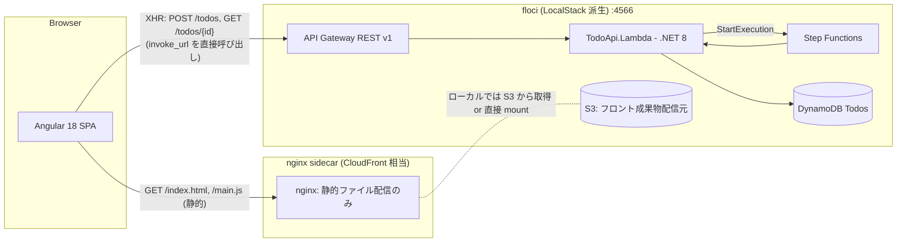

# アーキテクチャ調査

## 概要

`floci-apigateway-csharp` は floci (LocalStack 派生) 上で動作する .NET 8 製 Todo API サンプル。API Gateway REST v1 + Lambda + Step Functions + DynamoDB を Terraform で構築し、テストは Unit / Integration / E2E の3層で構成される。本タスクではこの単一バックエンド構成に Angular 18 LTS フロントエンドと nginx 静的配信レイヤーを追加する。

## 現状のディレクトリ構造

```
floci-apigateway-csharp/
├── src/
│   └── TodoApi.Lambda/         # .NET 8 Lambda (ApiHandler, ValidateTodo, PersistTodo)
│       ├── Aws/                # AwsClientFactory（DynamoDB/StepFunctions クライアント生成）
│       ├── Models/             # Todo / Request / Response モデル
│       ├── Repositories/       # DynamoDB Repository
│       ├── Validation/         # TodoValidator
│       ├── Function.cs         # ApiHandler エントリポイント (POST/GET ルーティング)
│       ├── Function.ValidateTodo.cs / Function.PersistTodo.cs  # SFN 用ハンドラ
│       ├── JsonOpts.cs / LambdaJsonSerializer.cs
│       └── TodoApi.Lambda.csproj
├── tests/
│   ├── TodoApi.UnitTests/        # xUnit + Moq, 依存無し
│   ├── TodoApi.IntegrationTests/ # xUnit + floci(LocalStack) 起動が前提
│   └── TodoApi.E2ETests/         # xUnit + terraform apply 済み API への HTTP 実呼び出し
├── infra/                       # Terraform: API Gateway / Lambda / SFN / DDB / IAM
├── compose/docker-compose.yml   # floci サービス（ports: 4566, network: floci-net）
├── scripts/                     # deploy-local.sh, warmup-lambdas.sh, e2e.sh ほか
├── .gitlab-ci.yml               # stages: lint / unit / integration / e2e
├── floci-apigateway-csharp.sln
└── README.md
```

## 追加予定のディレクトリ（本タスクの設計対象）

```
floci-apigateway-csharp/
├── frontend/                    # 新規: Angular 18 LTS プロジェクト
│   ├── src/app/                 # component / service / config loader
│   ├── src/assets/config.json   # ランタイム API ベース URL 等
│   ├── e2e/ または playwright/  # Playwright E2E（配置はAngular generatorに合わせる）
│   ├── angular.json / package.json / tsconfig*.json
│   └── playwright.config.ts
├── compose/
│   └── docker-compose.yml       # nginx sidecar 追加（静的フロント配信 / floci-net 参加）
├── infra/
│   └── (frontend.tf 等で S3 bucket + 静的ホスティング相当を追加)
└── scripts/
    └── (build-frontend.sh, deploy-frontend.sh, e2e-web.sh などを追加)
```

## アーキテクチャパターン

- **バックエンド**: AWS Lambda + API Gateway による Function-as-a-Service。1 zip / 3 ハンドラ（`ApiHandler` / `ValidateTodo` / `PersistTodo`）を再利用する単一アセンブリ構成。
- **オーケストレーション**: Step Functions の Express ではなく Standard `state_machine` を `terraform_data` + AWS CLI で apply（floci の API 互換制約回避: README §4 / DR-006）。
- **テスト**: 3 層 (Unit / Integration / E2E)。E2E は `terraform apply` → `terraform output -raw invoke_url` 経由の実 HTTP 検証。
- **ローカル/CI 同形**: docker compose で floci を起動し、CI(DinD) / ローカル(devcontainer/dood) で同じコマンド体系を使う。

## 追加後の論理コンポーネント図



> ⚠ 本タスクの決定事項: **API は nginx 経由でリバースプロキシしない**。Angular はブラウザから直接 API Gateway invoke_url を呼ぶ（DR: ブレスト議事録）。そのため API Gateway / Lambda 側で **CORS ヘッダ追加が必須** となる（詳細は `06_risks-and-constraints.md`）。

## レイヤー構成（追加後）

| レイヤー | 責務 | 主要コンポーネント |
|----------|------|-------------------|
| Presentation (新規) | UI 描画, ユーザ操作, API 呼び出し | Angular Component / Service |
| Static Delivery (新規) | フロント静的ファイル配信 | nginx sidecar (S3 と連携 or バインドマウント) |
| API Gateway | HTTP ルーティング, CORS 応答 | API Gateway REST v1 (+ OPTIONS / CORS 設定) |
| Application | ルーティング → ビジネスロジック | TodoApi.Lambda (`ApiHandler`) |
| Workflow | 検証 → 永続化のオーケストレーション | Step Functions (ValidateTodo → PersistTodo) |
| Domain | エンティティ, バリデーション | `Models/Todo`, `Validation/TodoValidator` |
| Infrastructure | 永続化, 外部サービスクライアント | `Repositories/TodoRepository`, `Aws/AwsClientFactory` |

## 主要既存ファイル（追加機能の起点）

| ファイル | 役割 | 本タスクでの位置付け |
|----------|------|--------------------|
| `src/TodoApi.Lambda/Function.cs` | API ルーティング / レスポンス生成 (`JsonHeaders`) | **CORS ヘッダ追加点** |
| `infra/main.tf` | API Gateway / Lambda / IAM / SFN / DDB | **OPTIONS メソッド + S3 frontend bucket 追加点** |
| `infra/outputs.tf` | `invoke_url`, `state_machine_arn` 等 | **frontend_url / s3_bucket 出力追加点** |
| `compose/docker-compose.yml` | floci 単体 | **nginx sidecar 追加点** |
| `.gitlab-ci.yml` | lint/unit/integration/e2e | **web-* ジョブ追加点** |
| `scripts/deploy-local.sh` | floci 起動 + lambda package + tf apply | **frontend build/upload 連携の参照点** |

## 備考

- 既存設計ドキュメントは `docs/floci-apigateway-csharp/design/00_overview〜06_*` に存在（README.md より）。本調査は既存設計とは独立した「フロント追加」観点で実施する。
- floci は `S3` を In-process で実装している（readonly 参照: `submodules/readonly/floci/README.md` 互換性表）。CloudFront 互換は確認できないため nginx で代替する方針が妥当。
