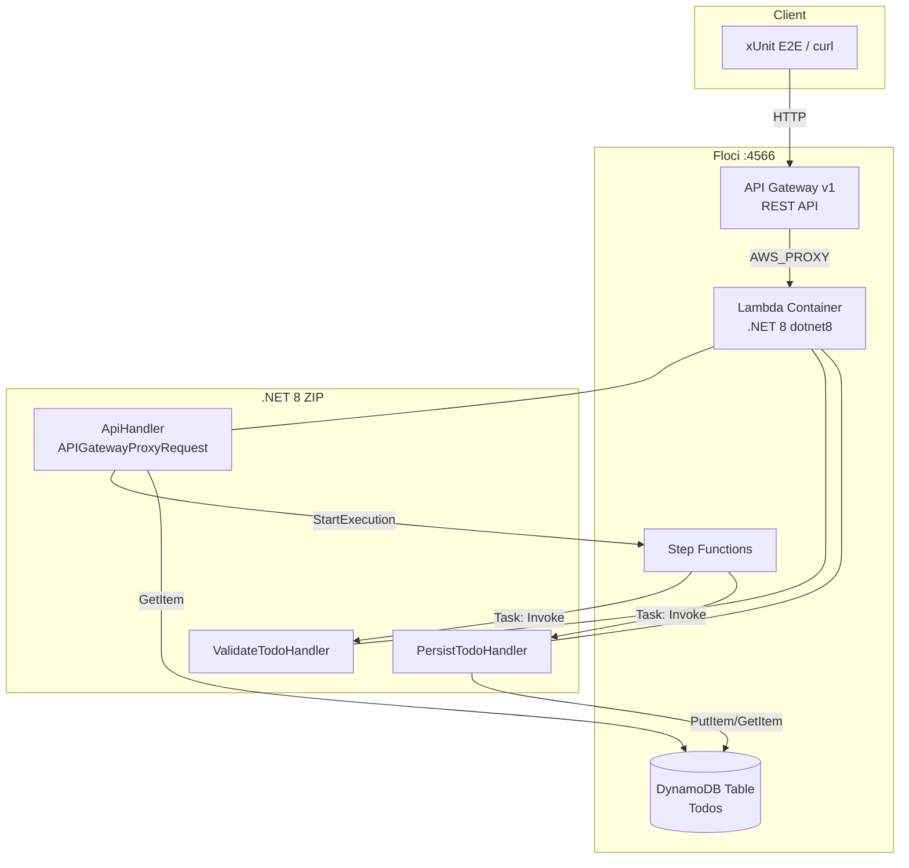

# アーキテクチャ調査

## 概要

`floci-apigateway-csharp` は **新規リポジトリ**（`README.md` のみ存在）であり、API Gateway (REST v1) + .NET 8 Lambda (ZIP) + Step Functions + DynamoDB の最小構成 Todo API サンプルを、floci ローカルエミュレータ上で動かす参照実装としてゼロから構築する。

## 現状

```
submodules/editable/floci-apigateway-csharp/
└── README.md   # 新規プロジェクト用のスタブのみ
```

`src/`、`infra/`、`tests/`、`.gitlab-ci.yml` 等は未作成。本タスクでは下記のディレクトリ構成を新たに作成する想定。

## 想定ディレクトリ構成（提案）

```
floci-apigateway-csharp/
├── README.md                    # セットアップ・ローカル/CI/Terraform/デバッグ手順
├── floci-apigateway-csharp.sln  # ソリューションファイル
├── src/
│   └── TodoApi.Lambda/          # .NET 8 Lambda 関数プロジェクト
│       ├── TodoApi.Lambda.csproj
│       ├── Function.cs          # APIGatewayProxyRequest ハンドラ
│       ├── Models/Todo.cs       # ドメインモデル
│       ├── Repositories/        # DynamoDB アクセス
│       └── StepFunctions/       # ValidateTodo / PersistTodo ハンドラ
├── tests/
│   ├── TodoApi.UnitTests/       # xUnit 単体テスト（純粋ロジック）
│   ├── TodoApi.IntegrationTests/# xUnit + Amazon.Lambda.TestUtilities
│   └── TodoApi.E2ETests/        # HttpClient による API Gateway 経由テスト
├── infra/
│   ├── main.tf                  # API GW / Lambda / Step Functions / DynamoDB
│   ├── provider.tf              # AWS provider (floci endpoints)
│   ├── variables.tf
│   ├── outputs.tf               # API Gateway invoke URL を出力
│   └── lambda/                  # dotnet lambda package で生成した zip 配置先
├── compose/
│   └── docker-compose.yml       # floci 起動定義（CI/ローカル共通）
├── scripts/
│   ├── deploy-local.sh          # build → package → tf apply の一括手順
│   └── e2e.sh                   # E2E 実行ヘルパ
└── .gitlab-ci.yml               # 単体 / 結合 / E2E ジョブ
```

## アーキテクチャパターン

- **サーバーレス3層**: API Gateway (Presentation) → Lambda (Application/Domain) → DynamoDB (Persistence)
- **オーケストレーション層**: Step Functions (ValidateTodo → PersistTodo) を Todo 作成フローに利用
- **IaC一貫主義**: 全 AWS リソースは Terraform で宣言。`dotnet lambda package` で生成した zip を `aws_lambda_function.filename` で指定

## コンポーネント図



## レイヤー構成

| レイヤー | 責務 | 主要コンポーネント |
|----------|------|-------------------|
| Presentation | HTTP/JSON 受信、ルーティング | API Gateway REST + AWS_PROXY |
| Application | リクエスト解析、Step Functions 起動、DynamoDB 参照 | `Function::FunctionHandler` (.NET 8) |
| Domain | Todo エンティティ、バリデーション | `Models/Todo.cs`、`ValidateTodoHandler` |
| Infrastructure | DynamoDB 永続化、AWS SDK クライアント | `Repositories/TodoRepository` |
| Orchestration | Todo 作成フロー定義 | Step Functions (Validate → Persist) |
| Testing | 単体/結合/E2E | xUnit、Amazon.Lambda.TestUtilities、HttpClient |

## 主要ファイル（新規作成予定）

| ファイル | 役割 |
|----------|------|
| `src/TodoApi.Lambda/Function.cs` | Lambda エントリポイント（Handler 関数群） |
| `src/TodoApi.Lambda/aws-lambda-tools-defaults.json` | `dotnet lambda package` 設定 |
| `infra/main.tf` | DynamoDB / Lambda / API Gateway / Step Functions リソース定義 |
| `infra/provider.tf` | floci 向け endpoints ブロック付き AWS provider |
| `compose/docker-compose.yml` | floci サービス定義（4566 ポート、Docker ソケット） |
| `.gitlab-ci.yml` | unit / integration / e2e ジョブ |

## 備考

- 本リポジトリには **既存コードがない** ため、本調査は「floci の制約」と「.NET 8 Lambda + Terraform の標準的な構成」に基づく**新規構築方針の整理**が中心となる。
- 関連リポジトリ `submodules/readonly/floci`（local AWS emulator）と `submodules/readonly/floci/compatibility-tests/compat-terraform/` の Terraform 例が主要な参照源。
- `FLOCI_HOSTNAME=floci` を設定し、CI 内では同一 Docker network から `http://floci:4566` で参照する想定。
