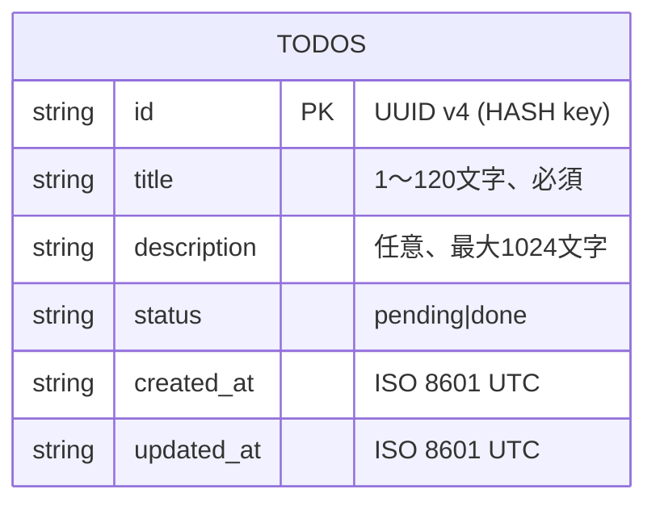
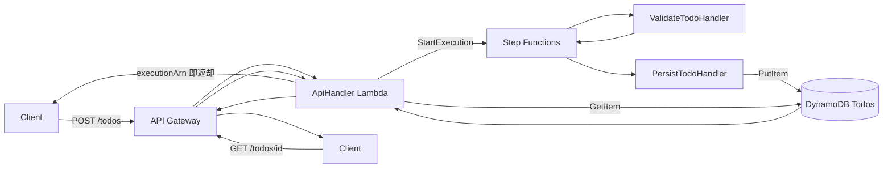

# データ構造調査

## 概要

Todo を単一 DynamoDB テーブル `Todos` に永続化し、API Gateway/Lambda/Step Functions 間は JSON DTO（`Todo`、`StepFunctionsInput/Output`）で受け渡す。floci の DynamoDB は AWS と同等の API（`PAY_PER_REQUEST`、`PutItem`、`GetItem`、`Query` 他）に対応する。

## ER図（DynamoDB シングルテーブル）



- **テーブル名**: `Todos`
- **billing_mode**: `PAY_PER_REQUEST`
- **hash_key**: `id` (S)
- **GSI**: 本サンプルでは未使用（Step Functions 検証が主目的のため最小構成）
- **TTL**: なし

## エンティティ一覧

| エンティティ | 説明 | 主要属性 |
|--------------|------|----------|
| `Todo` | Todo ドメインモデル | id, title, description, status, createdAt, updatedAt |
| `CreateTodoRequest` | POST 用入力 DTO | title, description |
| `ValidateTodoInput` | Step Functions 入力 | todo（CreateTodoRequest 相当） |
| `ValidateTodoOutput` | Validate ステート出力 | todo（補完済 id/timestamps）, valid: bool, errors[] |
| `PersistTodoOutput` | Persist ステート出力 | todoId, persisted: bool |

## 型定義（提案 C# DTO）

```csharp
public sealed record Todo(
    string Id,
    string Title,
    string? Description,
    TodoStatus Status,
    DateTime CreatedAt,
    DateTime UpdatedAt);

public enum TodoStatus { Pending, Done }

public sealed record CreateTodoRequest(string Title, string? Description);

public sealed record ValidateTodoInput(CreateTodoRequest Todo);

public sealed record ValidateTodoOutput(
    Todo Todo,
    bool Valid,
    IReadOnlyList<string> Errors);

public sealed record PersistTodoOutput(string TodoId, bool Persisted);
```

## API レスポンス（提案）

| エンドポイント | ステータス | ボディ |
|----------------|------------|--------|
| `POST /todos` | 201 | `{ "id": "...", "title": "...", ..., "executionArn": "arn:..." }` |
| `GET /todos/{id}` | 200 / 404 | `Todo` JSON |

## Step Functions ステートマシン定義（ASL 概略）

```json
{
  "Comment": "Todo 作成フロー",
  "StartAt": "ValidateTodo",
  "States": {
    "ValidateTodo": {
      "Type": "Task",
      "Resource": "arn:aws:lambda:us-east-1:000000000000:function:validate-todo",
      "Next": "CheckValid"
    },
    "CheckValid": {
      "Type": "Choice",
      "Choices": [
        { "Variable": "$.valid", "BooleanEquals": true, "Next": "PersistTodo" }
      ],
      "Default": "Failed"
    },
    "PersistTodo": {
      "Type": "Task",
      "Resource": "arn:aws:lambda:us-east-1:000000000000:function:persist-todo",
      "End": true
    },
    "Failed": { "Type": "Fail", "Error": "ValidationFailed" }
  }
}
```

## DynamoDB アイテムサンプル

```json
{
  "id":          { "S": "f1c8f7a8-1d3a-4cf9-8f88-3b9a3a0b9af1" },
  "title":       { "S": "Buy milk" },
  "description": { "S": "2L organic" },
  "status":      { "S": "pending" },
  "created_at":  { "S": "2026-04-25T10:00:00Z" },
  "updated_at":  { "S": "2026-04-25T10:00:00Z" }
}
```

## データフロー



## スキーマ定義ファイル（新規作成予定）

| ファイルパス | 内容 |
|--------------|------|
| `infra/main.tf` 内 `aws_dynamodb_table.todos` | DynamoDB テーブル定義 |
| `infra/main.tf` 内 `aws_sfn_state_machine.todo` | ASL 定義（`jsonencode`） |
| `src/TodoApi.Lambda/Models/Todo.cs` | C# レコード型 |

## 備考

- ID 生成は **Lambda 側で `Guid.NewGuid()`**。floci の DynamoDB は AWS 標準と同等のため、サーバーサイド生成（条件式付与）は不要。
- 日時は **UTC ISO 8601 文字列** で保持し、`System.Text.Json` のシリアライズに任せる。
- floci は DynamoDB Streams にも対応するが、本サンプルでは未使用。
- ASL の Lambda Resource ARN は floci 上では `arn:aws:lambda:us-east-1:000000000000:function:<name>` 形式（アカウント ID は固定 12 桁ゼロ）。
