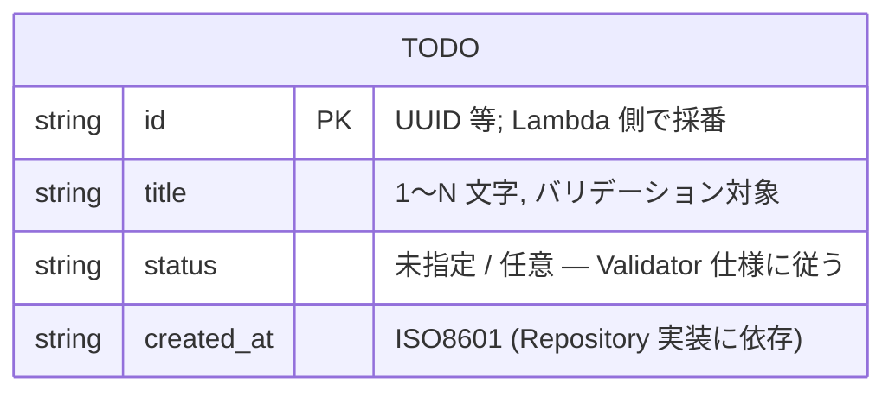
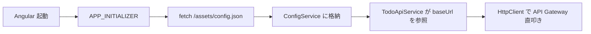
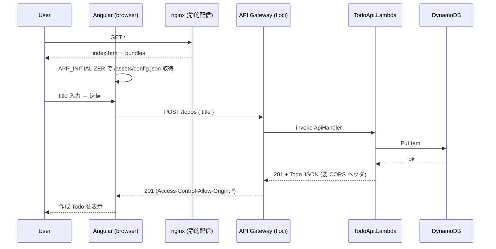

# データ構造調査

## 概要

API は Todo 1 種類を扱う極小サンプル。既存データ構造（Todo エンティティ / API リクエスト・レスポンス JSON）に変更は必要ない。本タスクで追加されるのは Angular 側の TypeScript 型定義（API レスポンスのミラー）と、ランタイム設定 JSON（`assets/config.json`）の構造。

## 既存エンティティ



> 注: `src/TodoApi.Lambda/Models` 配下の正確なフィールド一覧は実装時に Angular 側 DTO を生成する際に再確認すること（本調査は最小確認に留めた）。

## 既存 API JSON スキーマ

### POST /todos リクエスト
```json
{ "title": "buy milk" }
```
- `Content-Type: application/json; charset=utf-8`
- 不正 JSON は 400 `{ "errors": ["invalid JSON body"] }` を返す（`Function.cs` の catch JsonException）。

### POST /todos / GET /todos/{id} レスポンス
- 成功時: 200/201 + Todo オブジェクト JSON
- バリデーションエラー: 400 `{ "errors": [...] }`
- 未発見: 404 `{ "error": "..." }`
- サーバ側例外: 500 `{ "error": "internal error" }`

### 現在のレスポンスヘッダ
```csharp
private static readonly Dictionary<string, string> JsonHeaders = new()
{
    ["Content-Type"] = "application/json; charset=utf-8",
};
```
**CORS ヘッダ未設定**。本タスクで `Access-Control-Allow-Origin` 等を追加する必要あり。

## 追加データ構造（フロント側）

### Angular 側 TypeScript 型（想定）

```typescript
export interface Todo {
  id: string;
  title: string;
  status?: string;
  created_at?: string;
}

export interface TodoCreateRequest {
  title: string;
}

export interface ApiErrorResponse {
  errors?: string[];
  error?: string;
}
```

### ランタイム設定 `frontend/src/assets/config.json`

ビルド成果物に含まれる runtime config。E2E ワークフローでは
`terraform output -raw invoke_url` の値をビルド前に流し込むことで、
ローカル/CI で異なる invoke_url にも追従できる。

```json
{
  "apiBaseUrl": "http://localhost:4566/restapis/<rest_api_id>/dev/_user_request_"
}
```

| フィールド | 型 | 用途 | 注意 |
|------------|----|------|------|
| `apiBaseUrl` | string | floci API Gateway invoke_url | 末尾スラッシュ無し。ビルド時注入 or ランタイム fetch |

### 設定ロードフロー



## データフロー（ユーザ操作起点）



## スキーマ定義ファイル

| ファイルパス | 内容 | 状態 |
|--------------|------|------|
| `src/TodoApi.Lambda/Models/*.cs` | Todo / Request 型 | 既存 (変更不要) |
| `frontend/src/app/models/todo.ts` | TS 側 Todo 型 | **新規追加予定** |
| `frontend/src/assets/config.json` | ランタイム設定 | **新規追加予定** |

## 備考

- スキーマは安定。Angular DTO は手書きで十分（OpenAPI 自動生成は out_of_scope）。
- 将来 `error` / `errors` のレスポンス型統一を検討する余地はあるが、本タスク外。
