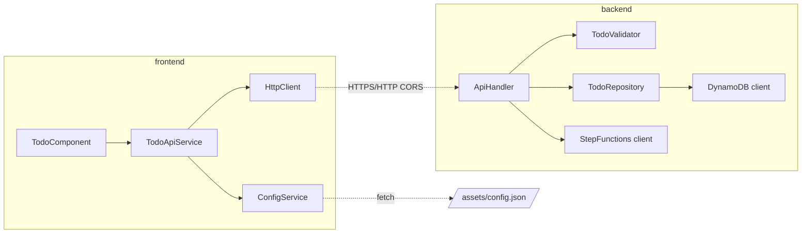

# 依存関係調査

## 概要

既存は .NET 8 / Terraform / docker compose / floci のみで完結。本タスクで Node.js / npm / Angular 18 / Playwright / nginx (Docker image) の系統が新規追加される。両者は独立しており、既存 .NET ビルドへの依存影響は無い。

## 既存依存関係

### 言語/ランタイム
| 項目 | バージョン | 用途 |
|------|-----------|------|
| .NET SDK | 8.0+ | Lambda ビルド・テスト |
| Docker / docker compose | 24+/v2+ | floci 起動 |
| Terraform | 1.6.6 | infra apply |
| Amazon.Lambda.Tools | 5.x | `dotnet lambda package` |
| AWS CLI | 2.x | floci への apigateway / sfn 互換補完 |

### .NET パッケージ（テストプロジェクトより）
| パッケージ | バージョン | 用途 |
|------------|-----------|------|
| Microsoft.NET.Test.Sdk | 17.11.1 | テストランナー |
| xunit | 2.9.2 | テストフレームワーク |
| xunit.runner.visualstudio | 2.8.2 | runner |
| Moq | 4.20.72 | モック |
| Amazon.Lambda.TestUtilities | 2.0.0 | Lambda テストヘルパ |

### Lambda 本体（参考）
- `Amazon.DynamoDBv2`, `Amazon.Lambda.APIGatewayEvents`, `Amazon.Lambda.Core`, `Amazon.StepFunctions`（Function.cs の using より）

## 追加予定の依存関係

### 言語/ランタイム
| 項目 | 推奨バージョン | 用途 | 備考 |
|------|---------------|------|------|
| Node.js | 20 LTS | Angular ビルド / Playwright 実行 | Angular 18 の最小要件 (>=18.19 / >=20.11) |
| npm | 10.x | パッケージ管理 | Node 20 LTS 同梱 |
| Angular CLI | 18.x | プロジェクト雛形・ビルド | `npm i -g @angular/cli@18` 不要、`npx` で可 |

### npm 主要パッケージ（frontend/package.json 想定）
| パッケージ | バージョン目安 | 用途 |
|------------|---------------|------|
| @angular/core ほか | ^18.0.0 | Angular 18 LTS |
| @angular/common/http | ^18.0.0 | HttpClient（API 呼び出し） |
| rxjs | ~7.8.x | Observable |
| zone.js | ~0.14.x | Angular ランタイム |
| typescript | ~5.4.x | TS コンパイラ（Angular 18 互換版） |
| karma / karma-jasmine / karma-chrome-launcher | ng add 既定 | Unit / Integration テストランナー |
| jasmine-core | ng add 既定 | アサーション |
| @angular/cli, @angular-devkit/build-angular | ^18.0.0 | ビルド |
| eslint, @angular-eslint/* | 任意 | lint (`ng lint` 連携) |
| @playwright/test | ^1.45+ | E2E ランナー |

### Docker イメージ
| イメージ | 用途 | 備考 |
|----------|------|------|
| `nginx:1.27-alpine` 等 | 静的フロント配信 (CloudFront 相当) | compose に sidecar として追加 |
| `mcr.microsoft.com/playwright:v1.45.x-jammy` | CI E2E ジョブ | ブラウザ同梱で再現性確保 |
| `node:20-alpine` 等 | CI lint/unit/integration ジョブ | npm キャッシュと組み合わせ |

## 依存関係図

```mermaid
graph TD
  subgraph Existing[".NET / Infra (既存)"]
    DOTNET[.NET 8 SDK]
    LAMBDA[TodoApi.Lambda]
    TF[Terraform 1.6.6]
    FLOCI[floci docker image]
    AWSCLI[AWS CLI 2.x]
    LAMBDATOOL[Amazon.Lambda.Tools]
  end

  subgraph Added["フロント / E2E (追加)"]
    NODE[Node.js 20 LTS]
    NG[Angular 18]
    PW[@playwright/test]
    NGX[nginx image]
  end

  LAMBDA --> DOTNET
  LAMBDA --> LAMBDATOOL
  TF --> FLOCI
  TF --> AWSCLI
  NG --> NODE
  PW --> NODE
  PW --> NGX
  PW --> TF
  PW --> LAMBDA
```

## 内部モジュール依存（追加後）



## 循環依存

- [x] 循環依存なし（フロントとバックは別言語・別ビルド単位、双方向依存は HTTP のみ）

## バージョン制約・注意点

| 項目 | 制約 | 理由 |
|------|------|------|
| Node.js | 20 LTS（>=18.19 でも可） | Angular 18 の engines |
| Angular | 18 LTS 固定 | ブレスト決定事項 |
| Playwright | 1.45+ | Chromium/Firefox/Webkit を CI でキャッシュ可能 |
| .NET | 8.0+ | 既存維持 |
| Terraform | 1.6.6 | 既存固定 |
| floci image | 既存 `floci/floci:latest` | S3 を有効化するには `SERVICES` への追加が必要 |

## floci `SERVICES` 変更

現状 (`compose/docker-compose.yml`):
```yaml
SERVICES: "apigateway,lambda,dynamodb,stepfunctions,iam,sts,cloudwatchlogs"
```
S3 をフロント配信に使う場合は `s3` 追加が必要：
```yaml
SERVICES: "apigateway,lambda,dynamodb,stepfunctions,iam,sts,cloudwatchlogs,s3"
```
> ⚠ floci の S3 挙動は readonly 参照リポジトリの互換性表で「In-process / 主要機能サポート」と確認済み。詳細互換は実装時に compose/Terraform で検証する。

## 備考

- npm キャッシュは GitLab CI の `cache:` で `~/.npm` と `frontend/node_modules` を、Playwright キャッシュは `~/.cache/ms-playwright` をキャッシュ対象とする想定。
- Node 20 LTS と .NET 8 は別ジョブで実行することで Docker image を分割でき、CI の安定性が向上する。
