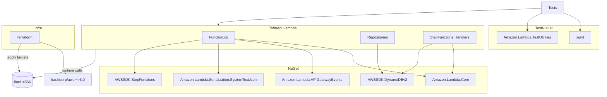
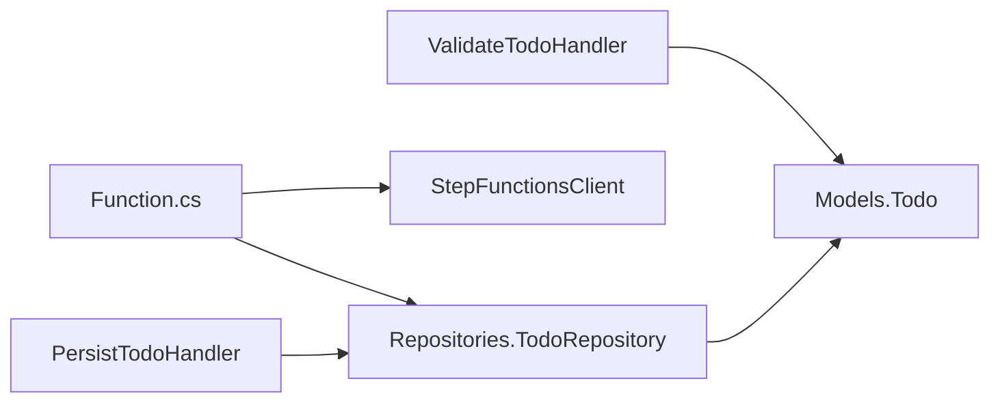

# 依存関係調査

## 概要

.NET 8 Lambda、AWS SDK、xUnit、Amazon.Lambda.TestUtilities を中心とした標準的な NuGet 依存と、Terraform AWS provider（v6 系）+ floci docker compose で構成する。

## 外部依存（NuGet 提案）

### 本番依存（src/TodoApi.Lambda）

| パッケージ | バージョン例 | 用途 |
|------------|-------------|------|
| `Amazon.Lambda.Core` | 2.x | Lambda ハンドラ基盤 |
| `Amazon.Lambda.APIGatewayEvents` | 2.x | `APIGatewayProxyRequest/Response` 型 |
| `Amazon.Lambda.Serialization.SystemTextJson` | 2.x | デフォルト JSON シリアライザ |
| `AWSSDK.DynamoDBv2` | 4.x | DynamoDB クライアント |
| `AWSSDK.StepFunctions` | 4.x | Step Functions `StartExecution` |

### 開発依存（tests/*）

| パッケージ | バージョン例 | 用途 |
|------------|-------------|------|
| `xunit` | 2.9.x | テストフレームワーク |
| `xunit.runner.visualstudio` | 2.8.x | テストランナー |
| `Microsoft.NET.Test.Sdk` | 17.x | テスト SDK |
| `Amazon.Lambda.TestUtilities` | 2.x | TestLambdaContext 等（結合テスト用） |
| `FluentAssertions` | 6.x | アサーション補助（任意） |
| `coverlet.collector` | 6.x | カバレッジ（任意） |

### CLI / ビルドツール

| ツール | 用途 |
|--------|------|
| `dotnet` 8 SDK | ビルド・テスト |
| `Amazon.Lambda.Tools` (`dotnet tool`) | `dotnet lambda package` で ZIP 生成 |
| `terraform` 1.6+ / `aws` CLI | floci への apply / SDK 呼び出し |
| `docker compose` | floci 起動 |

## Terraform プロバイダ依存

| プロバイダ | バージョン制約 | 備考 |
|------------|----------------|------|
| `hashicorp/aws` | `~> 6.0` | floci 互換テストで採用されているバージョン |
| backend | `local` | tfstate はローカル（README で managed state も補足） |

floci 向け provider 設定の必須要素（compat-terraform を踏襲）:

- `access_key = "test"` / `secret_key = "test"`
- `skip_credentials_validation = true`
- `skip_metadata_api_check = true`
- `skip_requesting_account_id = true`
- `s3_use_path_style = true`
- `endpoints { ... }` で `dynamodb`, `lambda`, `iam`, `sts`, `apigateway`, `stepfunctions` 等を `http://localhost:4566`（CI では `http://floci:4566`）に差し向け

## 依存関係図

## 内部モジュール依存

## バージョン制約・注意点

| 項目 | 制約 | 出典 |
|------|------|------|
| .NET | 8.0 (LTS) | setup.yaml 要件 |
| Lambda runtime | `dotnet8` | floci は AWS 公式 Lambda コンテナイメージを使用するためサポート対象（floci docs/services/lambda.md L301）|
| Terraform AWS provider | `~> 6.0` | floci compatibility-tests/compat-terraform/provider.tf |
| floci image | `floci/floci:latest`（旧 `hectorvent/floci` は更新停止） | floci README |
| docker socket マウント | Lambda 利用に必須 | floci docs/services/lambda.md |

## 循環依存

- [x] 循環依存なし（新規構築のため設計時点で発生させない）

## 備考

- `dotnet lambda package` コマンドは `Amazon.Lambda.Tools` グローバル/ローカルツールを要するため、CI image には `dotnet tool install -g Amazon.Lambda.Tools` を含める。
- floci に Lambda コンテナを起動させる構成では、CI ジョブから floci コンテナへの **Docker-in-Docker または docker socket 共有** が必要（後述 06 参照）。
- Provider バージョンは `~> 6.0` を使い、floci 互換テストとずれないようにする。
