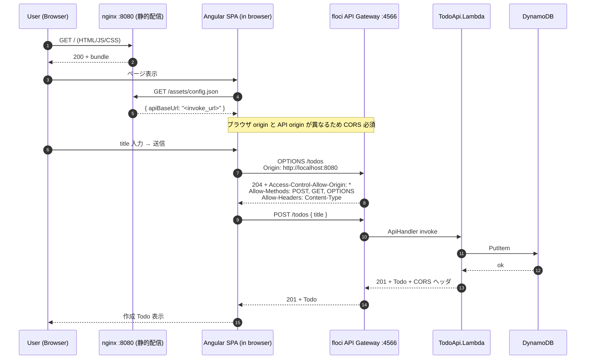
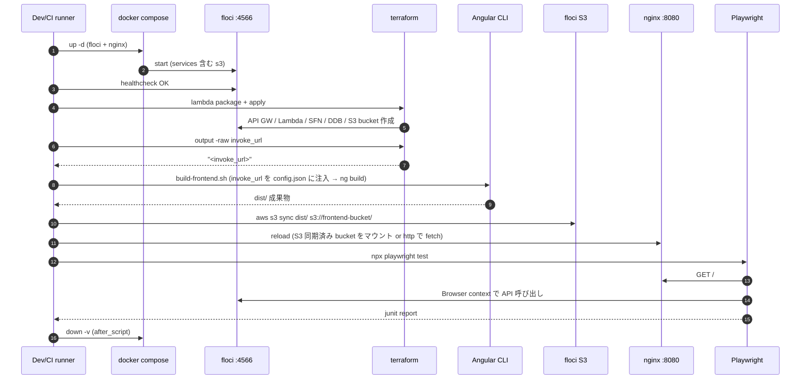
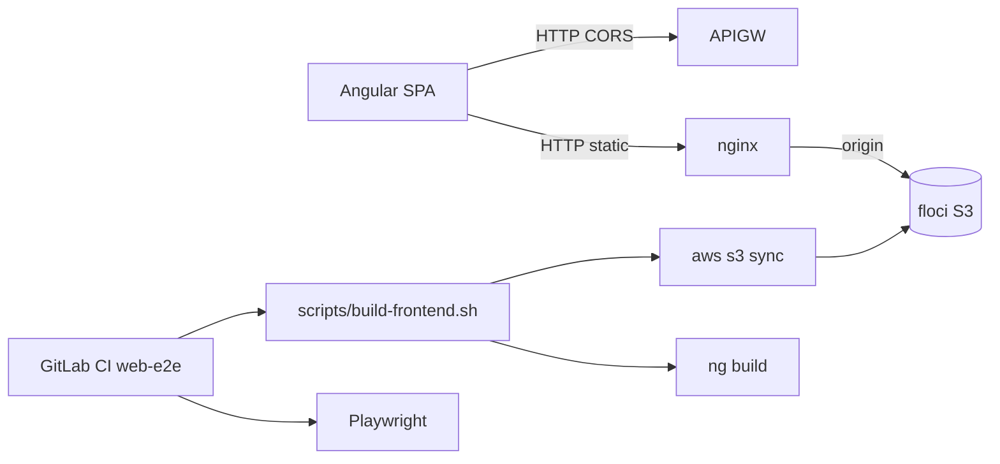

# 統合ポイント調査

## 概要

本タスクの統合面の核心は **Angular ブラウザ → floci API Gateway invoke_url の直接呼び出し** と、**E2E パイプラインにおける floci/Terraform/フロントビルド/nginx/Playwright の連携** にある。CloudFront 相当はリバースプロキシ無しの静的配信のみとし、API は経由しない決定がブレストで確定済み。

## API エンドポイント一覧（既存・変更なし）

| メソッド | パス | 説明 | 認証 |
|----------|------|------|------|
| POST | /todos | Todo 作成 | なし |
| GET | /todos/{id} | Todo 取得 | なし |
| OPTIONS | /todos | **新規追加: CORS preflight** | なし |
| OPTIONS | /todos/{id} | **新規追加: CORS preflight** | なし |

invoke_url 構造（既存 `infra/outputs.tf` より）:
```
{var.endpoint}/restapis/{rest_api_id}/dev/_user_request_
```

## シーケンス図

### Todo 作成フロー（ブラウザ起点 / 本タスクのメインケース）



### E2E パイプライン全体（ローカル / CI 共通）



## CORS 設計（追加点）

### 追加対象
1. **Lambda レスポンスヘッダ**: `Function.cs` の `JsonHeaders` を CORS 対応版に拡張、または別ヘルパで `Access-Control-Allow-Origin` 等を全レスポンスに付与。
2. **API Gateway OPTIONS メソッド**: Terraform で各リソース (`/todos`, `/todos/{id}`) に MOCK 統合 + メソッドレスポンス + 統合レスポンスを追加。
3. **フロント origin 許容**: 開発簡易性を優先し `Access-Control-Allow-Origin: *` を採用（認証スコープ外のため許容）。

### ヘッダ仕様（提案）
| ヘッダ | 値 | 設定箇所 |
|--------|----|---------|
| Access-Control-Allow-Origin | `*` | Lambda 応答 + APIGW OPTIONS |
| Access-Control-Allow-Methods | `GET, POST, OPTIONS` | APIGW OPTIONS 統合レスポンス |
| Access-Control-Allow-Headers | `Content-Type` | APIGW OPTIONS 統合レスポンス |
| Access-Control-Max-Age | `600` | APIGW OPTIONS 統合レスポンス |

> floci の API Gateway REST v1 における OPTIONS/MOCK 統合の互換性は実装時に Terraform plan + 実 HTTP で検証する。失敗時の代替策は `06_risks-and-constraints.md` 参照。

## 外部サービス連携

| サービス | 連携方式 | 用途 | 認証 |
|----------|----------|------|------|
| floci API Gateway | HTTPS/HTTP (CORS) | Todo CRUD | なし (test 固定) |
| floci S3 | aws cli `s3 sync` | フロント成果物配信元 | AWS_*=test |
| floci CloudWatch Logs | Lambda 内蔵 | ログ | 既存通り |

### 連携図（追加後）



## イベント/メッセージング

本タスクではイベント駆動の追加なし。既存 Step Functions (`ValidateTodo` → `PersistTodo`) はそのまま。

## データベース接続

変更なし。Lambda → DynamoDB (`Todos` テーブル) のみ。

## 統合ポイント一覧（追加分）

| 統合ポイント | モジュール | 連携先 | 連携方式 | 備考 |
|--------------|------------|--------|----------|------|
| ブラウザ → API | `frontend/src/app/services/todo-api.service.ts` | floci API Gateway | HTTP + CORS | 直接呼び出し |
| ブラウザ → 静的配信 | `frontend/dist/*` | nginx | HTTP | Same-origin |
| nginx → S3 | `compose/docker-compose.yml` (or config) | floci S3 | aws cli sync 経由 | nginx は最終ファイルを配信 |
| ビルド時設定注入 | `scripts/build-frontend.sh` | terraform output | shell | `invoke_url` を `assets/config.json` に書き込み |
| Playwright → 全系 | `frontend/playwright.config.ts` | nginx + API | ブラウザ自動操作 | CI で `mcr.microsoft.com/playwright` 使用想定 |
| GitLab CI ジョブ追加 | `.gitlab-ci.yml` | 既存 stage | extends `.node` | web-lint/web-unit/web-integration/web-e2e |

## ローカル / CI 環境差分

| 項目 | ローカル (devcontainer/dood) | CI (DinD) | 備考 |
|------|------------------------------|-----------|------|
| floci endpoint | `http://localhost:4566` or `http://host.docker.internal:4566` | `http://docker:4566` | 既存パターン踏襲 |
| nginx 配信 URL | `http://localhost:8080` | `http://docker:8080` (or service alias) | Playwright baseURL を環境変数化 |
| invoke_url | `terraform output -raw invoke_url` | 同左 | 同じ取得手順 |
| ブラウザ | ホストブラウザ or Playwright headed | Playwright headless (Chromium) | CI は Chromium のみで十分 (Firefox/Webkit は将来) |

## 備考

- nginx 設定は **API リバースプロキシを行わない** 純粋な静的配信に限定（決定事項）。これにより SPA の routing fallback (`try_files $uri /index.html;`) のみ設定すればよく、設計はシンプル。
- E2E は floci → terraform apply の所要時間（既存実績で数分）が支配的なため、CI 並列度には注意。
