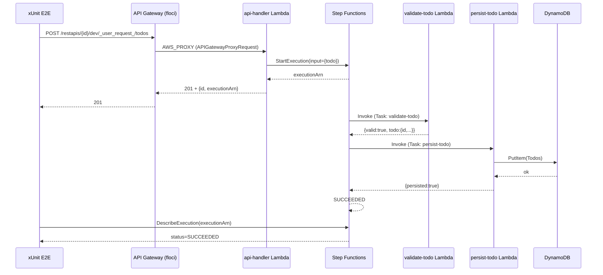
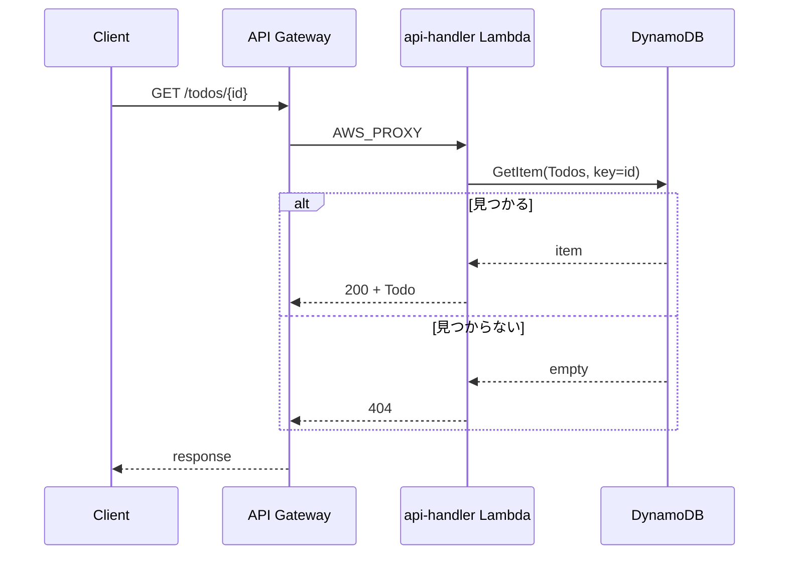
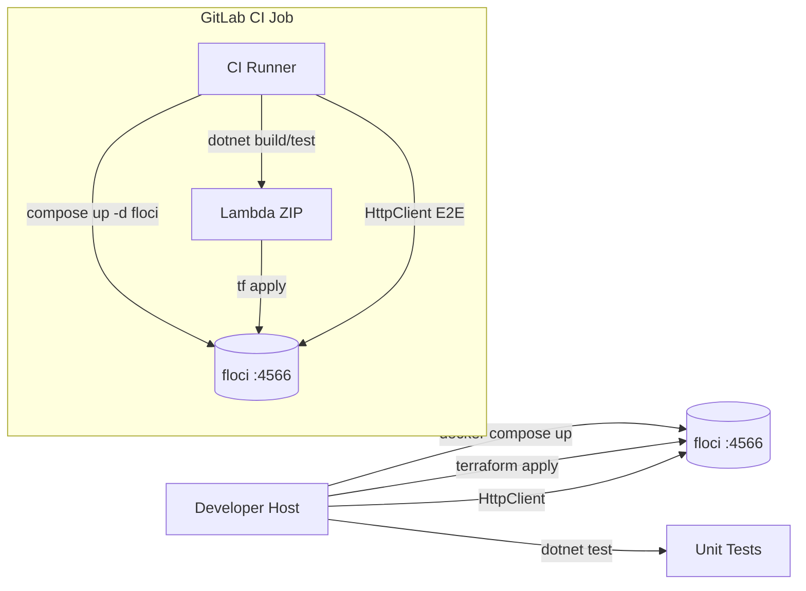

# 統合ポイント調査

## 概要

すべての統合ポイントは floci（`http://localhost:4566`、CI 内では `http://floci:4566`）に集約される。Lambda の実行は floci が Docker ソケット経由で `dotnet8` ランタイムコンテナを起動して行う。

## 提供 API エンドポイント（Todo API）

| メソッド | パス | 説明 | レスポンス |
|----------|------|------|------------|
| `POST` | `/todos` | Todo を作成（Step Functions 起動） | 201 + `Todo` |
| `GET`  | `/todos/{id}` | Todo を取得 | 200 / 404 |

API Gateway REST v1 に AWS_PROXY で `api-handler` Lambda をマウントする想定。

## floci の各 AWS API エンドポイント

floci は **単一ポート 4566** で全 AWS サービスを多重化し、`X-Amz-Target` ヘッダ等で振り分ける（出典: `docs/services/*.md`）。

| サービス | プロトコル | エンドポイント |
|----------|-----------|----------------|
| API Gateway v1 management | REST JSON | `http://localhost:4566/restapis/...` |
| API Gateway v1 invoke | HTTP | `http://localhost:4566/restapis/{id}/{stage}/_user_request_/...` |
| Lambda | REST JSON | `http://localhost:4566/2015-03-31/functions/...` |
| Step Functions | JSON 1.1 | `POST http://localhost:4566/` (`X-Amz-Target: AmazonStatesService.*`) |
| DynamoDB | JSON 1.1 | `POST http://localhost:4566/` (`X-Amz-Target: DynamoDB_20120810.*`) |
| IAM / STS | REST JSON | `http://localhost:4566/` |

## シーケンス図

### Todo 作成（POST /todos）



### Todo 取得（GET /todos/{id}）



## API Gateway → Lambda 統合（AWS_PROXY）

floci docs/services/api-gateway.md の例を踏襲：

```bash
aws apigateway put-integration \
  --rest-api-id $API_ID \
  --resource-id $RES_ID \
  --http-method POST \
  --type AWS_PROXY \
  --integration-http-method POST \
  --uri "arn:aws:apigateway:us-east-1:lambda:path/2015-03-31/functions/arn:aws:lambda:us-east-1:000000000000:function:api-handler/invocations" \
  --endpoint-url $AWS_ENDPOINT_URL
```

Terraform では `aws_api_gateway_integration` の `uri` を同形式で指定する。

## Step Functions 連携

- Lambda Resource ARN: `arn:aws:lambda:us-east-1:000000000000:function:<name>`
- IAM Role ARN: ダミーで OK（floci は Role 検証を強制しない。`arn:aws:iam::000000000000:role/sfn-role` 等で十分）
- 最小フロー: ValidateTodo → Choice($.valid) → PersistTodo / Fail

## CI/開発環境統合



## 環境変数（提案統一）

| 変数 | 値（ローカル） | 値（CI） | 用途 |
|------|---------------|---------|------|
| `AWS_ENDPOINT_URL` | `http://localhost:4566` | `http://floci:4566` | SDK / aws CLI |
| `AWS_DEFAULT_REGION` | `us-east-1` | 同左 | リージョン固定 |
| `AWS_ACCESS_KEY_ID` | `test` | 同左 | floci ダミー資格 |
| `AWS_SECRET_ACCESS_KEY` | `test` | 同左 | 同上 |
| `FLOCI_HOSTNAME` | （未設定） | `floci` | コンテナ間 URL 整合 |
| `TF_VAR_endpoint` | `http://localhost:4566` | `http://floci:4566` | Terraform variable |

## 統合ポイント一覧

| 統合ポイント | モジュール | 連携先 | 連携方式 |
|--------------|------------|--------|----------|
| API GW → Lambda | `infra/main.tf` | api-handler | AWS_PROXY |
| Lambda → DynamoDB | `Repositories` | Todos テーブル | AWSSDK.DynamoDBv2 |
| Lambda → Step Functions | `Function.cs` | StateMachine | AWSSDK.StepFunctions |
| Step Functions → Lambda | ASL | validate-todo / persist-todo | Task state |
| Terraform → floci | provider | 全サービス | endpoints ブロック |
| GitLab CI → floci | `.gitlab-ci.yml` | docker compose | Service container |
| E2E test → API GW | `TodoApi.E2ETests` | invoke URL | `HttpClient` |

## 備考

- API Gateway invoke URL は **`/restapis/{id}/{stage}/_user_request_/...`** 形式（floci 固有のパス）。実 AWS の `https://{id}.execute-api.region.amazonaws.com/{stage}/...` と異なるため、Terraform の `output` で組み立てた URL を `xUnit E2E` に環境変数で渡すのが安全。
- `FLOCI_HOSTNAME=floci` を設定しないと、floci が返す URL に `localhost` が埋め込まれてしまい、CI 内の他コンテナから到達不能になる（出典: floci docs/configuration/docker-compose.md）。
- Step Functions の SUCCEEDED 確認は `DescribeExecution` のポーリングで行う（最大 30 秒程度のリトライを E2E に組み込む）。
