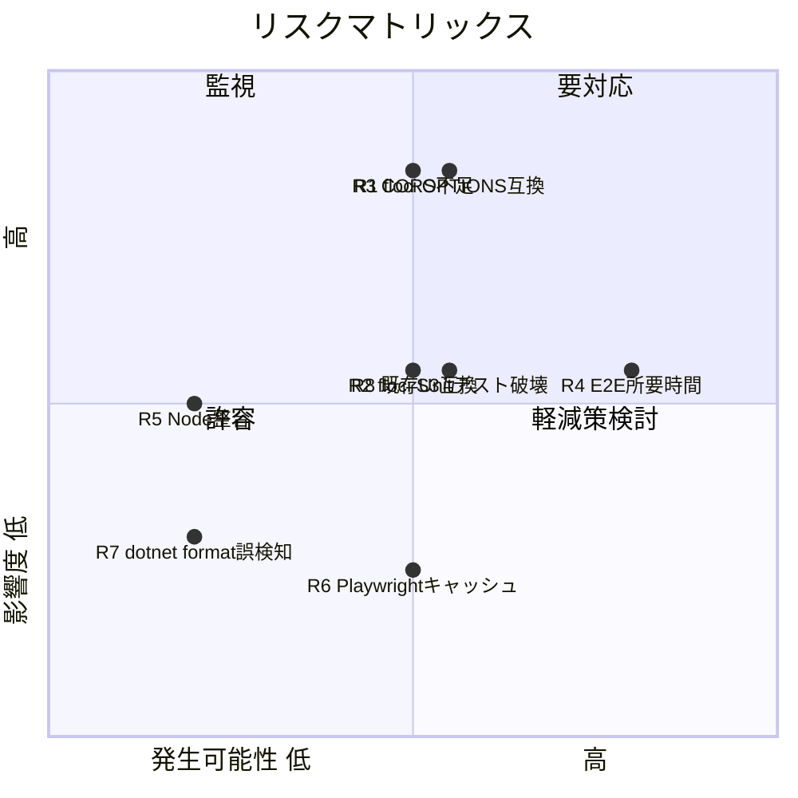
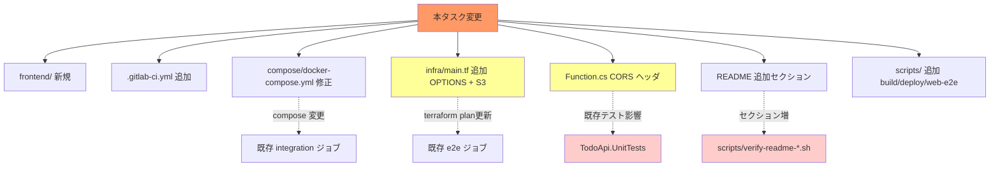

# リスク・制約分析

## 概要

最大リスクは「floci の S3/CORS/OPTIONS 周りの互換性」と「E2E パイプラインの所要時間と安定性」。設計上の制約として「nginx は静的配信のみ・API リバースプロキシ禁止」「実 AWS 接続禁止 (DR-001 既存)」が引き継がれる。

## 技術的リスク

| # | リスク | 影響度 | 発生可能性 | 対策 |
|---|--------|--------|------------|------|
| R1 | floci の API Gateway OPTIONS / MOCK 統合が未対応 or 部分対応 | 高 | 中 | OPTIONS は API Gateway で受けず Lambda で受ける fallback (`ANY` メソッドで OPTIONS 含めて Lambda に流し、`Function.cs` で OPTIONS を 204 返却) を予備案として準備 |
| R2 | floci S3 の静的ホスティング互換が不十分 | 中 | 中 | nginx をボリュームマウント方式（`dist/` を直接 nginx コンテナにマウント）に切替可能な設計にする。S3 は「将来本番化への布石」として最低限 `s3 sync` のみ実施 |
| R3 | ブラウザ CORS preflight が `Access-Control-Allow-*` 不足で失敗 | 高 | 中 | CI に Playwright での CORS 成立確認テストを 1 本入れ、失敗時に明確なエラーメッセージを出す |
| R4 | E2E ジョブ所要時間増（既存 e2e + frontend build + Playwright） | 中 | 高 | npm キャッシュ / Playwright ブラウザキャッシュ / docker layer cache を全て利用 |
| R5 | Angular 18 と Node バージョン非整合 | 中 | 低 | Node 20 LTS を CI image / devcontainer で固定 |
| R6 | Playwright のブラウザバイナリ容量によるキャッシュ肥大 | 低 | 中 | Chromium 単一ブラウザに限定 |
| R7 | `frontend/` 追加で `dotnet format --verify-no-changes` が誤検知 | 低 | 低 | `frontend/**` を `.editorconfig`/format 対象から除外 |
| R8 | `JsonHeaders` 共通辞書を変更すると既存 Unit テスト (`ApiHandlerRoutingTests` 等) が壊れる | 中 | 中 | テストの期待値を CORS ヘッダ含むよう更新（実装フェーズで TDD） |

### リスクマトリックス

## ビジネス/プロセスリスク

| リスク | 影響度 | 発生可能性 | 対策 |
|--------|--------|------------|------|
| 既存 .NET CI ジョブのリグレッション | 高 | 低 | フロント追加は **新ジョブの追加のみ**で既存 lint/unit/integration/e2e を非破壊で維持 |
| README 構造変化による `verify-readme-*.sh` 失敗 | 中 | 中 | 検証スクリプトを README 追加セクションに合わせて更新（実装の一部） |
| 設計が既存 `docs/floci-apigateway-csharp/design` と矛盾 | 中 | 低 | design ステップで既存 design ファイルを参照しつつ追補方針を明記 |

## 技術的制約

| 制約 | 詳細 | 影響範囲 |
|------|------|----------|
| 実 AWS 接続禁止 (DR-001 既存) | `AWS_*=test`, `AWS_ENDPOINT_URL` 必須。未設定で起動失敗 | フロント側でも本番 S3 / CloudFront を使わない |
| floci のみ利用 | 互換性は readonly README §互換性表に依存 | S3 と APIGW の挙動を都度検証 |
| nginx は静的配信のみ | API リバースプロキシ禁止（ブレスト決定） | CORS 設計が必須 |
| Angular 18 LTS 固定 | バージョン揺れ禁止 | package.json で `^18.0.0` ピン |
| テストは Karma + Jasmine + Playwright | ブレスト決定 | Jest 等への変更不可（本タスクでは） |
| Node 20 LTS | Angular 18 engines | CI image 統一 |

## 設計上の制約

| 制約 | 理由 | 対応方針 |
|------|------|----------|
| API ベース URL は **ランタイム** で解決 | terraform output が CI 毎に変わる可能性 | `assets/config.json` を build 時注入 + ブラウザ fetch |
| `frontend/` は単一ディレクトリに閉じる | 既存 .NET ビルドへの影響回避 | `frontend/` 配下のみで完結、ルートに余計なファイルを置かない |
| 既存 `.gitlab-ci.yml` 構造を破壊しない | リグレッション回避 | extends `.dotnet` 同様 `.node` テンプレート追加で揃える |
| OPTIONS は最小実装 | floci 互換不確実 | preflight に必要な最小ヘッダのみ |

## セキュリティ考慮事項

| 項目 | 現状 | 推奨/本タスク方針 |
|------|------|-------------------|
| 認証 | なし | 変更なし（out_of_scope） |
| CORS | 未設定 | `Access-Control-Allow-Origin: *` を設定（認可なしのため許容） |
| シークレット | `AWS_*=test` 固定 | 変更なし。実 AWS 鍵の protected variable 化禁止 (RP-009) |
| XSS | Angular 既定エスケープ | テンプレートで `[innerHTML]` を使わない |
| Dependency vuln | Dependabot 等なし | 本タスクでは追加しない（out_of_scope） |
| HTTPS | floci はローカル HTTP | 本番化時に検討（out_of_scope） |

## パフォーマンス考慮事項

| 項目 | 想定値 | 備考 |
|------|--------|------|
| Angular 初回ロード | 数百KB〜1MB 程度（Angular 18 standalone, treeshake） | 静的 SPA で十分 |
| API 呼び出しレイテンシ | 既存 Lambda + floci に依存 | 変更なし |
| E2E 所要時間 | floci up + tf apply + ng build + Playwright = 数分〜10分 | キャッシュ活用で短縮 |
| Playwright 並列度 | CI では 1〜2 worker | リソース節約 |

## 影響度・依存関係

## 緩和策一覧

| リスク/制約 | 緩和策 | 優先度 |
|-------------|--------|--------|
| R1 OPTIONS 互換 | 設計フェーズで Lambda OPTIONS 受け fallback を併記 | 高 |
| R3 CORS 不足 | Playwright で CORS 成立を必ずアサート | 高 |
| R4 E2E 時間 | npm / Playwright / docker layer キャッシュ徹底 | 高 |
| R8 既存テスト破壊 | TDD で既存 Unit テストを先に拡張 | 高 |
| README/verify 連動 | verify-readme-sections.sh 更新を plan に含める | 中 |

## ロールバック計画

| フェーズ | ロールバック方法 | 所要時間 |
|----------|------------------|----------|
| マージ前 | feature/FRONTEND-001 ブランチ破棄 | <1分 |
| マージ後 | `frontend/` ディレクトリ削除 + `.gitlab-ci.yml` の web-* ジョブ除去 + compose / infra の追加分 revert | 15分 |
| 既存ジョブが壊れた場合 | 当該変更コミットのみ revert（フロント追加は独立コミットに分離） | 5分 |

## 追加調査が必要な項目（design フェーズで実施）

1. floci `S3` と `static website hosting` の正確な互換度（特に `index.html` fallback / `error.html`）
2. floci API Gateway REST v1 の `OPTIONS` + `MOCK` 統合の実挙動
3. Angular 18 の standalone components / `provideHttpClient(withInterceptors([]))` ベース構成方針の確認
4. Playwright `mcr.microsoft.com/playwright` イメージサイズと CI ジョブ image cache の最適バランス
5. 既存 `JsonHeaders` の利用箇所網羅と CORS ヘッダ追加時のテスト影響範囲

## 備考

- 既存 README §5 にあるように CI は「DinD 既定 / shell executor 代替」の両モード対応を維持する必要があり、フロント追加でも双方を壊さないよう、ジョブ定義は image/services を切り出せる構造で書く。
- 「実 AWS 接続禁止」は本タスクでも厳格に守る（フロントから誤って S3 公開エンドポイントに行かないよう assets/config.json は floci 内 URL のみとする）。
