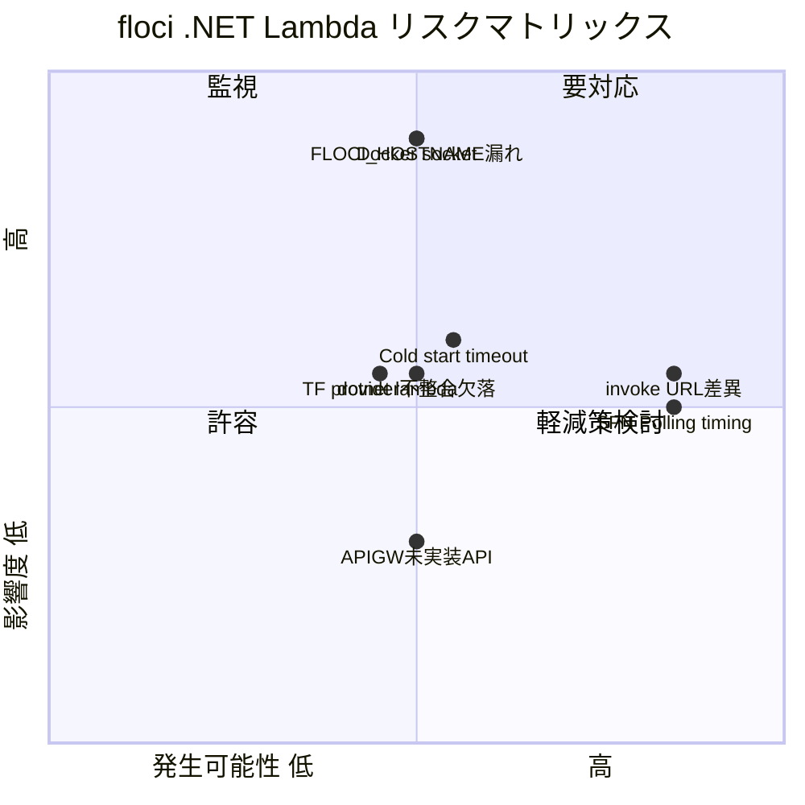
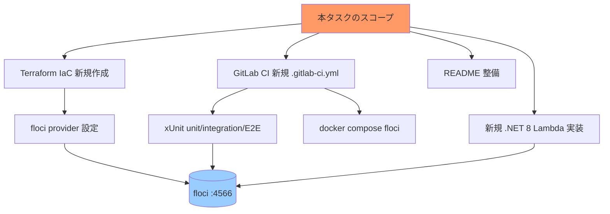

# リスク・制約分析

## 概要

floci 上で .NET 8 Lambda + REST API Gateway + Step Functions + DynamoDB を CI で完結させる際の主要リスクは「Docker ソケット経由の Lambda 起動」「invoke URL 形式差」「Step Functions 非同期確認のタイミング」「.NET 8 Lambda コールドスタート時間」の4点。

## 技術的リスク

| リスク | 影響度 | 発生可能性 | 対策 |
|--------|--------|-----------|------|
| floci が Docker ソケットを必要とし、CI ランナーで利用不可 | 高 | 中 | 専用 docker-in-docker サービス採用 + `/var/run/docker.sock` マウント or DinD で代替。GitLab Runner は `privileged` 設定の Docker executor を選択 |
| .NET 8 Lambda コールドスタート（ZIP 展開 + .NET 起動）で E2E がタイムアウト | 中 | 中 | API GW タイムアウト 30s、Step Functions 内 Lambda Task のタイムアウトを十分に確保。E2E 側で warmup invoke を 1回挟む |
| `FLOCI_HOSTNAME` 未設定により、CI 内 invoke URL が `localhost` を含み他コンテナから到達不可 | 高 | 中 | docker-compose.yml に `FLOCI_HOSTNAME: floci` を必ず設定。E2E 側は `http://floci:4566/restapis/...` を解決 |
| Lambda コンテナが Floci の Docker network に attach できない | 高 | 低 | `FLOCI_SERVICES_DOCKER_NETWORK` を CI compose プロジェクトの network 名（`<project>_default`）に合わせる |
| API Gateway invoke URL 形式（`/restapis/{id}/{stage}/_user_request_/...`）が AWS と異なる | 中 | 高 | Terraform `output` で URL を組み立て、E2E に環境変数で渡す。README にも明記 |
| Step Functions が SUCCEEDED になる前に E2E が判定 | 中 | 高 | `DescribeExecution` を最大 30 秒・1 秒間隔でポーリング |
| Terraform AWS provider バージョン不整合（v5 と v6 の breaking change） | 中 | 中 | floci compat-terraform と同じ `~> 6.0` を採用 |
| `dotnet lambda package` が CI イメージに無い | 中 | 中 | CI ジョブ先頭で `dotnet tool install -g Amazon.Lambda.Tools` を実行し PATH 追加 |
| floci の API Gateway v1 は `GetDeployment` などが未実装 | 低 | 中 | Terraform の動作で問題が出れば `aws_api_gateway_deployment` の lifecycle を `create_before_destroy` で回避 |
| floci の Lambda が S3 経由 hot-reload に依存しない構成（直接 `--zip-file`）でも適切に動くか | 低 | 低 | `aws_lambda_function.filename` 方式で十分（floci は標準の create-function を完全サポート）|

### リスクマトリックス

## ビジネス/プロジェクトリスク

| リスク | 影響度 | 発生可能性 | 対策 |
|--------|--------|-----------|------|
| サンプル肥大化により「最小構成で再現しやすい」原則が失われる | 中 | 中 | DI フレームワーク不採用、GSI なし、認証なしを維持（setup.yaml の non_functional 要件） |
| 実 AWS との挙動差で利用者が混乱 | 中 | 中 | README に「floci 限定挙動」セクション（invoke URL、Role 検証緩さ等）を明記 |
| GitLab managed Terraform state への移行手順不足 | 低 | 中 | README 補足として記載（setup.yaml の notes に明記済） |

## 技術的制約

| 制約 | 詳細 | 影響範囲 |
|------|------|----------|
| .NET 8 限定 | runtime: `dotnet8`（setup.yaml で確定） | Lambda プロジェクト |
| API Gateway v1 (REST) 限定 | setup.yaml の決定事項。HTTP API (v2) 不採用 | Terraform / 統合形式 |
| ZIP パッケージ | `dotnet lambda package` 出力を `aws_lambda_function.filename` で参照 | ビルド/デプロイ手順 |
| ローカル tfstate | GitLab managed state は補足扱い | CI tf apply 設計 |
| 実 AWS 不使用 | 全テストは floci 内で完結 | CI 構成 |
| 単一ポート 4566 | floci の全 AWS API は 4566 多重化 | endpoint 設定 |

## 設計上の制約

| 制約 | 理由 | 対応方針 |
|------|------|----------|
| 認証/認可なし | サンプル簡素化（setup.yaml out_of_scope） | API Gateway authorizer は未設定 |
| 単一テーブル DynamoDB | サンプル簡素化 | GSI なし、id (HASH) のみ |
| 同期 POST レスポンス | E2E 検証容易性 | POST は executionArn を即返却し、SFN 完了は別途 polling |
| AWS_PROXY 統合のみ | 標準的かつ Lambda 直結が最短 | mapping templates 不使用 |

## セキュリティ考慮事項

| 項目 | 現状/予定 | 備考 |
|------|----------|------|
| シークレット管理 | floci のダミー資格固定 (`test`/`test`) | 本番運用時は別管理（範囲外） |
| 入力検証 | `ValidateTodoHandler` で実施 | サンプル相当の最小実装 |
| SQL インジェクション | DynamoDB 利用のため非該当 | — |
| ログ漏洩 | 入力ペイロードを `LogInformation` で吐く可能性 | サンプル用途。README で本番化時の注意を記載 |

## パフォーマンス考慮事項

| 項目 | 想定値 | 備考 |
|------|-------|------|
| Lambda コールドスタート (.NET 8) | 1〜3 秒 | floci 初回実行で許容（warmup を E2E に組み込み） |
| API Gateway → Lambda 1往復 | < 200ms (warm) | サンプル基準 |
| DynamoDB PutItem/GetItem | < 50ms | ローカル floci のため十分 |
| Step Functions 完了 | 数秒（2 ステート） | E2E ポーリング 30 秒上限 |

## 影響度・依存関係

## 緩和策一覧（優先度順）

| リスク/制約 | 緩和策 | 優先度 |
|-------------|--------|--------|
| Docker socket / DinD | GitLab CI で `services: docker:dind` + `DOCKER_HOST=tcp://docker:2375` を採用、または compose で socket マウント。setup-template の前例を踏襲 | 高 |
| FLOCI_HOSTNAME 漏れ | docker-compose.yml に明示し、tests README にも記載 | 高 |
| invoke URL 形式 | Terraform output で完全 URL を生成、E2E に環境変数で渡す | 高 |
| Step Functions polling | 共通 helper（`WaitForExecutionAsync`）を E2E に実装 | 中 |
| .NET cold start | E2E 開始時に warmup invoke を実施 | 中 |
| dotnet lambda tool | CI ジョブで `dotnet tool install -g Amazon.Lambda.Tools` をキャッシュ込みで実施 | 中 |
| Provider バージョン | `required_providers` で `~> 6.0` を固定 | 中 |

## ロールバック計画

| フェーズ | ロールバック方法 | 所要時間 |
|----------|------------------|----------|
| ローカル apply 失敗 | `terraform destroy` または floci data ボリューム削除 + compose 再起動 | 1〜2 分 |
| CI ジョブ失敗 | ジョブ単位の re-run、artifact tfstate を破棄 | < 5 分 |
| 仕様巻き戻し | feature ブランチを破棄。本リポジトリは新規のため main 影響なし | 即時 |

## 備考・追加調査が必要な項目

- **要 PoC**: floci 上で `aws_api_gateway_method` + `aws_api_gateway_integration` (AWS_PROXY) → `.NET 8 Lambda` の接続が **`aws_lambda_permission` を要するか**、Terraform v6 provider との組み合わせで `lifecycle` 調整が要るか。設計フェーズの最初に手動で 1 リソース通すこと。
- **要 PoC**: GitLab CI における docker compose floci の起動方式（services + dind か、shell executor で compose 直叩きか）はランナー設定次第。`gitlab-repos/` 配下のサンプルランナー前提と整合させる必要あり。
- **要確認**: floci の Step Functions が `aws_sfn_state_machine` Terraform リソースで作成可能かどうかの検証（compat-terraform 例には未掲載）。create/describe の実装はあるため成功する見込みだが、apply 時のリトライ動作は要確認。
