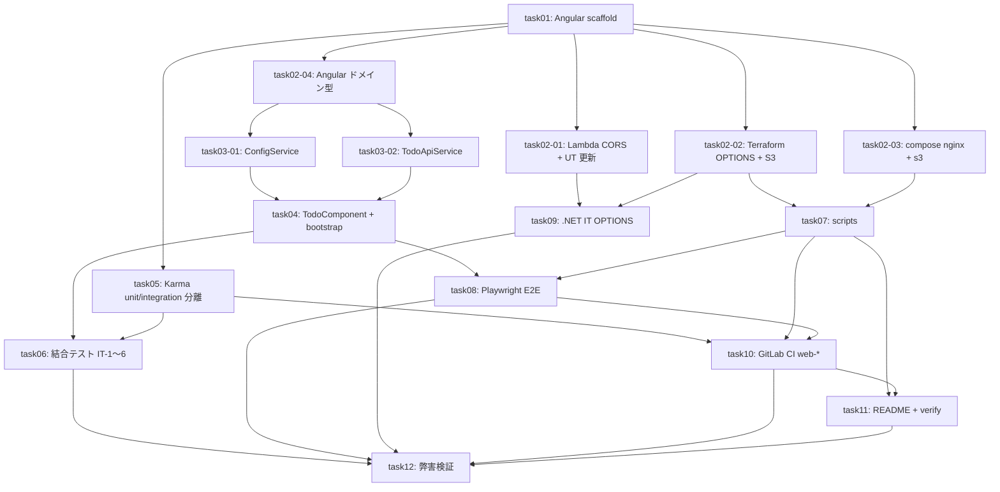

# 親エージェント統合管理プロンプト — FRONTEND-001 (floci-apigateway-csharp)

> 子エージェントに各タスクを委譲し、worktree / cherry-pick で `feature/FRONTEND-001` に統合する親エージェント向け実行ガイド。

## チケット / リポジトリ情報

| 項目          | 値                                       |
| ------------- | ---------------------------------------- |
| ticket_id     | FRONTEND-001                             |
| target_repo   | floci-apigateway-csharp                  |
| 統合ブランチ  | `feature/FRONTEND-001`                   |
| submodule     | `submodules/floci-apigateway-csharp/`    |
| タスク総数    | 16                                       |
| 並列グループ  | 8                                        |
| 推定総所要時間 | 約 13.75h (並列化前)                     |

## 依存関係 (Mermaid)



## 実行順序 (8 グループ)

| グループ | タスク                                             | 並列度 | 想定時間 |
| -------- | -------------------------------------------------- | ------ | -------- |
| G1       | task01                                             | 1      | 1.0h     |
| G2       | task02-01, task02-02, task02-03, task02-04, task05 | 5      | 1.5h     |
| G3       | task03-01, task03-02                               | 2      | 0.75h    |
| G4       | task04, task07, task09                             | 3      | 1.0h     |
| G5       | task06, task08                                     | 2      | 1.5h     |
| G6       | task10                                             | 1      | 1.0h     |
| G7       | task11                                             | 1      | 0.5h     |
| G8       | task12                                             | 1      | 1.0h     |

> 並列度は dev-container の CPU/メモリに合わせて適宜調整。初期は最大 3 並列を推奨。

## Worktree 管理手順

各タスクは **submodule 内** で worktree を切って独立作業する。

```bash
SUBMODULE=submodules/floci-apigateway-csharp
cd "$SUBMODULE"
git fetch origin
# 例: task02-01
git worktree add /tmp/FRONTEND-001-task02-01 -b FRONTEND-001-task02-01 origin/feature/FRONTEND-001
cd /tmp/FRONTEND-001-task02-01
# ...タスクを実装・テスト・コミット...
```

完了後は **元の submodule clone に戻り** cherry-pick で統合:

```bash
cd "$REPO_ROOT/$SUBMODULE"
git checkout feature/FRONTEND-001
git pull --ff-only origin feature/FRONTEND-001
# 子エージェントが作業した worktree の最終コミット SHA を取得
SHA=$(git -C /tmp/FRONTEND-001-task02-01 rev-parse HEAD)
git cherry-pick "$SHA"
git push origin feature/FRONTEND-001
# worktree を片付け
git worktree remove /tmp/FRONTEND-001-task02-01
git branch -D FRONTEND-001-task02-01
```

複数タスクを並列に実行する場合は **worktree のディレクトリ名を必ずユニーク化** する (`/tmp/FRONTEND-001-<task_id>/`)。

## Cherry-pick 統合フロー

1. 各グループ完了後、**そのグループ内のタスクを cherry-pick** する (G2 内の 5 タスクは順不同で OK、conflict 発生時は子エージェントに差し戻し)
2. cherry-pick が conflict した場合:
   - dependency 関係を見直す (例: task04 を task03-* より先に cherry-pick していないか)
   - 子エージェントに「ベース更新後に rebase してください」と差し戻す
3. 1 グループ完了 → `feature/FRONTEND-001` を `git push` → 次グループを開始
4. グループ内タスクを並列実行する際も、cherry-pick は **直列** で行う (push 競合回避)

## 子エージェントへのプロンプト雛形

```
あなたは FRONTEND-001 の {task_id} を実行するサブエージェントです。

【入力ドキュメント】
- /workspaces/dev-process/docs/floci-apigateway-csharp/plan/{task_id}.md (本タスク仕様)
- /workspaces/dev-process/docs/floci-apigateway-csharp/design/0X_*.md (設計参照)

【作業環境】
- Submodule: submodules/floci-apigateway-csharp/
- Worktree: /tmp/FRONTEND-001-{task_id}/
- Branch: FRONTEND-001-{task_id} (origin/feature/FRONTEND-001 起点)

【守るべきルール】
- TDD (RED → GREEN → REFACTOR) で進める。RED 段階のテスト失敗を必ず確認する
- コミットメッセージは日本語、`refs FRONTEND-001 {task_id} <概要>` 形式
- 末尾に `Co-authored-by: Copilot <223556219+Copilot@users.noreply.github.com>` を付与
- 既存テストを壊さない (UT/IT/E2E すべての回帰チェック)
- 設計の RD-* / RD2-* (fail-fast / DinD / pinned versions / etc.) を厳守
- gitlab-repos/ には触れない

【完了時に親へ返すもの】
- 最終コミット SHA
- 実行したテストコマンドと結果サマリ
- /tmp/FRONTEND-001-{task_id}/result.md にステップ別結果を記録
```

## 検証ゲート (各グループ後)

| グループ | 検証コマンド                                                              |
| -------- | ------------------------------------------------------------------------- |
| G1       | `cd frontend && npm ci && npm run build`                                  |
| G2       | `dotnet test tests/TodoApi.UnitTests`, `terraform validate`, `docker compose config` |
| G3       | `cd frontend && npm run test:unit`                                        |
| G4       | `cd frontend && npm run test:unit`, `dotnet test tests/TodoApi.IntegrationTests` |
| G5       | `npm run test:integration`, `npx playwright test` (devcontainer内 floci 起動済み) |
| G6       | `glab ci lint` または `gitlab-ci-lint .gitlab-ci.yml`                     |
| G7       | `bash scripts/verify-readme-sections.sh`                                  |
| G8       | task12.md の Step 1〜9 を完走                                             |

各ゲートで失敗 → そのグループのタスクへ差し戻し、修正 commit を再 cherry-pick。

## 全タスク完了後

1. `feature/FRONTEND-001` を最終 push
2. dev-process リポでサブモジュール pointer を更新するコミット (これは Step 9 `create-mr-pr` Code モードで行うため、本フェーズでは触らなくて良い)
3. 親エージェントは Step 7 `implement` の完了を `project-state` 経由で project.yaml に記録

## トラブルシュート

| 症状                                          | 対処                                                                          |
| --------------------------------------------- | ----------------------------------------------------------------------------- |
| cherry-pick conflict                          | 依存関係順を再確認、子エージェントに rebase を依頼                            |
| Karma で `coverage` 閾値割れ                   | 子エージェントに REFACTOR で追加テスト or coverage exclusion 見直しを指示     |
| Playwright が DinD 内で起動しない             | `DOCKER_HOST=tcp://docker:2375` / `--tls=false` / `FF_NETWORK_PER_BUILD=true` 確認 (RD-004) |
| `WEB_BASE_URL` 未設定で globalSetup が throw  | 期待動作 (RD-002)。CI 環境変数を補正                                          |
| Lambda CORS UT が壊れる                       | task02-01 の期待値更新が cherry-pick 済みか確認                               |
| `OPTIONS` が 403 / MOCK 統合になる             | task02-02 の AWS_PROXY 設定 / RD-006 / RD2-001 を再確認                       |
