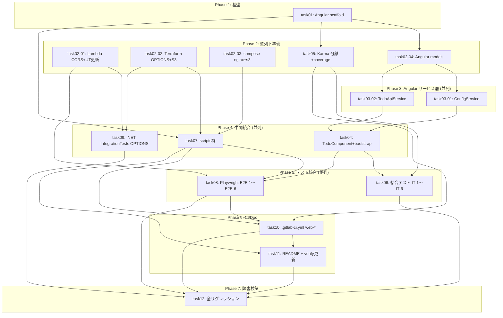

# タスク一覧 — FRONTEND-001 (floci-apigateway-csharp)

## メタデータ

| 項目         | 値                                                                 |
| ------------ | ------------------------------------------------------------------ |
| ステータス   | completed                                                          |
| 完了日時     | 2026-04-29T14:05:00+00:00                                          |
| 再計画日時   | 2026-04-30T12:00:00+00:00 (round 3: review-plan round 2 の RP2-001〜RP2-007 を反映) |
| サマリー     | floci-apigateway-csharp に Angular 18 SPA 追加 / CORS / nginx 静的配信 / S3 配置検証 / GitLab CI web-* / Playwright E2E / リグレッションを 16 タスクに分割。並列化は8グループで最大並列度5。**本ファイルが依存関係の正本** (RP-003)。`parent-agent-prompt.md` および各 `taskXX.md` の前提条件は本ファイルと同一でなければならない。<br>**round 3 修正点**: RP2-001 (task10 web-e2e に terraform 1.6.6 / dotnet-sdk-8.0 固定インストール) / RP2-002 (web-e2e.sh を唯一エントリポイント化、CI script 簡略化) / RP2-003 (task02-02 RED は test-frontend-plan.sh のみ、cross-task RED は task09 へ) / RP2-004 (task05 GREEN を構成検証のみに限定) / RP2-005 (jq を `.change.resource.addr` に統一、件数明示) / RP2-006 (design 05 の E2E-5 を page.route() に統一) / RP2-007 (design 02 の web-e2e 順序を task07/task10 と整合)。<br>**round 4 修正点**: RP3-001 (design 05 §2.3 を compose up / web-e2e.sh / compose down の 3 行へ縮約、内部処理を参考表へ分離) / RP3-002 (task10 CI script を 2 行へ統一、check-test-env は before_script のみ、SKIP_ENV_CHECK=1 で web-e2e.sh 内部の重複チェックを抑止)。 |
| 総タスク数   | 16                                                                 |
| 成果物パス   | `docs/floci-apigateway-csharp/plan/`                               |
| 対象リポジトリ | floci-apigateway-csharp                                          |

> **依存関係の正本ルール (RP-003)**: 「タスク一覧」テーブルの `前提条件` 列と「依存関係グラフ (Mermaid)」が **正本** である。`parent-agent-prompt.md` の Mermaid および各 `taskXX.md` の冒頭 `前提条件` を本ファイルに **必ず一致させる** こと。差異が発生した場合は本ファイルが優先する。round 2 では下記 grep で矛盾検知する:
> ```bash
> # 矛盾検知チェック (CI/手動)
> for f in docs/floci-apigateway-csharp/plan/task*.md; do
>   id=$(basename "$f" .md)
>   prereq_in_task=$(grep -E '^\| 前提条件' "$f" | head -1)
>   prereq_in_list=$(grep -E "^\\| ${id} " docs/floci-apigateway-csharp/plan/task-list.md)
>   echo "$id :: TASK[$prereq_in_task] LIST[$prereq_in_list]"
> done
> ```

## タスク一覧

| タスク識別子 | タスク名                                                           | 前提条件                                | 並列可否                                          | 推定時間 | ステータス |
| ------------ | ------------------------------------------------------------------ | --------------------------------------- | ------------------------------------------------- | -------- | ---------- |
| task01       | Angular 18.2 frontend スキャフォールド                              | なし                                    | 不可                                              | 1.0h     | pending    |
| task02-01    | Lambda CORS (`JsonHeaders` 拡張 + OPTIONS ハンドラ)+既存UT期待値更新| なし                                    | 可（task02-02 / task02-03 / task02-04 / task05）  | 1.0h     | pending    |
| task02-02    | Terraform OPTIONS(AWS_PROXY)+ S3 frontend bucket + outputs         | なし                                    | 可（task02-01 / task02-03 / task02-04 / task05）  | 1.5h     | pending    |
| task02-03    | compose nginx sidecar + `SERVICES`に`s3`追加 + `default.conf`      | なし                                    | 可（task02-01 / task02-02 / task02-04 / task05）  | 0.5h     | pending    |
| task02-04    | Angular ドメイン型 (`Todo` / `TodoCreateRequest` / `ApiErrorResponse` / `UiError` / `AppConfig`) | task01    | 可（task02-01 / task02-02 / task02-03 / task05）  | 0.5h     | pending    |
| task05       | Karma unit/integration 分離設定 + tsconfig.spec.* + angular.json target + npm scripts + 最終 coverage 閾値 (RP-006) | task01 | 可（task02-01〜task02-04）                        | 0.75h    | pending    |
| task03-01    | `ConfigService.load` + バリデーション (APP_INITIALIZER 登録は task04 へ移管 / RP-005) | task02-04                               | 可（task03-02）                                   | 0.75h    | pending    |
| task03-02    | `TodoApiService` (`create` / `get` / エラー整形)                    | task02-04                               | 可（task03-01）                                   | 0.75h    | pending    |
| task04       | `TodoComponent` + `AppComponent` + `main.ts` bootstrap (DI / APP_INITIALIZER / config-error 表示) (RP-005 / RP-012) | task03-01, task03-02              | 不可                                              | 1.0h     | pending    |
| task07       | scripts: `build-frontend.sh` / `deploy-frontend.sh` / `web-e2e.sh` / `check-test-env.sh` (ジョブ別プロファイル) / `wait-floci-healthy.sh` (新規) | task01, task02-02, task02-03 (RP-009 / RP-001 / RP-011) | 可（task04 / task09）                             | 1.25h    | pending    |
| task09       | .NET `TodoApi.IntegrationTests` に `OPTIONS /todos` 204+CORS ケース追加 | task02-01, task02-02                | 可（task04 / task07）                             | 0.5h     | pending    |
| task06       | 結合テスト IT-1〜IT-6 (`HttpTestingController`)（テスト追加のみ / RP-012） | task04, task05                          | 可（task08 / task10直前 順序）                    | 1.0h     | pending    |
| task08       | Playwright config + `e2e/todo.spec.ts` (E2E-1〜E2E-6、5xx は page.route() / RP-007) | task02-01, task04, task07 (RP-004) | 可（task06）                                      | 2.0h     | pending    |
| task10       | `.gitlab-ci.yml` `web-lint` / `web-unit` / `web-integration` / `web-e2e` (DinD 設定込み, check-test-env プロファイル使用) 追加 | task05, task07, task08         | 不可                                              | 1.0h     | pending    |
| task11       | `README.md` Frontend セクション追記 + `scripts/verify-readme-sections.sh` 更新 (baseline+順序 / RP-015) | task07, task10                  | 不可                                              | 0.5h     | pending    |
| task12       | 弊害検証・リグレッション (.NET全テスト再実行 / curl OPTIONS / `dotnet format` / パフォーマンス / coverage grep / 順序検証 / SHA特定 / __demo__ 削除確認 / CI 全 stage グリーン確認) | task06, task08, task09, task10, task11 | 不可     | 1.5h     | pending    |

**推定総時間**: 約 14.5h（並列化前。20〜30% バッファ込み RP-013 → 名目 18〜20h、並列化により実時間は約 8〜9h を想定）

## 依存関係グラフ



## 並列実行グループ

- **Group 1 (単独)**: task01
- **Group 2 (並列5)**: task02-01 / task02-02 / task02-03 / task02-04 / task05
- **Group 3 (並列2)**: task03-01 / task03-02
- **Group 4 (並列3)**: task04 / task07 / task09
   - 注: task07 は task01 + task02-02 + task02-03 完了後に開始可能 (RP-009)
- **Group 5 (並列2)**: task06 / task08
   - 注: task08 は task02-01 + task04 + task07 完了後に開始可能 (RP-004)
- **Group 6 (単独)**: task10
- **Group 7 (単独)**: task11
- **Group 8 (単独)**: task12

## 受入基準対応

| 受入基準                                                                                       | 対応タスク                              |
| ---------------------------------------------------------------------------------------------- | --------------------------------------- |
| ローカル Angular フロント起動 → floci API で Todo 作成・取得                                   | task01,02-03,02-04,03-*,04,07           |
| ローカル S3+CloudFront 相当 (nginx) 経由で Todo 作成・取得                                     | task02-02,02-03,07                      |
| Angular 単体テストがローカル/CI で通過                                                          | task03-01,03-02,04,05,10                |
| Angular 結合テストがローカル/CI で通過                                                          | task05,06,10                            |
| Playwright E2E がローカル/CI で通過                                                             | task07,08,10                            |
| 既存 .NET lint/unit/integration/e2e が引き続き成功                                              | task02-01,09,12                         |
| README にローカル起動 / テスト / CI 実行方法を記載                                              | task11                                  |

## E2E スコープ

E2E はテスト戦略にスコープ含むため **task08 (Playwright e2e/todo.spec.ts)** と **task10 (CI `web-e2e` ジョブ DinD 設定)** を必須として独立タスクで定義する（RD-002 / RD-004 fail-fast 含む）。
