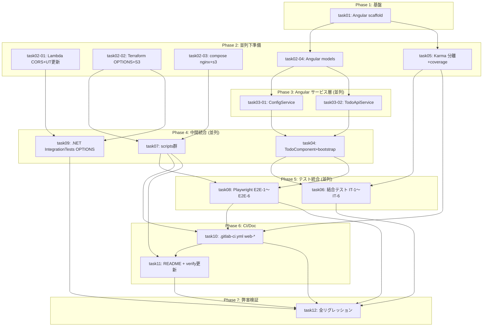

# タスク一覧 — FRONTEND-001 (floci-apigateway-csharp)

## メタデータ

| 項目         | 値                                                                 |
| ------------ | ------------------------------------------------------------------ |
| ステータス   | completed                                                          |
| 完了日時     | 2026-04-29T14:05:00+00:00                                          |
| サマリー     | floci-apigateway-csharp に Angular 18 SPA 追加 / CORS / nginx 静的配信 / S3 配置検証 / GitLab CI web-* / Playwright E2E / リグレッションを 16 タスクに分割。並列化は4フェーズで最大並列度4。 |
| 総タスク数   | 16                                                                 |
| 成果物パス   | `docs/floci-apigateway-csharp/plan/`                               |
| 対象リポジトリ | floci-apigateway-csharp                                          |

## タスク一覧

| タスク識別子 | タスク名                                                           | 前提条件                                | 並列可否                                          | 推定時間 | ステータス |
| ------------ | ------------------------------------------------------------------ | --------------------------------------- | ------------------------------------------------- | -------- | ---------- |
| task01       | Angular 18.2 frontend スキャフォールド                              | なし                                    | 不可                                              | 1.0h     | pending    |
| task02-01    | Lambda CORS (`JsonHeaders` 拡張 + OPTIONS ハンドラ)+既存UT期待値更新| なし                                    | 可（task02-02 / task02-03 / task02-04 / task05）  | 1.0h     | pending    |
| task02-02    | Terraform OPTIONS(AWS_PROXY)+ S3 frontend bucket + outputs         | なし                                    | 可（task02-01 / task02-03 / task02-04 / task05）  | 1.0h     | pending    |
| task02-03    | compose nginx sidecar + `SERVICES`に`s3`追加 + `default.conf`      | なし                                    | 可（task02-01 / task02-02 / task02-04 / task05）  | 0.5h     | pending    |
| task02-04    | Angular ドメイン型 (`Todo` / `TodoCreateRequest` / `ApiErrorResponse` / `UiError` / `AppConfig`) | task01    | 可（task02-01 / task02-02 / task02-03 / task05）  | 0.5h     | pending    |
| task05       | Karma unit/integration 分離設定 + tsconfig.spec.* + angular.json target + npm scripts + coverage 閾値 | task01 | 可（task02-01〜task02-04）                        | 0.75h    | pending    |
| task03-01    | `ConfigService.load` + バリデーション + `APP_INITIALIZER` 登録      | task02-04                               | 可（task03-02）                                   | 0.75h    | pending    |
| task03-02    | `TodoApiService` (`create` / `get` / エラー整形)                    | task02-04                               | 可（task03-01）                                   | 0.75h    | pending    |
| task04       | `TodoComponent` + `AppComponent` + `main.ts` bootstrap (DI / APP_INITIALIZER) | task03-01, task03-02              | 不可                                              | 1.0h     | pending    |
| task07       | scripts: `build-frontend.sh` / `deploy-frontend.sh` / `web-e2e.sh` / `check-test-env.sh` | task02-02, task02-03         | 可（task04 / task09）                             | 1.0h     | pending    |
| task09       | .NET `TodoApi.IntegrationTests` に `OPTIONS /todos` 204+CORS ケース追加 | task02-01, task02-02                | 可（task04 / task07）                             | 0.5h     | pending    |
| task06       | 結合テスト IT-1〜IT-6 (`HttpTestingController`)                     | task04, task05                          | 可（task08 / task10直前 順序）                    | 1.0h     | pending    |
| task08       | Playwright config + `e2e/todo.spec.ts` (E2E-1〜E2E-6)               | task04, task07                          | 可（task06）                                      | 1.5h     | pending    |
| task10       | `.gitlab-ci.yml` `web-lint` / `web-unit` / `web-integration` / `web-e2e` (DinD 設定込み) 追加 | task05, task07, task08         | 不可                                              | 1.0h     | pending    |
| task11       | `README.md` Frontend セクション追記 + `scripts/verify-readme-sections.sh` 更新 | task07, task10                  | 不可                                              | 0.5h     | pending    |
| task12       | 弊害検証・リグレッション (.NET全テスト再実行 / curl OPTIONS / `dotnet format` / パフォーマンス / CI 全 stage グリーン確認) | task06, task08, task09, task10, task11 | 不可     | 1.0h     | pending    |

**推定総時間**: 約 13.75h（並列化により実時間は約 7〜8h を想定）

## 依存関係グラフ

## 並列実行グループ

- **Group 1 (単独)**: task01
- **Group 2 (並列5)**: task02-01 / task02-02 / task02-03 / task02-04 / task05
- **Group 3 (並列2)**: task03-01 / task03-02
- **Group 4 (並列3)**: task04 / task07 / task09
- **Group 5 (並列2)**: task06 / task08
- **Group 6 (単独)**: task10
- **Group 7 (単独)**: task11
- **Group 8 (単独)**: task12

## 受入基準対応

| 受入基準                                                                                       | 対応タスク                              |
| ---------------------------------------------------------------------------------------------- | --------------------------------------- |
| ローカル Angular フロント起動 → floci API で Todo 作成・取得                                   | task01,02-03,02-04,03-*,04,07           |
| ローカル S3+CloudFront 相当 (nginx) 経由で Todo 作成・取得                                     | task02-02,02-03,07                      |
| Angular 単体テストがローカル/CI で通過                                                          | task03-01,03-02,04,05,10                |
| Angular 結合テストがローカル/CI で通過                                                          | task05,06,10                            |
| Playwright E2E がローカル/CI で通過                                                             | task07,08,10                            |
| 既存 .NET lint/unit/integration/e2e が引き続き成功                                              | task02-01,09,12                         |
| README にローカル起動 / テスト / CI 実行方法を記載                                              | task11                                  |

## E2E スコープ

E2E はテスト戦略にスコープ含むため **task08 (Playwright e2e/todo.spec.ts)** と **task10 (CI `web-e2e` ジョブ DinD 設定)** を必須として独立タスクで定義する（RD-002 / RD-004 fail-fast 含む）。
