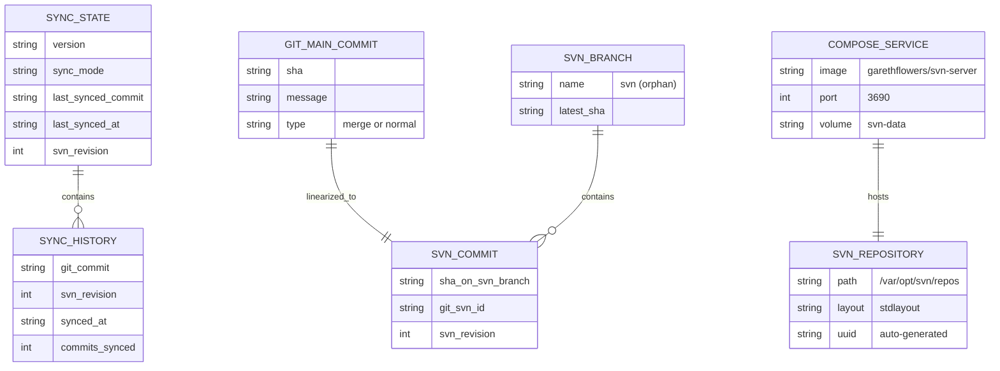

# データ構造設計

## 概要

| 項目 | 内容 |
|------|------|
| チケットID | GIT-SVN-001 |
| タスク名 | Git→SVN一方向同期の検証環境構築 |
| 作成日 | 2026-03-07 |

---

## 1. .sync-state.yml（同期状態管理ファイル）

sync ブランチに配置し、同期の進行状態を記録する。

### 1.1 スキーマ定義

```yaml
# .sync-state.yml
version: "1.0"                           # スキーマバージョン
sync_mode: "merge-unit"                  # 使用中の同期方式 (merge-unit | daily-batch)
last_synced_commit: "abc123def456..."    # main ブランチの最後に同期したコミットSHA（full SHA）
last_synced_at: "2024-01-15T10:30:00Z"  # 最終同期日時（ISO 8601 UTC）
svn_revision: 42                         # SVN 側の最終リビジョン番号
sync_history:                            # 同期履歴（直近10件、FIFO）
  - git_commit: "abc123def456..."        # 同期した main のコミットSHA
    svn_revision: 42                     # 対応する SVN リビジョン
    synced_at: "2024-01-15T10:30:00Z"   # 同期実行日時
    commits_synced: 3                    # この同期でSVNに送ったコミット数
```

### 1.2 フィールド詳細

| フィールド | 型 | 必須 | 説明 |
|------------|------|------|------|
| `version` | string | Yes | スキーマバージョン。現在 `"1.0"` |
| `sync_mode` | string | Yes | 同期方式。`merge-unit` または `daily-batch` |
| `last_synced_commit` | string | Yes | main の最終同期コミット（40文字SHA）。初回未同期は空文字 |
| `last_synced_at` | string | Yes | 最終同期日時（ISO 8601）。初回未同期は空文字 |
| `svn_revision` | int | Yes | SVN の最終リビジョン番号。初回未同期は 0 |
| `sync_history` | array | No | 同期履歴。直近10件を保持（古いものから削除） |
| `sync_history[].git_commit` | string | Yes | main のコミットSHA |
| `sync_history[].svn_revision` | int | Yes | SVN リビジョン番号 |
| `sync_history[].synced_at` | string | Yes | 同期日時 |
| `sync_history[].commits_synced` | int | Yes | 同期コミット数 |

### 1.3 初期状態

```yaml
version: "1.0"
sync_mode: "merge-unit"
last_synced_commit: ""
last_synced_at: ""
svn_revision: 0
sync_history: []
```

### 1.4 操作（yq コマンド）

```bash
# 読み取り
last_commit=$(yq '.last_synced_commit' .sync-state.yml)
svn_rev=$(yq '.svn_revision' .sync-state.yml)

# 更新
yq -i ".last_synced_commit = \"${NEW_SHA}\"" .sync-state.yml
yq -i ".last_synced_at = \"$(date -Iseconds -u)\"" .sync-state.yml
yq -i ".svn_revision = ${NEW_REV}" .sync-state.yml

# 履歴追加（先頭に追加、10件上限）
yq -i ".sync_history = [{\"git_commit\": \"${NEW_SHA}\", \"svn_revision\": ${NEW_REV}, \"synced_at\": \"$(date -Iseconds -u)\", \"commits_synced\": ${COUNT}}] + .sync_history | .sync_history = .sync_history[:10]" .sync-state.yml
```

---

## 2. compose.yaml（Docker Compose定義）

sync ブランチに配置。

```yaml
services:
  svn-server:
    image: garethflowers/svn-server
    container_name: svn-server
    ports:
      - "3690:3690"
    volumes:
      - svn-data:/var/opt/svn

volumes:
  svn-data:
```

### 2.1 設計判断

| 項目 | 判断 | 理由 |
|------|------|------|
| イメージ | `garethflowers/svn-server` | 最もシンプル、svn://のみ、Alpine ベース |
| ポート | `3690:3690` | svn:// プロトコルの標準ポート |
| ボリューム | named volume (`svn-data`) | テスト後 `docker compose down -v` でクリーン削除可能 |
| container_name | `svn-server` | 固定名でスクリプトから参照可能 |
| ネットワーク | デフォルト（bridge） | gitlab-ci-local は `--network host` で接続 |

### 2.2 SVN リポジトリ構造

```
/var/opt/svn/
└── repos/               # svnadmin create で作成
    ├── conf/
    │   ├── svnserve.conf  # サーバー設定
    │   └── passwd         # ユーザー認証
    ├── db/                # リポジトリデータ
    ├── hooks/             # フックスクリプト
    └── format             # リポジトリフォーマット
```

SVN リポジトリ内部構造（stdlayout）:

```
repos/
├── trunk/          # main ブランチの内容が同期される
├── branches/       # （未使用）
└── tags/           # （未使用）
```

---

## 3. .gitlab-ci.yml

sync ブランチに配置。

```yaml
stages:
  - sync
  - test

variables:
  GIT_DEPTH: 0
  GIT_STRATEGY: clone

sync-to-svn:
  stage: sync
  image: debian:bookworm-slim
  before_script:
    - apt-get update -qq && apt-get install -y -qq git git-svn subversion > /dev/null
    - |
      if command -v snap &>/dev/null; then
        snap install yq
      else
        YQ_VERSION="v4.44.1"
        wget -qO /usr/local/bin/yq "https://github.com/mikefarah/yq/releases/download/${YQ_VERSION}/yq_linux_amd64"
        chmod +x /usr/local/bin/yq
      fi
  script:
    - ./sync-to-svn.sh
  rules:
    - if: $CI_PIPELINE_SOURCE == "schedule"
    - if: $CI_PIPELINE_SOURCE == "web"

e2e-test:
  stage: test
  image: debian:bookworm-slim
  before_script:
    - apt-get update -qq && apt-get install -y -qq git git-svn subversion docker.io docker-compose-plugin > /dev/null
    - |
      YQ_VERSION="v4.44.1"
      wget -qO /usr/local/bin/yq "https://github.com/mikefarah/yq/releases/download/${YQ_VERSION}/yq_linux_amd64"
      chmod +x /usr/local/bin/yq
  script:
    - docker compose up -d
    - sleep 3
    - ./e2e-test.sh
  after_script:
    - docker compose down -v 2>/dev/null || true
  rules:
    - if: $CI_PIPELINE_SOURCE == "merge_request_event"
    - if: $CI_PIPELINE_SOURCE == "web"
```

### 3.1 設計判断

| 項目 | 判断 | 理由 |
|------|------|------|
| `GIT_DEPTH: 0` | 全履歴取得 | main の全コミット履歴が必要 |
| `GIT_STRATEGY: clone` | 毎回クリーン clone | 一貫した動作のため |
| ベースイメージ | `debian:bookworm-slim` | git-svn (Perl依存) のインストールが容易 |
| sync ジョブのトリガー | schedule / web | 定期実行 + 手動実行 |
| e2e-test のトリガー | merge_request / web | MR 時 + 手動実行 |

---

## 4. .gitlab-ci-local-variables.yml

ローカルテスト用の変数定義ファイル（sync ブランチに配置、.gitignore に追加しない）。

```yaml
SVN_URL: "svn://localhost:3690/repos"
SVN_USERNAME: "svnuser"
SVN_PASSWORD: "svnpass"
```

---

## 5. データ関係図



---

## 6. 環境変数一覧

| 変数名 | 使用箇所 | 必須 | 説明 |
|--------|----------|------|------|
| `SVN_URL` | sync-to-svn.sh, .gitlab-ci.yml | Yes | SVN リポジトリURL |
| `SVN_USERNAME` | sync-to-svn.sh, .gitlab-ci.yml | Yes | SVN 認証ユーザー名 |
| `SVN_PASSWORD` | sync-to-svn.sh, .gitlab-ci.yml | Yes | SVN 認証パスワード |
| `GIT_REMOTE` | sync-to-svn.sh | No | Git リモート名（default: `origin`） |
| `GIT_MAIN_BRANCH` | sync-to-svn.sh | No | 同期元ブランチ名（default: `main`） |
| `CI_JOB_TOKEN` | .gitlab-ci.yml | Auto | GitLab CI トークン（push 用） |
| `GIT_DEPTH` | .gitlab-ci.yml | Fixed | `0`（全履歴取得） |

---

## 変更履歴

| 日付 | バージョン | 変更内容 | 変更者 |
|------|------------|----------|--------|
| 2026-03-07 | 1.0 | 初版作成 | Copilot |
