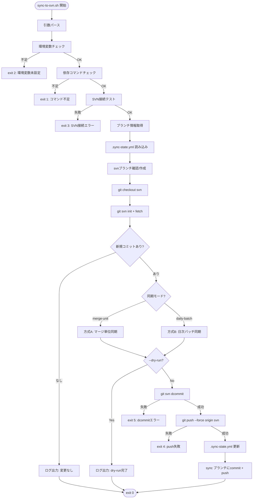
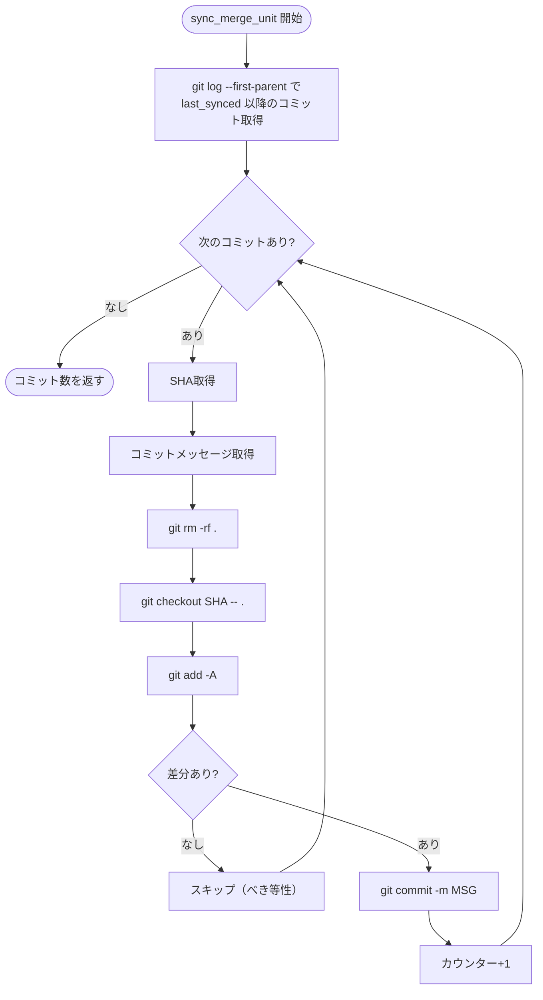
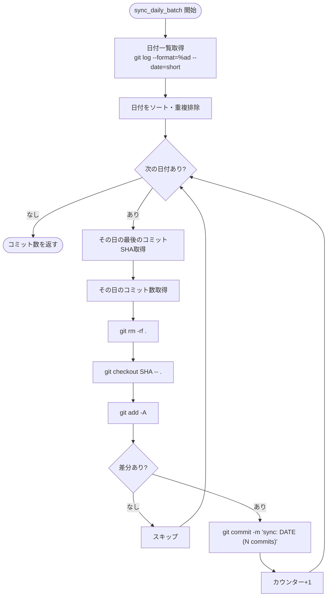
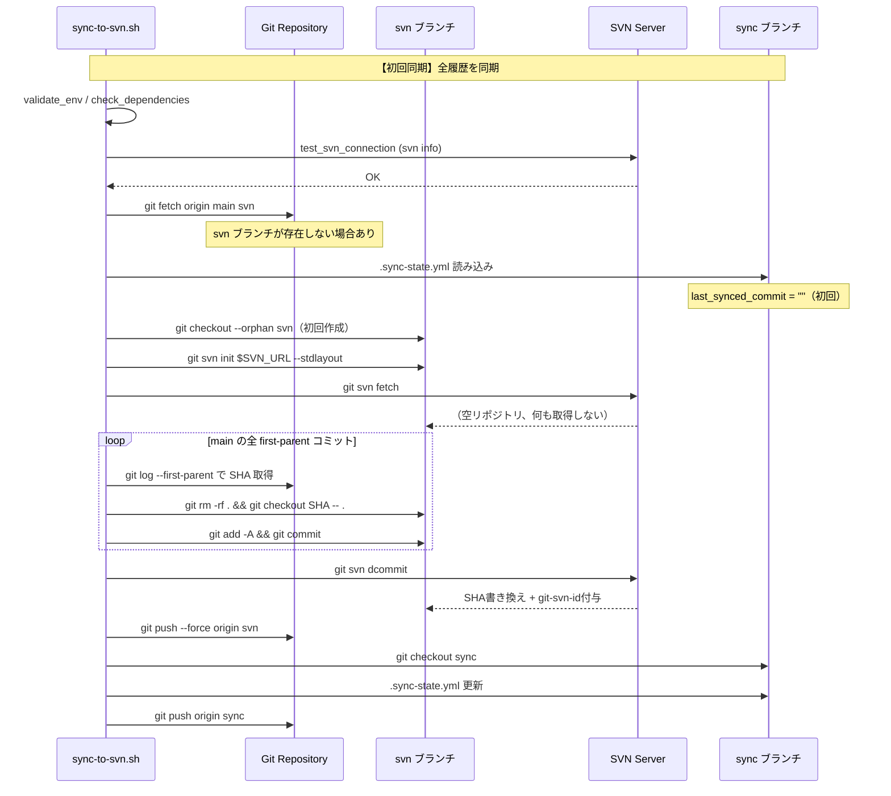
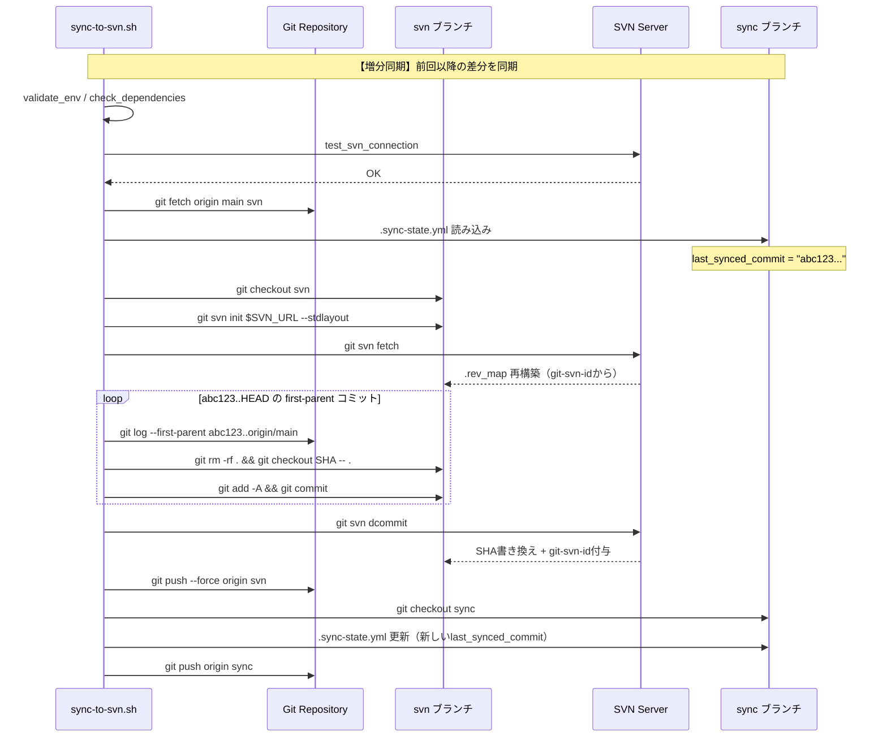
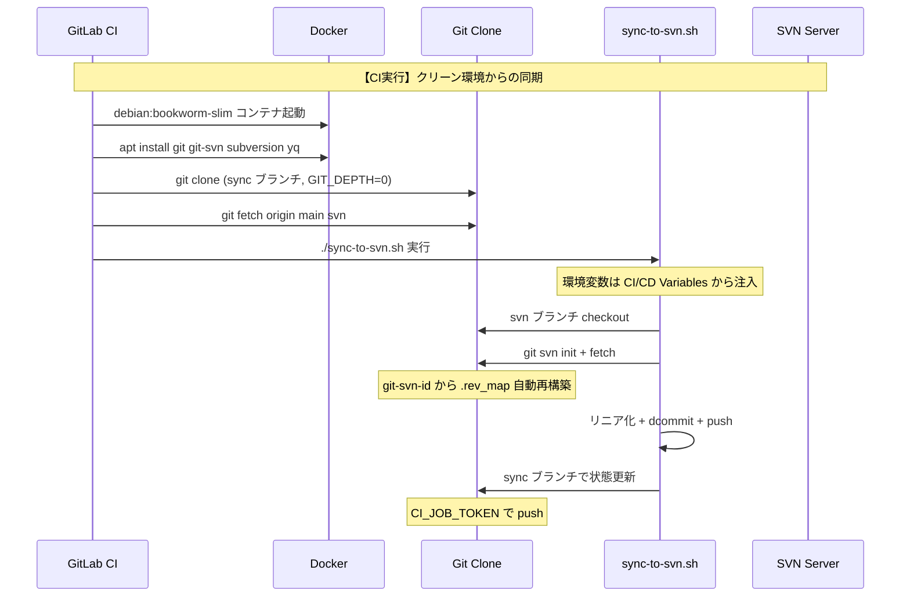
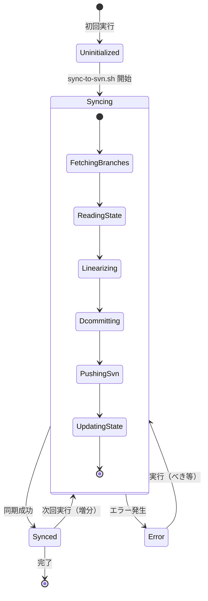
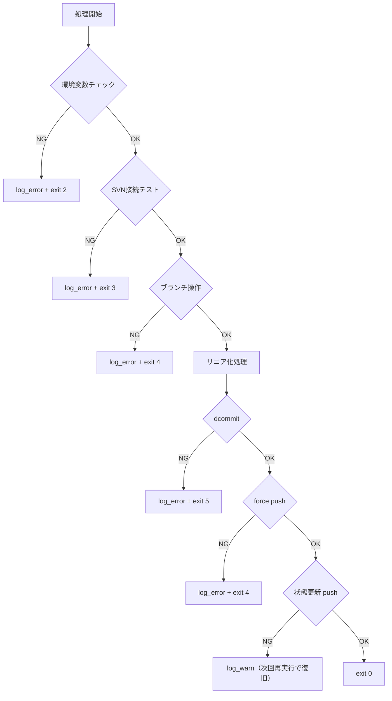
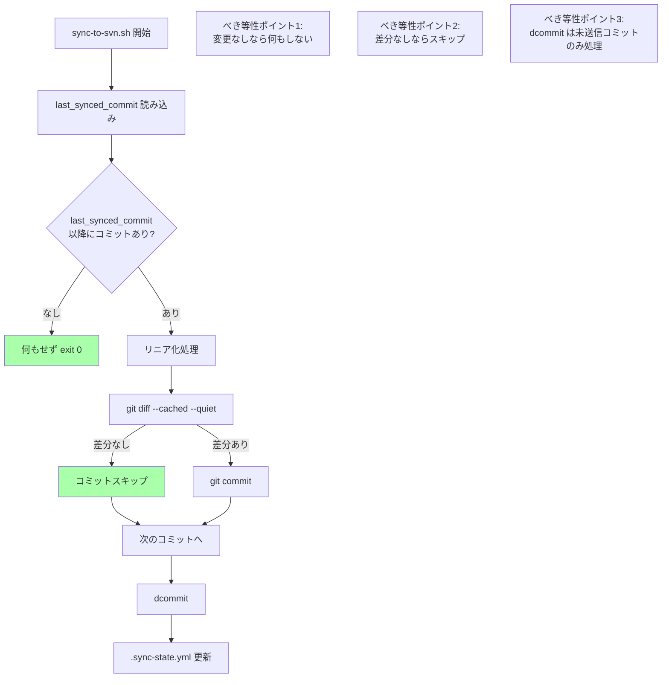
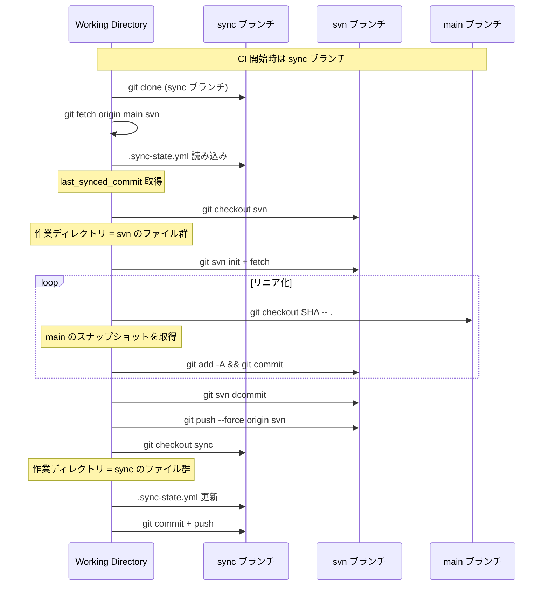

# 処理フロー設計

## 概要

| 項目 | 内容 |
|------|------|
| チケットID | GIT-SVN-001 |
| タスク名 | Git→SVN一方向同期の検証環境構築 |
| 作成日 | 2026-03-07 |

本プロジェクトは新規構築のため「修正前」は存在しない。同期スクリプトの処理フローを定義する。

---

## 1. 全体同期フロー

### 1.1 メインフロー

### 1.2 方式A: マージ単位同期（sync_merge_unit）

### 1.3 方式B: 日次バッチ同期（sync_daily_batch）

---

## 2. シーケンス図

### 2.1 初回同期フロー

### 2.2 増分同期フロー

### 2.3 CI 環境での実行フロー

---

## 3. 状態遷移図

### 3.1 同期状態の遷移

### 3.2 状態定義

| 状態 | 説明 | .sync-state.yml |
|------|------|-----------------|
| Uninitialized | 初回未実行。.sync-state.yml が初期状態 | `last_synced_commit: ""` |
| Syncing | 同期処理中 | 前回の値のまま |
| Synced | 同期完了 | 最新の main コミットSHA |
| Error | エラー発生（中断） | 前回の値のまま（べき等性により安全に再実行可能） |

---

## 4. エラーフロー

### 4.1 エラーハンドリングフロー

### 4.2 エラー種別と対応

| エラー種別 | 発生条件 | 対応方法 | べき等 |
|------------|----------|----------|--------|
| 環境変数未設定 | SVN_URL 等が未定義 | ログ出力して即座に終了 | Yes |
| SVN接続エラー | SVNサーバーが応答しない | リトライせず終了（CIスケジュールで再実行） | Yes |
| ブランチ操作エラー | checkout/fetch 失敗 | ログ出力して終了 | Yes |
| dcommit エラー | SVN側でコンフリクト等 | ログ出力して終了。.sync-state 未更新のため再実行安全 | Yes |
| push エラー | force push 拒否 | ブランチ保護設定を確認するよう案内 | Yes |
| 状態更新 push エラー | sync ブランチの push 失敗 | 警告のみ。次回実行時に同じコミットを再処理（べき等） | Yes |

### 4.3 べき等性の保証メカニズム

**べき等性が保証される理由:**

1. **状態ベース**: `.sync-state.yml` の `last_synced_commit` を基準に差分を計算。同じ状態で再実行すれば同じ結果
2. **差分チェック**: `git diff --cached --quiet` で実際に変更がない場合はコミットをスキップ
3. **dcommit の性質**: `git svn dcommit` は未送信のコミットのみをSVNに送信。既に送信済みのコミットは処理しない
4. **エラー時の安全性**: `.sync-state.yml` は同期成功後にのみ更新。エラー中断時は前回の状態が保持され、次回実行で同じ処理を再試行

---

## 5. ブランチ操作フロー

### 5.1 CI 内のブランチ切り替え

---

## 変更履歴

| 日付 | バージョン | 変更内容 | 変更者 |
|------|------------|----------|--------|
| 2026-03-07 | 1.0 | 初版作成 | Copilot |
