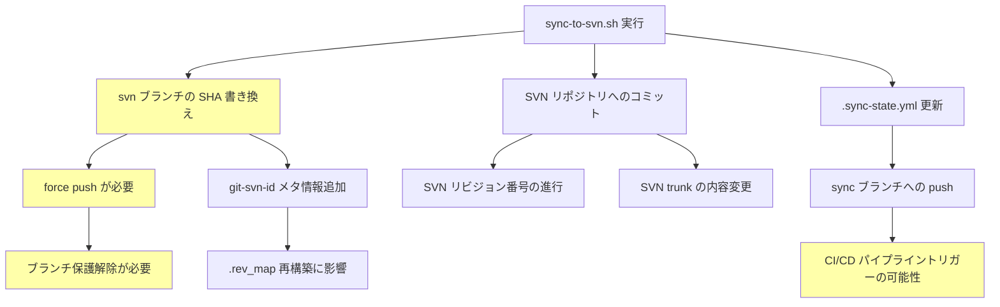

# 弊害検証計画

## 概要

| 項目 | 内容 |
|------|------|
| チケットID | GIT-SVN-001 |
| タスク名 | Git→SVN一方向同期の検証環境構築 |
| 作成日 | 2026-03-07 |

本プロジェクトは新規構築のため既存機能への弊害リスクは限定的。主にgit-svn操作固有のリスクとCI環境の制約に焦点を当てる。

---

## 1. 副作用分析

### 1.1 副作用が発生しやすい箇所

| 箇所 | 影響度 | 発生可能性 | 検証方法 | 優先度 |
|------|--------|------------|----------|--------|
| dcommit による SHA 書き換え | 高 | 確実（仕様） | E2E-6: 環境再構築テスト | 高 |
| force push による svn ブランチ上書き | 中 | 確実（仕様） | E2E-4: 増分同期で正常動作確認 | 高 |
| リニア化でのファイル削除漏れ | 高 | 低 | E2E-7: ファイル削除テスト | 中 |
| .sync-state.yml 更新失敗時の整合性 | 高 | 低 | E2E-5: べき等性テスト | 高 |
| SVNコンテナの認証設定不備 | 中 | 中 | E2E-1: 接続確認テスト | 高 |
| CI内の git remote URL 設定 | 中 | 中 | CI実行テスト | 中 |

### 1.2 影響範囲マップ



---

## 2. 回帰テスト

### 2.1 回帰テストチェックリスト

本プロジェクトは新規構築のため、リリース後の回帰テストとして以下を定義する。

- [ ] 初回同期が正常に動作する
- [ ] 増分同期が前回同期以降の変更のみ反映する
- [ ] マージコミットが正しくリニア化される
- [ ] べき等性が保持されている（再実行で副作用なし）
- [ ] 環境再構築後の増分同期が正常に動作する
- [ ] ファイルの追加・削除・リネームが正しく同期される
- [ ] .sync-state.yml が正しい値で更新される
- [ ] SVN trunk の内容が main の HEAD と一致する

---

## 3. パフォーマンス検証

### 3.1 検証項目

| 項目 | 目標値 | 許容値 | 測定方法 |
|------|--------|--------|----------|
| 初回同期時間（10コミット） | 30秒以内 | 60秒以内 | time コマンド |
| 増分同期時間（1コミット） | 10秒以内 | 30秒以内 | time コマンド |
| SVNコンテナ起動時間 | 5秒以内 | 10秒以内 | docker compose up からアクセス可能まで |
| git svn fetch 時間 | 5秒以内 | 15秒以内 | 個別計測 |

### 3.2 負荷シナリオ

| シナリオ | 条件 | 期待結果 |
|----------|------|----------|
| 通常負荷 | 1-5件のコミット同期 | 30秒以内に完了 |
| 大量コミット | 100件のコミット初回同期 | タイムアウトなしで完了（CI timeout 調整） |

---

## 4. セキュリティ検証

### 4.1 検証項目

| 項目 | 確認内容 | 検証方法 | チェック |
|------|----------|----------|----------|
| SVN認証情報 | 環境変数でのみ管理、コードにハードコードなし | grep でスクリプト内検索 | ⬜ |
| CI/CD Variables | SVN_PASSWORD が Masked 設定 | GitLab 設定確認 | ⬜ |
| force push 権限 | svn ブランチのみ許可 | ブランチ保護設定確認 | ⬜ |
| CI_JOB_TOKEN | push スコープが適切 | GitLab プロジェクト設定確認 | ⬜ |
| compose.yaml | 検証環境の簡易認証のみ（許容） | 設定ファイル確認 | ⬜ |

---

## 5. 互換性検証

### 5.1 環境互換性

| 環境 | 対応状況 | 確認方法 |
|------|----------|----------|
| ローカル（Docker Compose） | ✅ 主要環境 | 直接実行テスト |
| GitLab CI (Docker executor) | ✅ 本番CI環境 | gitlab-ci-local テスト |
| GitLab CI (Shell executor) | ⚠️ 未検証 | 必要に応じてテスト |

### 5.2 ツールバージョン互換性

| ツール | 最小バージョン | テスト環境バージョン | 確認方法 |
|--------|---------------|---------------------|----------|
| git | 2.30+ | 確認必要 | `git --version` |
| git-svn | git と同一 | 確認必要 | `git svn --version` |
| svn | 1.14+ | 確認必要 | `svn --version` |
| yq | 4.0+ | 確認必要 | `yq --version` |
| docker compose | 2.0+ | 確認必要 | `docker compose version` |

---

## 6. データ整合性検証

### 6.1 検証項目

| 項目 | 確認内容 | 検証方法 |
|------|----------|----------|
| main ↔ SVN trunk 内容一致 | 同期後の SVN trunk のファイルが main HEAD と一致 | svn export → diff |
| .sync-state.yml ↔ SVN revision 一致 | 記録された svn_revision が実際のSVN最新リビジョンと一致 | svn info で比較 |
| .sync-state.yml ↔ main HEAD 一致 | last_synced_commit が main の HEAD と一致 | git rev-parse で比較 |
| git-svn-id ↔ SVN revision 一致 | コミットの git-svn-id 内の revision が正しい | git log + svn log で比較 |

### 6.2 整合性チェックスクリプト

```bash
verify_sync_integrity() {
  # 1. SVN trunk の内容を取得
  svn export svn://localhost:3690/repos/trunk /tmp/svn-export --username svnuser --password svnpass --force

  # 2. main HEAD の内容を取得
  git archive origin/main | tar -x -C /tmp/git-export

  # 3. diff で比較
  diff -rq /tmp/svn-export /tmp/git-export

  # 4. .sync-state.yml の last_synced_commit が main HEAD と一致
  local state_commit=$(yq '.last_synced_commit' .sync-state.yml)
  local main_head=$(git rev-parse origin/main)
  assert_equal "$main_head" "$state_commit" "last_synced_commit vs main HEAD"

  # 5. SVN revision が .sync-state.yml と一致
  local state_rev=$(yq '.svn_revision' .sync-state.yml)
  local svn_rev=$(svn info svn://localhost:3690/repos/trunk --username svnuser --password svnpass | grep "Revision:" | awk '{print $2}')
  assert_equal "$state_rev" "$svn_rev" "svn_revision vs SVN info"
}
```

---

## 7. 検証実行計画

### 7.1 実行順序

1. E2Eテスト全項目（05_test-plan.md 参照）
2. データ整合性検証（上記スクリプト）
3. パフォーマンス計測
4. セキュリティチェックリスト確認

### 7.2 結果レポートテンプレート

| 検証項目 | 結果 | 発見事項 | 対応状況 |
|----------|------|----------|----------|
| E2Eテスト | ⬜ | | |
| データ整合性 | ⬜ | | |
| パフォーマンス | ⬜ | | |
| セキュリティ | ⬜ | | |
| 互換性 | ⬜ | | |

---

## 変更履歴

| 日付 | バージョン | 変更内容 | 変更者 |
|------|------------|----------|--------|
| 2026-03-07 | 1.0 | 初版作成 | Copilot |
