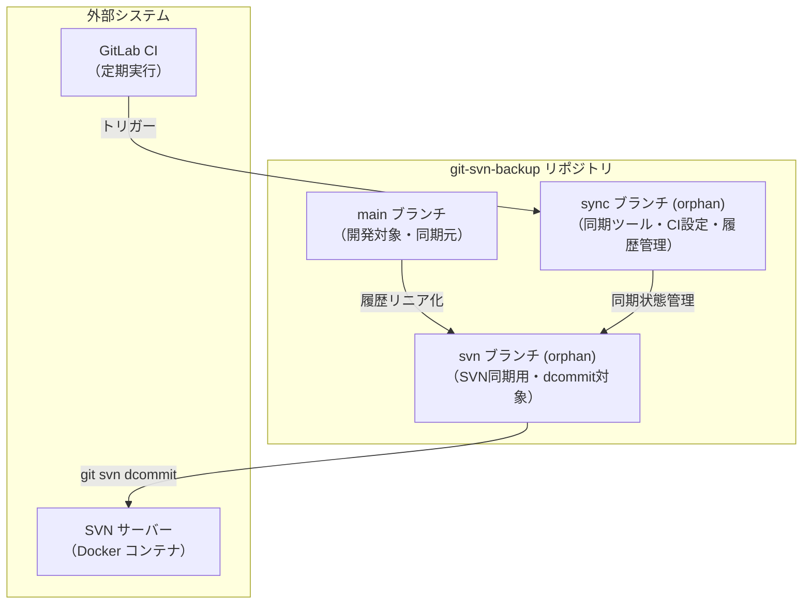
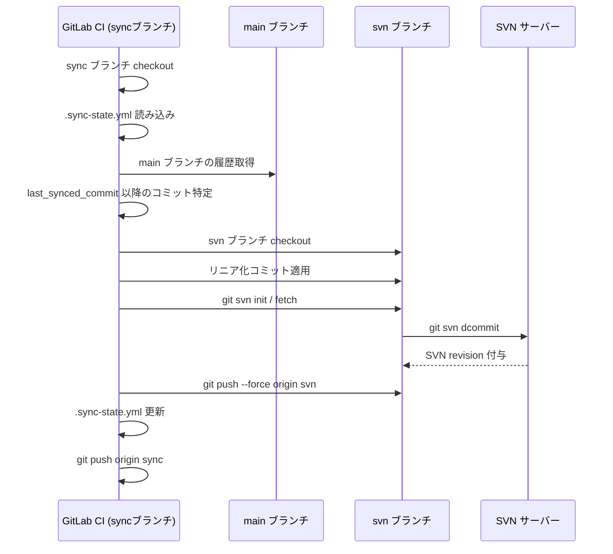
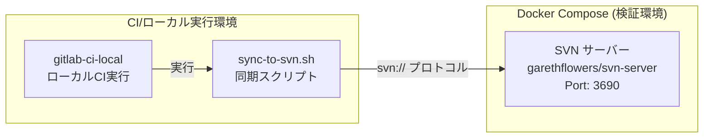

# アーキテクチャ調査

## 概要

git-svn-backup は GitLab 上の Git リポジトリの main ブランチを SVN サーバーに一方向同期するための検証環境・同期ツールプロジェクト。ターゲットリポジトリは現時点でほぼ空（README.md のみ）であり、今回新規に構築する。

## ターゲットリポジトリ現状

```
submodules/git-svn-backup/
├── .git/
└── README.md      # GitLab初期テンプレート（操作ガイド）
```

- GitLab リポジトリ: `https://gitlab.com/nagasaka-experimental/git-svn-backup.git`
- ブランチ: `main` のみ（コミット1件）
- 既存コード: なし（設計・実装は全て新規）

## 計画アーキテクチャ: 3ブランチ構成

brainstorming で決定した3ブランチ構成を採用する。



## ブランチ別責務

| ブランチ | 種別 | 責務 | 主要コンテンツ |
|----------|------|------|---------------|
| main | 通常 | 開発対象リポジトリ。同期元の履歴を持つ | ソースコード、README.md |
| svn | orphan | SVN と同期するためのリニア履歴を保持 | main からリニア化されたファイル群 |
| sync | orphan | 同期ツール・CI設定・状態管理 | スクリプト、.gitlab-ci.yml、compose.yaml、.sync-state.yml |

## 同期フロー概要



## インフラ構成



## 主要コンポーネント（計画）

| コンポーネント | 配置先 | 役割 |
|---------------|--------|------|
| `compose.yaml` | sync ブランチ | SVN サーバーコンテナ定義 |
| `sync-to-svn.sh` | sync ブランチ | Git→SVN 同期メインスクリプト |
| `.gitlab-ci.yml` | sync ブランチ | GitLab CI 定期実行ジョブ定義 |
| `.sync-state.yml` | sync ブランチ | 同期状態記録（最終同期コミットSHA等） |
| `e2e-test.sh` | sync ブランチ | E2E テストスクリプト |

## 備考

- ターゲットリポジトリは完全に新規構築のため、既存コードの制約はない
- 3ブランチ構成は brainstorming で合意済み
- SVN サーバーは検証用 Docker コンテナで、本番 SVN への接続は scope 外
