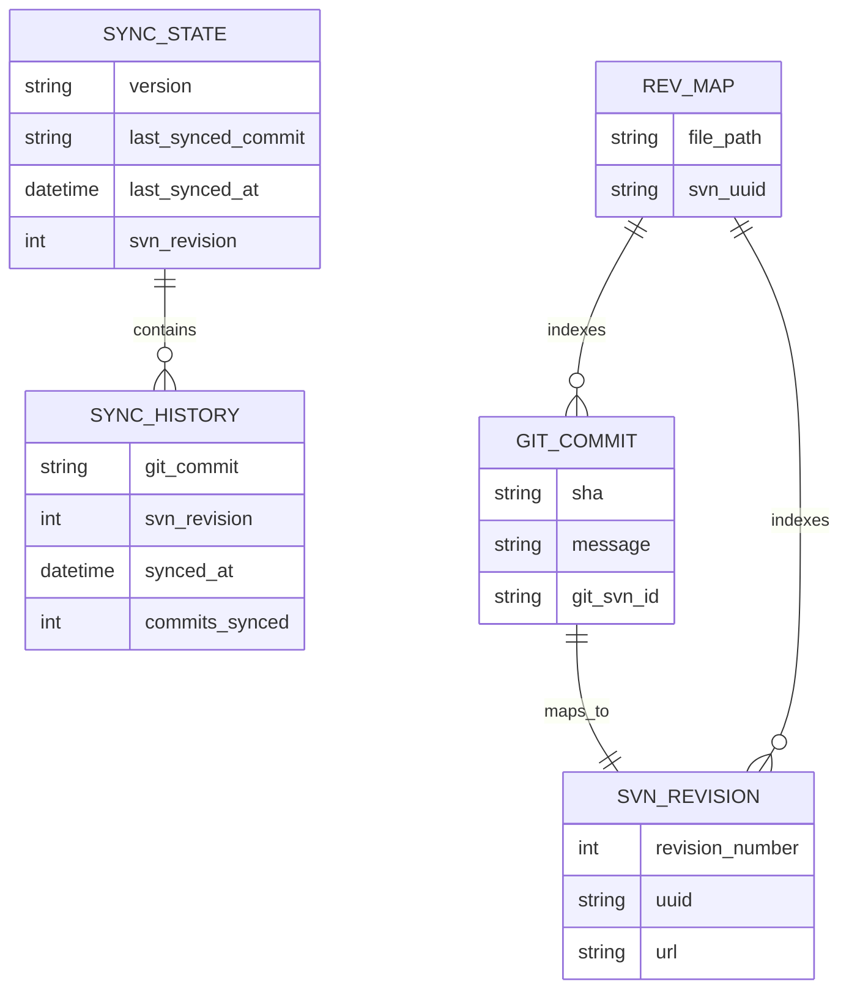

# データ構造調査

## 概要

本プロジェクトのデータ構造は、同期状態管理ファイル（.sync-state.yml）、git-svn メタデータ（.git/svn/）、SVN リポジトリ構造（trunk/branches/tags）の3つが中心となる。

## 同期状態管理: .sync-state.yml

sync ブランチに配置し、同期の進行状態を記録する。

```yaml
# .sync-state.yml
version: "1.0"
last_synced_commit: "abc123def456..."   # main ブランチの最後に同期したコミットSHA
last_synced_at: "2024-01-15T10:30:00Z"  # 最終同期日時（ISO 8601）
svn_revision: 42                         # SVN 側の最終リビジョン番号
sync_history:                            # 同期履歴（直近N件）
  - git_commit: "abc123..."
    svn_revision: 42
    synced_at: "2024-01-15T10:30:00Z"
    commits_synced: 3                    # この同期でSVNに送ったコミット数
```

## git-svn メタデータ

`git svn init` / `git svn fetch` により `.git/` 内に以下のメタデータが生成される。

```
.git/
├── svn/
│   └── refs/
│       └── remotes/
│           └── origin/
│               └── trunk/
│                   ├── .rev_map.*       # SVN revision ↔ Git SHA マッピング
│                   ├── index            # SVN 作業ツリーインデックス
│                   └── unhandled.log    # 未処理の SVN プロパティ等
└── config                               # [svn-remote "svn"] セクション追加
```

### git config 内の svn-remote 設定

```ini
[svn-remote "svn"]
    url = svn://svn-server:3690/repos
    fetch = trunk:refs/remotes/origin/trunk
    branches = branches/*:refs/remotes/origin/*
    tags = tags/*:refs/remotes/origin/tags/*
```

## git-svn-id メタ情報

dcommit 後、各コミットメッセージに `git-svn-id` トレーラーが自動付与される。

```
git-svn-id: svn://svn-server:3690/repos/trunk@5 e68e7a21-f206-47f4-aa95-bcbb44965a40
```

構造:
```
git-svn-id: <SVN_URL>@<revision> <SVN_UUID>
```

| フィールド | 説明 | 例 |
|-----------|------|-----|
| SVN_URL | SVN リポジトリの完全パス | `svn://svn-server:3690/repos/trunk` |
| revision | SVN リビジョン番号 | `5` |
| SVN_UUID | SVN リポジトリの UUID | `e68e7a21-f206-47f4-aa95-bcbb44965a40` |

### CI 環境での再構築可能性

**実験で確認済み**: git-svn-id メタ情報がコミットメッセージに埋め込まれているため、CI 環境で毎回クリーンな git clone を行っても、`git svn init` + `git svn fetch` を実行すれば `.rev_map` が自動再構築される。

```bash
# CI 環境での再構築フロー（実験で動作確認済み）
git clone <repo> && cd <repo>
git checkout svn
git svn init <SVN_URL> --stdlayout
git svn fetch    # git-svn-id から .rev_map を自動再構築
# 以降、新しいコミットの dcommit が可能
```

## SVN リポジトリ構造

標準的な trunk/branches/tags レイアウトを採用。

```
svn-repo/
├── trunk/          # main ブランチの内容が同期される
├── branches/       # （今回は未使用）
└── tags/           # （今回は未使用）
```

## ER 図（データ関係）



## 環境変数

| 変数名 | 説明 | 例 |
|--------|------|-----|
| `SVN_URL` | SVN リポジトリ URL | `svn://svn-server:3690/repos` |
| `SVN_USERNAME` | SVN 認証ユーザー名 | `svnuser` |
| `SVN_PASSWORD` | SVN 認証パスワード | `svnpass` |

## 備考

- `.rev_map` は git-svn-id メタ情報から完全に再構築可能（CI 環境で毎回破棄しても問題ない）
- dcommit 後の SHA 書き換えにより、svn ブランチの Git SHA は毎回変化する
- .sync-state.yml は main ブランチの SHA を記録（svn ブランチの SHA は dcommit で変わるため不適）
