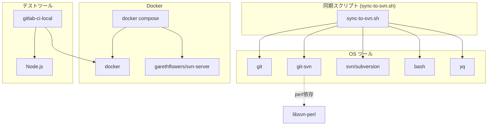

# 依存関係調査

## 概要

本プロジェクトの依存関係は、OS レベルのツール（git-svn, svn）、Docker イメージ（SVN サーバー）、npm パッケージ（gitlab-ci-local）の3層で構成される。

## 外部依存関係

### 実行環境依存

| ツール | バージョン | 用途 | インストール方法 |
|--------|-----------|------|-----------------|
| git | >= 2.30 | バージョン管理 | OS パッケージ |
| git-svn | >= 2.30 | Git↔SVN ブリッジ | `apt install git-svn` |
| svn (subversion) | >= 1.14 | SVN クライアント | `apt install subversion` |
| docker | >= 20.10 | コンテナ実行 | Docker CE |
| docker compose | >= 2.0 | マルチコンテナ管理 | Docker Compose V2 |
| bash | >= 4.0 | スクリプト実行 | OS 標準 |
| yq | >= 4.0 | YAML 操作 | バイナリ or snap |

### テスト環境依存

| ツール | バージョン | 用途 | インストール方法 |
|--------|-----------|------|-----------------|
| gitlab-ci-local | >= 4.68 | ローカル CI 実行 | `npm install -g gitlab-ci-local` |

### Docker イメージ依存

| イメージ | 用途 | プロトコル |
|---------|------|-----------|
| `garethflowers/svn-server` | SVN サーバー（推奨） | svn:// (port 3690) |
| `elleflorio/svn-server` | SVN サーバー（代替） | svn:// + http:// |

## SVN コンテナイメージ比較

### garethflowers/svn-server（推奨）

| 項目 | 詳細 |
|------|------|
| ベースイメージ | Alpine Linux |
| サーバー | svnserve |
| プロトコル | svn:// (port 3690) |
| 認証 | svnserve.conf + passwd ファイル |
| 設定の簡易さ | ⭐⭐⭐ 非常にシンプル |
| リポジトリパス | `/var/opt/svn/` |
| リポジトリ作成 | `docker exec <container> svnadmin create <name>` |

```yaml
# compose.yaml での構成例
services:
  svn-server:
    image: garethflowers/svn-server
    ports:
      - "3690:3690"
    volumes:
      - svn-data:/var/opt/svn
volumes:
  svn-data:
```

認証設定:
```bash
# リポジトリ作成
docker exec svn-server svnadmin create /var/opt/svn/repos

# 認証設定（svnserve.conf）
docker exec svn-server sh -c 'cat > /var/opt/svn/repos/conf/svnserve.conf << EOF
[general]
anon-access = none
auth-access = write
password-db = passwd
realm = My SVN Repository
EOF'

# ユーザー設定（passwd）
docker exec svn-server sh -c 'cat > /var/opt/svn/repos/conf/passwd << EOF
[users]
svnuser = svnpass
EOF'
```

### elleflorio/svn-server（代替）

| 項目 | 詳細 |
|------|------|
| ベースイメージ | Alpine Linux + S6 |
| サーバー | Apache httpd + svnserve |
| プロトコル | http:// (port 80) + svn:// (port 3690) |
| 認証 | htpasswd (WebDAV) + svnserve.conf |
| 設定の簡易さ | ⭐⭐ やや複雑（httpd設定含む） |
| 管理 UI | SVNADMIN (Web UI) あり |
| リポジトリパス | `/home/svn/` |

```yaml
# compose.yaml での構成例
services:
  svn-server:
    image: elleflorio/svn-server
    ports:
      - "80:80"
      - "3690:3690"
    volumes:
      - svn-data:/home/svn
volumes:
  svn-data:
```

### 選定理由: garethflowers/svn-server

- **シンプルさ**: svnserve のみ、httpd 不要
- **軽量**: Alpine ベースで最小構成
- **プロトコル**: svn:// は git-svn との相性が良い
- **設定**: svnserve.conf + passwd のみで完結

## 依存関係図



## Perl 依存（git-svn 固有）

git-svn は内部的に Perl スクリプトで実装されており、以下の Perl モジュールに依存する:

| モジュール | 用途 |
|-----------|------|
| `libsvn-perl` | SVN クライアントライブラリの Perl バインディング |
| `SVN::Core` | SVN コア機能 |
| `SVN::Ra` | SVN リモートアクセス |

CI の Docker イメージで git-svn を使う場合、`apt install git-svn` で自動的にインストールされる。

## バージョン制約・注意点

| 項目 | 制約内容 | 理由 |
|------|----------|------|
| git-svn | git パッケージと同バージョン推奨 | 互換性 |
| svnserve | SVN 1.14+ | セキュリティ |
| Docker Compose | V2 形式（compose.yaml） | `docker-compose.yml` は旧形式 |
| gitlab-ci-local | 4.x+ | services 非対応のためネットワーク接続で代替 |

## 備考

- git-svn は `apt install git-svn` で git パッケージとは別にインストールが必要
- garethflowers/svn-server は svn:// プロトコルのみ対応、http:// は使えない
- CI 環境（GitLab Runner Docker executor）では git-svn のインストールが before_script で必要
