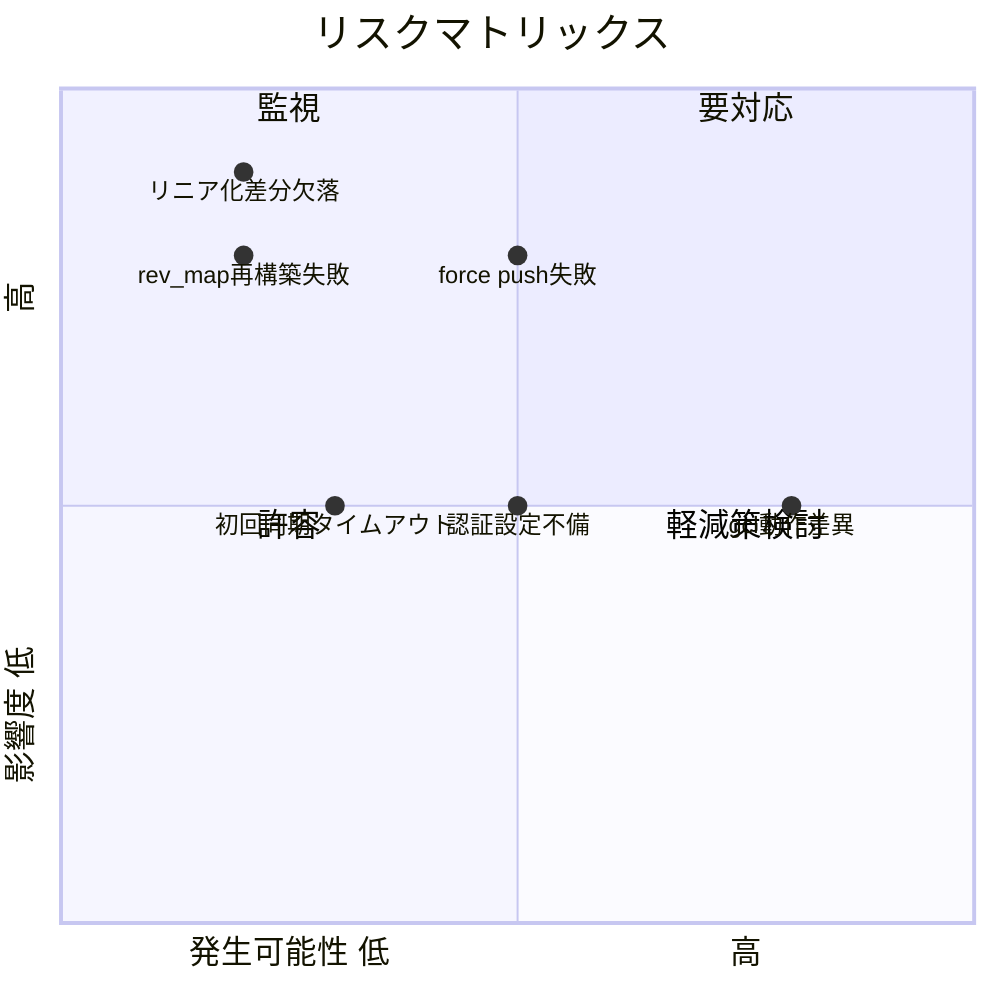
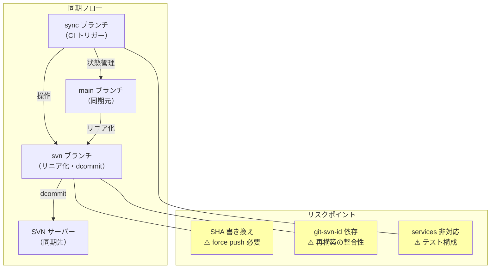

# リスク・制約分析

## 概要

本プロジェクトの主なリスクは git-svn の SHA 書き換えに起因する force push の必要性、CI 環境での git-svn セットアップの複雑さ、および gitlab-ci-local の services 非対応による E2E テスト構成の制約にある。

## 技術的リスク

| リスク | 影響度 | 発生可能性 | 対策 |
|--------|--------|------------|------|
| dcommit 後の SHA 書き換えによる force push 失敗 | 高 | 中 | svn ブランチの保護を解除、スクリプトで `--force` を明示 |
| git-svn の .rev_map 再構築失敗 | 高 | 低 | git-svn-id メタ情報の整合性を E2E テストで検証 |
| SVN コンテナの認証設定不備 | 中 | 中 | compose.yaml で初期設定スクリプトを自動実行 |
| main ブランチのリニア化で差分欠落 | 高 | 低 | `git checkout COMMIT -- .` 方式で安全に全ツリーコピー |
| gitlab-ci-local と GitLab Runner の動作差異 | 中 | 高 | services 非使用、Docker Compose で統一 |
| 大量のコミット初回同期でのタイムアウト | 中 | 低 | バッチ処理、タイムアウト設定の調整 |

### リスクマトリックス



## 技術的制約

| 制約 | 詳細 | 影響範囲 |
|------|------|----------|
| git-svn はリニア履歴のみ dcommit 可能 | マージコミットを含む履歴は直接 dcommit できない | 同期スクリプト設計 |
| dcommit は Git SHA を書き換える | コミットメッセージに git-svn-id を追加するため SHA が変わる | svn ブランチの管理方式 |
| gitlab-ci-local は services: 非対応 | Docker Compose で代替が必要 | E2E テスト構成 |
| svn ブランチは force push が必須 | dcommit による SHA 書き換えのため | ブランチ保護設定 |
| git-svn は Perl 依存 | CI の Docker イメージに git-svn + perl が必要 | CI イメージ選定 |
| SVN ユーザー = CI 実行ユーザー固定 | SVN 側のコミッター名は CI ユーザーになる（許容済み） | なし（許容） |

## 設計上の制約

| 制約 | 理由 | 対応方針 |
|------|------|----------|
| 一方向同期のみ（Git→SVN） | 要件による scope 定義 | SVN→Git は考慮しない |
| main ブランチのみ同期 | scope 定義 | 他ブランチの同期は対象外 |
| sync ブランチに全ツール配置 | main ブランチを汚さないため | orphan ブランチで完全分離 |
| E2E テストのみ | brainstorming で決定 | 単体・結合テストは作成しない |
| 検証用 SVN のみ | 本番 SVN は scope 外 | Docker コンテナ完結 |

## セキュリティ考慮事項

| 項目 | 対策 | 状態 |
|------|------|------|
| SVN 認証情報 | 環境変数（SVN_URL/USERNAME/PASSWORD）で管理 | 設計要 |
| GitLab CI/CD Variables | Protected/Masked 設定で秘匿 | 設計要 |
| compose.yaml の認証 | 検証環境のみのため簡易認証で許容 | 許容 |
| force push の安全性 | svn ブランチは同期専用、人間が直接編集しない | 許容 |
| CI_JOB_TOKEN スコープ | push 権限が必要（project settings で設定） | 設計要 |

## 3ブランチ構成の技術検証結果

### orphan ブランチ作成

```bash
# ✅ 実験で確認済み: orphan ブランチは独立した履歴を持つ
git checkout --orphan svn
git rm -rf .
echo "svn content" > file.txt
git add . && git commit -m "svn: initial"

# 3ブランチは完全に独立（共有する祖先コミットがない）
```

### CI 内でのマルチブランチ操作

```bash
# ✅ 実験で確認済み: 1つのリポジトリ内で自由にブランチ切り替え可能
git checkout sync      # sync ブランチで状態読み取り
git checkout svn       # svn ブランチで同期作業
git checkout sync      # sync ブランチに戻って状態更新
```

### svn ブランチから main のファイルを取得

```bash
# ✅ 実験で確認済み: 別ブランチのファイルを checkout で取得可能
git checkout svn
git checkout main -- file.txt    # main ブランチの file.txt を取得
git add -A && git commit -m "sync from main"
```

### force push の動作

```bash
# ✅ 実験で確認済み: dcommit 後の SHA 書き換えによる force push
git svn dcommit
# SHA: d1600be → a9165b3 に書き換え
git push --force origin svn
```

## 影響度・依存関係



## 緩和策一覧

| リスク/制約 | 緩和策 | 優先度 |
|-------------|--------|--------|
| force push 失敗 | svn ブランチの保護を解除、CI ユーザーに force push 権限付与 | 高 |
| git-svn 再構築失敗 | E2E テストで「0 からの環境再構築→増分同期」を検証 | 高 |
| services 非対応 | Docker Compose + `--network host` で統一 | 高 |
| 初回同期タイムアウト | CI ジョブのタイムアウト設定を十分に長く | 中 |
| リニア化差分欠落 | `git checkout COMMIT -- .` 方式（スナップショット型）で安全性確保 | 中 |
| CI push 権限 | CI_JOB_TOKEN または Deploy Token の設定 | 中 |

## ロールバック計画

| フェーズ | ロールバック方法 | 所要時間 |
|----------|------------------|----------|
| SVN 同期前 | svn ブランチを前回の状態に reset --hard | 1分 |
| SVN 同期後 | svn dump + load で SVN リポジトリ復元 | 10分 |
| sync 状態破損 | .sync-state.yml を手動修正、再同期 | 5分 |
| svn ブランチ破損 | orphan ブランチ再作成、全履歴再同期 | 30分 |

## 備考

- 最大のリスクは「dcommit による SHA 書き換え」だが、orphan ブランチ + force push の設計で対処可能
- gitlab-ci-local と GitLab Runner の差異は E2E テスト設計時に `$GITLAB_CI` 変数で条件分岐して吸収
- 検証環境（Docker）と本番環境（実 SVN サーバー）の差異は scope 外だが、SVN_URL を変えるだけで対応可能
