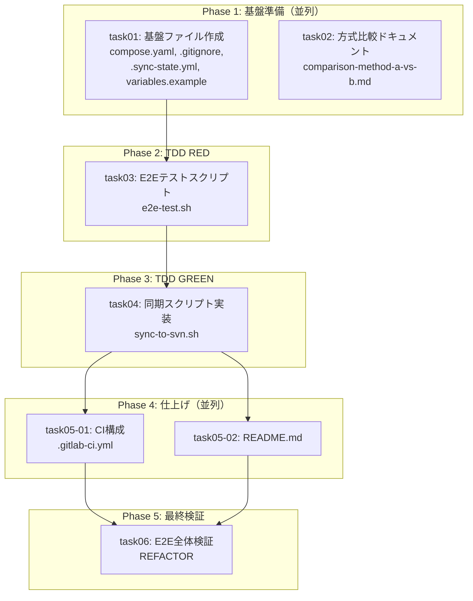

# 統合管理プロンプト: GIT-SVN-001 - Git→SVN一方向同期の検証環境構築

## 概要

このプロンプトは、タスク計画に基づいて子エージェントを管理し、並列実行を調整するための統合管理ガイドです。

| 項目 | 値 |
|------|-----|
| チケットID | GIT-SVN-001 |
| タスク名 | Git→SVN一方向同期の検証環境構築 |
| ターゲットリポジトリ | submodules/git-svn-backup |
| 実装先ブランチ | sync（orphan ブランチ） |
| 総タスク数 | 7 |
| 並列グループ数 | 3 |
| 推定総時間 | 1.5時間 |

---

## 全タスク一覧

| タスク識別子 | タスク名 | 前提条件 | 並列可否 | 推定時間 | ステータス |
|--------------|----------|----------|----------|----------|------------|
| task01 | 基盤ファイル作成 | なし | 可 | 10min | ⬜ 未着手 |
| task02 | 方式比較ドキュメント作成 | なし | 可 | 10min | ⬜ 未着手 |
| task03 | E2Eテストスクリプト作成（RED） | task01 | 不可 | 15min | ⬜ 未着手 |
| task04 | 同期スクリプト実装（GREEN） | task03 | 不可 | 20min | ⬜ 未着手 |
| task05-01 | CI構成ファイル作成 | task04 | 可 | 5min | ⬜ 未着手 |
| task05-02 | README.md 作成 | task04 | 可 | 10min | ⬜ 未着手 |
| task06 | E2E全体検証・REFACTOR | task05-01, task05-02 | 不可 | 15min | ⬜ 未着手 |

---

## 依存関係グラフ



---

## 並列実行グループ

### Group 1: 基盤準備（並列実行）

| タスク | 推定時間 | プロンプト |
|--------|----------|------------|
| task01 | 10min | [task01.md](task01.md) |
| task02 | 10min | [task02.md](task02.md) |

**開始条件**: なし（初期グループ）
**完了条件**: task01, task02 両方完了

**並列実行の根拠**:
- 相互依存なし
- 異なるファイルを編集（task01: compose.yaml等, task02: docs/）
- 共有状態変更なし

---

### Group 2: TDD RED → GREEN（順次実行）

| タスク | 推定時間 | プロンプト |
|--------|----------|------------|
| task03 | 15min | [task03.md](task03.md) |
| task04 | 20min | [task04.md](task04.md) |

**開始条件**: Group 1完了（task01 完了が必須。task02 は task03 に依存しないが、Group 1 として待機）
**完了条件**: task03, task04 順次完了
**注意**: TDD フロー上、task03（RED）→ task04（GREEN）の順序は必須

---

### Group 3: 仕上げ（並列実行）

| タスク | 推定時間 | プロンプト |
|--------|----------|------------|
| task05-01 | 5min | [task05-01.md](task05-01.md) |
| task05-02 | 10min | [task05-02.md](task05-02.md) |

**開始条件**: task04 完了
**完了条件**: task05-01, task05-02 両方完了

**並列実行の根拠**:
- 相互依存なし
- 異なるファイルを編集（task05-01: .gitlab-ci.yml, task05-02: README.md）
- 共有状態変更なし

---

### Group 4: 最終検証（単独実行）

| タスク | 推定時間 | プロンプト |
|--------|----------|------------|
| task06 | 15min | [task06.md](task06.md) |

**開始条件**: Group 3完了
**完了条件**: 全E2Eテスト PASS、全 acceptance_criteria 充足

---

## 実行順序

1. **Phase 1**: task01, task02 を並列実行
2. **Checkpoint 1**: task01, task02 の完了確認
3. **Phase 2**: task03（E2Eテストスクリプト）を実行
4. **Checkpoint 2**: task03 完了確認（E2E-1 PASS, E2E-2以降 FAIL = RED 状態）
5. **Phase 3**: task04（同期スクリプト実装）を実行
6. **Checkpoint 3**: task04 完了確認（全E2Eテスト PASS = GREEN 状態）
7. **Phase 4**: task05-01, task05-02 を並列実行
8. **Checkpoint 4**: task05-01, task05-02 の完了確認
9. **Phase 5**: task06（E2E全体検証 + REFACTOR）を実行
10. **Final**: 全タスク完了確認

---

## タスクプロンプト参照

| タスク | プロンプトファイル |
|--------|-------------------|
| task01 | [task01.md](task01.md) |
| task02 | [task02.md](task02.md) |
| task03 | [task03.md](task03.md) |
| task04 | [task04.md](task04.md) |
| task05-01 | [task05-01.md](task05-01.md) |
| task05-02 | [task05-02.md](task05-02.md) |
| task06 | [task06.md](task06.md) |

---

## 特殊な作業環境について

### sync ブランチ（orphan）での作業

全タスクは submodules/git-svn-backup リポジトリの **sync ブランチ（orphan）** 上で作業する。

```bash
# sync ブランチが存在しない場合（task01 で実施）
cd submodules/git-svn-backup
git checkout --orphan sync
git rm -rf . 2>/dev/null || true
git commit --allow-empty -m "Initialize sync branch"
git push origin sync
```

### worktree 管理が不要な場合

sync ブランチは main と完全に独立した orphan ブランチのため、worktree によるファイル衝突は発生しない。ただし、implement スキルの worktree 管理フローに従う場合は以下の手順を使用する。

---

## Worktree管理手順

### 実行開始時: メインworktreeの作成

```bash
REPO_ROOT=$(cd submodules/git-svn-backup && git rev-parse --show-toplevel)
REQUEST_NAME="GIT-SVN-001"

# sync ブランチからメインworktree作成
cd $REPO_ROOT
git worktree add /tmp/$REQUEST_NAME sync
echo "メインworktree作成: /tmp/$REQUEST_NAME"
```

### 各タスク実行前: サブworktreeの作成

```bash
REQUEST_NAME="GIT-SVN-001"
TASK_ID="task01"  # 各タスクに応じて変更
REPO_ROOT=$(cd submodules/git-svn-backup && git rev-parse --show-toplevel)

# サブブランチ作成（メインworktreeのHEADから分岐）
cd /tmp/$REQUEST_NAME
git branch ${REQUEST_NAME}-${TASK_ID} HEAD

# サブworktreeの作成
cd $REPO_ROOT
git worktree add /tmp/${REQUEST_NAME}-${TASK_ID} ${REQUEST_NAME}-${TASK_ID}
```

### 並列タスク用: 一括作成

```bash
REQUEST_NAME="GIT-SVN-001"
REPO_ROOT=$(cd submodules/git-svn-backup && git rev-parse --show-toplevel)

# ベースコミットを固定
cd /tmp/$REQUEST_NAME
BASE_COMMIT=$(git rev-parse HEAD)

# 並列タスクごとにworktree作成
cd $REPO_ROOT
for TASK_ID in task01 task02; do
    git branch ${REQUEST_NAME}-${TASK_ID} $BASE_COMMIT
    git worktree add /tmp/${REQUEST_NAME}-${TASK_ID} ${REQUEST_NAME}-${TASK_ID}
done
```

---

## Cherry-pickフロー

### 単一タスク完了後

```bash
REQUEST_NAME="GIT-SVN-001"
TASK_ID="task03"
REPO_ROOT=$(cd submodules/git-svn-backup && git rev-parse --show-toplevel)

# 1. コミットハッシュ取得
cd /tmp/${REQUEST_NAME}-${TASK_ID}
COMMIT_HASH=$(git rev-parse HEAD)

# 2. メインworktreeでcherry-pick
cd /tmp/$REQUEST_NAME
git cherry-pick $COMMIT_HASH

# 3. サブworktreeの削除
cd $REPO_ROOT
git worktree remove /tmp/${REQUEST_NAME}-${TASK_ID} --force
git branch -D ${REQUEST_NAME}-${TASK_ID}
```

### 並列タスク完了後（一括）

```bash
REQUEST_NAME="GIT-SVN-001"
REPO_ROOT=$(cd submodules/git-svn-backup && git rev-parse --show-toplevel)

# Phase 1: task01, task02 の順にcherry-pick
cd /tmp/$REQUEST_NAME
for TASK_ID in task01 task02; do
    cd /tmp/${REQUEST_NAME}-${TASK_ID}
    COMMIT_HASH=$(git rev-parse HEAD)
    cd /tmp/$REQUEST_NAME
    git cherry-pick $COMMIT_HASH
done

# サブworktreeの一括削除
cd $REPO_ROOT
for TASK_ID in task01 task02; do
    git worktree remove /tmp/${REQUEST_NAME}-${TASK_ID} --force
    git branch -D ${REQUEST_NAME}-${TASK_ID}
done
```

---

## ブロッカー管理

### ブロッカー発生時の対応

| 状況 | 対応 |
|------|------|
| E2Eテスト失敗（task04） | sync-to-svn.sh のデバッグ。失敗テストケースを --test で個別実行 |
| SVNサーバー起動失敗 | docker compose logs で確認。ポート3690の競合チェック |
| git svn dcommit 失敗 | SVN認証設定の確認。trunk の存在確認 |
| cherry-pickコンフリクト | orphan ブランチのため発生しないはず。発生時は手動解消 |
| gitlab-ci-local 未インストール | 直接実行テストで代替（acceptance_criteria に影響なし） |

---

## 結果統合方法

### 各タスク完了時の確認

1. 対象ファイルの存在確認
2. テスト結果の確認（task03: RED確認, task04: GREEN確認, task06: 全PASS）
3. コミットハッシュの記録
4. cherry-pick の実施

### 最終統合

1. 全タスク完了の確認
2. 全ファイル存在チェック
3. 全E2Eテスト実行（task06 で実施）
4. acceptance_criteria 全項目チェック（task06 で実施）
5. sync ブランチを origin に push

---

## 実行履歴

### タスク実行記録

| タスク | 開始時刻 | 完了時刻 | コミット | ステータス |
|--------|----------|----------|----------|------------|
| task01 | - | - | - | ⬜ 未着手 |
| task02 | - | - | - | ⬜ 未着手 |
| task03 | - | - | - | ⬜ 未着手 |
| task04 | - | - | - | ⬜ 未着手 |
| task05-01 | - | - | - | ⬜ 未着手 |
| task05-02 | - | - | - | ⬜ 未着手 |
| task06 | - | - | - | ⬜ 未着手 |

### 進捗サマリー

- 完了: 0/7
- 進行中: 0
- 待機: 7

---

## チェックポイント

| ID | タイミング | チェック内容 | 結果 |
|----|------------|--------------|------|
| CP1 | Phase 1完了後 | task01: compose.yaml起動確認, task02: ドキュメント存在確認 | ⬜ |
| CP2 | Phase 2完了後 | task03: E2E-1 PASS, E2E-2以降 FAIL（RED状態） | ⬜ |
| CP3 | Phase 3完了後 | task04: 全E2Eテスト PASS（GREEN状態） | ⬜ |
| CP4 | Phase 4完了後 | task05-01: .gitlab-ci.yml存在, task05-02: README.md存在 | ⬜ |
| CP5 | Phase 5完了後 | task06: 全acceptance_criteria充足、全E2E PASS | ⬜ |

---

## 完了条件

### 全体完了条件

- [ ] 全タスクが完了していること
- [ ] 全 cherry-pick が完了していること
- [ ] 全 E2E テストが PASS すること
- [ ] 全 acceptance_criteria が充足されていること
- [ ] sync ブランチが origin に push 済みであること

### acceptance_criteria（再掲）

- [ ] compose.yamlでSVNサーバーが起動し、svnコマンドでアクセスできる
- [ ] 同期スクリプトがGitのmainブランチの内容をSVNに正しく反映する
- [ ] マージコミットを含む履歴が適切に変換されてSVNに記録される
- [ ] 増分同期が正しく動作する（前回同期以降の変更のみ反映）
- [ ] 同期スクリプトの再実行がべき等である
- [ ] syncブランチにGitLab CI構成（.gitlab-ci.yml）が定義されている
- [ ] gitlab-ci-localでE2Eテストが実行できる
- [ ] 2つの同期方式のメリット・デメリット比較ドキュメントが存在する

---

## 注意事項

- 各タスクプロンプト（task0X.md）の内容を正確に子エージェントに伝える
- **orphan ブランチ**: sync ブランチは main と完全独立。main のファイルは含めない
- **TDD 順序**: task03（RED）→ task04（GREEN）→ task06（REFACTOR）の順序を厳守
- 並列タスクは同じベースコミットから分岐させる
- cherry-pick の順序を守る
- 全タスク完了後もメインworktreeは残す（ユーザー確認用）
