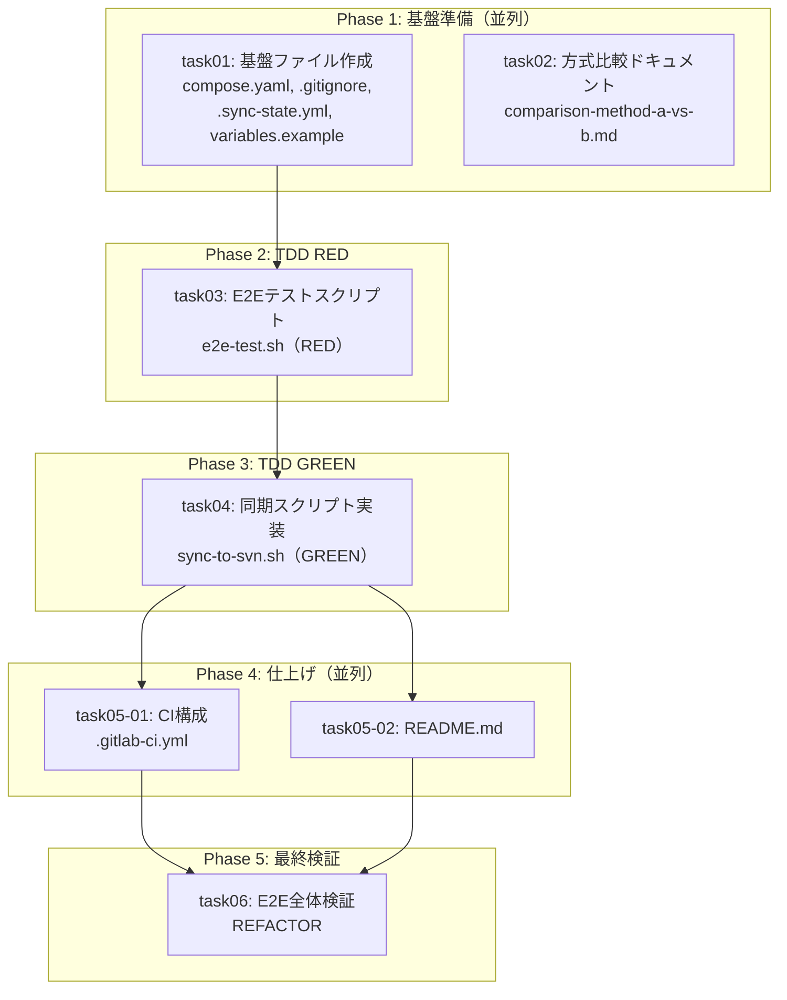

# タスク一覧: GIT-SVN-001 - Git→SVN一方向同期の検証環境構築

## 概要

| 項目 | 値 |
|------|-----|
| チケットID | GIT-SVN-001 |
| タスク名 | Git→SVN一方向同期の検証環境構築 |
| リポジトリ | git-svn-backup |
| 総タスク数 | 7 |
| 並列グループ数 | 3 |
| 推定総時間 | 1.5時間 |
| クリティカルパス | task01 → task03 → task04 → task05 → task06 |

---

## タスク一覧

| タスク識別子 | タスク名 | 前提条件 | 並列可否 | 推定時間 | ステータス |
|--------------|----------|----------|----------|----------|------------|
| task01 | 基盤ファイル作成 | なし | 可（task02と並列） | 10min | ⬜ 未着手 |
| task02 | 方式比較ドキュメント作成 | なし | 可（task01と並列） | 10min | ⬜ 未着手 |
| task03 | E2Eテストスクリプト作成（RED） | task01 | 不可 | 15min | ⬜ 未着手 |
| task04 | 同期スクリプト実装（GREEN） | task03 | 不可 | 20min | ⬜ 未着手 |
| task05-01 | CI構成ファイル作成 | task04 | 可（task05-02と並列） | 5min | ⬜ 未着手 |
| task05-02 | README.md 作成 | task04 | 可（task05-01と並列） | 10min | ⬜ 未着手 |
| task06 | E2E全体検証・REFACTOR | task05-01, task05-02 | 不可 | 15min | ⬜ 未着手 |

---

## 依存関係グラフ

---

## フェーズ別実行計画

### Phase 1: 基盤準備（並列実行）
- **task01** + **task02** を同時実行
- 開始条件: なし
- 完了条件: 両タスク完了

### Phase 2: TDD RED（単独実行）
- **task03**: E2Eテストスクリプト作成
- 開始条件: task01 完了
- 完了条件: e2e-test.sh が作成済み（テストは失敗する状態）

### Phase 3: TDD GREEN（単独実行）
- **task04**: 同期スクリプト実装
- 開始条件: task03 完了
- 完了条件: sync-to-svn.sh が実装済み、E2Eテストが通過

### Phase 4: 仕上げ（並列実行）
- **task05-01** + **task05-02** を同時実行
- 開始条件: task04 完了
- 完了条件: 両タスク完了

### Phase 5: 最終検証（単独実行）
- **task06**: E2E全体検証 + リファクタリング
- 開始条件: task05-01, task05-02 完了
- 完了条件: 全E2Eテスト通過、全acceptance_criteria 充足

---

## acceptance_criteria とタスクの対応

| acceptance_criteria | 対応タスク |
|---------------------|------------|
| compose.yamlでSVNサーバーが起動し、svnコマンドでアクセスできる | task01, task06 |
| 同期スクリプトがGitのmainブランチの内容をSVNに正しく反映する | task04, task06 |
| マージコミットを含む履歴が適切に変換されてSVNに記録される | task04, task06 |
| 増分同期が正しく動作する（前回同期以降の変更のみ反映） | task04, task06 |
| 同期スクリプトの再実行がべき等である | task04, task06 |
| syncブランチにGitLab CI構成（.gitlab-ci.yml）が定義されている | task05-01 |
| gitlab-ci-localでE2Eテストが実行できる | task06 |
| 2つの同期方式のメリット・デメリット比較ドキュメントが存在する | task02 |
