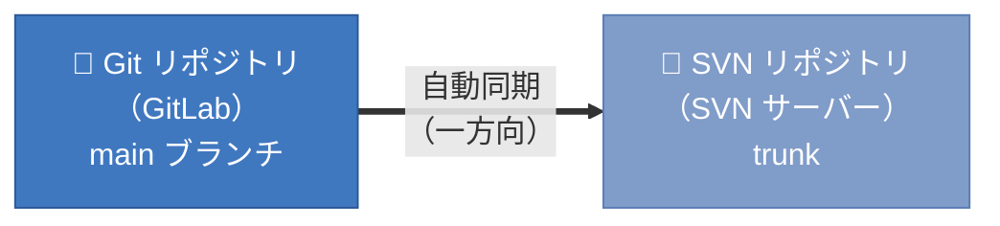
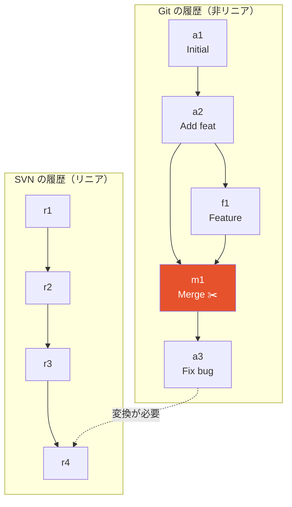
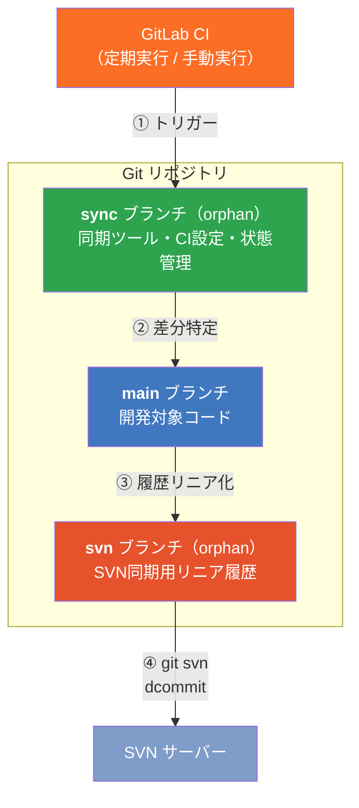
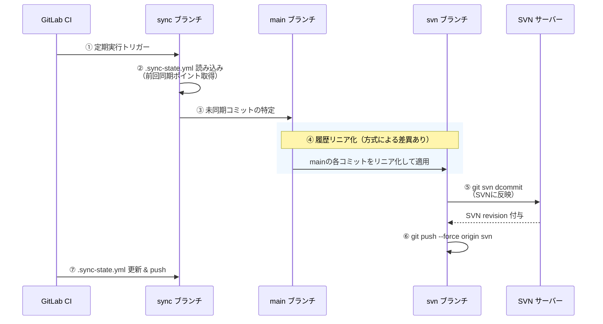
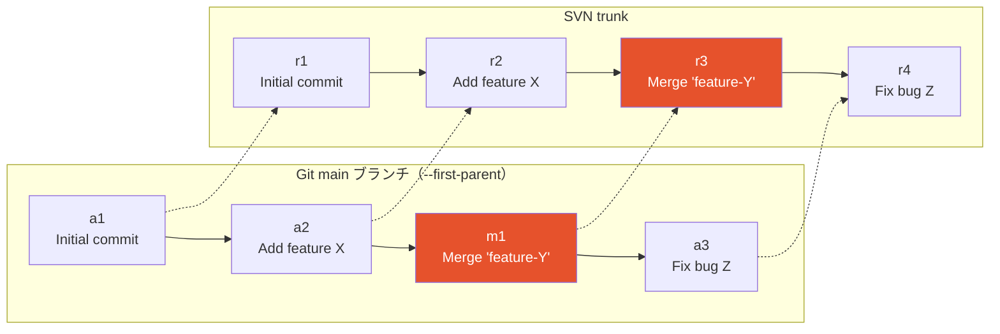
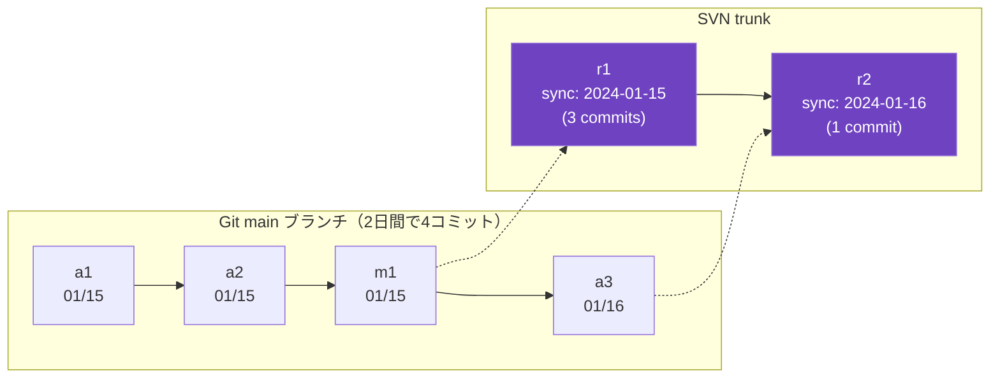
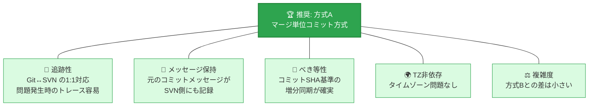
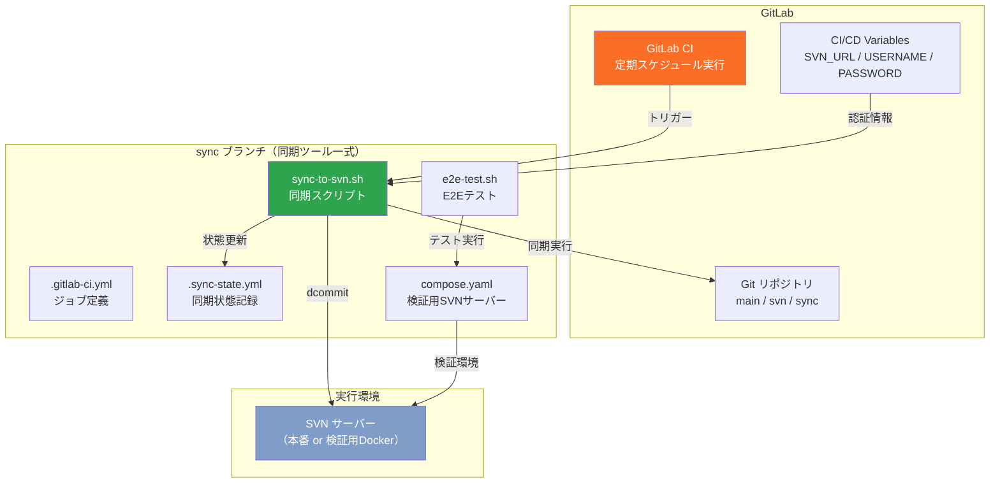
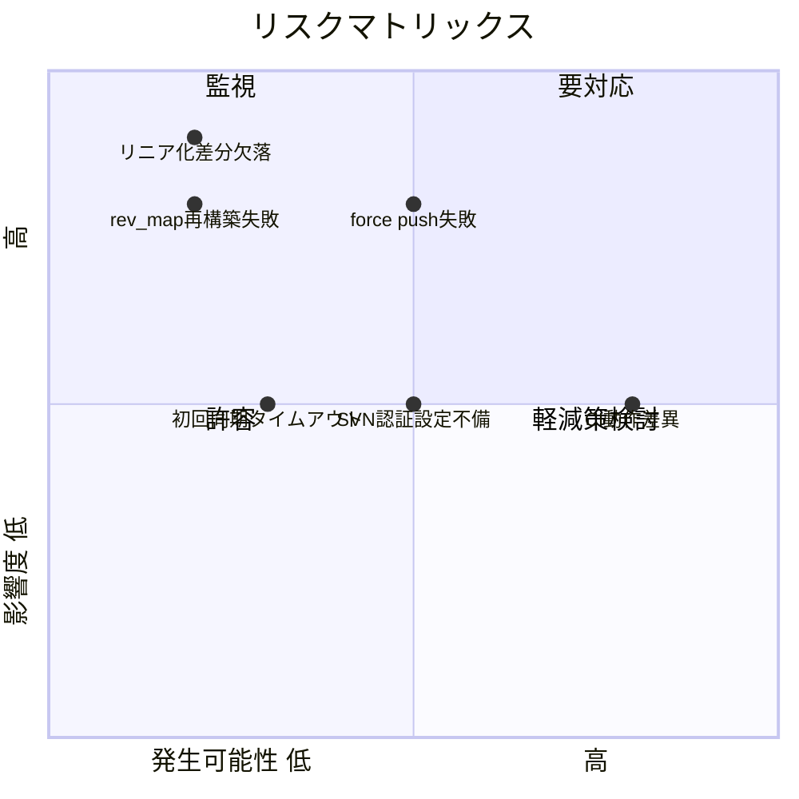
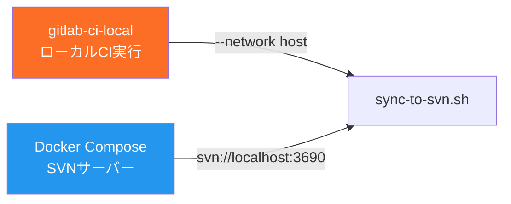

# Git→SVN 一方向同期 — 構成提案書

| 項目       | 内容                  |
| ---------- | --------------------- |
| 文書種別   | 顧客合意用 構成提案書 |
| 作成日     | 2026-03-09            |
| 作成者     | Hiroaki               |
| ステータス | レビュー待ち          |

---

## 1. 実現したいこと

### 1.1 目的

GitLab上のGitリポジトリ（mainブランチ）の変更を、**SVNリポジトリに自動的に一方向同期**する仕組みを構築します。



### 1.2 背景と課題

| 項目     | 内容                                                                       |
| -------- | -------------------------------------------------------------------------- |
| **現状** | 開発チームはGitLab上でGitを使用した開発ワークフローを運用中                |
| **要望** | 既存のGitワークフローを維持しつつ、SVNにもバックアップ・ミラーリングが必要 |
| **課題** | GitのマージコミットはSVNにそのまま反映できない（SVNはリニア履歴のみ対応）  |

### 1.3 前提条件

- **同期方向**: Git → SVN の一方向のみ（SVN → Git は対象外）
- **同期対象**: main（master）ブランチのみ
- **SVN登録者**: GitLab CI実行ユーザーに固定されることを許容
- **実行方式**: GitLab CIによる定期自動実行

---

## 2. 検討内容

### 2.1 技術的な課題

Git と SVN の履歴管理モデルの違いが根本的な課題です。



> [!IMPORTANT]
> **Gitのマージコミットを含む履歴をSVN互換のリニア履歴に変換する仕組みが必要です。**

### 2.2 調査・検証済み事項

技術検証により以下を確認済みです。

| 検証項目               | 結果     | 詳細                                                                |
| ---------------------- | -------- | ------------------------------------------------------------------- |
| git-svn dcommit の動作 | ✅ 確認済 | Git→SVN のコミット転送が正常動作                                    |
| SHA書き換えの挙動      | ✅ 確認済 | dcommit後にGitコミットSHAが変わる → force push で対処               |
| CI環境での復元性       | ✅ 確認済 | git-svn-idから毎回自動復元可能 → 環境使い捨て可                     |
| 履歴リニア化手法       | ✅ 確認済 | `git checkout COMMIT -- .` 方式でファイル追加/削除/リネーム全て正常 |
| SVNコンテナ（検証用）  | ✅ 確認済 | garethflowers/svn-server で動作確認                                 |

### 2.3 全体アーキテクチャ（共通）

どの同期方式でも共通となるアーキテクチャです。3ブランチ構成を採用し、**mainブランチを一切汚さず**に同期を実現します。



| ブランチ | 種別   | 責務                         | 配置内容                                                  |
| -------- | ------ | ---------------------------- | --------------------------------------------------------- |
| **main** | 通常   | 開発対象リポジトリ（同期元） | ソースコード                                              |
| **svn**  | orphan | SVN同期用リニア履歴を保持    | mainからリニア化されたファイル群                          |
| **sync** | orphan | 同期ツール・CI設定・状態管理 | スクリプト, .gitlab-ci.yml, compose.yaml, .sync-state.yml |

### 2.4 同期フロー（共通）



---

## 3. 同期方式の比較（2案）

### 3.1 方式A — マージ単位コミット方式

`git log --first-parent` でmainブランチの直系履歴を走査し、**マージコミットはPR全体の差分を1SVNコミット**に、**通常コミットはそのまま1SVNコミット**に反映する方式です。



**イメージ**: Git側でマージされたPR（`Merge 'feature-Y'`）は、そのPR全体の変更が1つのSVNコミットになります。元のコミットメッセージも保持されます。

### 3.2 方式B — 日次バッチ方式

**1日のコミットをまとめて1つのSVNコミット**に集約する方式です。



**イメージ**: 日付単位でまとめられるため、元のコミットメッセージや粒度は失われます。

### 3.3 比較表

| 比較項目                     |  方式A: マージ単位   |   方式B: 日次バッチ   |
| ---------------------------- | :------------------: | :-------------------: |
| **コミット粒度**             |  PR/コミット単位 ✅   |    日単位（粗い）     |
| **コミットメッセージ**       |  元メッセージ保持 ✅  | 自動生成（日付+件数） |
| **Git↔SVN 追跡性**           |    ⭐⭐⭐ 明確に対応    |     ⭐ 対応不明確      |
| **実装複雑度**               |     ⭐⭐ やや複雑      |     ⭐⭐⭐ シンプル      |
| **SVNコミット数**            | first-parent数と同等 | 日数と同等（少ない）  |
| **増分同期の確実性**         |  ⭐⭐⭐ SHA基準で確実   |   ⭐⭐ 日付境界に注意   |
| **べき等性（再実行安全性）** |       ⭐⭐⭐ 確実       |   ⭐⭐ 不安定要素あり   |
| **タイムゾーン問題**         |        なし ✅        |        あり ⚠️         |
| **元情報の保存度**           |        高い ✅        |         低い          |

---

## 4. 推奨案

### 4.1 推奨: 方式A（マージ単位コミット方式）



### 4.2 推奨理由

|   #   | 理由                       | 説明                                                                                   |
| :---: | -------------------------- | -------------------------------------------------------------------------------------- |
|   1   | **追跡性**                 | Gitのマージコミット/通常コミットとSVNリビジョンが1:1対応し、問題発生時のトレースが容易 |
|   2   | **コミットメッセージ保持** | 元のコミットメッセージがSVN側にも記録され、変更内容が理解しやすい                      |
|   3   | **べき等性**               | コミットSHA基準の増分同期が確実で、再実行時の挙動が予測可能                            |
|   4   | **タイムゾーン非依存**     | 日付グループ化を行わないため、タイムゾーン問題が発生しない                             |
|   5   | **実装複雑度の差が小さい** | `--first-parent`の使用と日付グループ化は、コア部分の複雑さがほぼ同程度                 |

### 4.3 トレードオフ（許容事項）

| トレードオフ                     | 影響                                       | 評価     |
| -------------------------------- | ------------------------------------------ | -------- |
| SVNコミット数が方式Bより多い     | 想定規模では問題なし                       | ✅ 許容可 |
| PR内の個別コミット履歴は失われる | 両方式共通の制約（`--first-parent`の特性） | ✅ 許容可 |

---

## 5. 推奨構成の詳細

### 5.1 全体構成図



### 5.2 sync ブランチのファイル構成

```
sync ブランチ:
├── sync-to-svn.sh                          # メイン同期スクリプト
├── e2e-test.sh                             # E2Eテストスクリプト
├── compose.yaml                            # 検証用SVNサーバー定義
├── .gitlab-ci.yml                          # GitLab CI ジョブ定義
├── .gitlab-ci-local-variables.yml.example  # ローカルCI用変数テンプレート
├── .sync-state.yml                         # 同期状態記録
└── README.md                               # sync ブランチの説明
```

### 5.3 実行環境要件

| 項目                | 詳細                                                            |
| ------------------- | --------------------------------------------------------------- |
| **CI実行イメージ**  | debian:bookworm + git-svn, subversion                           |
| **必須パッケージ**  | git, git-svn, subversion, bash, yq                              |
| **CI/CD Variables** | `SVN_URL`, `SVN_USERNAME`, `SVN_PASSWORD`（Protected / Masked） |
| **ブランチ保護**    | svn ブランチの force push を許可する設定が必要                  |
| **CI設定**          | `GIT_DEPTH: 0`（全履歴取得）                                    |

### 5.4 セキュリティ

| 項目                   | 対策                                                |
| ---------------------- | --------------------------------------------------- |
| SVN認証情報            | GitLab CI/CD Variables（Protected / Masked）で管理  |
| スクリプト内の認証情報 | 環境変数参照のみ。ハードコードなし                  |
| force pushの安全性     | svnブランチは自動同期専用。人間が直接編集しない運用 |

---

## 6. リスクと対策



| リスク                    | 影響度 | 発生可能性 | 対策                                         |
| ------------------------- | :----: | :--------: | -------------------------------------------- |
| dcommit後のforce push失敗 |   高   |     中     | svnブランチの保護解除、`--force` を明示      |
| git-svn復元の失敗         |   高   |     低     | git-svn-idからの自動再構築をE2Eテストで検証  |
| SVNコンテナ認証設定不備   |   中   |     中     | compose.yamlで初期設定を自動化               |
| リニア化で差分の欠落      |   高   |     低     | スナップショット方式で全ツリーコピー（安全） |
| 初回同期のタイムアウト    |   中   |     低     | CIジョブのタイムアウト値を十分に設定         |

### ロールバック計画

| 状況                  | 復旧方法                           | 所要時間 |
| --------------------- | ---------------------------------- | :------: |
| SVN同期前に問題発覚   | svnブランチを前回状態にreset       |   ~1分   |
| SVN同期後に問題発覚   | SVN dump + load でリポジトリ復元   |  ~10分   |
| 同期状態ファイル破損  | .sync-state.ymlを手動修正、再同期  |   ~5分   |
| svnブランチ全体の破損 | orphanブランチ再作成、全履歴再同期 |  ~30分   |

---

## 7. 検証計画

### 7.1 E2Eテストシナリオ

|  No   | テスト内容                     | 期待結果                                                |
| :---: | ------------------------------ | ------------------------------------------------------- |
|   1   | SVNサーバー接続確認            | compose.yamlでSVNサーバーが起動し、`svn info`で接続可能 |
|   2   | 初回同期（通常コミットのみ）   | 全コミットがSVNにリニアに記録される                     |
|   3   | 初回同期（マージコミット含む） | マージコミットが1つのSVNコミットとして変換・記録される  |
|   4   | 増分同期                       | 前回以降の変更のみが反映される（重複なし）              |
|   5   | べき等性テスト                 | 同一状態で再実行してもSVNに変更が発生しない             |
|   6   | 環境再構築後の増分同期         | CI環境を破棄→再構築しても、差分のみの同期が正常動作     |
|   7   | ファイル削除の同期             | Gitで削除されたファイルがSVN側でも削除される            |
|   8   | ファイルリネームの同期         | リネームが正しくSVNに反映される                         |
|   9   | 同期状態の整合性               | .sync-state.ymlが正しく更新される                       |

### 7.2 テスト環境



---

## 8. スコープ

### 対象範囲

- ✅ Git→SVN 一方向同期スクリプト（Bash）
- ✅ 3ブランチ構成（main / svn / sync）
- ✅ GitLab CI 定期実行構成
- ✅ 検証用SVNサーバー（Docker）
- ✅ E2Eテスト
- ✅ 同期方式の比較ドキュメント

### 対象外

- ❌ SVN → Git 方向の同期（双方向同期）
- ❌ main以外のブランチの同期
- ❌ 本番SVNサーバーへの接続
- ❌ SVN認証の複雑な設定

---

## 9. ご確認事項

以下の事項について合意をお願いいたします。

|   #   | 確認事項                                                | 備考                               |
| :---: | ------------------------------------------------------- | ---------------------------------- |
|   1   | 同期方式は**方式A（マージ単位コミット方式）**でよいか   | 方式Bとの比較は本文§3を参照        |
|   2   | 3ブランチ構成（main / svn / sync）で問題ないか          | mainブランチには一切変更を加えない |
|   3   | SVNのコミッター名がCI実行ユーザー固定で許容可能か       | Git側の作者情報は保持できない      |
|   4   | PR内の個別コミット履歴がSVN側で失われることは許容可能か | マージ単位の粒度では保持される     |
|   5   | svnブランチのforce pushを許可する設定変更が可能か       | git-svn dcommitの技術的制約        |

---

## 変更履歴

| 日付       | バージョン | 変更内容 | 変更者  |
| ---------- | :--------: | -------- | ------- |
| 2026-03-09 |    1.0     | 初版作成 | Hiroaki |
