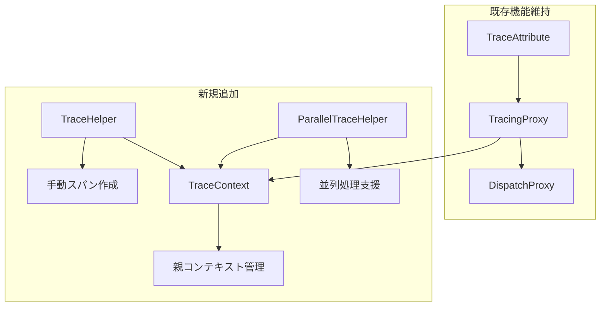
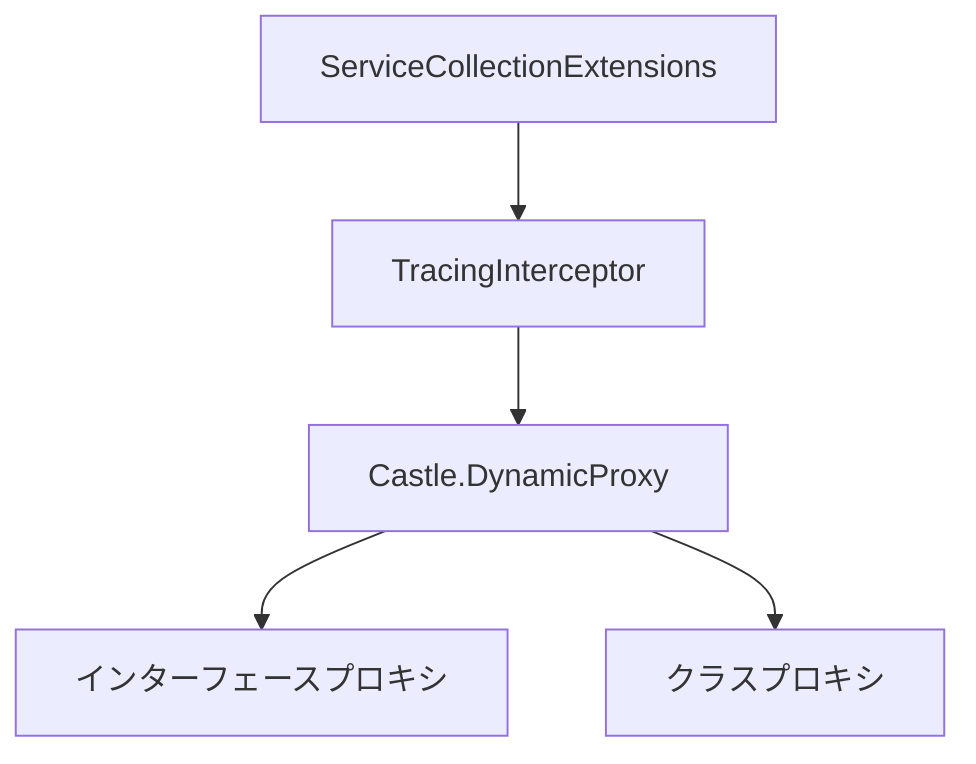
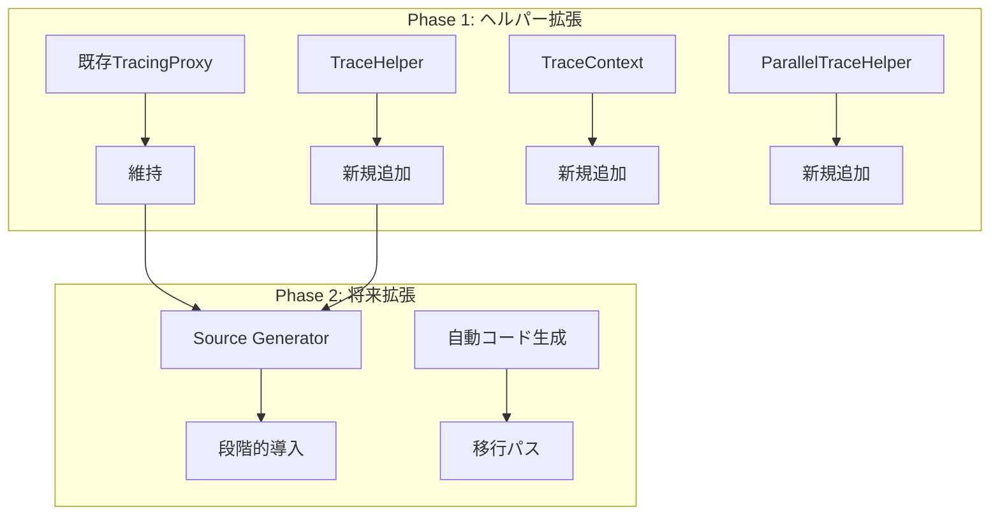
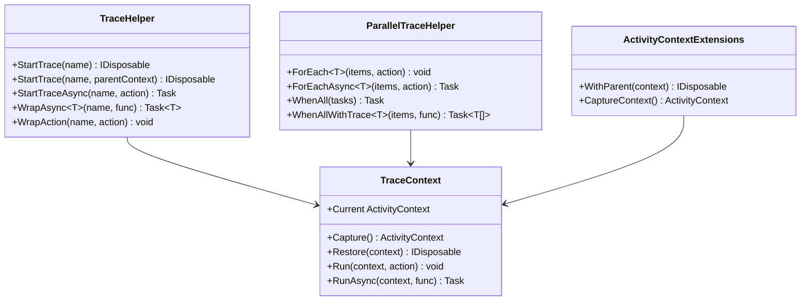

# 実装アプローチ設計

## 1. 概要

Issue #1の要件「複数スレッド・async/await環境での親子関係トレース」を実現するための実装アプローチを設計します。

## 2. 要件整理

### 2.1 機能要件

| 要件ID | 要件 | 優先度 |
|--------|------|--------|
| REQ-01 | 複数スレッドでモジュールを起動する環境に対応 | 必須 |
| REQ-02 | モジュール内でasync/awaitを使用する環境に対応 | 必須 |
| REQ-03 | 任意のメソッドで親を設定可能 | 必須 |
| REQ-04 | 新規タスクや並列実行するタスクでも親子関係を設定可能 | 必須 |
| REQ-05 | DIを使っているメソッドに対応 | 必須 |
| REQ-06 | staticなメソッドに対応 | 必須 |
| REQ-07 | ログをトレースに埋め込む | 必須 |
| REQ-08 | 開始終了をトレースできる機能 | 必須 |

### 2.2 現状の対応状況

| 要件ID | 現状 | ギャップ |
|--------|------|----------|
| REQ-01 | ✅ 対応済み | なし |
| REQ-02 | ✅ 対応済み | なし |
| REQ-03 | △ 部分対応 | 明示的API必要 |
| REQ-04 | △ 部分対応 | 親の明示的指定API必要 |
| REQ-05 | ✅ 対応済み | なし |
| REQ-06 | ❌ 未対応 | DispatchProxy制約 |
| REQ-07 | ✅ 対応済み | なし |
| REQ-08 | ✅ 対応済み | なし |

## 3. 実装アプローチ比較

### 3.1 アプローチA: ヘルパー拡張方式

**概要**: 既存のDispatchProxy実装を維持しつつ、staticメソッドや手動トレース用のヘルパーAPIを追加する。



**メリット**:
- 既存コードへの影響が最小限
- 段階的に導入可能
- 後方互換性を維持
- 実装コストが低い

**デメリット**:
- staticメソッドは手動でのトレース記述が必要
- 2つのトレース方式が混在

**実装コスト**: 低（1-2週間）

### 3.2 アプローチB: Source Generator方式

**概要**: コンパイル時にソースコードを生成し、アトリビュートベースのトレースを実現。

```mermaid
graph TD
    A[ソースコード] --> B[Source Generator]
    B --> C[生成コード]
    C --> D[コンパイル済みアセンブリ]
    
    subgraph Generator
        B --> E[[Trace]属性解析]
        E --> F[プロキシコード生成]
        E --> G[静的メソッドラッパー生成]
    end
```

**メリット**:
- コンパイル時生成のためランタイムオーバーヘッドが最小
- staticメソッドも自動対応可能
- 型安全性が高い

**デメリット**:
- 実装が複雑
- デバッグが困難
- 既存コードとの互換性検証が必要
- Source Generator の学習コストが高い

**実装コスト**: 高（4-6週間）

### 3.3 アプローチC: Castle.DynamicProxy方式

**概要**: DispatchProxyをCastle.DynamicProxyに置き換え、クラスベースのプロキシもサポート。



**メリット**:
- クラスベースのプロキシが可能
- 実績のあるライブラリ
- 既存パターンに近い実装

**デメリット**:
- 外部依存が増加
- staticメソッドには対応不可（クラスのvirtualメソッドのみ）
- 既存コードの書き換えが必要

**実装コスト**: 中（2-3週間）

### 3.4 アプローチD: ハイブリッド方式（推奨）

**概要**: アプローチAをベースに、将来的にアプローチBへの移行パスを確保。



**メリット**:
- 短期間でMVPを実現
- 既存コードへの影響最小限
- 将来の拡張パスを確保
- リスクを分散

**デメリット**:
- 2段階の実装が必要
- 一時的に2つの方式が共存

**実装コスト**: Phase 1: 低（1-2週間）、Phase 2: 中（2-4週間）

## 4. アプローチ選定

### 4.1 評価基準

| 基準 | 重み | A: ヘルパー | B: SourceGen | C: Castle | D: ハイブリッド |
|------|------|-------------|--------------|-----------|-----------------|
| 実装コスト | 25% | 5 | 2 | 3 | 4 |
| 既存互換性 | 20% | 5 | 3 | 3 | 5 |
| 保守性 | 20% | 4 | 4 | 4 | 4 |
| 将来拡張性 | 15% | 3 | 5 | 3 | 5 |
| パフォーマンス | 10% | 3 | 5 | 3 | 4 |
| 学習コスト | 10% | 5 | 2 | 4 | 4 |
| **総合スコア** | 100% | **4.20** | 3.35 | 3.30 | **4.35** |

### 4.2 選定結果

**推奨アプローチ: D（ハイブリッド方式）**

**選定理由**:
1. 短期間でMVPを実現可能
2. 既存のTracingProxy実装をそのまま活用
3. staticメソッド対応をヘルパーAPIで実現
4. 将来的なSource Generator導入への移行パスを確保
5. リスクを分散しながら段階的に機能拡張可能

## 5. 実装計画

### 5.1 Phase 1: ヘルパー拡張（MVP）

**期間**: 1-2週間

**実装内容**:

| コンポーネント | 説明 | 優先度 |
|---------------|------|--------|
| TraceHelper | 手動トレース用ヘルパークラス | P0 |
| TraceContext | 親コンテキスト管理クラス | P0 |
| ParallelTraceHelper | 並列処理用ヘルパー | P1 |
| ActivityContextExtensions | コンテキスト伝播用拡張メソッド | P1 |

**アーキテクチャ図**:



### 5.2 Phase 2: 最適化と拡張

**期間**: 2-4週間（Phase 1完了後）

**実装内容**:

| コンポーネント | 説明 | 優先度 |
|---------------|------|--------|
| サンプリング機能 | トレースのサンプリング制御 | P1 |
| 機密情報マスク | パラメータの自動マスク | P1 |
| メトリクス統合 | OpenTelemetry Metrics連携 | P2 |
| Source Generator（検討） | 自動コード生成 | P3 |

## 6. リスクと対策

### 6.1 技術リスク

| リスク | 影響度 | 対策 |
|--------|--------|------|
| AsyncLocal の誤用による親子関係破綻 | 高 | ドキュメント化、テストケース充実 |
| Fire-and-Forget での親終了問題 | 中 | パターン別ガイドライン作成 |
| パフォーマンス劣化 | 中 | ベンチマーク実施、サンプリング機能 |

### 6.2 運用リスク

| リスク | 影響度 | 対策 |
|--------|--------|------|
| 機密情報漏洩 | 高 | マスク機能、ガイドライン |
| トレースデータ肥大化 | 中 | サンプリング、保持期間設定 |
| 学習コスト | 低 | 使用例、ベストプラクティス文書化 |

## 7. 成功基準

### 7.1 機能要件達成

- [ ] 全ての呼び出しパターンでトレースが取得できる
- [ ] 親子関係が正しく設定される
- [ ] DIとstaticの両方で動作する

### 7.2 非機能要件達成

- [ ] 1メソッド呼び出しあたり1ms以下のオーバーヘッド
- [ ] 既存コードへの影響なし
- [ ] ドキュメント完備

## 8. 次のステップ

1. インターフェース・API設計の詳細化
2. データ構造設計
3. 処理フロー設計
4. テスト計画策定
5. 副作用検証計画策定
