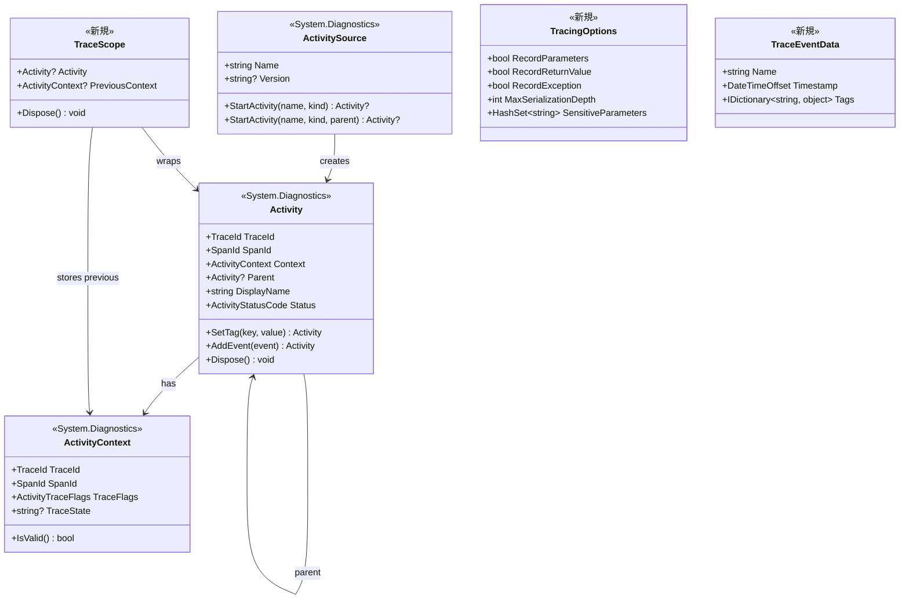
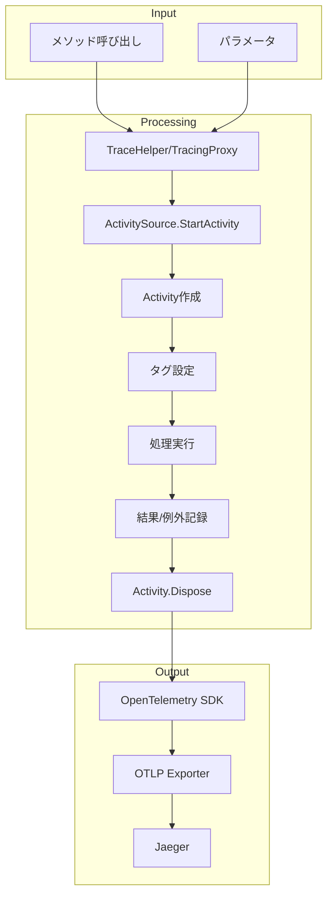
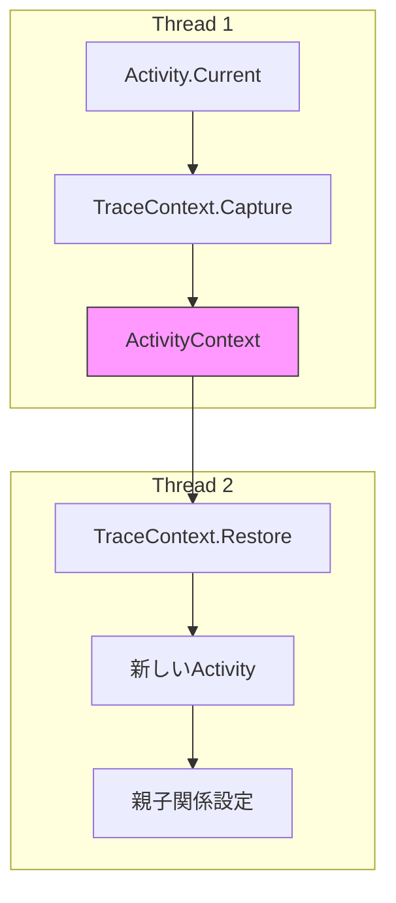
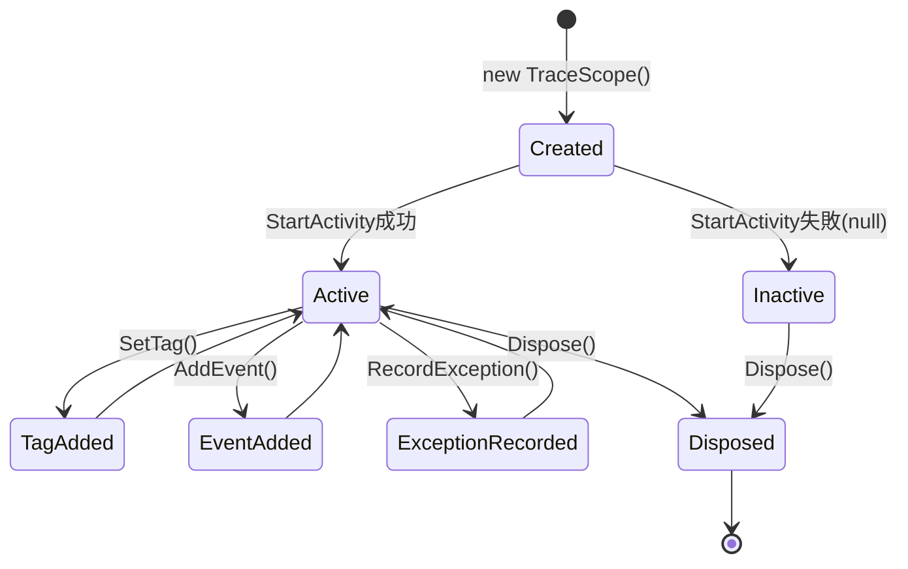

# データ構造設計

## 1. 概要

トレーシングライブラリ拡張で使用する内部データ構造と、OpenTelemetry関連の型との関係を定義します。

## 2. データ構造全体図



## 3. 新規データ構造

### 3.1 TraceScope

**目的**: トレースのスコープを管理し、`using`ステートメントで自動終了を実現

```csharp
namespace TracingSample.Tracing.Helpers;

/// <summary>
/// トレースのスコープを表すオブジェクト。
/// IDisposableを実装し、usingステートメントで使用できます。
/// </summary>
public sealed class TraceScope : IDisposable
{
    /// <summary>
    /// このスコープに関連付けられたActivity
    /// </summary>
    public Activity? Activity { get; }

    /// <summary>
    /// スコープ開始前のActivityContext
    /// </summary>
    public ActivityContext? PreviousContext { get; }

    /// <summary>
    /// スコープ作成時刻
    /// </summary>
    public DateTimeOffset StartTime { get; }

    /// <summary>
    /// スコープが既にDisposeされたかどうか
    /// </summary>
    public bool IsDisposed { get; private set; }

    /// <summary>
    /// トレースオプション
    /// </summary>
    public TracingOptions Options { get; }

    /// <summary>
    /// 内部コンストラクタ（TraceHelperからのみ作成）
    /// </summary>
    internal TraceScope(
        Activity? activity,
        ActivityContext? previousContext,
        TracingOptions options)
    {
        Activity = activity;
        PreviousContext = previousContext;
        StartTime = DateTimeOffset.UtcNow;
        Options = options;
        IsDisposed = false;
    }

    /// <summary>
    /// タグを追加します
    /// </summary>
    public TraceScope SetTag(string key, object? value)
    {
        Activity?.SetTag(key, SerializeValue(value));
        return this;
    }

    /// <summary>
    /// イベントを追加します
    /// </summary>
    public TraceScope AddEvent(string name, IDictionary<string, object?>? tags = null)
    {
        if (Activity != null)
        {
            var eventTags = tags != null
                ? new ActivityTagsCollection(
                    tags.Select(kv => new KeyValuePair<string, object?>(kv.Key, kv.Value)))
                : null;
            Activity.AddEvent(new ActivityEvent(name, DateTimeOffset.UtcNow, eventTags));
        }
        return this;
    }

    /// <summary>
    /// 例外を記録します
    /// </summary>
    public TraceScope RecordException(Exception ex)
    {
        if (Activity != null && Options.RecordException)
        {
            Activity.SetTag("exception.type", ex.GetType().FullName);
            Activity.SetTag("exception.message", ex.Message);
            Activity.SetTag("exception.stacktrace", ex.StackTrace);
            Activity.SetStatus(ActivityStatusCode.Error, ex.Message);
        }
        return this;
    }

    /// <summary>
    /// 成功としてマークします
    /// </summary>
    public TraceScope SetSuccess()
    {
        Activity?.SetStatus(ActivityStatusCode.Ok);
        return this;
    }

    /// <summary>
    /// エラーとしてマークします
    /// </summary>
    public TraceScope SetError(string? description = null)
    {
        Activity?.SetStatus(ActivityStatusCode.Error, description);
        return this;
    }

    /// <summary>
    /// スコープを終了し、Activityを完了させます
    /// </summary>
    public void Dispose()
    {
        if (IsDisposed) return;
        IsDisposed = true;

        Activity?.Dispose();
    }

    private static string SerializeValue(object? value)
    {
        if (value == null) return "null";

        var type = value.GetType();
        if (type.IsPrimitive || type == typeof(string) || 
            type == typeof(decimal) || type == typeof(DateTime))
        {
            return value.ToString() ?? "null";
        }

        try
        {
            return JsonSerializer.Serialize(value, new JsonSerializerOptions
            {
                MaxDepth = 5,
                WriteIndented = false
            });
        }
        catch
        {
            return value.ToString() ?? type.Name;
        }
    }
}
```

### 3.2 TracingOptions

**目的**: トレース動作のオプション設定を保持

```csharp
namespace TracingSample.Tracing.Helpers;

/// <summary>
/// トレースの動作オプションを定義します。
/// </summary>
public class TracingOptions
{
    /// <summary>
    /// デフォルトのオプション
    /// </summary>
    public static TracingOptions Default { get; } = new TracingOptions();

    /// <summary>
    /// パラメータを記録するかどうか
    /// </summary>
    public bool RecordParameters { get; set; } = true;

    /// <summary>
    /// 戻り値を記録するかどうか
    /// </summary>
    public bool RecordReturnValue { get; set; } = true;

    /// <summary>
    /// 例外を記録するかどうか
    /// </summary>
    public bool RecordException { get; set; } = true;

    /// <summary>
    /// JSONシリアライズの最大深度
    /// </summary>
    public int MaxSerializationDepth { get; set; } = 5;

    /// <summary>
    /// 機密パラメータ名のセット（自動マスク対象）
    /// </summary>
    public HashSet<string> SensitiveParameters { get; set; } = new(StringComparer.OrdinalIgnoreCase)
    {
        "password",
        "secret",
        "token",
        "apiKey",
        "apikey",
        "api_key",
        "accessToken",
        "access_token",
        "refreshToken",
        "refresh_token",
        "connectionString",
        "connection_string",
        "credentials"
    };

    /// <summary>
    /// 機密情報のマスク文字列
    /// </summary>
    public string SensitiveMask { get; set; } = "***MASKED***";

    /// <summary>
    /// サンプリングレート（0.0-1.0）
    /// 1.0 = 全て記録、0.0 = 記録なし
    /// </summary>
    public double SamplingRate { get; set; } = 1.0;
}
```

### 3.3 ContextRestorationScope

**目的**: コンテキスト復元のスコープ管理

```csharp
namespace TracingSample.Tracing.Helpers;

/// <summary>
/// ActivityContextの復元スコープを表します。
/// Dispose時に元のコンテキストを復元します。
/// </summary>
internal sealed class ContextRestorationScope : IDisposable
{
    private readonly Activity? _previousActivity;
    private readonly Activity? _restoredActivity;
    private bool _isDisposed;

    internal ContextRestorationScope(
        ActivityContext context,
        ActivitySource activitySource)
    {
        _previousActivity = Activity.Current;

        // 指定されたコンテキストを親として新しいActivityを開始
        _restoredActivity = activitySource.StartActivity(
            "ContextRestoration",
            ActivityKind.Internal,
            context);
    }

    public void Dispose()
    {
        if (_isDisposed) return;
        _isDisposed = true;

        _restoredActivity?.Dispose();
    }
}
```

### 3.4 ParallelTraceOptions

**目的**: 並列トレースの設定

```csharp
namespace TracingSample.Tracing.Helpers;

/// <summary>
/// 並列トレースのオプション設定
/// </summary>
public class ParallelTraceOptions
{
    /// <summary>
    /// 最大並列度（-1 = 無制限）
    /// </summary>
    public int MaxDegreeOfParallelism { get; set; } = -1;

    /// <summary>
    /// キャンセルトークン
    /// </summary>
    public CancellationToken CancellationToken { get; set; } = CancellationToken.None;

    /// <summary>
    /// 親トレースを作成するかどうか
    /// </summary>
    public bool CreateParentSpan { get; set; } = true;

    /// <summary>
    /// 親トレースの名前
    /// </summary>
    public string? ParentSpanName { get; set; }

    /// <summary>
    /// 各並列タスクのトレースオプション
    /// </summary>
    public TracingOptions TracingOptions { get; set; } = TracingOptions.Default;
}
```

## 4. 既存データ構造の拡張

### 4.1 TraceAttribute 拡張

```csharp
namespace TracingSample.Tracing.Attributes;

/// <summary>
/// メソッドにこのアトリビュートを付与すると、OpenTelemetryによる自動トレースが有効になります。
/// </summary>
[AttributeUsage(AttributeTargets.Method, AllowMultiple = false, Inherited = true)]
public class TraceAttribute : Attribute
{
    /// <summary>
    /// トレースの名前（指定しない場合はメソッド名が使用されます）
    /// </summary>
    public string? Name { get; set; }

    /// <summary>
    /// パラメータを記録するかどうか（デフォルト: true）
    /// </summary>
    public bool RecordParameters { get; set; } = true;

    /// <summary>
    /// 戻り値を記録するかどうか（デフォルト: true）
    /// </summary>
    public bool RecordReturnValue { get; set; } = true;

    /// <summary>
    /// 例外を記録するかどうか（デフォルト: true）
    /// </summary>
    public bool RecordException { get; set; } = true;

    // ===== 以下、新規追加プロパティ =====

    /// <summary>
    /// Activityの種類（デフォルト: Internal）
    /// </summary>
    public ActivityKind Kind { get; set; } = ActivityKind.Internal;

    /// <summary>
    /// サンプリング対象とするかどうか（デフォルト: true）
    /// falseの場合、サンプリング設定に関わらず常に記録
    /// </summary>
    public bool SamplingEnabled { get; set; } = true;

    /// <summary>
    /// 機密パラメータの名前（カンマ区切り）
    /// 指定されたパラメータはマスクされます
    /// </summary>
    public string? SensitiveParameters { get; set; }
}
```

## 5. 内部キャッシュ構造

### 5.1 MethodTraceInfo

**目的**: メソッド情報のキャッシュ

```csharp
namespace TracingSample.Tracing.Internal;

/// <summary>
/// メソッドのトレース情報をキャッシュするための内部構造体
/// </summary>
internal readonly struct MethodTraceInfo
{
    /// <summary>
    /// トレース名
    /// </summary>
    public string TraceName { get; init; }

    /// <summary>
    /// クラス名
    /// </summary>
    public string ClassName { get; init; }

    /// <summary>
    /// メソッド名
    /// </summary>
    public string MethodName { get; init; }

    /// <summary>
    /// パラメータ情報
    /// </summary>
    public ParameterInfo[] Parameters { get; init; }

    /// <summary>
    /// トレース属性
    /// </summary>
    public TraceAttribute? TraceAttribute { get; init; }

    /// <summary>
    /// 非同期メソッドかどうか
    /// </summary>
    public bool IsAsync { get; init; }

    /// <summary>
    /// 戻り値の型
    /// </summary>
    public Type? ReturnType { get; init; }
}
```

### 5.2 MethodTraceInfoCache

**目的**: MethodTraceInfoのスレッドセーフキャッシュ

```csharp
namespace TracingSample.Tracing.Internal;

/// <summary>
/// メソッドトレース情報のキャッシュ
/// </summary>
internal static class MethodTraceInfoCache
{
    private static readonly ConcurrentDictionary<MethodInfo, MethodTraceInfo> _cache = new();

    /// <summary>
    /// メソッド情報を取得（キャッシュがあれば再利用）
    /// </summary>
    public static MethodTraceInfo GetOrCreate(MethodInfo method, Type implementationType)
    {
        return _cache.GetOrAdd(method, m => CreateMethodTraceInfo(m, implementationType));
    }

    private static MethodTraceInfo CreateMethodTraceInfo(MethodInfo method, Type implementationType)
    {
        var implMethod = implementationType.GetMethod(
            method.Name,
            method.GetParameters().Select(p => p.ParameterType).ToArray());

        var attr = implMethod?.GetCustomAttribute<TraceAttribute>();

        return new MethodTraceInfo
        {
            TraceName = attr?.Name ?? $"{method.DeclaringType?.Name}.{method.Name}",
            ClassName = method.DeclaringType?.FullName ?? "Unknown",
            MethodName = method.Name,
            Parameters = method.GetParameters(),
            TraceAttribute = attr,
            IsAsync = typeof(Task).IsAssignableFrom(method.ReturnType),
            ReturnType = method.ReturnType
        };
    }
}
```

## 6. データフロー

### 6.1 トレースデータフロー



### 6.2 コンテキスト伝播フロー



## 7. 状態遷移

### 7.1 TraceScopeの状態遷移



## 8. シリアライズ仕様

### 8.1 パラメータシリアライズ

| 型カテゴリ | シリアライズ方法 | 例 |
|-----------|------------------|-----|
| プリミティブ型 | ToString() | `123`, `true` |
| string | そのまま | `"hello"` |
| DateTime | ISO8601形式 | `"2024-01-15T10:30:00Z"` |
| decimal | ToString() | `"12345.67"` |
| Enum | ToString() | `"Pending"` |
| 複合型 | JSON (MaxDepth=5) | `{"Id":"1","Name":"Test"}` |
| 循環参照 | 型名 | `"[CircularReference: Order]"` |
| シリアライズエラー | エラーメッセージ | `"[Error: ...]"` |

### 8.2 機密情報マスク

```csharp
// マスク対象パラメータ名
password, secret, token, apiKey, credentials, connectionString

// マスク後の値
"***MASKED***"
```

## 9. 型制約

### 9.1 ジェネリック型制約

| API | 型制約 | 理由 |
|-----|--------|------|
| `TraceHelper.Wrap<T>` | なし | 任意の戻り値型をサポート |
| `TracingProxy<T>` | `T : class` | DispatchProxyの制約 |
| `ParallelTraceHelper.ForEachAsync<T>` | なし | 任意のコレクション要素型 |

### 9.2 Null許容性

| プロパティ/パラメータ | Nullable | 理由 |
|----------------------|----------|------|
| `Activity.Current` | Yes | 親がない場合はnull |
| `TraceScope.Activity` | Yes | StartActivityがnullを返す可能性 |
| `ActivityContext` | No (struct) | 値型、default値で無効を表現 |
| `TracingOptions` | No | 常にデフォルト値を持つ |

## 10. 次のステップ

1. 処理フロー設計
2. テスト計画策定
3. 副作用検証計画策定
