# 処理フロー設計

## 1. 概要

トレーシングライブラリの各コンポーネントにおける処理フローを定義します。

## 2. 全体アーキテクチャ

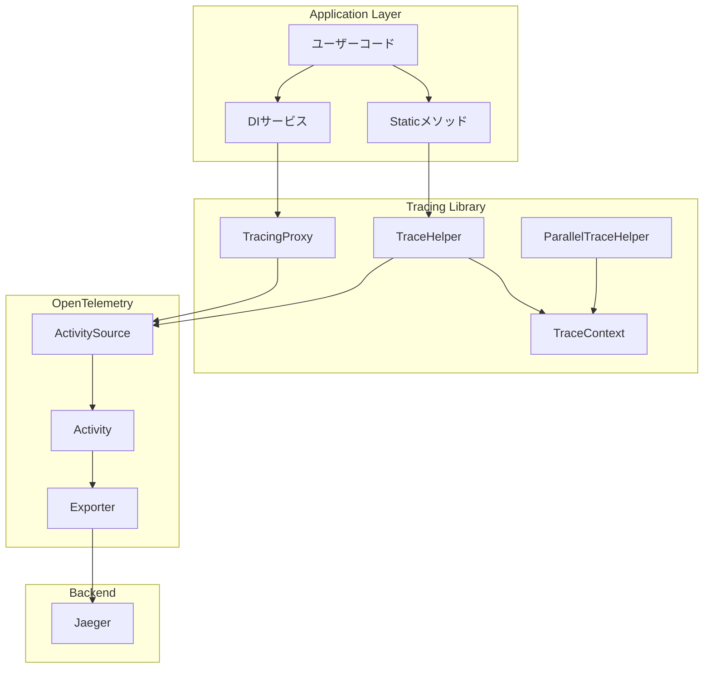

## 3. 主要処理フロー

### 3.1 DIサービス経由のトレースフロー

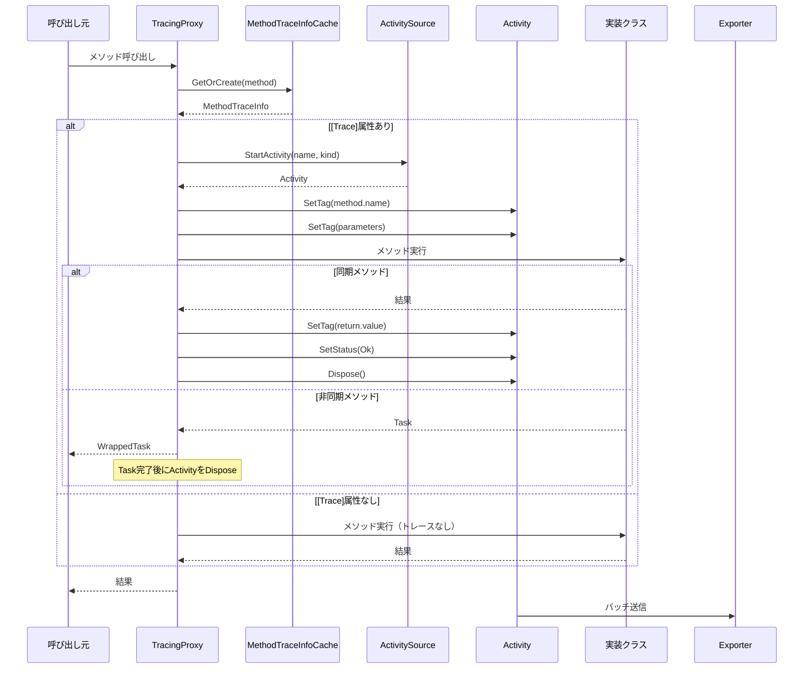

### 3.2 TraceHelper経由のトレースフロー

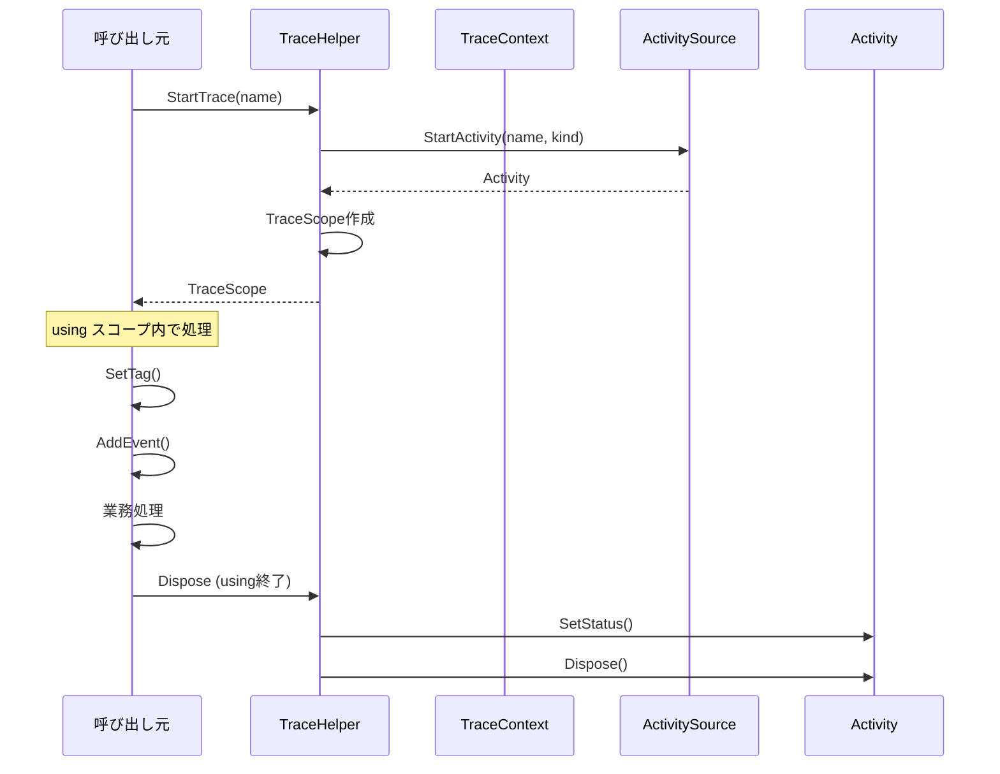

### 3.3 親コンテキスト伝播フロー

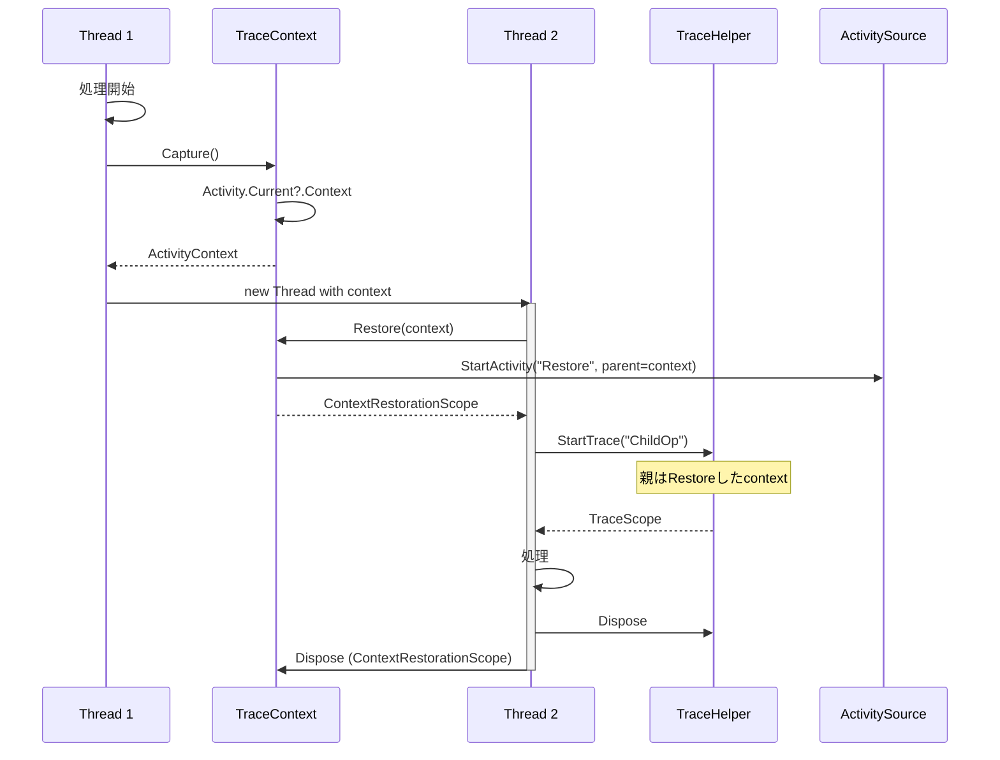

### 3.4 並列処理トレースフロー

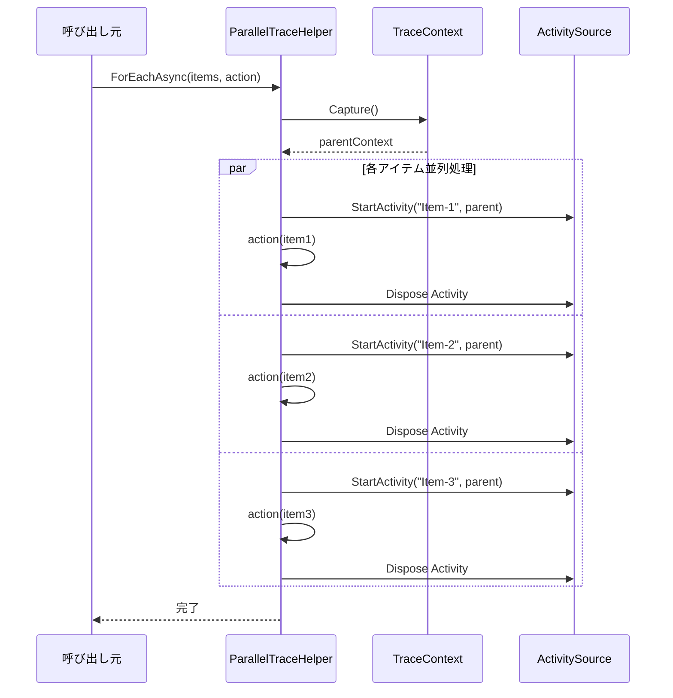

## 4. 詳細処理フロー

### 4.1 TraceHelper.StartTrace

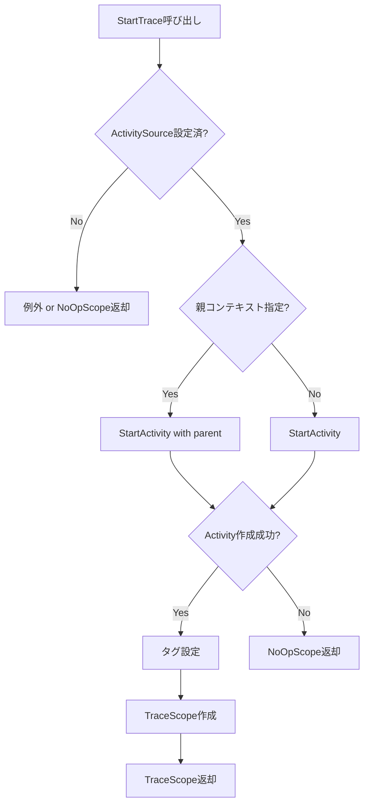

**実装詳細**:

```csharp
public static IDisposable StartTrace(
    string name,
    ActivityKind kind = ActivityKind.Internal)
{
    if (DefaultActivitySource == null)
    {
        // ActivitySourceが未設定の場合は何もしないスコープを返す
        return NoOpScope.Instance;
    }

    var activity = DefaultActivitySource.StartActivity(name, kind);
    
    return new TraceScope(activity, Activity.Current?.Context, TracingOptions.Default);
}

public static IDisposable StartTrace(
    string name,
    ActivityContext parentContext,
    ActivityKind kind = ActivityKind.Internal)
{
    if (DefaultActivitySource == null)
    {
        return NoOpScope.Instance;
    }

    var activity = DefaultActivitySource.StartActivity(
        name,
        kind,
        parentContext);
    
    return new TraceScope(activity, parentContext, TracingOptions.Default);
}
```

### 4.2 TraceContext.Capture と Restore

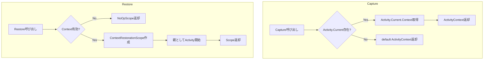

**実装詳細**:

```csharp
public static ActivityContext Capture()
{
    return Activity.Current?.Context ?? default;
}

public static IDisposable Restore(ActivityContext context)
{
    if (!context.IsValid())
    {
        return NoOpScope.Instance;
    }

    return new ContextRestorationScope(context, DefaultActivitySource);
}
```

### 4.3 非同期メソッドのActivity管理

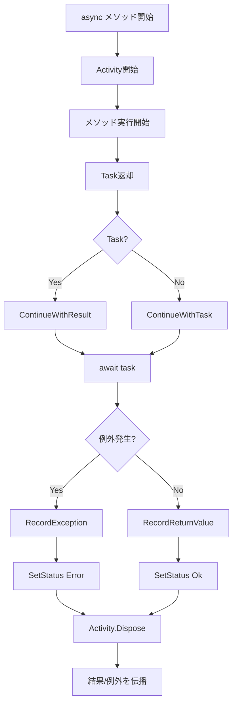

### 4.4 ParallelTraceHelper.ForEachAsync

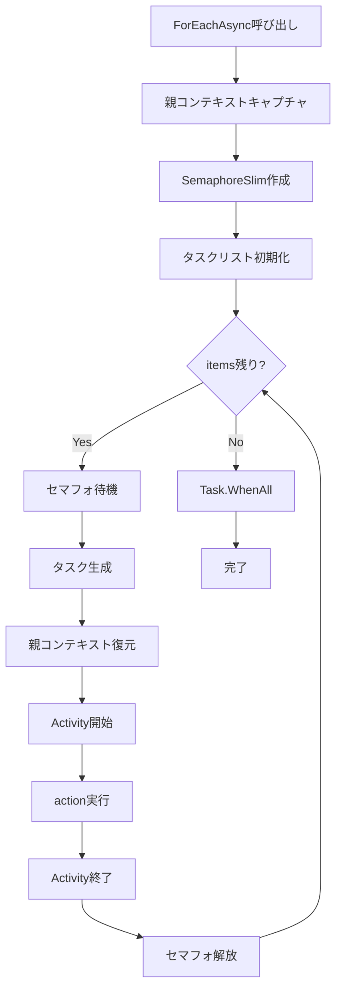

**実装詳細**:

```csharp
public static async Task ForEachAsync<T>(
    IEnumerable<T> items,
    Func<T, string> traceNameFunc,
    Func<T, Task> action,
    int maxDegreeOfParallelism = -1)
{
    var parentContext = TraceContext.Capture();
    
    var semaphore = maxDegreeOfParallelism > 0 
        ? new SemaphoreSlim(maxDegreeOfParallelism) 
        : null;

    var tasks = items.Select(async item =>
    {
        if (semaphore != null)
            await semaphore.WaitAsync();

        try
        {
            using (TraceHelper.StartTrace(traceNameFunc(item), parentContext))
            {
                await action(item);
            }
        }
        finally
        {
            semaphore?.Release();
        }
    });

    await Task.WhenAll(tasks);
}
```

## 5. 例外処理フロー

### 5.1 同期メソッドでの例外

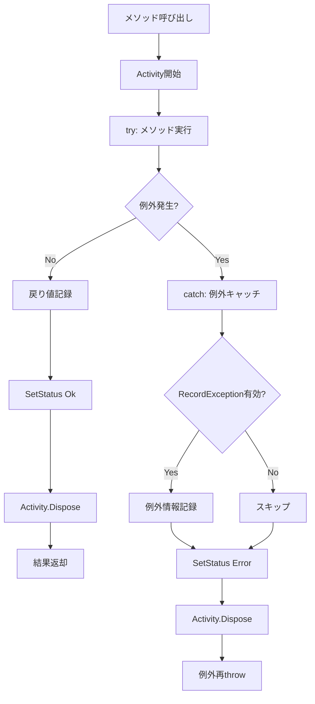

### 5.2 非同期メソッドでの例外

```mermaid
flowchart TD
    A[async メソッド呼び出し] --> B[Activity開始]
    B --> C[メソッド実行]
    C --> D[Task返却]
    D --> E[ContinueWith登録]
    
    E --> F{await完了}
    F --> G{例外発生?}
    
    G -->|No| H[戻り値記録]
    H --> I[SetStatus Ok]
    
    G -->|Yes| J{TaskCanceledException?}
    J -->|Yes| K[SetStatus Error "Canceled"]
    J -->|No| L[例外情報記録]
    L --> M[SetStatus Error]
    
    K --> N[finally: Activity.Dispose]
    M --> N
    I --> N
    
    N --> O[結果/例外伝播]
```

## 6. Fire-and-Forget対応

### 6.1 推奨パターン

```mermaid
sequenceDiagram
    participant Parent as 親処理
    participant TC as TraceContext
    participant Child as 子タスク
    participant Link as TraceLink
    
    Parent->>Parent: Activity開始
    Parent->>TC: Capture()
    TC-->>Parent: parentContext
    
    Parent->>Child: Task起動(Fire-and-Forget)
    Note over Parent,Child: Link経由で関連付け
    
    Parent->>Parent: Activity終了
    
    activate Child
    Child->>Child: 新しいルートActivity開始
    Child->>Link: AddLink(parentContext)
    Note over Child: 親子ではなくリンク関係
    Child->>Child: 処理
    Child->>Child: Activity終了
    deactivate Child
```

**実装例**:

```csharp
public static class TraceHelper
{
    /// <summary>
    /// Fire-and-Forget用のトレース開始
    /// 親子関係ではなく、リンク関係でトレースを関連付けます
    /// </summary>
    public static IDisposable StartLinkedTrace(
        string name,
        ActivityContext linkedContext)
    {
        if (DefaultActivitySource == null)
            return NoOpScope.Instance;

        // 新しいルートトレースとして開始
        var activity = DefaultActivitySource.StartActivity(name, ActivityKind.Internal);
        
        // リンクとして関連付け（親子ではない）
        activity?.AddLink(new ActivityLink(linkedContext));
        
        return new TraceScope(activity, null, TracingOptions.Default);
    }
}
```

## 7. サンプリング制御フロー

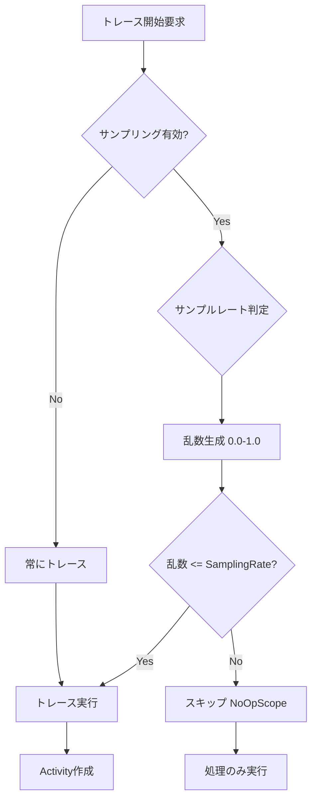

## 8. ログ統合フロー

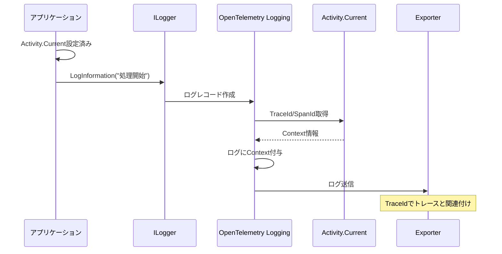

## 9. 初期化フロー

### 9.1 アプリケーション起動時

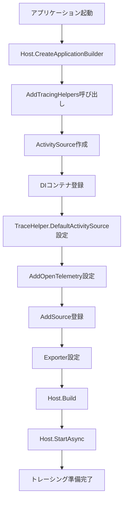

### 9.2 初期化コード例

```csharp
var builder = Host.CreateApplicationBuilder(args);

// トレーシングヘルパー初期化
builder.Services.AddTracingHelpers("MyApplication");

// OpenTelemetry設定
builder.Services.AddOpenTelemetry()
    .ConfigureResource(r => r.AddService("MyApplication"))
    .WithTracing(tracing =>
    {
        tracing
            .AddSource("MyApplication")
            .AddOtlpExporter();
    });

// トレース有効なサービス登録
builder.Services.AddTracedScoped<IOrderService, OrderService>();

var host = builder.Build();
await host.RunAsync();
```

## 10. 終了フロー

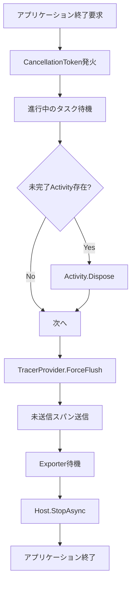

## 11. エラーリカバリーフロー

### 11.1 ActivitySource未設定時

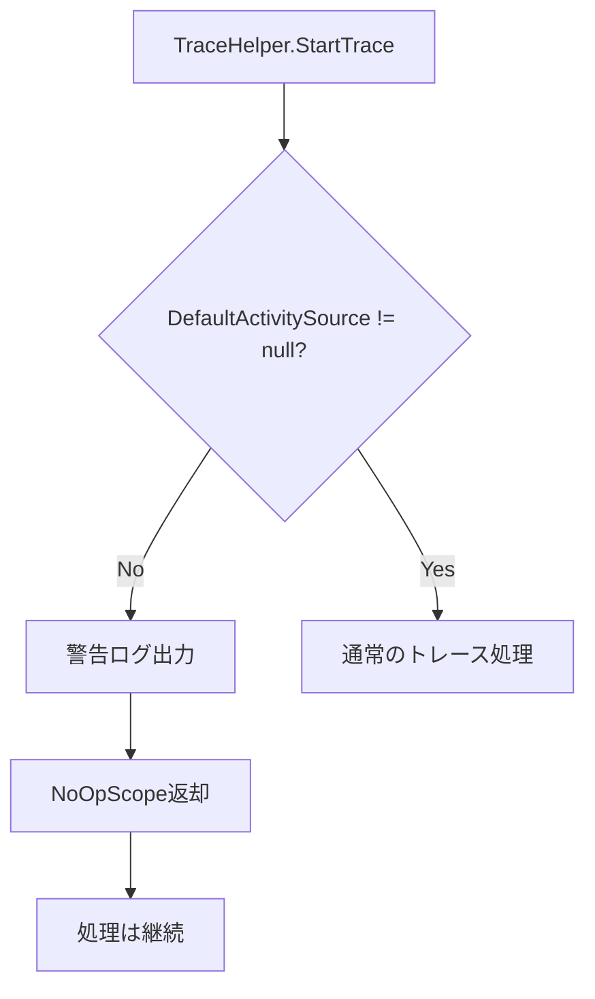

### 11.2 シリアライズエラー時

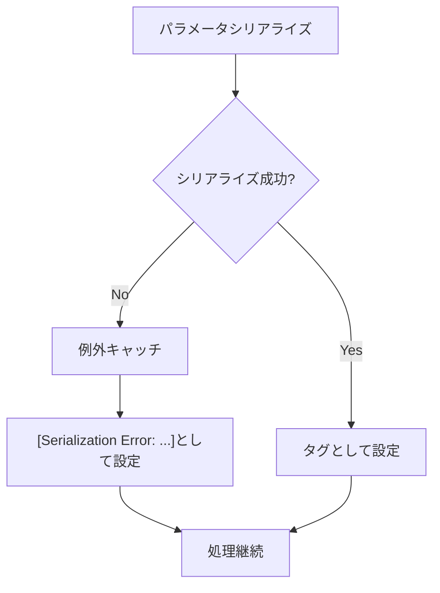

## 12. 次のステップ

1. テスト計画策定
2. 副作用検証計画策定
