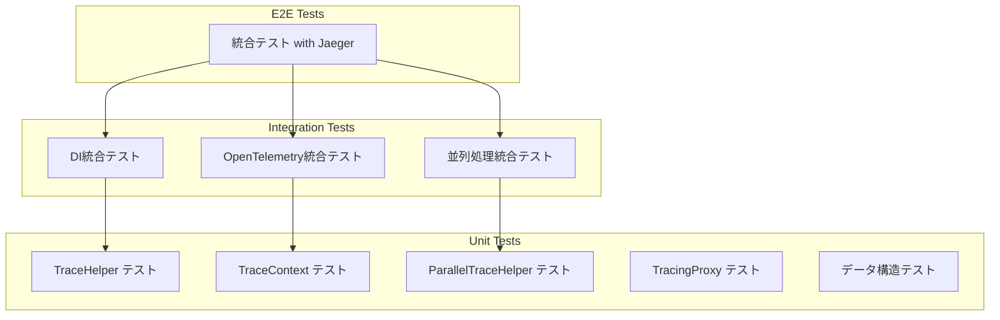

# テスト計画

## 1. 概要

トレーシングライブラリ拡張のテスト戦略と具体的なテストケースを定義します。

## 2. テスト戦略

### 2.1 テストピラミッド



### 2.2 テスト環境

| 環境 | 用途 | ツール |
|------|------|--------|
| Unit Test | 単体テスト | xUnit, Moq |
| Integration Test | 統合テスト | xUnit, TestServer |
| E2E Test | エンドツーエンド | xUnit, Testcontainers (Jaeger) |

### 2.3 テストプロジェクト構成

```
TracingSample.Tests/
├── TracingSample.Tracing.Tests/           # Tracingライブラリのテスト
│   ├── Unit/
│   │   ├── TraceHelperTests.cs
│   │   ├── TraceContextTests.cs
│   │   ├── ParallelTraceHelperTests.cs
│   │   ├── TraceScopeTests.cs
│   │   └── TracingOptionsTests.cs
│   └── Integration/
│       ├── DIIntegrationTests.cs
│       ├── OpenTelemetryIntegrationTests.cs
│       └── AsyncContextPropagationTests.cs
├── TracingSample.Core.Tests/              # Coreのテスト
│   └── Services/
│       └── OrderServiceTests.cs
└── TracingSample.E2E.Tests/               # E2Eテスト
    └── JaegerIntegrationTests.cs
```

## 3. 呼び出しパターン別テストケース

### 3.1 パターン分類

| カテゴリ | パターン | テスト優先度 |
|---------|----------|-------------|
| 同期 | 通常メソッド呼び出し | P0 |
| 同期 | ネスト呼び出し | P0 |
| 同期 | staticメソッド | P0 |
| 非同期 | async/await | P0 |
| 非同期 | Task<T>戻り値 | P0 |
| 非同期 | Task戻り値（void相当） | P0 |
| 並列 | Task.Run | P0 |
| 並列 | Parallel.ForEach | P1 |
| 並列 | Task.WhenAll | P1 |
| 並列 | PLINQ | P2 |
| スレッド | new Thread | P1 |
| スレッド | ThreadPool | P1 |
| 特殊 | Fire-and-Forget | P1 |
| 特殊 | 例外発生 | P0 |
| 特殊 | キャンセル | P1 |

### 3.2 詳細テストケース

#### 3.2.1 同期メソッドテスト

```csharp
public class SyncMethodTests
{
    [Fact]
    public void StartTrace_SyncMethod_CreatesAndDisposesActivity()
    {
        // Arrange
        var activities = new List<Activity>();
        using var listener = new ActivityListener
        {
            ShouldListenTo = _ => true,
            Sample = (ref ActivityCreationOptions<ActivityContext> _) => ActivitySamplingResult.AllData,
            ActivityStarted = a => activities.Add(a)
        };
        ActivitySource.AddActivityListener(listener);

        // Act
        using (TraceHelper.StartTrace("TestOperation"))
        {
            // 何らかの処理
        }

        // Assert
        Assert.Single(activities);
        Assert.Equal("TestOperation", activities[0].DisplayName);
    }

    [Fact]
    public void NestedTrace_CreatesParentChildRelationship()
    {
        // Arrange
        var activities = new List<Activity>();
        SetupActivityListener(activities);

        // Act
        using (TraceHelper.StartTrace("Parent"))
        {
            using (TraceHelper.StartTrace("Child"))
            {
                // 処理
            }
        }

        // Assert
        Assert.Equal(2, activities.Count);
        var parent = activities[0];
        var child = activities[1];
        Assert.Equal(parent.Context.TraceId, child.Context.TraceId);
        Assert.Equal(parent.Context.SpanId, child.ParentSpanId);
    }

    [Fact]
    public void StaticMethod_WithTraceHelper_CreatesActivity()
    {
        // Arrange
        var activities = new List<Activity>();
        SetupActivityListener(activities);

        // Act
        var result = StaticTestClass.CalculateWithTrace(10, 20);

        // Assert
        Assert.Equal(30, result);
        Assert.Single(activities);
        Assert.Equal("StaticTestClass.Calculate", activities[0].DisplayName);
    }
}
```

#### 3.2.2 非同期メソッドテスト

```csharp
public class AsyncMethodTests
{
    [Fact]
    public async Task StartTrace_AsyncMethod_MaintainsContextAcrossAwait()
    {
        // Arrange
        var activities = new List<Activity>();
        SetupActivityListener(activities);

        // Act
        await TraceHelper.WrapAsync("AsyncOperation", async () =>
        {
            await Task.Delay(10);
            // awaitの後もコンテキストが維持される
            Assert.NotNull(Activity.Current);
        });

        // Assert
        Assert.Single(activities);
    }

    [Fact]
    public async Task WrapAsync_WithResult_ReturnsValue()
    {
        // Arrange & Act
        var result = await TraceHelper.WrapAsync("Calculate", async () =>
        {
            await Task.Delay(10);
            return 42;
        });

        // Assert
        Assert.Equal(42, result);
    }

    [Fact]
    public async Task WrapAsync_WithException_RecordsExceptionAndThrows()
    {
        // Arrange
        var activities = new List<Activity>();
        SetupActivityListener(activities);

        // Act & Assert
        await Assert.ThrowsAsync<InvalidOperationException>(async () =>
        {
            await TraceHelper.WrapAsync("FailingOperation", async () =>
            {
                await Task.Delay(10);
                throw new InvalidOperationException("Test error");
            });
        });

        Assert.Single(activities);
        Assert.Equal(ActivityStatusCode.Error, activities[0].Status);
    }

    [Fact]
    public async Task TaskWithResult_RecordsReturnValue()
    {
        // Arrange
        var activities = new List<Activity>();
        SetupActivityListener(activities);
        var service = CreateTracedService<ITestService, TestService>();

        // Act
        var result = await service.GetValueAsync();

        // Assert
        var activity = activities.First(a => a.DisplayName.Contains("GetValueAsync"));
        Assert.Contains("return.value", activity.Tags.Select(t => t.Key));
    }
}
```

#### 3.2.3 並列処理テスト

```csharp
public class ParallelProcessingTests
{
    [Fact]
    public async Task TaskRun_WithCapturedContext_MaintainsParentRelationship()
    {
        // Arrange
        var activities = new List<Activity>();
        SetupActivityListener(activities);

        // Act
        using (TraceHelper.StartTrace("Parent"))
        {
            var context = TraceContext.Capture();
            
            await Task.Run(async () =>
            {
                using (TraceContext.Restore(context))
                using (TraceHelper.StartTrace("ChildInTaskRun"))
                {
                    await Task.Delay(10);
                }
            });
        }

        // Assert
        Assert.Equal(2, activities.Count);
        var parent = activities.First(a => a.DisplayName == "Parent");
        var child = activities.First(a => a.DisplayName == "ChildInTaskRun");
        Assert.Equal(parent.Context.TraceId, child.Context.TraceId);
    }

    [Fact]
    public async Task ParallelForEachAsync_AllItemsHaveSameParent()
    {
        // Arrange
        var activities = new List<Activity>();
        SetupActivityListener(activities);
        var items = new[] { 1, 2, 3, 4, 5 };
        ActivityContext parentContext;

        // Act
        using (var scope = TraceHelper.StartTrace("ParallelParent"))
        {
            parentContext = TraceContext.Capture();
            
            await ParallelTraceHelper.ForEachAsync(
                items,
                item => $"ProcessItem-{item}",
                async item =>
                {
                    await Task.Delay(10);
                });
        }

        // Assert
        var parent = activities.First(a => a.DisplayName == "ParallelParent");
        var children = activities.Where(a => a.DisplayName.StartsWith("ProcessItem")).ToList();
        
        Assert.Equal(5, children.Count);
        Assert.All(children, child =>
        {
            Assert.Equal(parent.Context.TraceId, child.Context.TraceId);
        });
    }

    [Fact]
    public async Task TaskWhenAll_EachTaskHasOwnSpan()
    {
        // Arrange
        var activities = new List<Activity>();
        SetupActivityListener(activities);

        // Act
        await ParallelTraceHelper.WhenAll(
            ("Task1", ProcessAsync("1")),
            ("Task2", ProcessAsync("2")),
            ("Task3", ProcessAsync("3")));

        // Assert
        var taskActivities = activities.Where(a => a.DisplayName.StartsWith("Task")).ToList();
        Assert.Equal(3, taskActivities.Count);
    }

    [Fact]
    public async Task MaxDegreeOfParallelism_LimitsConConcurrency()
    {
        // Arrange
        var concurrent = 0;
        var maxConcurrent = 0;
        var items = Enumerable.Range(1, 10).ToList();

        // Act
        await ParallelTraceHelper.ForEachAsync(
            items,
            i => $"Item-{i}",
            async _ =>
            {
                var current = Interlocked.Increment(ref concurrent);
                maxConcurrent = Math.Max(maxConcurrent, current);
                await Task.Delay(50);
                Interlocked.Decrement(ref concurrent);
            },
            maxDegreeOfParallelism: 3);

        // Assert
        Assert.True(maxConcurrent <= 3);
    }

    private async Task ProcessAsync(string id)
    {
        await Task.Delay(10);
    }
}
```

#### 3.2.4 スレッド間コンテキスト伝播テスト

```csharp
public class ThreadContextTests
{
    [Fact]
    public void NewThread_WithRestoredContext_MaintainsParentRelationship()
    {
        // Arrange
        var activities = new List<Activity>();
        SetupActivityListener(activities);
        var threadCompleted = new ManualResetEvent(false);

        // Act
        using (TraceHelper.StartTrace("MainThreadParent"))
        {
            var context = TraceContext.Capture();
            
            var thread = new Thread(() =>
            {
                using (TraceContext.Restore(context))
                using (TraceHelper.StartTrace("NewThreadChild"))
                {
                    // 処理
                }
                threadCompleted.Set();
            });
            
            thread.Start();
            threadCompleted.WaitOne();
        }

        // Assert
        Assert.Equal(2, activities.Count);
        var parent = activities.First(a => a.DisplayName == "MainThreadParent");
        var child = activities.First(a => a.DisplayName == "NewThreadChild");
        Assert.Equal(parent.Context.TraceId, child.Context.TraceId);
    }

    [Fact]
    public void ThreadPool_AutomaticallyPropagatesContext()
    {
        // Arrange
        var activities = new List<Activity>();
        SetupActivityListener(activities);
        var completed = new ManualResetEvent(false);
        string? childTraceId = null;

        // Act
        using (TraceHelper.StartTrace("ThreadPoolParent"))
        {
            var parentTraceId = Activity.Current?.TraceId.ToString();
            
            ThreadPool.QueueUserWorkItem(_ =>
            {
                using (TraceHelper.StartTrace("ThreadPoolChild"))
                {
                    childTraceId = Activity.Current?.TraceId.ToString();
                }
                completed.Set();
            });
            
            completed.WaitOne();
            
            // Assert
            Assert.Equal(parentTraceId, childTraceId);
        }
    }
}
```

#### 3.2.5 例外処理テスト

```csharp
public class ExceptionHandlingTests
{
    [Fact]
    public void SyncException_RecordsExceptionDetails()
    {
        // Arrange
        var activities = new List<Activity>();
        SetupActivityListener(activities);

        // Act
        Assert.Throws<ArgumentException>(() =>
        {
            using (var scope = TraceHelper.StartTrace("FailingOp"))
            {
                throw new ArgumentException("Invalid argument");
            }
        });

        // Assert - TraceScope内で例外はキャッチされないが、
        // 呼び出し元で適切にハンドリングする必要あり
        Assert.Single(activities);
    }

    [Fact]
    public void TracingProxy_RecordsExceptionWhenEnabled()
    {
        // Arrange
        var activities = new List<Activity>();
        SetupActivityListener(activities);
        var service = CreateTracedService<ITestService, FailingService>();

        // Act
        Assert.Throws<InvalidOperationException>(() =>
        {
            service.FailingMethod();
        });

        // Assert
        var activity = activities.Single();
        Assert.Equal(ActivityStatusCode.Error, activity.Status);
        Assert.Contains("exception.type", activity.Tags.Select(t => t.Key));
        Assert.Contains("exception.message", activity.Tags.Select(t => t.Key));
    }

    [Fact]
    public async Task AsyncException_RecordsExceptionDetails()
    {
        // Arrange
        var activities = new List<Activity>();
        SetupActivityListener(activities);
        var service = CreateTracedService<ITestService, FailingService>();

        // Act
        await Assert.ThrowsAsync<InvalidOperationException>(async () =>
        {
            await service.FailingMethodAsync();
        });

        // Assert
        var activity = activities.Single();
        Assert.Equal(ActivityStatusCode.Error, activity.Status);
    }

    [Fact]
    public async Task TaskCancellation_RecordsCancelledStatus()
    {
        // Arrange
        var activities = new List<Activity>();
        SetupActivityListener(activities);
        var cts = new CancellationTokenSource();

        // Act
        cts.Cancel();
        
        await Assert.ThrowsAsync<OperationCanceledException>(async () =>
        {
            await TraceHelper.WrapAsync("CancelledOperation", async () =>
            {
                cts.Token.ThrowIfCancellationRequested();
                await Task.Delay(100);
            });
        });

        // Assert
        Assert.Single(activities);
        Assert.Equal(ActivityStatusCode.Error, activities[0].Status);
    }
}
```

#### 3.2.6 Fire-and-Forgetテスト

```csharp
public class FireAndForgetTests
{
    [Fact]
    public async Task FireAndForget_WithLinkedTrace_CreatesLinkedSpan()
    {
        // Arrange
        var activities = new List<Activity>();
        SetupActivityListener(activities);
        var childCompleted = new TaskCompletionSource<bool>();

        // Act
        using (TraceHelper.StartTrace("Parent"))
        {
            var context = TraceContext.Capture();
            
            // Fire-and-forget
            _ = Task.Run(async () =>
            {
                // リンク関係でトレース（親子ではない）
                using (TraceHelper.StartLinkedTrace("FireAndForgetChild", context))
                {
                    await Task.Delay(50);
                }
                childCompleted.SetResult(true);
            });
        }

        await childCompleted.Task;

        // Assert
        var parent = activities.First(a => a.DisplayName == "Parent");
        var child = activities.First(a => a.DisplayName == "FireAndForgetChild");
        
        // 異なるTraceId（親子ではない）
        Assert.NotEqual(parent.Context.TraceId, child.Context.TraceId);
        
        // リンクで関連付け
        Assert.Contains(child.Links, link => link.Context.TraceId == parent.Context.TraceId);
    }
}
```

## 4. 統合テスト

### 4.1 DI統合テスト

```csharp
public class DIIntegrationTests
{
    [Fact]
    public void AddTracedScoped_RegistersServiceWithProxy()
    {
        // Arrange
        var services = new ServiceCollection();
        services.AddTracingHelpers();
        services.AddTracedScoped<ITestService, TestService>();
        var provider = services.BuildServiceProvider();

        // Act
        var service = provider.GetRequiredService<ITestService>();

        // Assert
        Assert.NotNull(service);
        Assert.True(service.GetType().Name.Contains("Proxy"));
    }

    [Fact]
    public async Task TracedService_CreatesActivityOnMethodCall()
    {
        // Arrange
        var activities = new List<Activity>();
        SetupActivityListener(activities);
        
        var services = new ServiceCollection();
        services.AddTracingHelpers();
        services.AddTracedScoped<ITestService, TestService>();
        var provider = services.BuildServiceProvider();

        // Act
        using var scope = provider.CreateScope();
        var service = scope.ServiceProvider.GetRequiredService<ITestService>();
        await service.DoWorkAsync();

        // Assert
        Assert.NotEmpty(activities);
    }
}
```

### 4.2 OpenTelemetry統合テスト

```csharp
public class OpenTelemetryIntegrationTests
{
    [Fact]
    public async Task TracedOperations_ExportToInMemoryExporter()
    {
        // Arrange
        var exportedItems = new List<Activity>();
        
        using var tracerProvider = Sdk.CreateTracerProviderBuilder()
            .AddSource("TestSource")
            .AddInMemoryExporter(exportedItems)
            .Build();

        var activitySource = new ActivitySource("TestSource");
        TraceHelper.DefaultActivitySource = activitySource;

        // Act
        using (TraceHelper.StartTrace("TestOperation"))
        {
            await Task.Delay(10);
        }

        tracerProvider.ForceFlush();

        // Assert
        Assert.Single(exportedItems);
        Assert.Equal("TestOperation", exportedItems[0].DisplayName);
    }
}
```

## 5. E2Eテスト

### 5.1 Jaeger統合テスト

```csharp
[Collection("Jaeger")]
public class JaegerIntegrationTests : IClassFixture<JaegerContainerFixture>
{
    private readonly JaegerContainerFixture _jaeger;

    public JaegerIntegrationTests(JaegerContainerFixture jaeger)
    {
        _jaeger = jaeger;
    }

    [Fact]
    public async Task FullTrace_ExportsToJaeger()
    {
        // Arrange
        using var tracerProvider = Sdk.CreateTracerProviderBuilder()
            .AddSource("E2ETest")
            .AddOtlpExporter(o => o.Endpoint = new Uri(_jaeger.OtlpEndpoint))
            .Build();

        var activitySource = new ActivitySource("E2ETest");

        // Act
        using (var parent = activitySource.StartActivity("ParentOperation"))
        {
            using (var child = activitySource.StartActivity("ChildOperation"))
            {
                await Task.Delay(100);
            }
        }

        tracerProvider.ForceFlush();
        await Task.Delay(2000); // Jaegerへの送信待機

        // Assert
        var traces = await _jaeger.GetTracesAsync("E2ETest");
        Assert.NotEmpty(traces);
    }
}

public class JaegerContainerFixture : IAsyncLifetime
{
    private IContainer? _container;
    public string OtlpEndpoint => $"http://localhost:{_otlpPort}";
    private int _otlpPort = 4317;

    public async Task InitializeAsync()
    {
        _container = new ContainerBuilder()
            .WithImage("jaegertracing/all-in-one:latest")
            .WithPortBinding(_otlpPort, 4317)
            .WithWaitStrategy(Wait.ForUnixContainer().UntilPortIsAvailable(4317))
            .Build();

        await _container.StartAsync();
    }

    public async Task DisposeAsync()
    {
        if (_container != null)
        {
            await _container.StopAsync();
        }
    }
}
```

## 6. テストヘルパー

### 6.1 共通セットアップ

```csharp
public abstract class TraceTestBase : IDisposable
{
    protected readonly List<Activity> Activities = new();
    protected readonly ActivityListener Listener;
    protected readonly ActivitySource TestActivitySource;

    protected TraceTestBase()
    {
        TestActivitySource = new ActivitySource("Test");
        TraceHelper.DefaultActivitySource = TestActivitySource;

        Listener = new ActivityListener
        {
            ShouldListenTo = _ => true,
            Sample = (ref ActivityCreationOptions<ActivityContext> _) => 
                ActivitySamplingResult.AllDataAndRecorded,
            ActivityStarted = a => Activities.Add(a)
        };

        ActivitySource.AddActivityListener(Listener);
    }

    protected T CreateTracedService<TInterface, TImpl>()
        where TInterface : class
        where TImpl : class, TInterface
    {
        var services = new ServiceCollection();
        services.AddSingleton(TestActivitySource);
        services.AddTracedScoped<TInterface, TImpl>();
        var provider = services.BuildServiceProvider();
        return provider.CreateScope().ServiceProvider.GetRequiredService<TInterface>();
    }

    public void Dispose()
    {
        Listener.Dispose();
        TestActivitySource.Dispose();
    }
}
```

## 7. テストカバレッジ目標

| コンポーネント | 目標カバレッジ |
|---------------|---------------|
| TraceHelper | 90%+ |
| TraceContext | 90%+ |
| ParallelTraceHelper | 85%+ |
| TracingProxy | 85%+ |
| TracingOptions | 80%+ |
| 全体 | 80%+ |

## 8. テスト実行計画

### 8.1 CI/CD統合

```yaml
# GitHub Actions例
- name: Run Unit Tests
  run: dotnet test --filter "Category=Unit" --collect:"XPlat Code Coverage"

- name: Run Integration Tests
  run: dotnet test --filter "Category=Integration"

- name: Run E2E Tests
  run: |
    docker-compose -f docker-compose.test.yml up -d
    dotnet test --filter "Category=E2E"
    docker-compose -f docker-compose.test.yml down
```

### 8.2 テスト実行順序

1. Unit Tests（ビルド時）
2. Integration Tests（PR時）
3. E2E Tests（マージ前/リリース前）

## 9. 次のステップ

1. 副作用検証計画策定
2. テストプロジェクト作成
3. テスト実装
