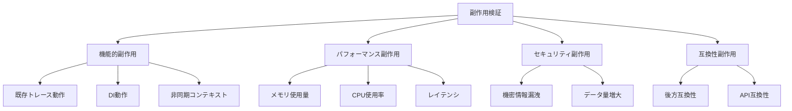
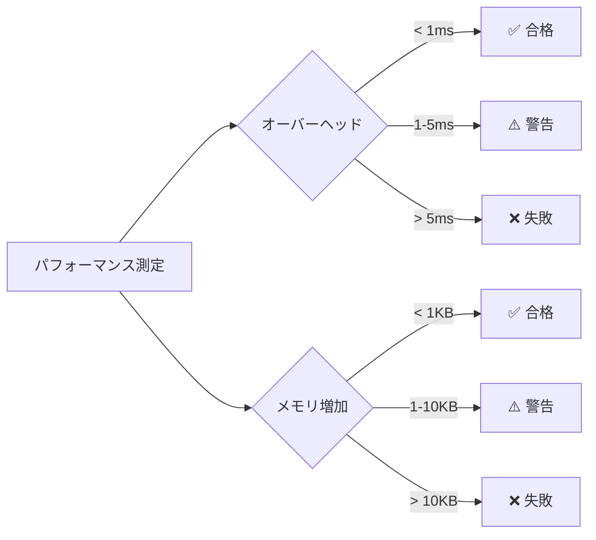
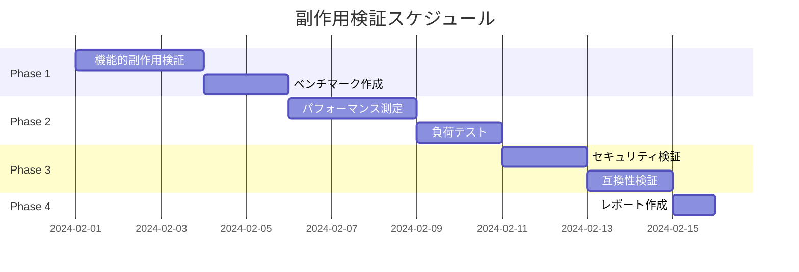

# 副作用検証計画

## 1. 概要

トレーシングライブラリ拡張による既存機能・パフォーマンス・セキュリティへの副作用を検証する計画を定義します。

## 2. 副作用カテゴリ



## 3. 機能的副作用検証

### 3.1 既存トレース動作への影響

| 検証項目 | 検証方法 | 期待結果 | 優先度 |
|---------|---------|---------|--------|
| 既存TracingProxyの動作 | 既存テスト実行 | 全テスト合格 | P0 |
| TraceAttribute動作 | 単体テスト | 従来通り動作 | P0 |
| DI登録済みサービス | 統合テスト | 正常動作 | P0 |
| OpenTelemetry設定 | 統合テスト | 正常動作 | P0 |

#### 3.1.1 検証手順

```csharp
public class ExistingFunctionalityTests
{
    [Fact]
    public async Task ExistingTracingProxy_StillWorks()
    {
        // Arrange
        var services = new ServiceCollection();
        services.AddTracingHelpers();
        services.AddTracedScoped<IOrderService, OrderService>();
        var provider = services.BuildServiceProvider();

        // Act
        using var scope = provider.CreateScope();
        var service = scope.ServiceProvider.GetRequiredService<IOrderService>();
        var order = await service.ProcessOrder("CUST-001", GetSampleItems(), "Address");

        // Assert
        Assert.NotNull(order);
        Assert.NotEmpty(order.OrderId);
    }

    [Fact]
    public void ExistingTraceAttribute_RecordsParameters()
    {
        // Arrange
        var activities = new List<Activity>();
        SetupActivityListener(activities);
        var service = CreateTracedService<IOrderService, OrderService>();

        // Act
        service.ProcessOrder("CUST-001", GetSampleItems(), "Address").Wait();

        // Assert
        var activity = activities.First();
        Assert.Contains("parameter.customerId", activity.Tags.Select(t => t.Key));
    }
}
```

### 3.2 DI動作への影響

| 検証項目 | 検証方法 | 期待結果 | 優先度 |
|---------|---------|---------|--------|
| Scopedライフタイム | スコープテスト | 正常動作 | P0 |
| Transientライフタイム | 複数取得テスト | 正常動作 | P0 |
| Singletonライフタイム | 再取得テスト | 正常動作 | P0 |
| 依存解決 | 複合サービステスト | 正常動作 | P0 |

#### 3.2.1 検証手順

```csharp
public class DIImpactTests
{
    [Fact]
    public void ScopedService_DisposesWithScope()
    {
        // Arrange
        var services = new ServiceCollection();
        services.AddTracingHelpers();
        services.AddTracedScoped<ITestService, DisposableService>();
        var provider = services.BuildServiceProvider();
        
        DisposableService instance;
        
        // Act
        using (var scope = provider.CreateScope())
        {
            instance = scope.ServiceProvider.GetRequiredService<ITestService>() as DisposableService;
        }

        // Assert
        Assert.True(instance.IsDisposed);
    }

    [Fact]
    public void TransientService_CreatesNewInstanceEachTime()
    {
        // Arrange
        var services = new ServiceCollection();
        services.AddTracingHelpers();
        services.AddTracedTransient<ITestService, TestService>();
        var provider = services.BuildServiceProvider();

        // Act
        var instance1 = provider.GetRequiredService<ITestService>();
        var instance2 = provider.GetRequiredService<ITestService>();

        // Assert
        Assert.NotSame(instance1, instance2);
    }

    [Fact]
    public void DependencyChain_ResolvesCorrectly()
    {
        // Arrange
        var services = new ServiceCollection();
        services.AddTracingHelpers();
        services.AddTracedScoped<IInventoryService, InventoryService>();
        services.AddTracedScoped<IPaymentService, PaymentService>();
        services.AddTracedScoped<IShippingService, ShippingService>();
        services.AddTracedScoped<IOrderService, OrderService>();
        var provider = services.BuildServiceProvider();

        // Act
        using var scope = provider.CreateScope();
        var orderService = scope.ServiceProvider.GetRequiredService<IOrderService>();

        // Assert
        Assert.NotNull(orderService);
    }
}
```

### 3.3 非同期コンテキストへの影響

| 検証項目 | 検証方法 | 期待結果 | 優先度 |
|---------|---------|---------|--------|
| AsyncLocal伝播 | 非同期チェーンテスト | 正常伝播 | P0 |
| ConfigureAwait(false) | 混合テスト | 正常動作 | P1 |
| SynchronizationContext | UI環境シミュレート | 影響なし | P2 |

#### 3.3.1 検証手順

```csharp
public class AsyncContextImpactTests
{
    [Fact]
    public async Task AsyncLocal_PropagatesAcrossAwaits()
    {
        // Arrange
        var activities = new List<Activity>();
        SetupActivityListener(activities);
        string? traceIdBefore = null;
        string? traceIdAfter = null;

        // Act
        using (TraceHelper.StartTrace("Parent"))
        {
            traceIdBefore = Activity.Current?.TraceId.ToString();
            await Task.Delay(10);
            traceIdAfter = Activity.Current?.TraceId.ToString();
        }

        // Assert
        Assert.Equal(traceIdBefore, traceIdAfter);
    }

    [Fact]
    public async Task ConfigureAwaitFalse_DoesNotBreakContext()
    {
        // Arrange
        var activities = new List<Activity>();
        SetupActivityListener(activities);

        // Act
        using (TraceHelper.StartTrace("Parent"))
        {
            await Task.Delay(10).ConfigureAwait(false);
            
            using (TraceHelper.StartTrace("Child"))
            {
                await Task.Delay(10);
            }
        }

        // Assert
        Assert.Equal(2, activities.Count);
        Assert.Equal(activities[0].Context.TraceId, activities[1].Context.TraceId);
    }
}
```

## 4. パフォーマンス副作用検証

### 4.1 ベンチマーク項目

| 項目 | 測定方法 | 許容閾値 | 優先度 |
|-----|---------|---------|--------|
| メソッド呼び出しオーバーヘッド | BenchmarkDotNet | < 1ms | P0 |
| メモリアロケーション | MemoryDiagnoser | < 1KB/call | P1 |
| GC圧力 | GCCollect counts | 増加 < 10% | P1 |
| 並列処理スループット | 並列ベンチマーク | 低下 < 5% | P1 |

#### 4.1.1 ベンチマーク実装

```csharp
[MemoryDiagnoser]
[SimpleJob(RuntimeMoniker.Net80)]
public class TracingBenchmarks
{
    private IOrderService _tracedService;
    private OrderService _directService;
    private List<OrderItem> _items;

    [GlobalSetup]
    public void Setup()
    {
        var services = new ServiceCollection();
        services.AddTracingHelpers();
        services.AddTracedScoped<IOrderService, OrderService>();
        services.AddScoped<IInventoryService, InventoryService>();
        services.AddScoped<IPaymentService, PaymentService>();
        services.AddScoped<IShippingService, ShippingService>();
        
        var provider = services.BuildServiceProvider();
        _tracedService = provider.CreateScope().ServiceProvider.GetRequiredService<IOrderService>();
        _directService = new OrderService(
            new InventoryService(),
            new PaymentService(),
            new ShippingService());

        _items = new List<OrderItem>
        {
            new() { ProductId = "PROD-001", ProductName = "Test", Quantity = 1, UnitPrice = 100 }
        };
    }

    [Benchmark(Baseline = true)]
    public async Task DirectCall()
    {
        await _directService.ProcessOrder("CUST-001", _items, "Address");
    }

    [Benchmark]
    public async Task TracedCall()
    {
        await _tracedService.ProcessOrder("CUST-001", _items, "Address");
    }

    [Benchmark]
    public void TraceHelperStartTrace()
    {
        using (TraceHelper.StartTrace("BenchmarkOperation"))
        {
            // 空の処理
        }
    }

    [Benchmark]
    public async Task TraceHelperWrapAsync()
    {
        await TraceHelper.WrapAsync("BenchmarkAsync", async () =>
        {
            await Task.CompletedTask;
        });
    }
}
```

### 4.2 負荷テスト

```csharp
public class LoadTests
{
    [Fact]
    public async Task HighConcurrency_NoMemoryLeak()
    {
        // Arrange
        var services = new ServiceCollection();
        services.AddTracingHelpers();
        services.AddTracedScoped<ITestService, TestService>();
        var provider = services.BuildServiceProvider();
        
        var initialMemory = GC.GetTotalMemory(true);

        // Act
        var tasks = Enumerable.Range(0, 10000).Select(async _ =>
        {
            using var scope = provider.CreateScope();
            var service = scope.ServiceProvider.GetRequiredService<ITestService>();
            await service.DoWorkAsync();
        });

        await Task.WhenAll(tasks);
        
        GC.Collect();
        GC.WaitForPendingFinalizers();
        var finalMemory = GC.GetTotalMemory(true);

        // Assert
        var memoryIncrease = finalMemory - initialMemory;
        Assert.True(memoryIncrease < 10 * 1024 * 1024, // 10MB以下
            $"Memory increased by {memoryIncrease / 1024 / 1024}MB");
    }

    [Fact]
    public async Task LongRunning_NoActivityLeak()
    {
        // Arrange
        var activityCount = 0;
        using var listener = new ActivityListener
        {
            ShouldListenTo = _ => true,
            Sample = (ref ActivityCreationOptions<ActivityContext> _) => ActivitySamplingResult.AllData,
            ActivityStarted = _ => Interlocked.Increment(ref activityCount),
            ActivityStopped = _ => Interlocked.Decrement(ref activityCount)
        };
        ActivitySource.AddActivityListener(listener);

        // Act
        for (int i = 0; i < 1000; i++)
        {
            using (TraceHelper.StartTrace($"Operation-{i}"))
            {
                await Task.Delay(1);
            }
        }

        // Assert
        Assert.Equal(0, activityCount); // 全てDisposed
    }
}
```

### 4.3 パフォーマンス許容基準



## 5. セキュリティ副作用検証

### 5.1 機密情報漏洩リスク

| リスク | 検証方法 | 対策確認 | 優先度 |
|-------|---------|---------|--------|
| パスワード記録 | パラメータ検査 | マスク動作 | P0 |
| トークン記録 | パラメータ検査 | マスク動作 | P0 |
| 接続文字列記録 | パラメータ検査 | マスク動作 | P0 |
| 個人情報記録 | パラメータ検査 | ガイドライン | P1 |

#### 5.1.1 検証手順

```csharp
public class SecurityTests
{
    [Theory]
    [InlineData("password")]
    [InlineData("Password")]
    [InlineData("PASSWORD")]
    [InlineData("apiKey")]
    [InlineData("api_key")]
    [InlineData("secret")]
    [InlineData("token")]
    [InlineData("accessToken")]
    [InlineData("connectionString")]
    public void SensitiveParameters_AreMasked(string parameterName)
    {
        // Arrange
        var options = TracingOptions.Default;

        // Assert
        Assert.Contains(parameterName, options.SensitiveParameters, 
            StringComparer.OrdinalIgnoreCase);
    }

    [Fact]
    public void TracedMethod_MasksSensitiveParameters()
    {
        // Arrange
        var activities = new List<Activity>();
        SetupActivityListener(activities);
        var service = CreateTracedService<IAuthService, AuthService>();

        // Act
        service.Login("user@example.com", "secret-password");

        // Assert
        var activity = activities.Single();
        var passwordTag = activity.Tags.FirstOrDefault(t => t.Key == "parameter.password");
        Assert.Equal("***MASKED***", passwordTag.Value);
    }

    [Fact]
    public void TraceAttribute_WithSensitiveParameters_MasksSpecifiedParams()
    {
        // Arrange
        var activities = new List<Activity>();
        SetupActivityListener(activities);
        var service = CreateTracedService<IPaymentService, PaymentService>();

        // Act
        service.ProcessPayment("4111111111111111", "123", 100m); // カード番号、CVV

        // Assert
        var activity = activities.Single();
        Assert.DoesNotContain(activity.Tags, t => t.Value?.Contains("4111") == true);
    }
}

public interface IAuthService
{
    [Trace(SensitiveParameters = "password")]
    bool Login(string email, string password);
}
```

### 5.2 データ量・ストレージリスク

| リスク | 検証方法 | 許容閾値 | 優先度 |
|-------|---------|---------|--------|
| スパンサイズ | サイズ測定 | < 10KB/span | P1 |
| エクスポート頻度 | レート測定 | < 1000/sec | P1 |
| ストレージ使用量 | 累積測定 | 見積もり算出 | P2 |

## 6. 互換性副作用検証

### 6.1 後方互換性

| 検証項目 | 検証方法 | 期待結果 | 優先度 |
|---------|---------|---------|--------|
| 既存API署名 | コンパイル確認 | エラーなし | P0 |
| 既存動作 | リグレッションテスト | 全合格 | P0 |
| 設定ファイル | 既存設定で起動 | 正常動作 | P1 |

#### 6.1.1 検証手順

```csharp
public class BackwardCompatibilityTests
{
    [Fact]
    public void ExistingServiceRegistration_Works()
    {
        // Arrange - 既存の登録方法
        var services = new ServiceCollection();
        services.AddTracedScoped<IOrderService, OrderService>();

        // Act
        var provider = services.BuildServiceProvider();
        var service = provider.CreateScope().ServiceProvider.GetRequiredService<IOrderService>();

        // Assert
        Assert.NotNull(service);
    }

    [Fact]
    public void ExistingTraceAttribute_Works()
    {
        // Arrange - 既存のアトリビュート使用
        var method = typeof(OrderService).GetMethod("ProcessOrder");
        var attr = method.GetCustomAttribute<TraceAttribute>();

        // Assert
        Assert.NotNull(attr);
        Assert.True(attr.RecordParameters);
        Assert.True(attr.RecordReturnValue);
    }
}
```

### 6.2 API互換性マトリクス

| API | v1.0 | v2.0 (新規) | 互換性 |
|-----|------|-------------|--------|
| TraceAttribute | ✅ | ✅ | 完全互換 |
| AddTracedScoped | ✅ | ✅ | 完全互換 |
| AddTracedTransient | ✅ | ✅ | 完全互換 |
| AddTracedSingleton | ✅ | ✅ | 完全互換 |
| TraceHelper | - | ✅ | 新規追加 |
| TraceContext | - | ✅ | 新規追加 |
| ParallelTraceHelper | - | ✅ | 新規追加 |

## 7. 検証実行計画

### 7.1 検証フェーズ



### 7.2 検証環境

| 環境 | スペック | 用途 |
|------|---------|------|
| 開発環境 | 8GB RAM, 4 CPU | 単体テスト、統合テスト |
| CI環境 | 16GB RAM, 8 CPU | ベンチマーク、負荷テスト |
| ステージング | 本番同等 | E2Eテスト |

### 7.3 自動化

```yaml
# .github/workflows/side-effect-verification.yml
name: Side Effect Verification

on:
  pull_request:
    branches: [main]

jobs:
  functional-tests:
    runs-on: ubuntu-latest
    steps:
      - uses: actions/checkout@v4
      - name: Setup .NET
        uses: actions/setup-dotnet@v4
        with:
          dotnet-version: '8.0.x'
      - name: Run Functional Tests
        run: dotnet test --filter "Category=SideEffect&SubCategory=Functional"

  performance-tests:
    runs-on: ubuntu-latest
    steps:
      - name: Run Benchmarks
        run: dotnet run -c Release --project tests/Benchmarks -- --filter '*' --exporters json
      - name: Compare with Baseline
        run: ./scripts/compare-benchmarks.sh

  security-tests:
    runs-on: ubuntu-latest
    steps:
      - name: Run Security Tests
        run: dotnet test --filter "Category=Security"
```

## 8. 検証レポートテンプレート

### 8.1 副作用検証レポート

```markdown
# 副作用検証レポート

## 実施日: YYYY-MM-DD
## バージョン: X.Y.Z

### 1. 機能的副作用

| 項目 | 結果 | 備考 |
|------|------|------|
| 既存トレース動作 | ✅ PASS | |
| DI動作 | ✅ PASS | |
| 非同期コンテキスト | ✅ PASS | |

### 2. パフォーマンス副作用

| メトリクス | 変更前 | 変更後 | 変化率 | 判定 |
|-----------|--------|--------|--------|------|
| メソッドオーバーヘッド | 0.3ms | 0.4ms | +33% | ✅ |
| メモリ/呼び出し | 500B | 600B | +20% | ✅ |

### 3. セキュリティ副作用

| 項目 | 結果 | 備考 |
|------|------|------|
| 機密情報マスク | ✅ PASS | |
| データ量 | ✅ PASS | |

### 4. 互換性副作用

| 項目 | 結果 | 備考 |
|------|------|------|
| 後方互換性 | ✅ PASS | |
| API互換性 | ✅ PASS | |

### 5. 結論

[総合判定: PASS/FAIL]
[特記事項があれば記載]
```

## 9. リスク対応マトリクス

| リスク | 発生可能性 | 影響度 | 対応策 |
|-------|-----------|--------|--------|
| パフォーマンス劣化 | 中 | 高 | サンプリング機能、ベンチマーク継続監視 |
| メモリリーク | 低 | 高 | 負荷テスト、Activity追跡 |
| 機密情報漏洩 | 中 | 高 | 自動マスク、ガイドライン |
| 互換性破壊 | 低 | 中 | リグレッションテスト、API凍結 |

## 10. 承認基準

### 10.1 リリース承認条件

- [ ] 全機能テスト合格
- [ ] パフォーマンス劣化 < 20%
- [ ] メモリ増加 < 50%
- [ ] セキュリティテスト合格
- [ ] 後方互換性確保
- [ ] 副作用検証レポート作成

### 10.2 例外対応

パフォーマンス劣化が閾値を超える場合：
1. 原因分析
2. 最適化検討
3. ドキュメント化（許容理由）
4. ステークホルダー承認

## 11. 次のステップ

1. テストプロジェクト作成
2. ベンチマークプロジェクト作成
3. CI/CDパイプライン構築
4. 実装開始
