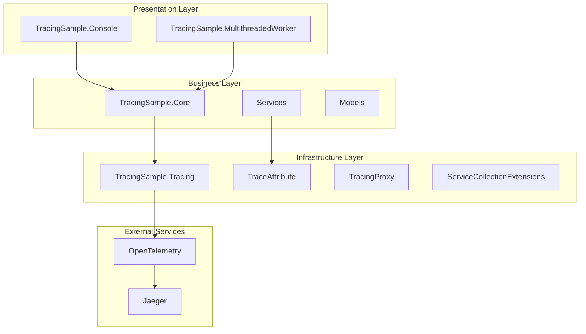
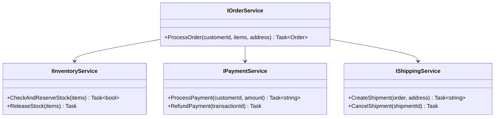
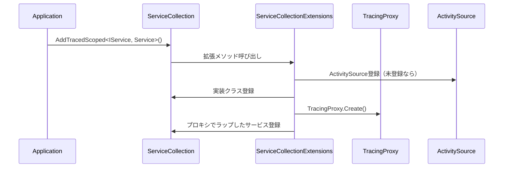
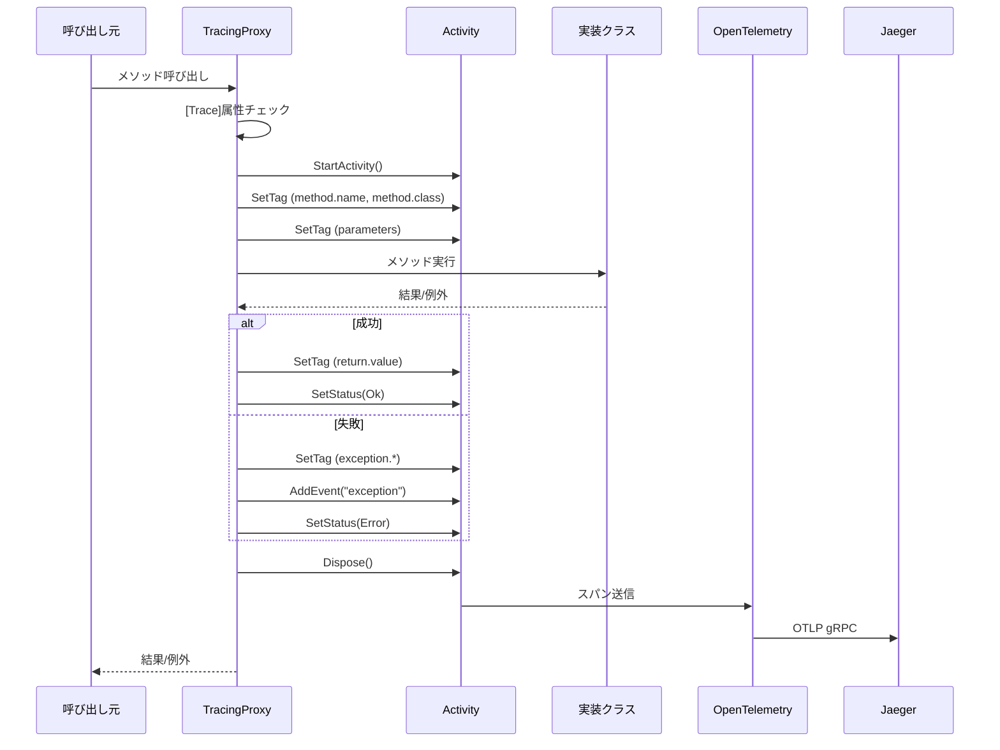
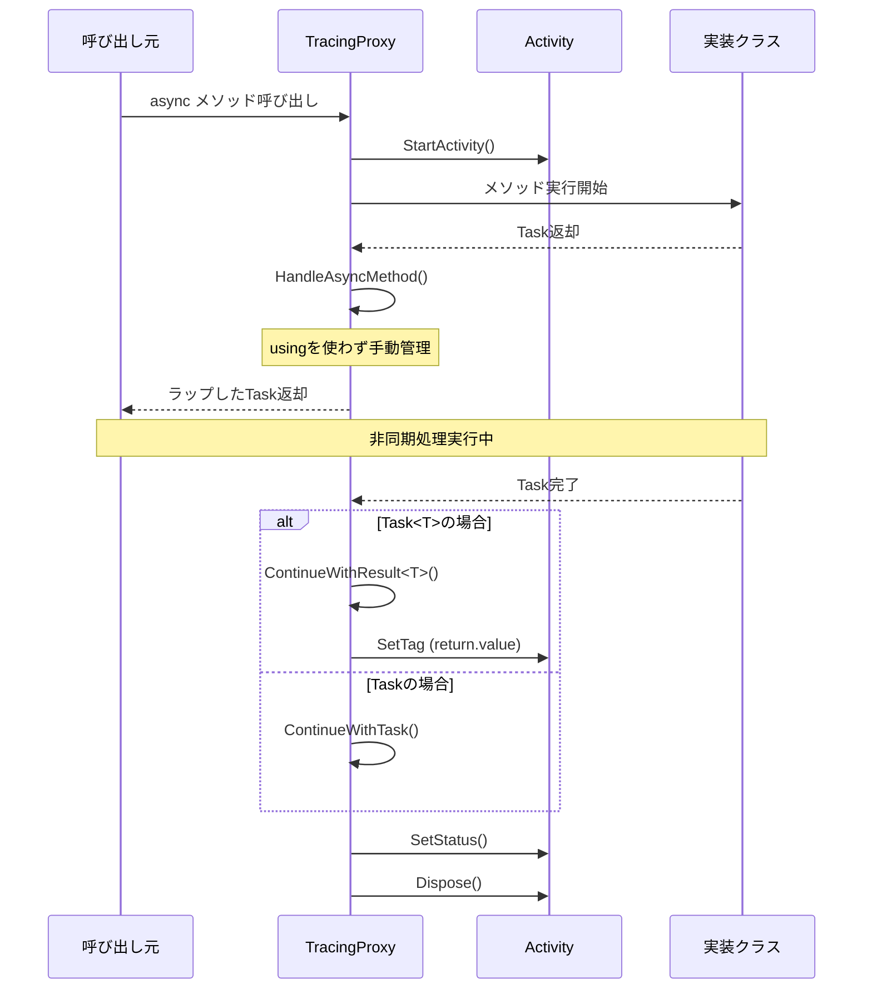

# アーキテクチャ調査

## 1. プロジェクト概要

TracingSampleは、OpenTelemetryを使用した.NET 8向け分散トレーシングのサンプルプロジェクトです。メソッドに`[Trace]`アトリビュートを付与するだけで、パラメータ・戻り値・例外・実行時間を自動的にJaegerで可視化できる実践的なトレーシング機能を提供します。

## 2. ディレクトリ構造

```
opentelemtry/
├── .devcontainer/                        # DevContainer設定（Jaeger自動起動）
│   ├── devcontainer.json
│   ├── Dockerfile
│   ├── docker-compose.yml
│   └── README.md
├── TracingSample/                        # メインソリューション
│   ├── TracingSample.sln
│   ├── docker/
│   │   └── docker-compose.yml            # Jaeger単体起動設定
│   ├── src/
│   │   ├── TracingSample.Console/        # コンソールアプリケーション（エントリーポイント）
│   │   ├── TracingSample.Core/           # ビジネスロジック（EC注文処理サンプル）
│   │   ├── TracingSample.MultithreadedWorker/  # マルチスレッドワーカーサンプル
│   │   └── TracingSample.Tracing/        # トレーシング機能（再利用可能ライブラリ）
│   └── README.md
└── test-trace.cs
```

## 3. レイヤー構成



## 4. コンポーネント詳細

### 4.1 TracingSample.Tracing（トレーシングライブラリ）

**責務**: メソッドレベルの自動トレースを実現する再利用可能なライブラリ

**主要コンポーネント**:

| ファイル | 役割 |
|----------|------|
| `Attributes/TraceAttribute.cs` | トレース対象メソッドをマーキングするアトリビュート |
| `Extensions/ServiceCollectionExtensions.cs` | DIコンテナへのトレース対応サービス登録 |
| `Interceptors/TracingProxy.cs` | DispatchProxyによるメソッドインターセプト実装 |

**設計パターン**: 
- **Proxy Pattern**: DispatchProxyを使用したインターフェースベースのプロキシ
- **Decorator Pattern**: 既存サービスにトレース機能を付加

### 4.2 TracingSample.Core（ビジネスロジック）

**責務**: EC注文処理のサンプルビジネスロジック

**サービス構成**:



### 4.3 TracingSample.Console（コンソールアプリ）

**責務**: 単一スレッドでの注文処理デモ

**特徴**:
- Microsoft.Extensions.Hosting使用
- OpenTelemetry設定（OTLP Exporter）
- DIコンテナ設定
- サンプル注文データの生成と処理

### 4.4 TracingSample.MultithreadedWorker（マルチスレッドワーカー）

**責務**: マルチスレッド環境でのトレースデモ

**特徴**:
- 複数ワーカースレッドの並列実行
- 手動でのActivity作成（ワーカー単位のスパン）
- ログとトレースの統合
- グレースフルシャットダウン対応

## 5. 処理フロー

### 5.1 トレース設定フロー



### 5.2 メソッド呼び出しフロー



### 5.3 async/awaitフロー



## 6. 技術的特徴

### 6.1 DispatchProxyの採用

**採用理由**:
- .NET標準ライブラリ（外部依存なし）
- インターフェースベースのプロキシ生成
- リフレクションによる動的メソッドインターセプト

**制限事項**:
- インターフェース経由の呼び出しのみ対応
- クラスベースのプロキシは不可

### 6.2 Activity管理

**同期メソッド**:
- using文を使わず手動でDispose()呼び出し

**非同期メソッド**:
- Task完了後のContinuationでDispose()
- TaskとTask<T>の両方をサポート

### 6.3 親子関係トレース

**現在の実装**:
- OpenTelemetryのActivity.Current自動伝播に依存
- 同期/非同期コンテキスト内で自動的に親子関係が構築
- DIコンテナ経由のサービス呼び出しで親子関係が維持

## 7. 拡張ポイント

1. **TraceAttribute**: 新しいプロパティの追加（サンプリング率など）
2. **TracingProxy**: 追加のメタデータ記録
3. **ServiceCollectionExtensions**: 新しいライフタイムパターンの追加
4. **カスタムシリアライザ**: 機密情報のマスク処理
