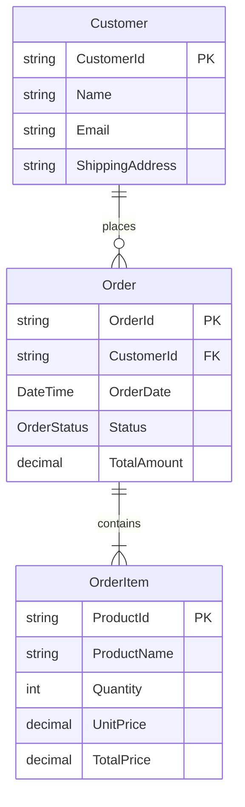
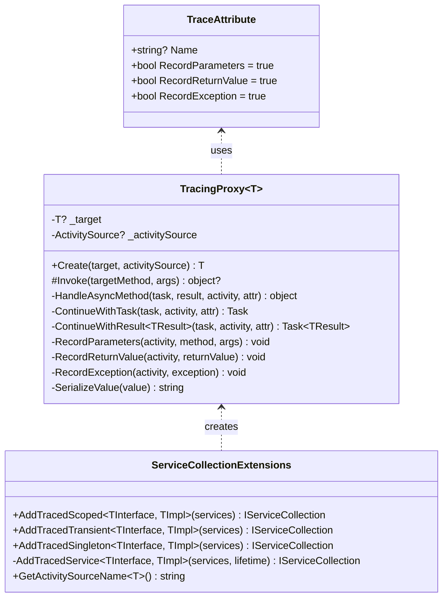
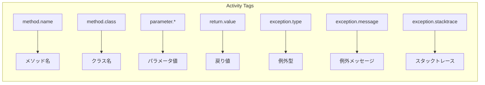

# データ構造調査

## 1. 概要

TracingSampleプロジェクトで使用されるデータ構造とその関係性を調査した結果を記載します。

## 2. モデルクラス

### 2.1 ER図



### 2.2 クラス定義

#### Customer（顧客情報）

```csharp
namespace TracingSample.Core.Models;

public class Customer
{
    public string CustomerId { get; set; } = string.Empty;
    public string Name { get; set; } = string.Empty;
    public string Email { get; set; } = string.Empty;
    public string ShippingAddress { get; set; } = string.Empty;
}
```

| プロパティ | 型 | 説明 |
|-----------|-----|------|
| CustomerId | string | 顧客ID（主キー） |
| Name | string | 顧客名 |
| Email | string | メールアドレス |
| ShippingAddress | string | 配送先住所 |

#### Order（注文情報）

```csharp
namespace TracingSample.Core.Models;

public class Order
{
    public string OrderId { get; set; } = string.Empty;
    public string CustomerId { get; set; } = string.Empty;
    public List<OrderItem> Items { get; set; } = new();
    public DateTime OrderDate { get; set; } = DateTime.UtcNow;
    public OrderStatus Status { get; set; } = OrderStatus.Pending;
    public decimal TotalAmount => Items.Sum(item => item.TotalPrice);
}
```

| プロパティ | 型 | 説明 |
|-----------|-----|------|
| OrderId | string | 注文ID（主キー）、形式: `ORD-XXXXXXXX` |
| CustomerId | string | 顧客ID（外部キー） |
| Items | List\<OrderItem\> | 注文明細リスト |
| OrderDate | DateTime | 注文日時（UTC） |
| Status | OrderStatus | 注文ステータス |
| TotalAmount | decimal | 合計金額（算出プロパティ） |

#### OrderItem（注文明細）

```csharp
namespace TracingSample.Core.Models;

public class OrderItem
{
    public string ProductId { get; set; } = string.Empty;
    public string ProductName { get; set; } = string.Empty;
    public int Quantity { get; set; }
    public decimal UnitPrice { get; set; }
    public decimal TotalPrice => Quantity * UnitPrice;
}
```

| プロパティ | 型 | 説明 |
|-----------|-----|------|
| ProductId | string | 商品ID |
| ProductName | string | 商品名 |
| Quantity | int | 数量 |
| UnitPrice | decimal | 単価 |
| TotalPrice | decimal | 小計（算出プロパティ） |

#### OrderStatus（注文ステータス列挙型）

```csharp
public enum OrderStatus
{
    Pending,           // 処理待ち
    PaymentProcessing, // 決済処理中
    Paid,              // 支払い完了
    Shipping,          // 配送中
    Completed,         // 完了
    Failed             // 失敗
}
```

## 3. トレーシング関連の型

### 3.1 クラス図



### 3.2 TraceAttribute

メソッドにトレースを適用するためのアトリビュート。

| プロパティ | 型 | デフォルト | 説明 |
|-----------|-----|-----------|------|
| Name | string? | null | トレース名（nullの場合はメソッド名） |
| RecordParameters | bool | true | パラメータを記録するか |
| RecordReturnValue | bool | true | 戻り値を記録するか |
| RecordException | bool | true | 例外を記録するか |

### 3.3 TracingProxy\<T\>

DispatchProxyを継承したプロキシクラス。

**主要メソッド**:

| メソッド | 説明 |
|----------|------|
| Create() | プロキシインスタンスを生成 |
| Invoke() | メソッド呼び出しをインターセプト |
| HandleAsyncMethod() | 非同期メソッドのActivity管理 |
| ContinueWithTask() | 非ジェネリックTaskの継続処理 |
| ContinueWithResult\<T\>() | Task\<T\>の継続処理 |

## 4. OpenTelemetry関連の型

### 4.1 使用するOpenTelemetry型

| 型 | 名前空間 | 用途 |
|----|----------|------|
| ActivitySource | System.Diagnostics | トレースソースの生成 |
| Activity | System.Diagnostics | 個別のスパン（トレース単位） |
| ActivityKind | System.Diagnostics | スパンの種類 |
| ActivityStatusCode | System.Diagnostics | スパンの結果ステータス |
| ActivityEvent | System.Diagnostics | スパン内のイベント（例外記録） |
| ActivityTagsCollection | System.Diagnostics | タグコレクション |

### 4.2 Activity（スパン）のタグ構造



## 5. シリアライズ形式

### 5.1 パラメータ・戻り値のシリアライズ

```csharp
private static string SerializeValue(object? value)
{
    // nullの場合
    if (value == null) return "null";
    
    // プリミティブ型、string、decimal、DateTime、DateTimeOffset
    // → ToString()
    
    // その他のオブジェクト
    // → JsonSerializer.Serialize (MaxDepth=5)
}
```

### 5.2 シリアライズオプション

| オプション | 値 | 目的 |
|-----------|-----|------|
| WriteIndented | false | 圧縮されたJSON出力 |
| MaxDepth | 5 | 循環参照対策 |

## 6. ID生成パターン

| 種類 | 形式 | 例 |
|------|------|-----|
| OrderId | `ORD-{GUID8桁}` | `ORD-A1B2C3D4` |
| TransactionId | `TXN-{GUID8桁}` | `TXN-E5F6G7H8` |
| ShipmentId | `SHIP-{GUID8桁}` | `SHIP-I9J0K1L2` |
| CustomerId | `CUST-{番号}` | `CUST-001` |
| ProductId | `PROD-{番号}` | `PROD-001` |
