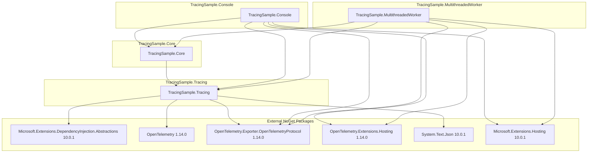
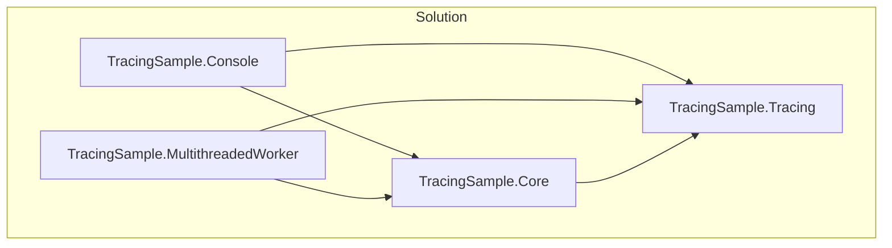
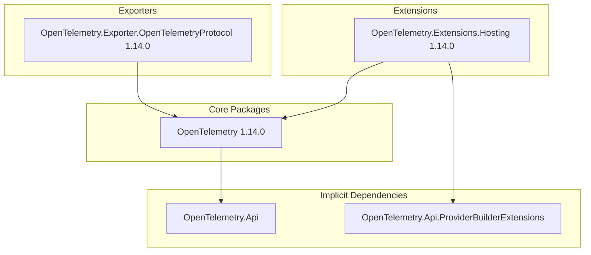
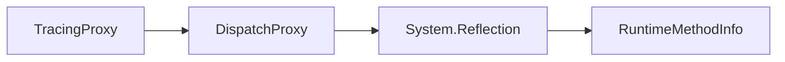

# 依存関係調査

## 1. 概要

TracingSampleプロジェクトの外部パッケージ依存関係と内部モジュール間依存関係を調査した結果を記載します。

## 2. 外部パッケージ依存関係

### 2.1 依存関係図



### 2.2 パッケージ一覧

#### TracingSample.Tracing

| パッケージ | バージョン | 用途 |
|-----------|-----------|------|
| Microsoft.Extensions.DependencyInjection.Abstractions | 10.0.1 | DIコンテナ抽象化 |
| OpenTelemetry | 1.14.0 | 分散トレーシング基盤 |
| OpenTelemetry.Exporter.OpenTelemetryProtocol | 1.14.0 | OTLPエクスポーター |
| System.Text.Json | 10.0.1 | JSONシリアライズ |

#### TracingSample.Console / MultithreadedWorker

| パッケージ | バージョン | 用途 |
|-----------|-----------|------|
| Microsoft.Extensions.Hosting | 10.0.1 | ホスティング基盤 |
| OpenTelemetry.Exporter.OpenTelemetryProtocol | 1.14.0 | OTLPエクスポーター |
| OpenTelemetry.Extensions.Hosting | 1.14.0 | ホスティング統合 |

### 2.3 開発依存

| ツール | 用途 |
|--------|------|
| Docker / Docker Compose | Jaeger実行環境 |
| .NET 8 SDK | ビルド・実行環境 |

## 3. 内部モジュール間依存関係

### 3.1 プロジェクト参照図



### 3.2 プロジェクト参照一覧

| プロジェクト | 参照先 |
|-------------|--------|
| TracingSample.Console | TracingSample.Core, TracingSample.Tracing |
| TracingSample.MultithreadedWorker | TracingSample.Core, TracingSample.Tracing |
| TracingSample.Core | TracingSample.Tracing |
| TracingSample.Tracing | なし（ライブラリ） |

## 4. 名前空間依存関係

### 4.1 TracingSample.Tracing

```csharp
// Attributes/TraceAttribute.cs
namespace TracingSample.Tracing.Attributes;

// Extensions/ServiceCollectionExtensions.cs
using System.Diagnostics;
using Microsoft.Extensions.DependencyInjection;
using Microsoft.Extensions.DependencyInjection.Extensions;
using TracingSample.Tracing.Interceptors;

namespace TracingSample.Tracing.Extensions;

// Interceptors/TracingProxy.cs
using System.Diagnostics;
using System.Reflection;
using System.Text.Json;
using TracingSample.Tracing.Attributes;

namespace TracingSample.Tracing.Interceptors;
```

### 4.2 TracingSample.Core

```csharp
// Models
namespace TracingSample.Core.Models;

// Services
using TracingSample.Core.Models;
using TracingSample.Tracing.Attributes;

namespace TracingSample.Core.Services;
```

### 4.3 TracingSample.Console

```csharp
using System.Diagnostics;
using Microsoft.Extensions.DependencyInjection;
using Microsoft.Extensions.Hosting;
using Microsoft.Extensions.Logging;
using OpenTelemetry;
using OpenTelemetry.Resources;
using OpenTelemetry.Trace;
using TracingSample.Core.Models;
using TracingSample.Core.Services;
using TracingSample.Tracing.Extensions;
```

### 4.4 TracingSample.MultithreadedWorker

```csharp
using System.Diagnostics;
using Microsoft.Extensions.DependencyInjection;
using Microsoft.Extensions.Hosting;
using Microsoft.Extensions.Logging;
using OpenTelemetry;
using OpenTelemetry.Logs;
using OpenTelemetry.Resources;
using OpenTelemetry.Trace;
using TracingSample.Core.Models;
using TracingSample.Core.Services;
using TracingSample.Tracing.Extensions;
```

## 5. OpenTelemetry依存関係詳細

### 5.1 OpenTelemetry パッケージ構成



### 5.2 使用するOpenTelemetry API

| クラス/インターフェース | 用途 |
|------------------------|------|
| TracerProviderBuilder | トレーサープロバイダーの構築 |
| AddSource() | ActivitySourceの登録 |
| SetSampler() | サンプリング戦略の設定 |
| AddOtlpExporter() | OTLPエクスポーターの設定 |
| ResourceBuilder | サービスリソース情報の設定 |

## 6. .NET Framework依存関係

### 6.1 使用するSystem名前空間

| 名前空間 | 用途 |
|----------|------|
| System.Diagnostics | Activity, ActivitySource |
| System.Reflection | DispatchProxy, MethodInfo |
| System.Text.Json | JSONシリアライズ |
| System.Threading.Tasks | Task, async/await |

### 6.2 DispatchProxy依存



## 7. 外部サービス依存

### 7.1 Jaeger

| 設定 | 値 |
|------|-----|
| イメージ | jaegertracing/all-in-one:latest |
| OTLP gRPCポート | 4317 |
| OTLP HTTPポート | 4318 |
| UIポート | 16686 |
| プロトコル | gRPC |

### 7.2 接続設定

```csharp
options.Endpoint = new Uri("http://localhost:4317");
options.Protocol = OpenTelemetry.Exporter.OtlpExportProtocol.Grpc;
```

## 8. バージョン互換性

| コンポーネント | バージョン | 互換性 |
|---------------|-----------|--------|
| .NET | 8.0 | LTS |
| C# | 12 | 最新機能使用 |
| OpenTelemetry | 1.14.0 | 安定版 |
| Microsoft.Extensions.* | 10.0.1 | .NET 8対応 |
