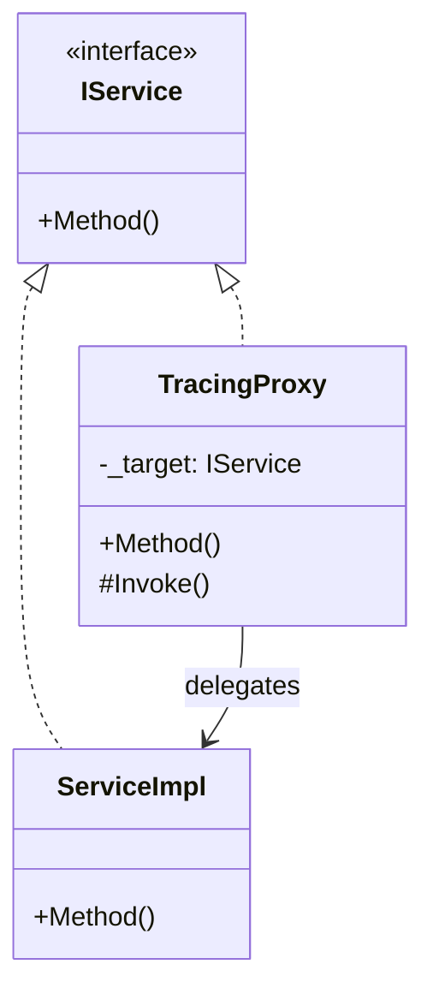

# 既存パターン調査

## 1. 概要

TracingSampleプロジェクトで使用されているコーディング規約、設計パターン、実装パターンを調査した結果を記載します。

## 2. コーディング規約・スタイル

### 2.1 命名規則

| 種類 | 規則 | 例 |
|------|------|-----|
| クラス | PascalCase | `OrderService`, `TracingProxy` |
| インターフェース | I + PascalCase | `IOrderService`, `IPaymentService` |
| メソッド | PascalCase | `ProcessOrder`, `CheckAndReserveStock` |
| プロパティ | PascalCase | `OrderId`, `TotalAmount` |
| プライベートフィールド | _camelCase | `_inventoryService`, `_target` |
| パラメータ | camelCase | `customerId`, `items` |
| 定数 | PascalCase | `ServiceName`, `WorkerCount` |

### 2.2 ファイル構成

```
プロジェクト/
├── Models/           # データモデル
├── Services/         # サービスインターフェース・実装
├── Attributes/       # カスタムアトリビュート
├── Extensions/       # 拡張メソッド
├── Interceptors/     # プロキシ・インターセプター
└── Program.cs        # エントリーポイント
```

### 2.3 コードスタイル

```csharp
// Nullable有効
<Nullable>enable</Nullable>

// ImplicitUsings有効
<ImplicitUsings>enable</ImplicitUsings>

// ターゲットフレームワーク
<TargetFramework>net8.0</TargetFramework>
```

## 3. 設計パターン

### 3.1 Proxy Pattern（プロキシパターン）

**使用箇所**: TracingProxy



**実装ポイント**:
- DispatchProxyを継承
- インターフェース経由の呼び出しをインターセプト
- 元の実装に処理を委譲

### 3.2 Decorator Pattern（デコレータパターン）

**使用箇所**: ServiceCollectionExtensions

```csharp
public static IServiceCollection AddTracedScoped<TInterface, TImplementation>(
    this IServiceCollection services)
{
    // 実装クラスを登録
    services.Add(new ServiceDescriptor(
        typeof(TImplementation),
        typeof(TImplementation),
        lifetime));

    // プロキシでラップしたインターフェースを登録
    services.Add(new ServiceDescriptor(
        typeof(TInterface),
        sp =>
        {
            var implementation = sp.GetRequiredService<TImplementation>();
            var activitySource = sp.GetRequiredService<ActivitySource>();
            return TracingProxy<TInterface>.Create(implementation, activitySource);
        },
        lifetime));

    return services;
}
```

### 3.3 Factory Method Pattern（ファクトリメソッドパターン）

**使用箇所**: TracingProxy.Create()

```csharp
public static T Create(T target, ActivitySource activitySource)
{
    var proxy = Create<T, TracingProxy<T>>() as TracingProxy<T>;
    proxy._target = target;
    proxy._activitySource = activitySource;
    return (T)(object)proxy;
}
```

### 3.4 Dependency Injection（依存性注入）

**使用箇所**: 全サービスクラス

```csharp
public class OrderService : IOrderService
{
    private readonly IInventoryService _inventoryService;
    private readonly IPaymentService _paymentService;
    private readonly IShippingService _shippingService;

    // コンストラクタインジェクション
    public OrderService(
        IInventoryService inventoryService,
        IPaymentService paymentService,
        IShippingService shippingService)
    {
        _inventoryService = inventoryService;
        _paymentService = paymentService;
        _shippingService = shippingService;
    }
}
```

### 3.5 Saga Pattern（サガパターン）

**使用箇所**: OrderService.ProcessOrder()

```csharp
[Trace]
public async Task<Order> ProcessOrder(...)
{
    string? transactionId = null;
    string? shipmentId = null;

    try
    {
        // ステップ1: 在庫確認と予約
        await _inventoryService.CheckAndReserveStock(items);
        
        // ステップ2: 決済処理
        transactionId = await _paymentService.ProcessPayment(...);
        
        // ステップ3: 配送手配
        shipmentId = await _shippingService.CreateShipment(...);
        
        return order;
    }
    catch (Exception ex)
    {
        // 補償トランザクション（ロールバック）
        if (shipmentId != null)
            await _shippingService.CancelShipment(shipmentId);
        
        if (transactionId != null)
            await _paymentService.RefundPayment(transactionId);
        
        await _inventoryService.ReleaseStock(items);
        
        throw;
    }
}
```

## 4. 非同期処理パターン

### 4.1 async/await パターン

```csharp
// 標準的なasync/awaitパターン
public async Task<Order> ProcessOrder(...)
{
    await _inventoryService.CheckAndReserveStock(items);
    transactionId = await _paymentService.ProcessPayment(...);
    shipmentId = await _shippingService.CreateShipment(...);
    return order;
}
```

### 4.2 Task継続パターン

**使用箇所**: TracingProxy（非同期メソッドのActivity管理）

```csharp
private static async Task<TResult> ContinueWithResult<TResult>(
    Task<TResult> task, 
    Activity? activity, 
    TraceAttribute traceAttribute)
{
    try
    {
        var result = await task;
        // 結果を記録
        activity?.SetStatus(ActivityStatusCode.Ok);
        return result;
    }
    catch (Exception ex)
    {
        activity?.SetStatus(ActivityStatusCode.Error, ex.Message);
        throw;
    }
    finally
    {
        activity?.Dispose();
    }
}
```

### 4.3 並列タスク実行パターン

**使用箇所**: MultithreadedWorker

```csharp
// 複数ワーカーの並列起動
var workerTasks = new List<Task>();
for (int workerId = 1; workerId <= WorkerCount; workerId++)
{
    var id = workerId; // ラムダキャプチャ用
    var workerTask = Task.Run(async () =>
    {
        await RunWorkerAsync(services, id, activitySource, cts.Token);
    });
    workerTasks.Add(workerTask);
}

// 全タスク完了待機
await Task.WhenAll(workerTasks);
```

## 5. エラーハンドリングパターン

### 5.1 例外のアンラップ

```csharp
catch (TargetInvocationException ex) when (ex.InnerException != null)
{
    // リフレクション呼び出しの例外をアンラップ
    if (traceAttribute.RecordException)
    {
        RecordException(activity, ex.InnerException);
    }
    throw ex.InnerException;
}
```

### 5.2 キャンセル処理

```csharp
catch (OperationCanceledException) when (cancellationToken.IsCancellationRequested)
{
    logger.LogInformation("Worker-{WorkerId}: キャンセルされました", workerId);
    break;
}
```

### 5.3 グレースフルシャットダウン

```csharp
using var cts = new CancellationTokenSource();

Console.CancelKeyPress += (sender, e) =>
{
    e.Cancel = true; // プロセス終了を防ぐ
    cts.Cancel();
};

AppDomain.CurrentDomain.ProcessExit += (sender, e) =>
{
    cts.Cancel();
};
```

## 6. DI登録パターン

### 6.1 標準パターン

```csharp
// 通常のサービス登録
services.AddScoped<IService, ServiceImpl>();

// トレース有効なサービス登録
services.AddTracedScoped<IService, ServiceImpl>();
```

### 6.2 ライフタイム対応

| 拡張メソッド | ライフタイム |
|-------------|-------------|
| AddTracedScoped | Scoped |
| AddTracedTransient | Transient |
| AddTracedSingleton | Singleton |

## 7. アトリビュートパターン

### 7.1 定義

```csharp
[AttributeUsage(AttributeTargets.Method, AllowMultiple = false, Inherited = true)]
public class TraceAttribute : Attribute
{
    public string? Name { get; set; }
    public bool RecordParameters { get; set; } = true;
    public bool RecordReturnValue { get; set; } = true;
    public bool RecordException { get; set; } = true;
}
```

### 7.2 使用方法

```csharp
// 基本使用
[Trace]
public async Task<Order> ProcessOrder(...) { }

// カスタム名
[Trace(Name = "注文処理")]
public async Task<Order> ProcessOrder(...) { }

// パラメータ記録無効化
[Trace(RecordParameters = false)]
public async Task ProcessPayment(string cardNumber, ...) { }
```

## 8. ホスティングパターン

### 8.1 汎用ホスト使用

```csharp
var builder = Host.CreateApplicationBuilder(args);

// サービス登録
builder.Services.AddOpenTelemetry()...
builder.Services.AddTracedScoped<IService, Service>();

// ログ設定
builder.Logging.SetMinimumLevel(LogLevel.Information);

var host = builder.Build();

// ホスト開始
await host.StartAsync();

// アプリケーション処理
using (var scope = host.Services.CreateScope())
{
    // ...
}

// ホスト停止
await host.StopAsync();
```

## 9. テストパターン

**現状**: テストプロジェクトは未実装

**推奨テストパターン**:
- ユニットテスト: xUnit + Moq
- 統合テスト: TestServer + Testcontainers (Jaeger)
