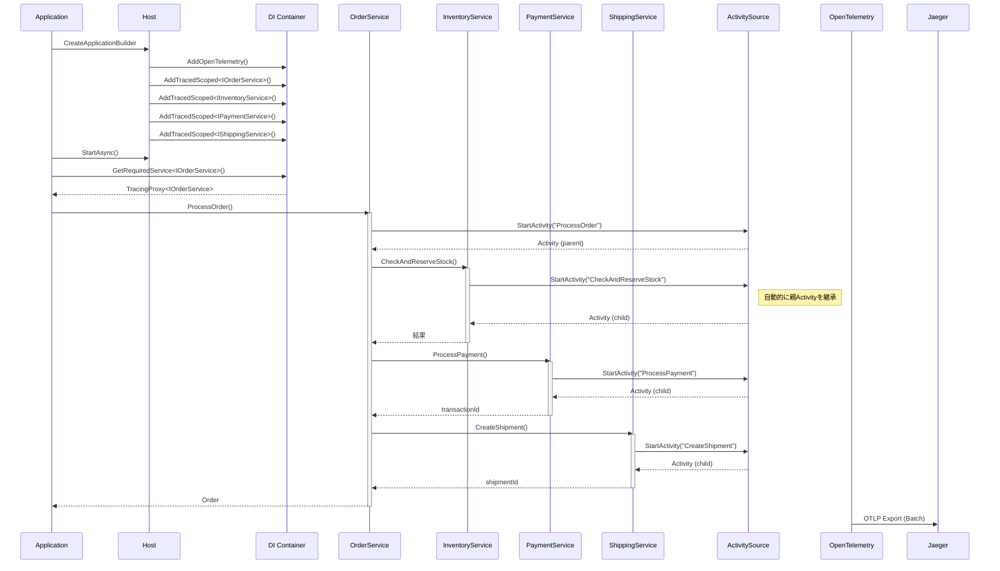
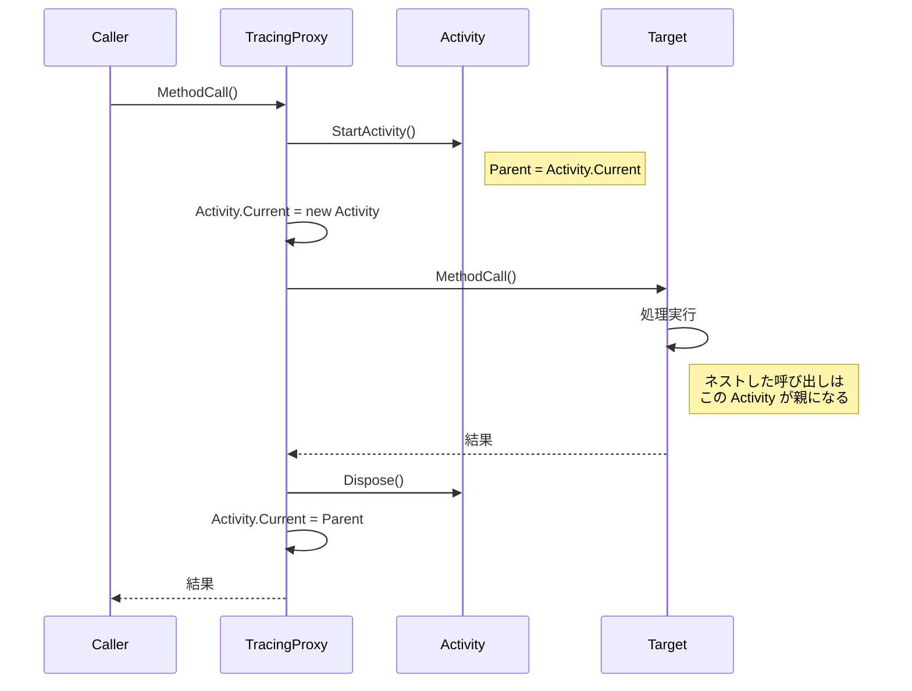
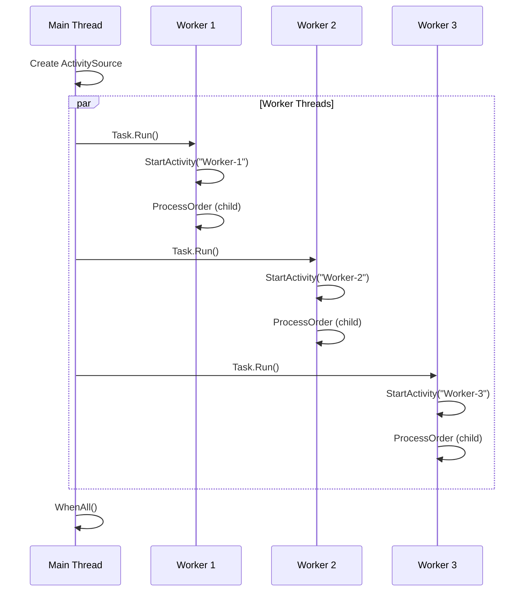
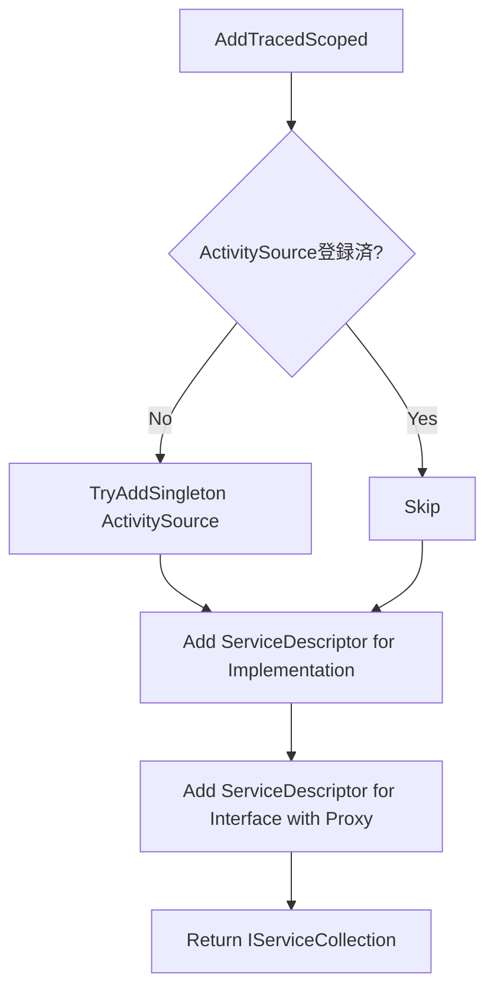
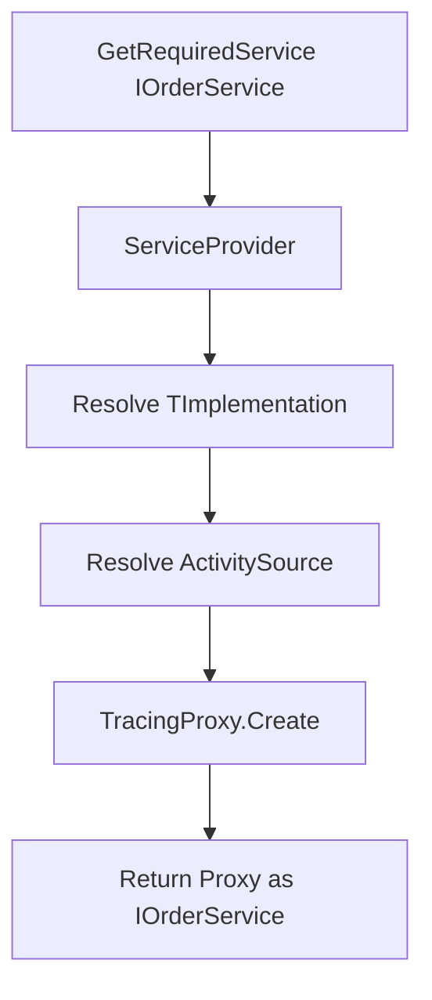
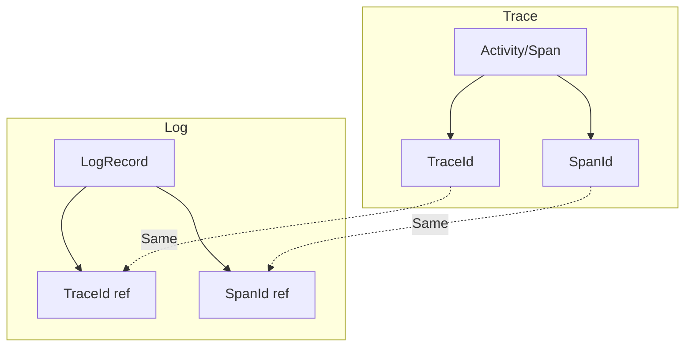

# 統合ポイント調査

## 1. 概要

TracingSampleプロジェクトにおける各モジュール・サービス間の統合ポイント、および親子関係トレースの実現方法を調査した結果を記載します。

## 2. トレーシング統合フロー

### 2.1 全体シーケンス図



## 3. 親子関係トレースの仕組み

### 3.1 Activity.Current による自動伝播

OpenTelemetryは`Activity.Current`を使用してトレースコンテキストを自動的に伝播します。

```mermaid
graph TD
    subgraph Thread Context
        A[Activity.Current = Parent]
    end
    
    subgraph Method A
        B[StartActivity"MethodA"] --> C[Activity.Current = MethodA]
        C --> D[Call Method B]
    end
    
    subgraph Method B
        E[StartActivity"MethodB"] --> F[Parent = Activity.Current = MethodA]
        F --> G[Activity.Current = MethodB]
    end
    
    D --> E
```

### 3.2 同期メソッドでの親子関係

```csharp
using var parentActivity = _activitySource.StartActivity("Parent");
// Activity.Current = parentActivity

// 子メソッド呼び出し
await ChildMethod(); 
// ChildMethod内でStartActivityすると、自動的にparentActivityが親になる
```

### 3.3 async/awaitでの親子関係

```csharp
// 非同期メソッドでも ExecutionContext により自動伝播
public async Task<Order> ProcessOrder(...)
{
    // Activity.Current = ProcessOrder Activity
    
    await _inventoryService.CheckAndReserveStock(items);
    // CheckAndReserveStock内のActivity は ProcessOrder の子になる
    
    await _paymentService.ProcessPayment(...);
    // ProcessPayment内のActivity も ProcessOrder の子になる
}
```

### 3.4 TracingProxy での Activity 管理



## 4. マルチスレッド環境での親子関係

### 4.1 ワーカースレッドパターン



### 4.2 MultithreadedWorker の実装

```csharp
static async Task RunWorkerAsync(
    IServiceProvider services,
    int workerId,
    ActivitySource activitySource,
    CancellationToken cancellationToken)
{
    while (!cancellationToken.IsCancellationRequested)
    {
        // ワーカー単位のスパンを作成（親）
        using var workerActivity = activitySource.StartActivity($"Worker-{workerId}.ProcessOrder");
        workerActivity?.SetTag("worker.id", workerId);

        try
        {
            using var scope = services.CreateScope();
            var orderService = scope.ServiceProvider.GetRequiredService<IOrderService>();
            
            // DIから取得したサービスの呼び出しは自動的に子スパンになる
            var order = await orderService.ProcessOrder(...);
        }
        catch (Exception ex)
        {
            workerActivity?.SetStatus(ActivityStatusCode.Error, ex.Message);
        }
    }
}
```

## 5. DI統合ポイント

### 5.1 サービス登録フロー



### 5.2 サービス解決フロー



## 6. OpenTelemetry統合

### 6.1 設定フロー

```csharp
builder.Services.AddOpenTelemetry()
    .ConfigureResource(resource => resource.AddService(
        serviceName: "TracingSample",
        serviceVersion: "1.0.0"))
    .WithTracing(tracing =>
    {
        tracing
            .AddSource("TracingSample.Core")  // ActivitySourceを登録
            .SetSampler(new AlwaysOnSampler())
            .AddOtlpExporter(options =>
            {
                options.Endpoint = new Uri("http://localhost:4317");
                options.Protocol = OtlpExportProtocol.Grpc;
            });
    });
```

### 6.2 ActivitySource連携

```mermaid
graph LR
    subgraph Application
        AS[ActivitySource "TracingSample.Core"]
    end
    
    subgraph OpenTelemetry SDK
        TP[TracerProvider]
        EX[OTLP Exporter]
    end
    
    subgraph External
        JG[Jaeger]
    end
    
    AS -->|AddSource| TP
    TP -->|Batch| EX
    EX -->|gRPC| JG
```

## 7. ログとトレースの統合

### 7.1 MultithreadedWorkerでの設定

```csharp
// OpenTelemetry Logging設定
builder.Logging.AddOpenTelemetry(logging =>
{
    logging.SetResourceBuilder(resourceBuilder);
    logging.IncludeScopes = true;  // スコープを含める
    logging.IncludeFormattedMessage = true;
    logging.AddOtlpExporter(options =>
    {
        options.Endpoint = new Uri("http://localhost:4317");
        options.Protocol = OtlpExportProtocol.Grpc;
    });
});
```

### 7.2 トレースとログの関連付け



## 8. 拡張ポイント

### 8.1 新規サービス追加時

```csharp
// 1. インターフェース定義
public interface INewService
{
    [Trace]
    Task<Result> DoSomething(string param);
}

// 2. 実装クラス
public class NewService : INewService
{
    [Trace]
    public async Task<Result> DoSomething(string param) { ... }
}

// 3. DI登録
builder.Services.AddTracedScoped<INewService, NewService>();
```

### 8.2 カスタムActivitySource追加

```csharp
// 1. ActivitySource作成
var customActivitySource = new ActivitySource("CustomModule");
builder.Services.AddSingleton(customActivitySource);

// 2. OpenTelemetryに登録
.WithTracing(tracing =>
{
    tracing.AddSource("CustomModule");
});

// 3. 手動でスパン作成
using var activity = customActivitySource.StartActivity("CustomOperation");
```

### 8.3 手動での親子関係設定

```csharp
// 明示的に親を指定
var parentContext = parentActivity?.Context ?? default;
using var childActivity = activitySource.StartActivity(
    "ChildOperation",
    ActivityKind.Internal,
    parentContext);
```

## 9. 統合における注意点

### 9.1 スコープ管理

```csharp
// Scopedサービスは CreateScope() 内で解決
using var scope = host.Services.CreateScope();
var orderService = scope.ServiceProvider.GetRequiredService<IOrderService>();
// scope内での呼び出しは同じActivityContextを共有
```

### 9.2 並列処理時の考慮

```csharp
// 並列処理では各タスクが独立したActivityを持つ
var tasks = items.Select(async item =>
{
    using var activity = activitySource.StartActivity($"Process-{item.Id}");
    await ProcessItem(item);
});
await Task.WhenAll(tasks);
```
