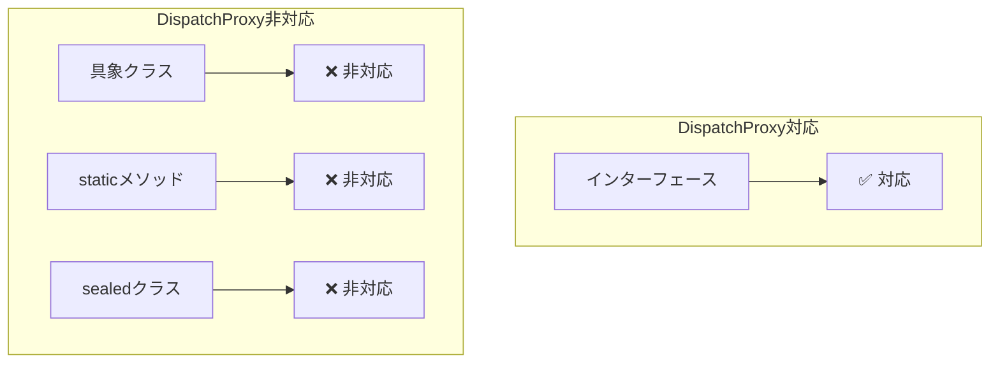
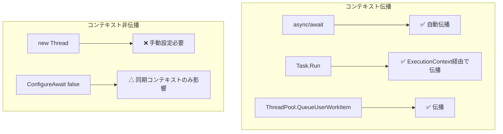
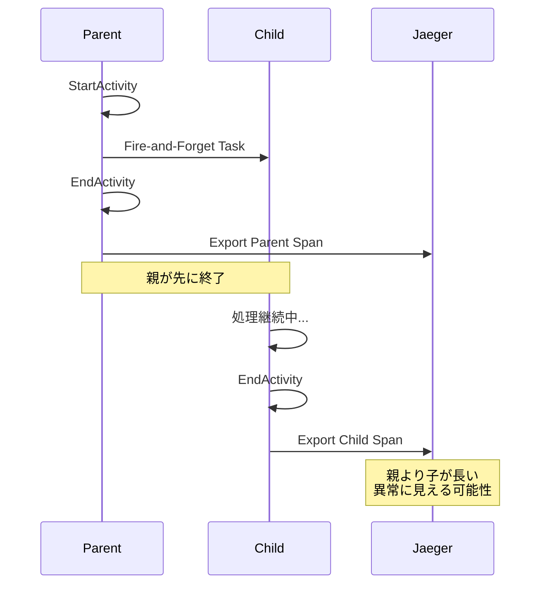
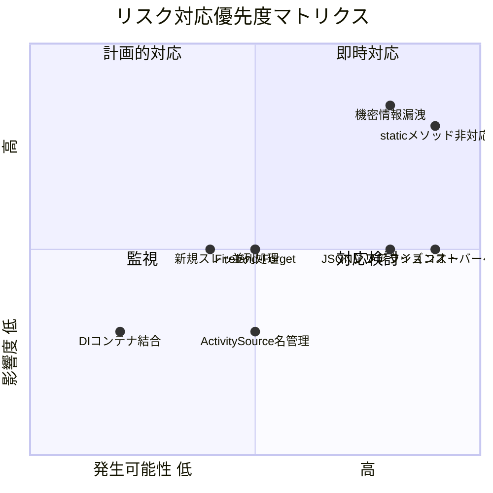

# リスク・制約分析

## 1. 概要

TracingSampleプロジェクトに基づくトレーシングライブラリの拡張において、特に複数スレッド・async/await環境での親子関係トレース実現に関するリスクと制約を分析した結果を記載します。

## 2. 要件の整理

### 2.1 Issue #1 の要件

| 要件 | 詳細 |
|------|------|
| 環境 | 複数スレッドでモジュールを起動、モジュール内でasync/awaitを使用 |
| 親設定 | 任意のメソッドで親を設定可能 |
| 子設定 | 新規タスクや並列実行タスクでも親子関係を設定可能 |
| DI対応 | DIを使っているメソッドに対応 |
| Static対応 | staticなメソッドにも対応 |
| 出力 | OpenTelemetryとJaegerでトレース |

### 2.2 現在の対応状況

| 要件 | 現状 | ギャップ |
|------|------|----------|
| async/await対応 | ✅ 対応済み | なし |
| DI経由サービス | ✅ 対応済み | なし |
| staticメソッド | ❌ 未対応 | DispatchProxy制約 |
| 任意の親設定 | △ 部分対応 | 明示的API必要 |
| Task.Run等の新規タスク | △ 部分対応 | コンテキスト伝播要考慮 |
| 並列タスク | △ 部分対応 | 親の明示的指定必要 |

## 3. 技術的制約

### 3.1 DispatchProxy の制約

**制約内容**:
- インターフェースベースのプロキシのみサポート
- クラスベース（具象クラス）のプロキシ不可
- staticメソッドのインターセプト不可



**影響度**: 高
**発生可能性**: 確実（設計上の制約）

**対策案**:
1. Castle.DynamicProxyへの切り替え（クラスベース対応）
2. Source Generatorによるコンパイル時コード生成
3. IL Weavingツール（Fody等）の使用
4. staticメソッド用の手動トレースヘルパー提供

### 3.2 AsyncLocal とスレッドコンテキスト

**制約内容**:
- `Activity.Current`は`AsyncLocal<Activity?>`で管理
- `Task.Run`で新しいスレッドプールスレッドに移行時、コンテキストは伝播
- `new Thread()`で明示的にスレッド作成時は伝播しない



**影響度**: 中
**発生可能性**: 中（使用パターンに依存）

**対策案**:
1. `ActivityContext`の明示的な受け渡しAPI
2. トレースコンテキスト伝播用ヘルパーメソッド
3. ドキュメント化と使用ガイドライン

### 3.3 Parallel.ForEach / PLINQ

**制約内容**:
- 並列実行では各ワーカーが独立したコンテキストを持つ
- デフォルトで親Activityは正しく伝播するが、同時実行制御が複雑

```csharp
// ⚠️ 注意が必要なパターン
var parentContext = Activity.Current?.Context ?? default;
Parallel.ForEach(items, item =>
{
    // 各並列タスクで明示的に親を指定
    using var activity = activitySource.StartActivity(
        "ProcessItem",
        ActivityKind.Internal,
        parentContext);  // 明示的に親を指定
    ProcessItem(item);
});
```

**影響度**: 中
**発生可能性**: 中

**対策案**:
1. `ParallelTraceHelper`の提供
2. 並列処理用の拡張メソッド作成
3. 使用例とベストプラクティスの文書化

### 3.4 Fire-and-Forget パターン

**制約内容**:
- `_ = SomeAsyncMethod();`パターンでは親Activityがすぐに終了する可能性
- 子のActivityが親より長く続く場合、親子関係の表示が不正確になる



**影響度**: 中
**発生可能性**: 中

**対策案**:
1. Fire-and-Forget用のパターンドキュメント
2. 子タスクの完了を待つオプションの提供
3. 独立したトレースとしてリンク機能を使用

## 4. パフォーマンスリスク

### 4.1 リフレクションオーバーヘッド

**リスク内容**:
- DispatchProxyはリフレクションを使用
- 1メソッド呼び出しあたり約0.1-0.5msのオーバーヘッド
- 高頻度呼び出しでパフォーマンス影響

**影響度**: 中
**発生可能性**: 確実

**対策案**:
1. 重要なメソッドのみ`[Trace]`付与
2. サンプリング設定の導入
3. ホットパスの事前最適化

### 4.2 JSONシリアライズコスト

**リスク内容**:
- パラメータ・戻り値のJSON化
- 大きなオブジェクトでメモリ・CPU消費

**影響度**: 中
**発生可能性**: 高

**対策案**:
1. `RecordParameters = false`でパラメータ記録無効化
2. シリアライズ対象の上限設定
3. カスタムシリアライザで軽量化

## 5. 設計上のリスク

### 5.1 ActivitySource名の管理

**リスク内容**:
- 複数のActivitySourceを使用する場合の名前衝突
- OpenTelemetry設定での登録漏れ

**影響度**: 低
**発生可能性**: 中

**対策案**:
1. ActivitySource名の命名規則策定
2. 自動登録機能の提供
3. 設定バリデーション

### 5.2 DIコンテナとの結合

**リスク内容**:
- Microsoft.Extensions.DependencyInjectionへの依存
- 他DIコンテナ（Autofac等）での使用困難

**影響度**: 低
**発生可能性**: 低

**対策案**:
1. DIコンテナ抽象化レイヤー
2. 手動プロキシ作成APIの提供

## 6. 運用リスク

### 6.1 機密情報の漏洩

**リスク内容**:
- パスワード、トークン等がトレースに記録
- Jaeger UIからの情報漏洩

**影響度**: 高
**発生可能性**: 高

**対策案**:
1. `RecordParameters = false`の使用
2. 機密フィールドの自動検出・マスク
3. セキュリティガイドラインの策定

### 6.2 トレースデータ量

**リスク内容**:
- 大量のトレースデータによるストレージ圧迫
- Jaegerのパフォーマンス低下

**影響度**: 中
**発生可能性**: 高

**対策案**:
1. サンプリング戦略の導入
2. 重要度に応じたトレースレベル
3. データ保持期間の設定

## 7. 対応優先度マトリクス



## 8. 推奨対応策

### 8.1 即時対応（高優先度）

1. **staticメソッド対応**
   - 手動トレースヘルパーの提供
   - ドキュメント化

2. **機密情報保護**
   - セキュリティガイドライン策定
   - 自動マスク機能の検討

### 8.2 計画的対応（中優先度）

1. **任意の親設定API**
   - `ActivityContext`受け渡し用ヘルパー
   - 使用例の文書化

2. **並列処理サポート**
   - `ParallelTraceHelper`の実装
   - ベストプラクティス文書化

### 8.3 将来検討（低優先度）

1. **Castle.DynamicProxyへの切り替え**
   - クラスベースプロキシサポート
   - 移行コスト評価

2. **Source Generator対応**
   - コンパイル時コード生成
   - パフォーマンス最適化

## 9. 呼び出しパターン一覧

### 9.1 対応済みパターン

| パターン | 例 | 親子関係 |
|----------|-----|---------|
| 同期メソッド呼び出し | `service.Method()` | ✅ 自動 |
| async/await | `await service.MethodAsync()` | ✅ 自動 |
| DI経由呼び出し | `_service.Method()` | ✅ 自動 |
| ネスト呼び出し | A→B→C | ✅ 自動 |
| Task.Run | `Task.Run(() => ...)` | ✅ ExecutionContext伝播 |

### 9.2 要対応パターン

| パターン | 例 | 必要な対応 |
|----------|-----|-----------|
| staticメソッド | `Utils.Helper()` | 手動トレース |
| new Thread | `new Thread(() => ...)` | 明示的コンテキスト伝播 |
| Fire-and-Forget | `_ = MethodAsync()` | ドキュメント/パターン提供 |
| Parallel.ForEach | `Parallel.ForEach(...)` | ヘルパーメソッド |
| 外部ライブラリ呼び出し | サードパーティAPI | ラッパー作成 |

## 10. 次のステップ

1. 要対応パターンの具体的な実装方針策定
2. テストケースの設計
3. 拡張APIの設計
4. ドキュメント・使用ガイドラインの作成
