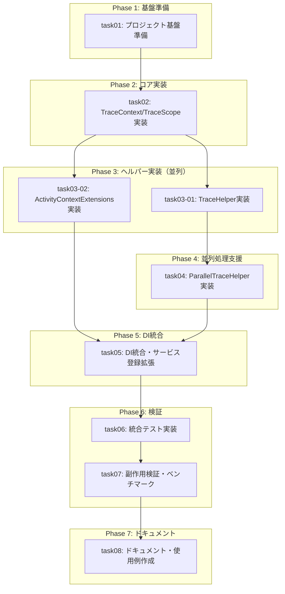

# 統合管理プロンプト: Issue #1 - トレース用ライブラリの作成

## 概要

このプロンプトは、タスク計画に基づいて子エージェントを管理し、並列実行を調整するための統合管理ガイドです。

| 項目 | 値 |
|------|-----|
| チケットID | Issue #1 |
| タスク名 | トレース用ライブラリの作成 |
| リポジトリ | opentelemtry (TracingSample) |
| 総タスク数 | 8 |
| 並列グループ数 | 3 |
| 推定総時間 | 18時間（並列効果後16.5時間） |

---

## 全タスク一覧

| タスク識別子 | タスク名 | 前提条件 | 並列可否 | 推定時間 | ステータス |
|--------------|----------|----------|----------|----------|------------|
| task01 | プロジェクト基盤準備 | なし | 不可 | 1h | ⬜ 未着手 |
| task02 | TraceContext/TraceScope実装 | task01 | 不可 | 2.5h | ⬜ 未着手 |
| task03-01 | TraceHelper実装 | task02 | 可 | 2.5h | ⬜ 未着手 |
| task03-02 | ActivityContextExtensions実装 | task02 | 可 | 1.5h | ⬜ 未着手 |
| task04 | ParallelTraceHelper実装 | task03-01 | 不可 | 2.5h | ⬜ 未着手 |
| task05 | DI統合・サービス登録拡張 | task03-02, task04 | 不可 | 2h | ⬜ 未着手 |
| task06 | 統合テスト実装 | task05 | 不可 | 3h | ⬜ 未着手 |
| task07 | 副作用検証・ベンチマーク | task06 | 不可 | 2h | ⬜ 未着手 |
| task08 | ドキュメント・使用例作成 | task07 | 不可 | 1h | ⬜ 未着手 |

---

## 依存関係グラフ



---

## 並列実行グループ詳細

### Group 1: 基盤準備（単独実行）

| タスク | 推定時間 | プロンプト |
|--------|----------|------------|
| task01 | 1h | [task01.md](task01.md) |

**開始条件**: なし（初期グループ）
**完了条件**: task01が完了

**作業内容**:
- Helpers/、Internal/ ディレクトリ作成
- TracingOptions クラス作成
- NoOpScope クラス作成

---

### Group 2: コア実装（単独実行）

| タスク | 推定時間 | プロンプト |
|--------|----------|------------|
| task02 | 2.5h | [task02.md](task02.md) |

**開始条件**: Group 1完了（task01完了）
**完了条件**: task02が完了

**作業内容**:
- TraceScope クラス実装
- TraceContext 静的クラス実装
- ContextRestorationScope 内部クラス実装

---

### Group 3: ヘルパー実装（並列実行）

| タスク | 推定時間 | プロンプト |
|--------|----------|------------|
| task03-01 | 2.5h | [task03-01.md](task03-01.md) |
| task03-02 | 1.5h | [task03-02.md](task03-02.md) |

**開始条件**: Group 2完了（task02完了）
**完了条件**: task03-01, task03-02 すべて完了

**並列実行の根拠**:
- 相互依存なし
- task03-01 は Helpers/TraceHelper.cs
- task03-02 は Extensions/ActivityContextExtensions.cs
- 異なるディレクトリで作業

**並列実行手順**:
1. task02完了後、同じベースコミットから両タスクを開始
2. 2つの子エージェントを同時に起動
3. 両方の完了を待機
4. 順番にcherry-pick（task03-01 → task03-02）

---

### Group 4: 並列処理支援（単独実行）

| タスク | 推定時間 | プロンプト |
|--------|----------|------------|
| task04 | 2.5h | [task04.md](task04.md) |

**開始条件**: task03-01完了（TraceHelperが必要）
**完了条件**: task04が完了

**注意**: task03-02の完了を待たなくてもよい（TraceHelperのみ依存）
ただし、管理簡略化のためGroup 3全体の完了を待っても可

**作業内容**:
- ParallelTraceOptions クラス作成
- ParallelTraceHelper 静的クラス実装

---

### Group 5: DI統合（単独実行）

| タスク | 推定時間 | プロンプト |
|--------|----------|------------|
| task05 | 2h | [task05.md](task05.md) |

**開始条件**: task03-02, task04完了（全ヘルパー完了）
**完了条件**: task05が完了

**作業内容**:
- TracingServiceCollectionExtensions 作成
- AddTracingHelpers メソッド実装
- 既存ServiceCollectionExtensionsとの統合

---

### Group 6: 検証（順次実行）

| タスク | 推定時間 | プロンプト |
|--------|----------|------------|
| task06 | 3h | [task06.md](task06.md) |
| task07 | 2h | [task07.md](task07.md) |

**開始条件**: Group 5完了
**完了条件**: task06, task07が順次完了

**作業内容**:
- task06: 15パターンの統合テスト実装
- task07: ベンチマーク、メモリテスト、後方互換性テスト

---

### Group 7: ドキュメント（単独実行）

| タスク | 推定時間 | プロンプト |
|--------|----------|------------|
| task08 | 1h | [task08.md](task08.md) |

**開始条件**: Group 6完了
**完了条件**: task08が完了

**作業内容**:
- README.md 更新
- TraceHelper-Guide.md 作成
- Patterns-Guide.md 作成

---

## 実行順序

```
1. [Phase 1] task01を実行
   ↓
2. [Checkpoint 1] task01の完了確認、基盤ファイル確認
   ↓
3. [Phase 2] task02を実行
   ↓
4. [Checkpoint 2] task02の完了確認、TraceContext/TraceScope確認
   ↓
5. [Phase 3] task03-01, task03-02を並列実行
   ↓
6. [Checkpoint 3] 並列タスク全完了確認、cherry-pick完了
   ↓
7. [Phase 4] task04を実行
   ↓
8. [Checkpoint 4] task04の完了確認、ParallelTraceHelper確認
   ↓
9. [Phase 5] task05を実行
   ↓
10. [Checkpoint 5] task05の完了確認、DI統合確認
    ↓
11. [Phase 6] task06 → task07を順次実行
    ↓
12. [Checkpoint 6] 全テストPASS確認、副作用検証PASS確認
    ↓
13. [Phase 7] task08を実行
    ↓
14. [Final] 全タスク完了確認、最終ビルド・テスト
```

---

## タスクプロンプト参照

各タスクの詳細プロンプト:

| タスク | プロンプトファイル | 概要 |
|--------|-------------------|------|
| task01 | [task01.md](task01.md) | TracingOptions, NoOpScope |
| task02 | [task02.md](task02.md) | TraceContext, TraceScope |
| task03-01 | [task03-01.md](task03-01.md) | TraceHelper |
| task03-02 | [task03-02.md](task03-02.md) | ActivityContextExtensions |
| task04 | [task04.md](task04.md) | ParallelTraceHelper |
| task05 | [task05.md](task05.md) | DI統合 |
| task06 | [task06.md](task06.md) | 統合テスト |
| task07 | [task07.md](task07.md) | 副作用検証 |
| task08 | [task08.md](task08.md) | ドキュメント |

---

## Worktree管理手順

### 実行開始時: メインworktreeの作成

```bash
REPO_ROOT="/workspaces/dev-process/submodules/opentelemtry/TracingSample"
REQUEST_NAME="opentelemetry-issue-1"

# リクエスト名ブランチを作成
cd $REPO_ROOT
git branch $REQUEST_NAME HEAD 2>/dev/null || echo "ブランチは既に存在"

# メインworktreeの作成
git worktree add /tmp/$REQUEST_NAME $REQUEST_NAME
echo "メインworktree作成: /tmp/$REQUEST_NAME"
```

### 各タスク実行前: サブworktreeの作成

```bash
REQUEST_NAME="opentelemetry-issue-1"
TASK_ID="task01"  # 実行するタスクIDに変更
REPO_ROOT="/workspaces/dev-process/submodules/opentelemtry/TracingSample"

# サブブランチ作成（メインworktreeのHEADから分岐）
cd /tmp/$REQUEST_NAME
git branch ${REQUEST_NAME}-${TASK_ID} HEAD

# サブworktreeの作成
cd $REPO_ROOT
git worktree add /tmp/${REQUEST_NAME}-${TASK_ID} ${REQUEST_NAME}-${TASK_ID}
```

### 並列タスク用: 一括作成（Phase 3用）

```bash
REQUEST_NAME="opentelemetry-issue-1"
REPO_ROOT="/workspaces/dev-process/submodules/opentelemtry/TracingSample"

# ベースコミットを固定
cd /tmp/$REQUEST_NAME
BASE_COMMIT=$(git rev-parse HEAD)

# 並列タスクごとにworktree作成
cd $REPO_ROOT
for TASK_ID in task03-01 task03-02; do
    git branch ${REQUEST_NAME}-${TASK_ID} $BASE_COMMIT
    git worktree add /tmp/${REQUEST_NAME}-${TASK_ID} ${REQUEST_NAME}-${TASK_ID}
done
```

---

## Cherry-pickフロー

### 単一タスク完了後

```bash
REQUEST_NAME="opentelemetry-issue-1"
TASK_ID="task01"  # 完了したタスクIDに変更
REPO_ROOT="/workspaces/dev-process/submodules/opentelemtry/TracingSample"

# 1. コミットハッシュ取得
cd /tmp/${REQUEST_NAME}-${TASK_ID}
COMMIT_HASH=$(git rev-parse HEAD)
echo "Cherry-pick対象: $COMMIT_HASH"

# 2. メインworktreeでcherry-pick
cd /tmp/$REQUEST_NAME
git cherry-pick $COMMIT_HASH

# 3. サブworktreeの削除
cd $REPO_ROOT
git worktree remove /tmp/${REQUEST_NAME}-${TASK_ID} --force
git branch -D ${REQUEST_NAME}-${TASK_ID}
```

### 並列タスク完了後（Phase 3用）

```bash
REQUEST_NAME="opentelemetry-issue-1"
REPO_ROOT="/workspaces/dev-process/submodules/opentelemtry/TracingSample"

# 順番にcherry-pick（順序重要: task03-01 → task03-02）
for TASK_ID in task03-01 task03-02; do
    cd /tmp/${REQUEST_NAME}-${TASK_ID}
    COMMIT_HASH=$(git rev-parse HEAD)
    
    cd /tmp/$REQUEST_NAME
    git cherry-pick $COMMIT_HASH
    
    echo "Cherry-picked: $TASK_ID ($COMMIT_HASH)"
done

# サブworktreeの一括削除
cd $REPO_ROOT
for TASK_ID in task03-01 task03-02; do
    git worktree remove /tmp/${REQUEST_NAME}-${TASK_ID} --force
    git branch -D ${REQUEST_NAME}-${TASK_ID}
done
```

---

## ブロッカー管理

### ブロッカー発生時の対応

| 状況 | 対応 |
|------|------|
| タスク失敗 | 原因を分析、worktree削除、再実行またはスキップ判断 |
| 依存タスク未完了 | 待機、完了後に再開 |
| cherry-pickコンフリクト | 手動解消、解消できない場合はタスクやり直し |
| テスト失敗 | 修正依頼、完了後に再テスト |
| ビルドエラー | 原因分析、修正依頼 |

### コンフリクト解消手順

```bash
cd /tmp/$REQUEST_NAME

# コンフリクト発生時
git status  # コンフリクトファイル確認
# 手動で解消
git add <resolved-files>
git cherry-pick --continue

# 解消できない場合
git cherry-pick --abort
# タスクのやり直しを検討
```

---

## 結果統合方法

### 各タスク完了時の確認チェックリスト

- [ ] result.md が作成されている
- [ ] テストが全て通過している
- [ ] ビルドエラーがない
- [ ] コミットメッセージが適切
- [ ] コミットハッシュを記録

### 並列グループ完了後の統合確認

- [ ] 全タスクのcherry-pick完了
- [ ] コンフリクトなし（または解消済み）
- [ ] 統合後のビルド成功
- [ ] 統合後のテスト成功

### 最終統合（全タスク完了後）

- [ ] 全タスク完了
- [ ] 最終ビルド成功
- [ ] 全テスト成功（既存 + 新規）
- [ ] 副作用検証PASS
- [ ] ドキュメント完成
- [ ] 完了レポート作成

---

## 実行履歴

### タスク実行記録

| タスク | 開始時刻 | 完了時刻 | コミット | ステータス |
|--------|----------|----------|----------|------------|
| task01 | - | - | - | ⬜ 未着手 |
| task02 | - | - | - | ⬜ 未着手 |
| task03-01 | - | - | - | ⬜ 未着手 |
| task03-02 | - | - | - | ⬜ 未着手 |
| task04 | - | - | - | ⬜ 未着手 |
| task05 | - | - | - | ⬜ 未着手 |
| task06 | - | - | - | ⬜ 未着手 |
| task07 | - | - | - | ⬜ 未着手 |
| task08 | - | - | - | ⬜ 未着手 |

### 進捗サマリー

- 完了: 0/8
- 進行中: 0
- 待機: 8

---

## チェックポイント

| ID | タイミング | チェック内容 | 結果 |
|----|------------|--------------|------|
| CP1 | Phase 1完了後 | task01完了、基盤ファイル存在確認 | ⬜ |
| CP2 | Phase 2完了後 | task02完了、TraceContext/TraceScope動作確認 | ⬜ |
| CP3 | Phase 3完了後 | 並列タスク全完了、cherry-pick完了、コンフリクトなし | ⬜ |
| CP4 | Phase 4完了後 | task04完了、ParallelTraceHelper動作確認 | ⬜ |
| CP5 | Phase 5完了後 | task05完了、DI統合動作確認 | ⬜ |
| CP6 | Phase 6完了後 | 全テストPASS、副作用検証PASS | ⬜ |
| CP7 | Phase 7完了後 | ドキュメント完成、最終確認 | ⬜ |

---

## 完了条件

### 全体完了条件

- [ ] 全8タスクが完了
- [ ] 全cherry-pickが完了
- [ ] 最終ビルド成功
- [ ] 全テスト通過（既存 + 新規統合テスト）
- [ ] 副作用検証PASS
- [ ] ドキュメント完成
- [ ] 完了レポート作成

### 受け入れ基準の達成確認

| 受け入れ基準 | 達成状況 |
|-------------|---------|
| スレッドやasyncなどの呼び出しパターンを網羅した要件が洗い出されていること | ⬜ (task06で確認) |
| 各パターンに対するテストパターンが定義されていること | ⬜ (task06で確認) |
| テストパターンに対する実装方針が検討されていること | ⬜ (全タスクで確認) |

---

## 完了レポートテンプレート

```markdown
# Issue #1 完了レポート

## 実施期間
- 開始: YYYY-MM-DD HH:MM
- 完了: YYYY-MM-DD HH:MM
- 実作業時間: XX時間

## 実装サマリー

### 新規追加ファイル
- `src/TracingSample.Tracing/Helpers/TracingOptions.cs`
- `src/TracingSample.Tracing/Helpers/TraceScope.cs`
- `src/TracingSample.Tracing/Helpers/TraceContext.cs`
- `src/TracingSample.Tracing/Helpers/TraceHelper.cs`
- `src/TracingSample.Tracing/Helpers/ParallelTraceHelper.cs`
- `src/TracingSample.Tracing/Extensions/ActivityContextExtensions.cs`
- `src/TracingSample.Tracing/Extensions/TracingServiceCollectionExtensions.cs`
- `src/TracingSample.Tracing/Internal/NoOpScope.cs`
- `src/TracingSample.Tracing/Internal/ContextRestorationScope.cs`

### テスト結果
- 新規テスト: XX件
- 全テスト通過: ✅

### 副作用検証結果
- パフォーマンス: PASS
- メモリ: PASS
- 後方互換性: PASS

## 受け入れ基準達成状況

| 基準 | 達成 |
|------|------|
| 呼び出しパターン網羅 | ✅ 15パターン対応 |
| テストパターン定義 | ✅ 統合テスト実装 |
| 実装方針検討 | ✅ 設計通り実装 |

## 次のステップ

1. PR作成・レビュー依頼
2. Phase 2（サンプリング、機密情報マスク）の計画
```

---

## 注意事項

- 各タスクプロンプト（task0X.md）の内容を正確に子エージェントに伝える
- 並列タスクは**同じベースコミット**から分岐させる
- cherry-pickの**順序**を守る（task03-01 → task03-02）
- コンフリクト発生時は慎重に対応
- 全タスク完了後もメインworktreeは残す（ユーザー確認用）
- 各フェーズ完了時にチェックポイント確認を行う
