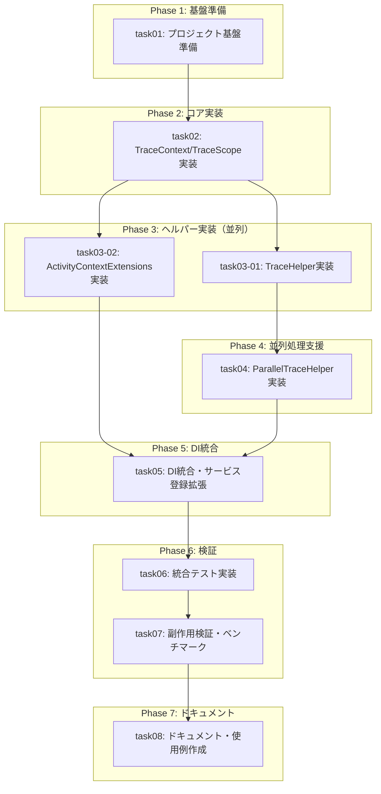

# タスク一覧

## 概要

| 項目 | 値 |
|------|-----|
| チケットID | Issue #1 |
| タスク名 | トレース用ライブラリの作成 |
| リポジトリ | opentelemtry |
| 総タスク数 | 8 |
| 並列グループ数 | 3 |
| 推定総時間 | 18時間 |
| クリティカルパス | task01 → task02 → task03-01 → task05 → task07 → task08 |

---

## タスク分割

| タスク識別子 | タスク名 | 前提条件 | 並列可否 | 推定時間 | ステータス |
|--------------|----------|----------|----------|----------|------------|
| task01 | プロジェクト基盤準備 | なし | 不可 | 1h | ⬜ 未着手 |
| task02 | TraceContext/TraceScope実装 | task01 | 不可 | 2.5h | ⬜ 未着手 |
| task03-01 | TraceHelper実装 | task02 | 可 | 2.5h | ⬜ 未着手 |
| task03-02 | ActivityContextExtensions実装 | task02 | 可 | 1.5h | ⬜ 未着手 |
| task04 | ParallelTraceHelper実装 | task03-01 | 不可 | 2.5h | ⬜ 未着手 |
| task05 | DI統合・サービス登録拡張 | task04 | 不可 | 2h | ⬜ 未着手 |
| task06 | 統合テスト実装 | task05 | 不可 | 3h | ⬜ 未着手 |
| task07 | 副作用検証・ベンチマーク | task06 | 不可 | 2h | ⬜ 未着手 |
| task08 | ドキュメント・使用例作成 | task07 | 不可 | 1h | ⬜ 未着手 |

---

## 依存関係グラフ

---

## 並列実行グループ

### Group 1: 基盤準備（単独実行）

| タスク | 推定時間 | プロンプト |
|--------|----------|------------|
| task01 | 1h | [task01.md](task01.md) |

**開始条件**: なし（初期グループ）
**完了条件**: task01が完了

---

### Group 2: コア実装（単独実行）

| タスク | 推定時間 | プロンプト |
|--------|----------|------------|
| task02 | 2.5h | [task02.md](task02.md) |

**開始条件**: Group 1完了（task01完了）
**完了条件**: task02が完了

---

### Group 3: ヘルパー実装（並列実行）

| タスク | 推定時間 | プロンプト |
|--------|----------|------------|
| task03-01 | 2.5h | [task03-01.md](task03-01.md) |
| task03-02 | 1.5h | [task03-02.md](task03-02.md) |

**開始条件**: Group 2完了（task02完了）
**完了条件**: task03-01, task03-02 すべて完了

**並列実行の根拠**:
- 相互依存なし
- TraceHelperはHelpersディレクトリ、ActivityContextExtensionsはExtensionsディレクトリ
- 両方ともTraceContext/TraceScopeを使用するが読み取りのみ

---

### Group 4: 並列処理支援（単独実行）

| タスク | 推定時間 | プロンプト |
|--------|----------|------------|
| task04 | 2.5h | [task04.md](task04.md) |

**開始条件**: task03-01完了（TraceHelperが必要）
**完了条件**: task04が完了

---

### Group 5: DI統合（単独実行）

| タスク | 推定時間 | プロンプト |
|--------|----------|------------|
| task05 | 2h | [task05.md](task05.md) |

**開始条件**: Group 3, Group 4完了（全ヘルパー完了）
**完了条件**: task05が完了

---

### Group 6: 検証（順次実行）

| タスク | 推定時間 | プロンプト |
|--------|----------|------------|
| task06 | 3h | [task06.md](task06.md) |
| task07 | 2h | [task07.md](task07.md) |

**開始条件**: Group 5完了
**完了条件**: task06, task07が順次完了

---

### Group 7: ドキュメント（単独実行）

| タスク | 推定時間 | プロンプト |
|--------|----------|------------|
| task08 | 1h | [task08.md](task08.md) |

**開始条件**: Group 6完了
**完了条件**: task08が完了

---

## 見積もりサマリー

| フェーズ | タスク | 見積もり | 並列効果後 |
|----------|--------|----------|------------|
| Phase 1 | task01 | 1h | 1h |
| Phase 2 | task02 | 2.5h | 2.5h |
| Phase 3 | task03-01, task03-02 | 4h | 2.5h（並列） |
| Phase 4 | task04 | 2.5h | 2.5h |
| Phase 5 | task05 | 2h | 2h |
| Phase 6 | task06, task07 | 5h | 5h |
| Phase 7 | task08 | 1h | 1h |
| **合計** | | **18h** | **16.5h** |

---

## 受け入れ基準への対応

setup.yaml の acceptance_criteria との対応:

| 受け入れ基準 | 対応タスク |
|-------------|-----------|
| スレッドやasyncなどの呼び出しパターンを網羅した要件が洗い出されていること | task06（統合テストで15パターンをカバー） |
| 各パターンに対するテストパターンが定義されていること | task06（テスト計画に基づくテスト実装） |
| テストパターンに対する実装方針が検討されていること | task02-05（設計に基づく実装） |

---

## 次のステップ

1. 各タスクプロンプト（task01.md ～ task08.md）の作成
2. 親エージェント統合管理プロンプト（parent-agent-prompt.md）の作成
3. 計画レビュー
4. 実装開始
