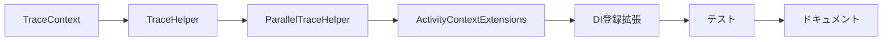

# 実装可能性レビュー

## 1. 概要

設計が十分に詳細で実装可能か、不明確な点がないか、工数見積もりの妥当性を評価します。

## 2. 設計詳細度の評価

### 2.1 各設計ドキュメントの詳細度

| ドキュメント | API定義 | データ構造 | 処理フロー | サンプルコード | 評価 |
|-------------|---------|-----------|-----------|---------------|------|
| 01_implementation-approach.md | ✅ | ✅ | ✅ | ✅ | ✅ 十分 |
| 02_interface-api-design.md | ✅ | - | - | ✅ | ✅ 十分 |
| 03_data-structure-design.md | - | ✅ | ✅ | ✅ | ✅ 十分 |
| 04_processing-flow-design.md | - | - | ✅ | ✅ | ✅ 十分 |
| 05_test-plan.md | - | - | ✅ | ✅ | ✅ 十分 |
| 06_side-effect-verification.md | - | - | ✅ | ✅ | ✅ 十分 |

### 2.2 新規コンポーネントの詳細度

#### TraceHelper

| 項目 | 定義済み | 内容 |
|------|----------|------|
| メソッド署名 | ✅ | StartTrace, WrapAsync, Wrap, SetTag, AddEvent, RecordException |
| パラメータ型 | ✅ | 全パラメータに型定義あり |
| 戻り値型 | ✅ | IDisposable, Task<T>, void等 |
| XMLドキュメント | ✅ | 全メソッドにドキュメント |
| 使用例 | ✅ | コードサンプル提供 |
| エラー処理 | ✅ | graceful degradation定義 |

**評価**: ✅ 実装に十分な詳細度

#### TraceContext

| 項目 | 定義済み | 内容 |
|------|----------|------|
| メソッド署名 | ✅ | Current, Capture, Restore, Run, RunAsync, RunWithContext |
| パラメータ型 | ✅ | ActivityContext, Action, Func<Task> |
| 戻り値型 | ✅ | ActivityContext, IDisposable, Task |
| XMLドキュメント | ✅ | 全メソッドにドキュメント |
| 使用例 | ✅ | 複数シナリオのサンプル |
| スレッド安全性 | ✅ | AsyncLocal使用明記 |

**評価**: ✅ 実装に十分な詳細度

#### ParallelTraceHelper

| 項目 | 定義済み | 内容 |
|------|----------|------|
| メソッド署名 | ✅ | ForEach, ForEachAsync, WhenAll, WhenAllWithTrace |
| パラメータ型 | ✅ | IEnumerable<T>, Func, ParallelOptions |
| 戻り値型 | ✅ | void, Task, Task<T[]> |
| XMLドキュメント | ✅ | 全メソッドにドキュメント |
| 使用例 | ✅ | Before/Afterパターン提供 |
| 並列制御 | ✅ | maxDegreeOfParallelism対応 |

**評価**: ✅ 実装に十分な詳細度

#### データ構造

| 構造 | 定義済み | フィールド | メソッド | 備考 |
|------|----------|-----------|---------|------|
| TraceScope | ✅ | Activity, PreviousContext, StartTime, IsDisposed, Options | SetTag, AddEvent, RecordException, Dispose | IDisposable実装 |
| TracingOptions | ✅ | RecordParameters, RecordReturnValue, SensitiveParameters等 | Default静的プロパティ | デフォルト値明記 |
| ContextRestorationScope | ✅ | _previousActivity, _restoredActivity, _isDisposed | Dispose | 内部クラス |
| MethodTraceInfo | ✅ | TraceName, ClassName, MethodName, Parameters等 | - | readonly struct |
| MethodTraceInfoCache | ✅ | _cache | GetOrCreate | ConcurrentDictionary使用 |

**評価**: ✅ 実装に十分な詳細度

## 3. 不明確・曖昧な点の確認

### 3.1 チェック結果

| 項目 | 状態 | 備考 |
|------|------|------|
| NoOpScope実装 | ⚠️ 未定義 | ActivitySource未設定時の戻り値。定義追加推奨 |
| DefaultActivitySource初期化 | ✅ 明確 | AddTracingHelpers拡張メソッドで設定 |
| スレッドセーフティ保証方法 | ✅ 明確 | ConcurrentDictionary, AsyncLocal使用 |
| 例外発生時のActivity状態 | ✅ 明確 | finally節でDispose保証 |
| サンプリング実装詳細 | ⚠️ Phase 2 | Phase 1では実装不要 |

### 3.2 指摘事項

| No | 重大度 | 指摘内容 | 推奨対応 |
|----|--------|----------|----------|
| 1 | 🟡 Minor | NoOpScopeクラスの詳細定義がない | 簡単な空実装（Dispose時に何もしない）を追加 |

## 4. 工数見積もり評価

### 4.1 Phase 1 見積もり

| コンポーネント | 見積もり | 妥当性 | 根拠 |
|---------------|----------|--------|------|
| TraceHelper | 2-3日 | ✅ 妥当 | 4メソッド群、シンプルな実装 |
| TraceContext | 2-3日 | ✅ 妥当 | 6メソッド、AsyncLocal操作 |
| ParallelTraceHelper | 2-3日 | ✅ 妥当 | 4メソッド群、並列制御 |
| TraceScope/データ構造 | 1-2日 | ✅ 妥当 | データクラス定義 |
| 単体テスト | 3-4日 | ✅ 妥当 | テストケース数に対応 |
| 統合テスト | 2-3日 | ✅ 妥当 | DI/OpenTelemetry統合 |
| ドキュメント | 1日 | ✅ 妥当 | 使用例、ガイドライン |

**Phase 1 合計**: 1-2週間 → ✅ **妥当な見積もり**

### 4.2 Phase 2 見積もり

| コンポーネント | 見積もり | 妥当性 |
|---------------|----------|--------|
| サンプリング機能 | 1-2日 | ✅ 妥当 |
| 機密情報マスク | 2-3日 | ✅ 妥当 |
| メトリクス統合 | 3-4日 | ✅ 妥当 |
| Source Generator（検討） | 2-4週間 | ⚠️ 不確実性あり |

**Phase 2 合計**: 2-4週間（Source Generator除く）→ ✅ **妥当な見積もり**

## 5. 技術的制約との整合性

### 5.1 調査で特定された制約への対応

| 制約 | 設計対応 | 実装可能性 |
|------|----------|-----------|
| DispatchProxy: staticメソッド非対応 | TraceHelperで手動対応 | ✅ 実装可能 |
| DispatchProxy: クラスベースプロキシ不可 | 既存インターフェース使用継続 | ✅ 実装可能 |
| new Thread: コンテキスト非伝播 | TraceContext.Restore | ✅ 実装可能 |
| Fire-and-Forget: 親終了問題 | StartLinkedTrace | ✅ 実装可能 |

### 5.2 依存関係の実現可能性

| 依存 | バージョン | 入手可能性 | 備考 |
|------|-----------|-----------|------|
| .NET 8 | 8.0 | ✅ LTS | サポート期間内 |
| OpenTelemetry | 1.14.0 | ✅ 安定版 | NuGetで入手可能 |
| Microsoft.Extensions.DI | 10.0.1 | ✅ 安定版 | NuGetで入手可能 |
| System.Text.Json | 10.0.1 | ✅ 標準 | 追加依存なし |

## 6. 実装リスク

### 6.1 技術リスク

| リスク | 影響度 | 発生可能性 | 緩和策 |
|--------|--------|-----------|--------|
| AsyncLocal誤用による親子関係破綻 | 高 | 中 | テストケース充実、ドキュメント化 |
| 非同期処理でのActivity終了タイミング | 中 | 中 | ContinueWithパターン使用 |
| パフォーマンス劣化 | 中 | 低 | ベンチマーク実施 |

### 6.2 リスク対応計画

設計ドキュメント（01_implementation-approach.md）でリスク対策が定義されており、適切です。

## 7. 実装手順の明確性

### 7.1 実装順序

設計ドキュメントで以下の実装順序が明確に定義されています：

**評価**: ✅ 実装順序が明確

### 7.2 テスト可能な成果物

各コンポーネントが独立してテスト可能な設計になっています。

## 8. レビュー結果

### 8.1 指摘事項

| No | 重大度 | カテゴリ | 指摘内容 | 対応方針 |
|----|--------|----------|----------|----------|
| 1 | 🟡 Minor | 設計詳細 | NoOpScopeクラスの詳細定義がない | 実装フェーズで追加（簡単な空実装） |

### 8.2 総合評価

| 評価項目 | 結果 |
|----------|------|
| API設計詳細度 | ✅ 十分 |
| データ構造詳細度 | ✅ 十分 |
| 処理フロー詳細度 | ✅ 十分 |
| サンプルコード | ✅ 豊富 |
| 工数見積もり | ✅ 妥当 |
| 技術的制約対応 | ✅ 対応済み |
| 依存関係 | ✅ 実現可能 |
| 実装順序 | ✅ 明確 |

**判定**: ✅ **実装可能な設計です**

設計は十分に詳細であり、実装に必要な情報が網羅されています。Minor指摘1件は実装フェーズで容易に対応可能です。
