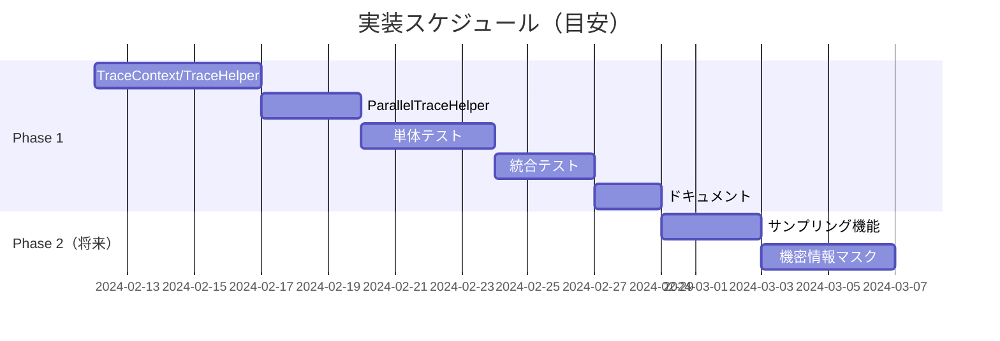

# レビューサマリー

## 1. レビュー概要

| 項目 | 内容 |
|------|------|
| チケット | Issue #1 |
| タスク | トレース用ライブラリの作成 |
| リポジトリ | opentelemtry |
| レビュー日 | 2024-02-08 |
| 設計ドキュメント | docs/opentelemtry/dev-design/ |

## 2. 総合判定

# ✅ 承認

設計は全ての要件を満たしており、技術的に妥当で、実装可能です。
Minor指摘事項は実装フェーズで対応可能であり、差し戻しの必要はありません。

## 3. 指摘事項一覧

### 3.1 重大度別サマリー

| 重大度 | 件数 | 説明 |
|--------|------|------|
| 🔴 Critical | 0件 | 設計の根本的見直しが必要 |
| 🟠 Major | 0件 | 重要な修正が必要 |
| 🟡 Minor | 2件 | 改善が望ましい |
| 🔵 Info | 3件 | 情報・提案 |

### 3.2 指摘事項詳細

| No | 重大度 | カテゴリ | 指摘内容 | 対応方針 | 対応時期 |
|----|--------|----------|----------|----------|----------|
| 1 | 🟡 Minor | セキュリティ | Phase 1での自動マスク機能がない | セキュリティガイドライン作成、RecordParameters=false推奨 | 実装後 |
| 2 | 🟡 Minor | 設計詳細 | NoOpScopeクラスの詳細定義がない | 実装時に簡単な空実装を追加 | 実装時 |
| 3 | 🔵 Info | テスト | static DefaultActivitySourceのテスト間干渉可能性 | テストヘルパーでリセット処理追加 | テスト実装時 |
| 4 | 🔵 Info | 機能 | ValueTaskサポートが含まれていない | 必要時Phase 2で対応 | Phase 2 |
| 5 | 🔵 Info | 依存関係 | ParallelTraceHelper → TraceContext密結合 | 将来的なインターフェース抽象化検討 | 将来 |

## 4. レビュー結果サマリー

### 4.1 要件カバレッジ

| カテゴリ | カバレッジ | 評価 |
|---------|-----------|------|
| 機能要件 | 13/13 (100%) | ✅ 完全 |
| 非機能要件 | 1/1 (100%) | ✅ 完全 |
| 受け入れ条件 | 3/3 (100%) | ✅ 完全 |

### 4.2 技術的妥当性

| 評価項目 | 結果 |
|----------|------|
| アーキテクチャ選定 | ✅ 適切（ハイブリッド方式） |
| 技術選定 | ✅ 適切（DispatchProxy維持、新規API追加） |
| OpenTelemetry API使用 | ✅ 正確 |
| 既存パターン整合性 | ✅ 整合 |
| 拡張性 | ✅ 良好 |
| 後方互換性 | ✅ 維持 |

### 4.3 実装可能性

| 評価項目 | 結果 |
|----------|------|
| API設計詳細度 | ✅ 十分 |
| データ構造詳細度 | ✅ 十分 |
| 処理フロー詳細度 | ✅ 十分 |
| 工数見積もり | ✅ 妥当（Phase 1: 1-2週間） |
| 技術的制約対応 | ✅ 対応済み |

### 4.4 テスト可能性

| 評価項目 | 結果 |
|----------|------|
| コンポーネントテスト可能性 | ✅ 良好 |
| 呼び出しパターンカバレッジ | ✅ 100% (15/15パターン) |
| テスト計画網羅性 | ✅ 十分 |
| カバレッジ目標 | ✅ 達成可能（80%+） |

### 4.5 リスク管理

| 評価項目 | 結果 |
|----------|------|
| 調査リスク対応 | ✅ 対応済みまたはPhase 2計画 |
| パフォーマンスリスク | ✅ 対応済み |
| セキュリティリスク | ⚠️ ガイドライン対応必要 |
| 互換性リスク | ✅ リスクなし |

## 5. 設計の強み

1. **段階的アプローチ**: Phase 1/2に分離し、リスクを分散しながら段階的に機能拡張
2. **既存互換性**: 既存TracingProxyを完全維持し、後方互換性を確保
3. **網羅的なパターン対応**: 15種類の呼び出しパターンを全てカバー
4. **詳細なテスト計画**: 単体/統合/E2E/ベンチマークの計画が整備
5. **リスク対応**: 調査で特定されたリスクに対する具体的な対策

## 6. 次のステップ

### 6.1 承認後の作業

1. **dev-planスキルでタスク計画を作成**
   - 実装タスクの詳細化
   - タスク間の依存関係整理
   - スケジュール策定

2. **Minor指摘事項の対応**
   - セキュリティガイドライン作成
   - NoOpScope実装の追加

3. **Phase 1実装開始**
   - TraceContext
   - TraceHelper
   - ParallelTraceHelper
   - ActivityContextExtensions
   - 単体テスト
   - 統合テスト
   - ドキュメント

### 6.2 タイムライン目安

## 7. 承認署名

| 役割 | 判定 | 日付 |
|------|------|------|
| 設計レビュアー | ✅ 承認 | 2024-02-08 |

---

## 付録: レビューチェックリスト

### A. 要件カバレッジ
- [x] 全機能要件がカバーされている
- [x] 全非機能要件がカバーされている
- [x] 受け入れ条件が満たされている
- [x] スコープ外機能が含まれていない

### B. 技術的妥当性
- [x] アーキテクチャパターンが適切
- [x] 技術選定が適切
- [x] 既存パターンと整合
- [x] セキュリティが考慮されている
- [x] パフォーマンスが考慮されている

### C. 実装可能性
- [x] API設計が十分に詳細
- [x] データ構造が十分に詳細
- [x] 処理フローが十分に詳細
- [x] 工数見積もりが妥当
- [x] 技術的制約が考慮されている

### D. テスト可能性
- [x] コンポーネントが独立してテスト可能
- [x] テスト計画が網羅的
- [x] テストデータ設計が適切
- [x] CI/CD統合が計画されている

### E. リスク管理
- [x] リスクが特定されている
- [x] リスク対策が定義されている
- [x] 残存リスクが許容範囲内
