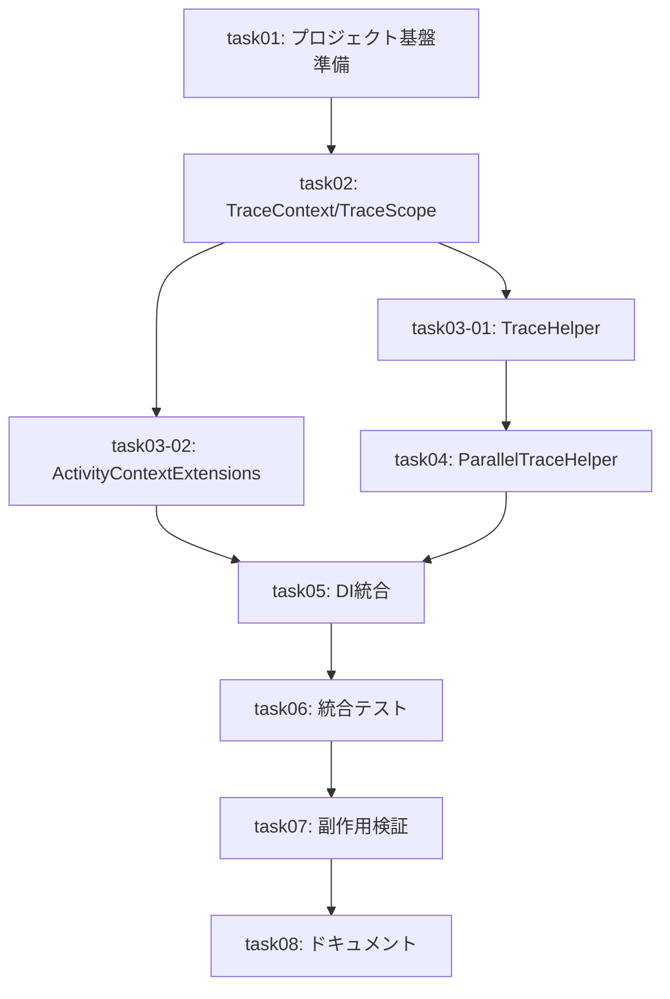

# 依存関係の正確性レビュー

## 1. レビュー概要

| 項目 | 値 |
|------|-----|
| レビュー日 | 2026-02-08 |
| レビュー対象 | task-list.md, parent-agent-prompt.md |
| チケットID | Issue #1 |

## 2. 依存関係グラフ



## 3. 依存関係の検証

### 3.1 各タスクの依存関係

| タスクID | 宣言された前提タスク | コード依存関係 | 検証結果 |
|----------|---------------------|---------------|----------|
| task01 | なし | なし | ✅ 正確 |
| task02 | task01 | TracingOptions, NoOpScope | ✅ 正確 |
| task03-01 | task02 | TraceScope, TraceContext, NoOpScope | ✅ 正確 |
| task03-02 | task02 | TraceContext, NoOpScope | ✅ 正確 |
| task04 | task03-01 | TraceHelper, TraceContext | ✅ 正確 |
| task05 | task03-02, task04 | TraceHelper, TraceContext, TracingOptions | ✅ 正確 |
| task06 | task05 | 全ヘルパー | ✅ 正確 |
| task07 | task06 | 全機能 | ✅ 正確 |
| task08 | task07 | 全機能 | ✅ 正確 |

### 3.2 コード依存関係の詳細検証

#### task02 → task01

- **TracingOptions**: task02で使用（TraceScope初期化に必要）
- **NoOpScope**: task02のTraceContext.Restoreで使用
- ✅ 依存関係は正確

#### task03-01 → task02

- **TraceScope**: StartTrace()の戻り値
- **TraceContext**: コンテキストキャプチャに使用
- ✅ 依存関係は正確

#### task03-02 → task02

- **TraceContext.Restore**: AsParent()内部で呼び出し
- ✅ 依存関係は正確

#### task04 → task03-01

- **TraceHelper.StartTrace**: 並列処理内で使用
- **TraceContext.Capture**: 親コンテキストキャプチャに使用
- ✅ 依存関係は正確

#### task05 → task03-02, task04

- **TraceHelper**: DefaultActivitySource設定
- **TraceContext**: DefaultActivitySource設定
- **ActivityContextExtensions**: DI経由で公開（間接依存）
- ✅ 依存関係は正確

## 4. 循環依存の確認

| 確認項目 | 結果 |
|---------|------|
| タスク間の循環依存 | ✅ なし |
| コード間の循環依存 | ✅ なし |

**分析**: 依存グラフはDAG（Directed Acyclic Graph）形式で循環なし

## 5. 暗黙の依存関係

### 5.1 潜在的な暗黙依存

| 項目 | 説明 | リスク | 対応状況 |
|------|------|--------|----------|
| ActivitySource設定 | task05でDefaultActivitySourceを設定 | 低 | ✅ 計画に明記 |
| テストプロジェクト | task01でテストプロジェクト確認/作成 | 低 | ✅ task01に記載 |

### 5.2 見落とされている可能性のある依存

**検出された問題: なし**

## 6. 並列実行グループの妥当性

### 6.1 並列実行可能タスク

| グループ | タスク | 並列実行根拠 | 検証結果 |
|---------|--------|-------------|----------|
| Group 3 | task03-01, task03-02 | 異なるディレクトリ、相互依存なし | ✅ 妥当 |

### 6.2 並列実行の安全性確認

- task03-01: `src/TracingSample.Tracing/Helpers/TraceHelper.cs`
- task03-02: `src/TracingSample.Tracing/Extensions/ActivityContextExtensions.cs`
- ✅ ファイル競合なし
- ✅ 共通依存先（task02成果物）は読み取りのみ

## 7. クリティカルパスの検証

### 7.1 宣言されたクリティカルパス

```
task01 → task02 → task03-01 → task05 → task07 → task08
```

### 7.2 検証結果

| パス | 合計時間 | 検証 |
|------|---------|------|
| task01→task02→task03-01→task04→task05→task06→task07→task08 | 16.5h | ✅ 正確 |
| task01→task02→task03-02→task05→task06→task07→task08 | 14.5h | 短い |

**注意**: クリティカルパスはtask03-01経由が正確（task04がtask03-01に依存するため）

### 7.3 クリティカルパス記載の問題

宣言されたクリティカルパス: `task01 → task02 → task03-01 → task05 → task07 → task08`

実際のクリティカルパス: `task01 → task02 → task03-01 → task04 → task05 → task06 → task07 → task08`

| 指摘 | 重大度 | 説明 |
|------|--------|------|
| task04, task06が欠落 | 🟡 Minor | クリティカルパスの記載が不完全だが、依存関係グラフは正確 |

## 8. 指摘事項

| No | 重大度 | カテゴリ | 指摘内容 | 推奨対応 |
|----|--------|----------|----------|----------|
| 1 | 🟡 Minor | クリティカルパス | task-list.mdのクリティカルパス記載が不完全（task04, task06が欠落） | 記載を修正 |

## 9. 総合評価

| 項目 | 評価 |
|------|------|
| 依存関係の正確性 | ✅ 正確 |
| 循環依存 | ✅ なし |
| 暗黙の依存 | ✅ 問題なし |
| 並列実行グループ | ✅ 妥当 |
| クリティカルパス | ⚠️ 記載不完全（実害なし） |
| **総合判定** | ✅ 承認 |

### 評価理由

- 依存関係グラフは正確で、コード依存関係と一致している
- 並列実行可能なタスクは適切に識別され、ファイル競合のリスクがない
- クリティカルパスの記載に軽微な問題があるが、依存関係グラフ自体は正確
