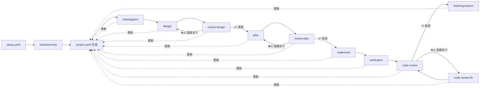

# project.yaml — プロジェクトコンテキストファイル

全プロセスの **SSOT（Single Source of Truth）** として機能するYAMLファイルです。

---

## 概要

- **生成**: `brainstorming` スキルが `setup.yaml` を基に初期生成
- **更新**: 各プロセスが完了時に自セクションを追記
- **参照**: 以降の全プロセスがこのファイルを入力として使用

---

## 設計方針

| 方針                   | 説明                                                                   |
| ---------------------- | ---------------------------------------------------------------------- |
| **YAMLはインデックス** | 各プロセスの状態・要約・成果物パスを記録。詳細は外部ドキュメントに委譲 |
| **肥大化防止**         | 各セクションの `summary` は3行以内。詳細は `artifacts` パスで参照      |
| **累積更新**           | 各プロセスは自セクションのみ追記/更新。他セクションは読み取り専用      |
| **setup.yaml互換**     | `meta` + `setup` セクションに setup.yaml の内容をそのまま保持          |

---

## セクション構成

| プロセス           | project.yaml セクション          | 記録内容                                                         |
| ------------------ | -------------------------------- | ---------------------------------------------------------------- |
| brainstorming      | `meta`, `setup`, `brainstorming` | 要件探索結果、決定事項、テスト戦略                               |
| submodule-overview | `overview`                       | サブモジュール概要                                               |
| investigation      | `investigation`                  | 調査結果、リスク                                                 |
| design             | `design`                         | 設計方針                                                         |
| review-design      | `design.review`                  | 設計レビュー指摘・ラウンド                                       |
| plan               | `plan`                           | タスク一覧、依存関係                                             |
| review-plan        | `plan.review`                    | 計画レビュー指摘・ラウンド                                       |
| implement          | `implement`                      | 実行状況、コミットハッシュ                                       |
| verification       | `verification`                   | テスト・ビルド・リント実行結果、E2E結果、acceptance_criteria照合 |
| code-review        | `code_review`                    | チェックリスト、指摘、ラウンド                                   |
| code-review-fix    | `code_review`                    | 指摘修正記録（同セクション更新）                                 |
| finishing-branch   | `finishing`                      | 最終アクション、PR URL                                           |

---

## ワークフロー

