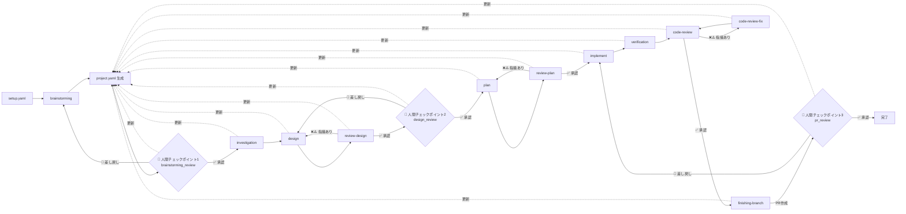

# project.yaml — プロジェクトコンテキストファイル

全プロセスの **SSOT（Single Source of Truth）** として機能するYAMLファイルです。

---

## 概要

- **生成**: `brainstorming` スキルが `setup.yaml` を基に初期生成
- **更新**: 各プロセスが完了時に自セクションを追記
- **参照**: 以降の全プロセスがこのファイルを入力として使用

---

## 設計方針

| 方針                   | 説明                                                                   |
| ---------------------- | ---------------------------------------------------------------------- |
| **YAMLはインデックス** | 各プロセスの状態・要約・成果物パスを記録。詳細は外部ドキュメントに委譲 |
| **肥大化防止**         | 各セクションの `summary` は3行以内。詳細は `artifacts` パスで参照      |
| **累積更新**           | 各プロセスは自セクションのみ追記/更新。他セクションは読み取り専用      |
| **setup.yaml互換**     | `meta` + `setup` セクションに setup.yaml の内容をそのまま保持          |

---

## セクション構成

| プロセス           | project.yaml セクション          | 記録内容                                                         |
| ------------------ | -------------------------------- | ---------------------------------------------------------------- |
| brainstorming      | `meta`, `setup`, `brainstorming` | 要件探索結果、決定事項、テスト戦略                               |
| submodule-overview | `overview`                       | サブモジュール概要                                               |
| investigation      | `investigation`                  | 調査結果、リスク                                                 |
| design             | `design`                         | 設計方針                                                         |
| review-design      | `design.review`                  | 設計レビュー指摘・ラウンド                                       |
| plan               | `plan`                           | タスク一覧、依存関係                                             |
| review-plan        | `plan.review`                    | 計画レビュー指摘・ラウンド                                       |
| implement          | `implement`                      | 実行状況、コミットハッシュ                                       |
| verification       | `verification`                   | テスト・ビルド・リント実行結果、E2E結果、acceptance_criteria照合 |
| code-review        | `code_review`                    | チェックリスト、指摘、ラウンド                                   |
| code-review-fix    | `code_review`                    | 指摘修正記録（同セクション更新）                                 |
| finishing-branch   | `finishing`                      | 最終アクション、PR URL                                           |
| 人間チェックポイント | `human_checkpoints`            | 人間レビューの承認・差し戻し履歴（3箇所）                        |

---

## ワークフロー


```mermaid
flowchart LR
    SY[setup.yaml] --> BS[brainstorming]
    BS --> PY[project.yaml 生成]
    PY --> HC1{👤 人間チェックポイント1\nbrainstorming_review}
    HC1 -->|✅ 承認| INV[investigation]
    HC1 -->|🔄 差し戻し| BS
    INV --> DES[design]
    DES --> RD[review-design]
    RD -->|✅ 承認| HC2{👤 人間チェックポイント2\ndesign_review}
    RD -->|❌⚠️ 指摘あり| DES
    HC2 -->|✅ 承認| PLN[plan]
    HC2 -->|🔄 差し戻し| DES
    PLN --> RP[review-plan]
    RP -->|✅ 承認| IMP[implement]
    RP -->|❌⚠️ 指摘あり| PLN
    IMP --> VER[verification]
    VER --> CR[code-review]
    CR -->|✅ 承認| FIN[finishing-branch]
    CR -->|❌⚠️ 指摘あり| CRF[code-review-fix]
    CRF --> CR
    FIN -->|PR作成| HC3{👤 人間チェックポイント3\npr_review}
    HC3 -->|✅ 承認| DONE[完了]
    HC3 -->|🔄 差し戻し| IMP

    INV -.->|更新| PY
    DES -.->|更新| PY
    RD -.->|更新| PY
    PLN -.->|更新| PY
    RP -.->|更新| PY
    IMP -.->|更新| PY
    VER -.->|更新| PY
    CR -.->|更新| PY
    CRF -.->|更新| PY
    FIN -.->|更新| PY
    HC1 -.->|更新| PY
    HC2 -.->|更新| PY
    HC3 -.->|更新| PY
```

---

## 人間チェックポイント（human_checkpoints）

ワークフロー中の3箇所で人間によるレビュー・承認が発生します。差し戻し時は指摘内容と対応履歴が `human_checkpoints` セクションに記録されます。

### チェックポイント一覧

| チェックポイント | タイミング | 確認内容 | 差し戻し先 |
| --- | --- | --- | --- |
| `brainstorming_review` | project.yaml 生成直後 | 要件定義・テスト戦略・設計方針の妥当性 | brainstorming |
| `design_review` | review-design 承認後 | 設計全体の妥当性・実装可能性 | design または investigation |
| `pr_review` | PR 発行後 | 実装・テスト・ドキュメントの最終確認 | implement, design 等 |

### 構造

```yaml
human_checkpoints:
  brainstorming_review:
    status: approved              # pending | approved | revision_requested
    current_round: 2              # 現在のラウンド番号
    rounds:
      - round: 1
        reviewed_at: "2025-01-01T10:00:00+09:00"
        verdict: revision_requested
        feedback: "非機能要件のパフォーマンス基準が不足"
        rollback_to: "brainstorming"
        resolved_at: "2025-01-01T14:00:00+09:00"
        resolution_summary: "レスポンスタイム200ms以内の基準を追加"
      - round: 2
        reviewed_at: "2025-01-01T15:00:00+09:00"
        verdict: approved
  design_review:
    status: approved
    current_round: 1
    rounds:
      - round: 1
        reviewed_at: "2025-01-02T10:00:00+09:00"
        verdict: approved
  pr_review:
    status: pending
    current_round: 0
    rounds: []
```

### CLIヘルパーの使用方法

```bash
# チェックポイントの結果を記録（承認）
./scripts/project-yaml-helper.sh checkpoint brainstorming_review --verdict approved

# チェックポイントの結果を記録（差し戻し）
./scripts/project-yaml-helper.sh checkpoint design_review \
  --verdict revision_requested \
  --feedback "APIのエラーハンドリング設計が不十分" \
  --rollback-to design

# 差し戻し対応完了を記録
./scripts/project-yaml-helper.sh resolve-checkpoint design_review \
  --summary "エラーハンドリングのフロー図とリトライ戦略を追加"

# 再レビュー結果を記録
./scripts/project-yaml-helper.sh checkpoint design_review --verdict approved
```
