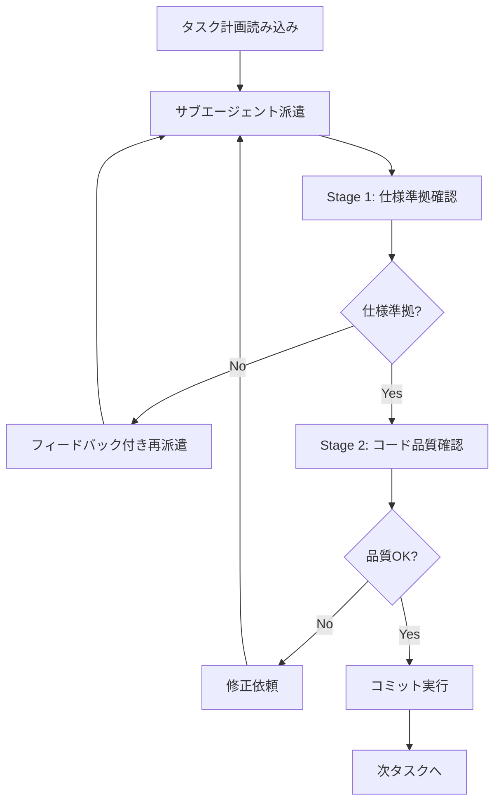

# サブエージェント駆動開発（Subagent-Driven Development）

## 概要

親エージェントがサブエージェントに実装を委譲し、その戻り値を検証する開発パターンです。

---

## 同一セッションでのサブエージェント派遣手順



---

## 2段階レビュー手順

### Stage 1: 仕様準拠確認

```markdown
## Stage 1 チェックリスト

- [ ] task0X.md のプロンプト要件を全て満たしているか
- [ ] 完了条件が全てクリアされているか
- [ ] design-document の設計に従っているか
- [ ] 期待されるファイルが作成/変更されているか
```

### Stage 2: コード品質確認

```markdown
## Stage 2 チェックリスト

- [ ] テストが先に書かれているか（TDD原則）
- [ ] テストが全てパスしているか
- [ ] リントエラーがないか
- [ ] 型エラーがないか
- [ ] result.md が作成されているか
```

---

## 具体的ワークフロー例

```bash
# 1. タスクプロンプト読み込み
TASK_PROMPT=$(cat docs/target-repo/plan/task01.md)

# 2. サブエージェント派遣
claude --agent general-purpose --model claude-opus-4.6 --prompt "
## 実装タスク

$TASK_PROMPT

## 完了時の成果物
- 実装コード
- テストコード
- result.md
"

# 3. Stage 1: 仕様準拠確認
echo "=== Stage 1: 仕様準拠確認 ==="
# - 要件チェック
# - 成果物確認

# 4. Stage 2: コード品質確認
echo "=== Stage 2: コード品質確認 ==="
cd submodules/target-repo
npm test && npm run lint && npm run typecheck

# 5. 問題なければコミット
git add -A
git commit -m "task01: 機能実装完了"
```
