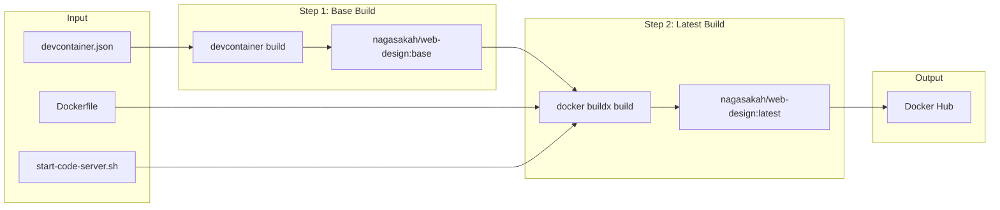
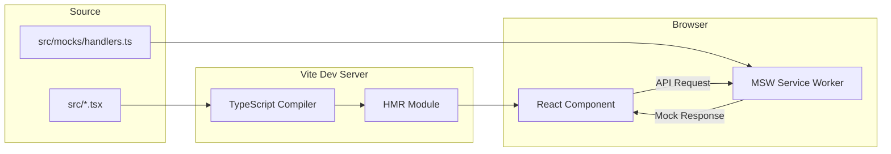

# データ構造設計

## 概要

| 項目 | 内容 |
|------|------|
| チケットID | WEB-DESIGN-001 |
| タスク名 | ウェブデザイン要件定義プロジェクト環境構築 |
| 作成日 | 2026-02-27 |

---

## 1. ファイル構造設計

本プロジェクトはデータベースを使用しないため、リポジトリのファイル構造と設定ファイルの構造を設計する。

### 1.1 web-designリポジトリ全体構造

```
web-design/
├── .devcontainer/
│   ├── devcontainer.json           # devcontainer features・settings定義
│   ├── Dockerfile                  # code-server・拡張機能追加レイヤー
│   └── scripts/
│       └── start-code-server.sh    # コンテナ起動スクリプト
├── scripts/
│   ├── dev-container.sh            # DooD/DinD切り替え・コンテナ管理
│   └── build-and-push-devcontainer.sh  # プリビルドイメージ作成
├── src/
│   ├── App.tsx                     # メインAppコンポーネント
│   ├── App.css                     # Appスタイル
│   ├── main.tsx                    # Viteエントリポイント
│   ├── index.css                   # グローバルスタイル (Tailwind directives)
│   ├── vite-env.d.ts               # Vite型定義
│   ├── components/                 # 共通コンポーネント
│   │   └── .gitkeep
│   └── mocks/                      # MSWモック定義
│       ├── browser.ts              # MSWブラウザワーカー設定
│       └── handlers.ts             # APIモックハンドラー
├── public/
│   └── mockServiceWorker.js        # MSW Service Worker（npx msw initで生成）
├── e2e/
│   ├── playwright.config.ts        # Playwright設定
│   ├── code-server.spec.ts         # code-serverアクセステスト
│   ├── react-preview.spec.ts       # Reactプレビューテスト
│   ├── extensions.spec.ts          # 拡張機能確認テスト
│   └── docker-mode.spec.ts         # DooD/DinD動作確認テスト
├── index.html                      # Viteエントリポイント HTML
├── package.json                    # npm依存定義
├── tsconfig.json                   # TypeScript設定
├── tsconfig.app.json               # アプリ用TypeScript設定
├── tsconfig.node.json              # Node.js用TypeScript設定
├── vite.config.ts                  # Vite設定
├── eslint.config.js                # ESLint設定
├── .prettierrc                     # Prettier設定
├── .gitignore                      # Git除外設定
└── README.md                       # プロジェクトREADME
```

### 1.2 ディレクトリ責務

| ディレクトリ | 責務 | 備考 |
|--------------|------|------|
| `.devcontainer/` | devcontainer構成ファイル | ビルド・起動関連 |
| `.devcontainer/scripts/` | コンテナ内起動スクリプト | start-code-server.sh |
| `scripts/` | ホスト側管理スクリプト | dev-container.sh, build-and-push |
| `src/` | Reactアプリケーションソース | コンポーネント・モック |
| `src/components/` | 再利用可能なReactコンポーネント | 画面デザインモック |
| `src/mocks/` | MSWモック定義 | APIレスポンスモック |
| `public/` | 静的ファイル | MSW Service Worker |
| `e2e/` | Playwright E2Eテスト | devcontainer環境テスト |

---

## 2. 設定ファイルの構造

### 2.1 package.json

```json
{
  "name": "web-design",
  "private": true,
  "version": "0.0.1",
  "type": "module",
  "scripts": {
    "dev": "vite --host 0.0.0.0",
    "build": "tsc -b && vite build",
    "preview": "vite preview --host 0.0.0.0",
    "lint": "eslint .",
    "format": "prettier --write .",
    "format:check": "prettier --check .",
    "test:e2e": "playwright test",
    "test:e2e:ui": "playwright test --ui"
  },
  "dependencies": {
    "react": "^19.0.0",
    "react-dom": "^19.0.0",
    "msw": "^2.0.0"
  },
  "devDependencies": {
    "@playwright/test": "^1.50.0",
    "@tailwindcss/vite": "^4.0.0",
    "@types/react": "^19.0.0",
    "@types/react-dom": "^19.0.0",
    "@vitejs/plugin-react": "^4.0.0",
    "eslint": "^9.0.0",
    "tailwindcss": "^4.0.0",
    "typescript": "^5.7.0",
    "vite": "^6.0.0"
  }
}
```

### 2.2 vite.config.ts

```typescript
import { defineConfig } from 'vite';
import react from '@vitejs/plugin-react';
import tailwindcss from '@tailwindcss/vite';

export default defineConfig({
  plugins: [react(), tailwindcss()],
  server: {
    host: '0.0.0.0',
    port: 5173,
    watch: {
      usePolling: true,  // bind mount環境でのファイル監視対応
    },
  },
});
```

### 2.3 tsconfig.json

```json
{
  "files": [],
  "references": [
    { "path": "./tsconfig.app.json" },
    { "path": "./tsconfig.node.json" }
  ]
}
```

### 2.4 tsconfig.app.json

```json
{
  "compilerOptions": {
    "target": "ES2020",
    "useDefineForClassFields": true,
    "lib": ["ES2020", "DOM", "DOM.Iterable"],
    "module": "ESNext",
    "skipLibCheck": true,
    "moduleResolution": "bundler",
    "allowImportingTsExtensions": true,
    "isolatedModules": true,
    "moduleDetection": "force",
    "noEmit": true,
    "jsx": "react-jsx",
    "strict": true,
    "noUnusedLocals": true,
    "noUnusedParameters": true,
    "noFallthroughCasesInSwitch": true,
    "noUncheckedSideEffectImports": true
  },
  "include": ["src"]
}
```

### 2.5 tsconfig.node.json

```json
{
  "compilerOptions": {
    "target": "ES2022",
    "lib": ["ES2023"],
    "module": "ESNext",
    "skipLibCheck": true,
    "moduleResolution": "bundler",
    "allowImportingTsExtensions": true,
    "isolatedModules": true,
    "moduleDetection": "force",
    "noEmit": true,
    "strict": true,
    "noUnusedLocals": true,
    "noUnusedParameters": true,
    "noFallthroughCasesInSwitch": true,
    "noUncheckedSideEffectImports": true
  },
  "include": ["vite.config.ts"]
}
```

### 2.6 .prettierrc

```json
{
  "semi": true,
  "singleQuote": true,
  "tabWidth": 2,
  "trailingComma": "all",
  "printWidth": 100
}
```

---

## 3. 型定義

### 3.1 MSWハンドラー型

```typescript
// src/mocks/handlers.ts
import { http, HttpResponse } from 'msw';

// APIモックハンドラーの型定義
export const handlers = [
  http.get('/api/health', () => {
    return HttpResponse.json({ status: 'ok' });
  }),
];
```

### 3.2 MSWブラウザ設定型

```typescript
// src/mocks/browser.ts
import { setupWorker } from 'msw/browser';
import { handlers } from './handlers';

export const worker = setupWorker(...handlers);
```

---

## 4. データフロー

### 4.1 devcontainerビルドフロー



### 4.2 Reactアプリデータフロー



---

## 5. 環境変数設計

### 5.1 dev-container.sh 環境変数

| 変数名 | デフォルト | 説明 | 設定場所 |
|--------|-----------|------|----------|
| `DOCKER_MODE` | `dind` | Docker動作モード | ユーザー指定 |
| `DEV_CONTAINER_IMAGE` | `nagasakah/web-design:latest` | Dockerイメージ名 | スクリプト内定数 |
| `PROJECT_NAME` | `web-design` | プロジェクト名 | スクリプト内定数 |
| `WORKSPACE_DIR` | (自動検出) | ワークスペースパス | スクリプト内自動検出 |

### 5.2 start-code-server.sh 環境変数

| 変数名 | デフォルト | 説明 | 設定場所 |
|--------|-----------|------|----------|
| `RUN_USER` | `vscode` | 実行ユーザー | スクリプト内定数 |
| `WORKSPACE_DIR` | `/workspaces/web-design` | ワークスペースパス | 引数 or デフォルト |
| `CODE_SERVER_PORT` | `8080` | code-serverポート | スクリプト内定数 |

### 5.3 code-server 環境変数

| 変数名 | デフォルト | 説明 |
|--------|-----------|------|
| `PASSWORD` | (なし) | code-server認証パスワード |
| `HASHED_PASSWORD` | (なし) | ハッシュ化パスワード |

---

## 変更履歴

| 日付 | バージョン | 変更内容 | 変更者 |
|------|------------|----------|--------|
| 2026-02-27 | 1.0 | 初版作成 | Copilot |
