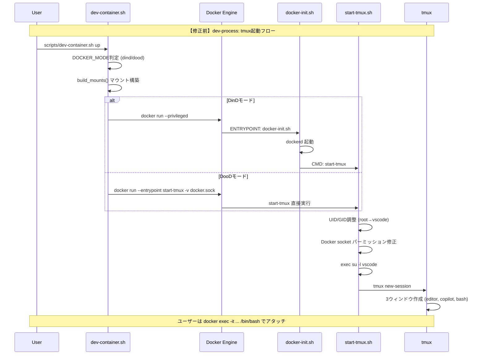
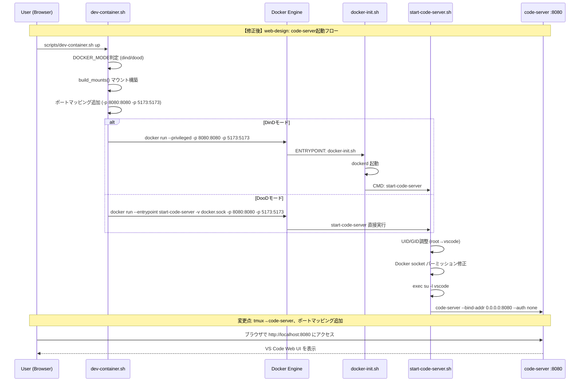
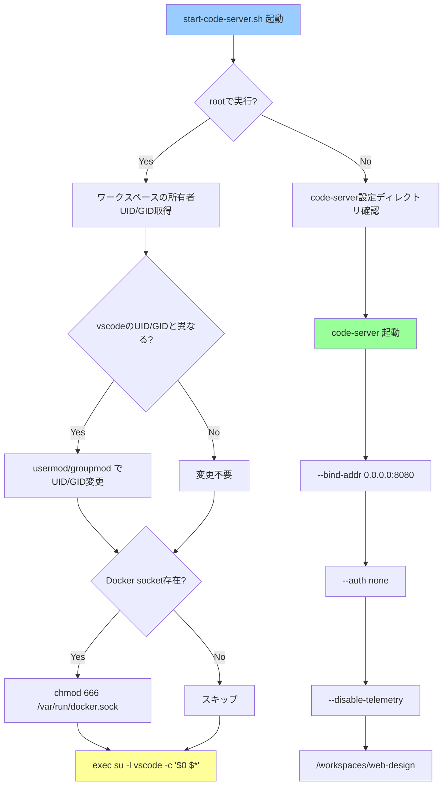
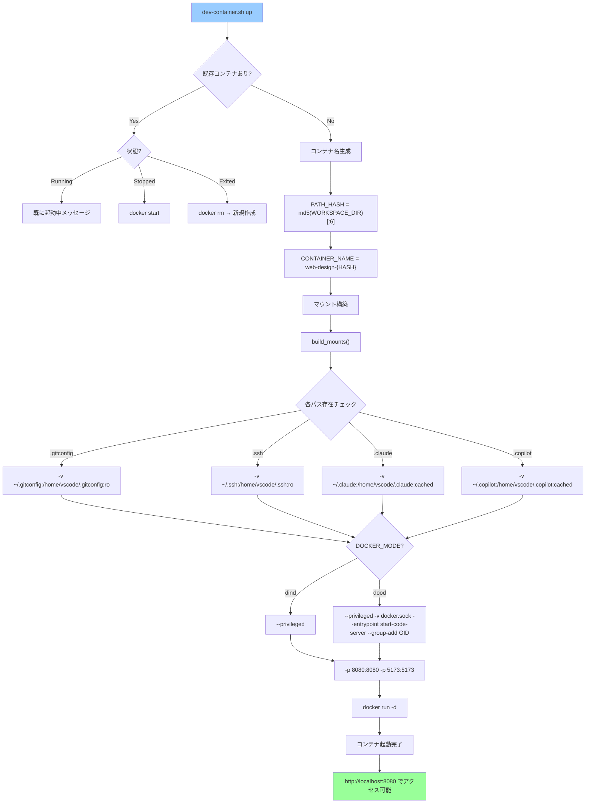
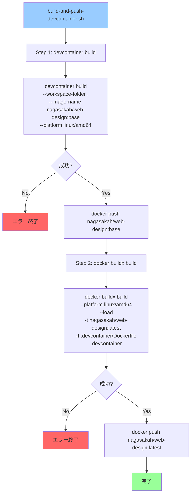
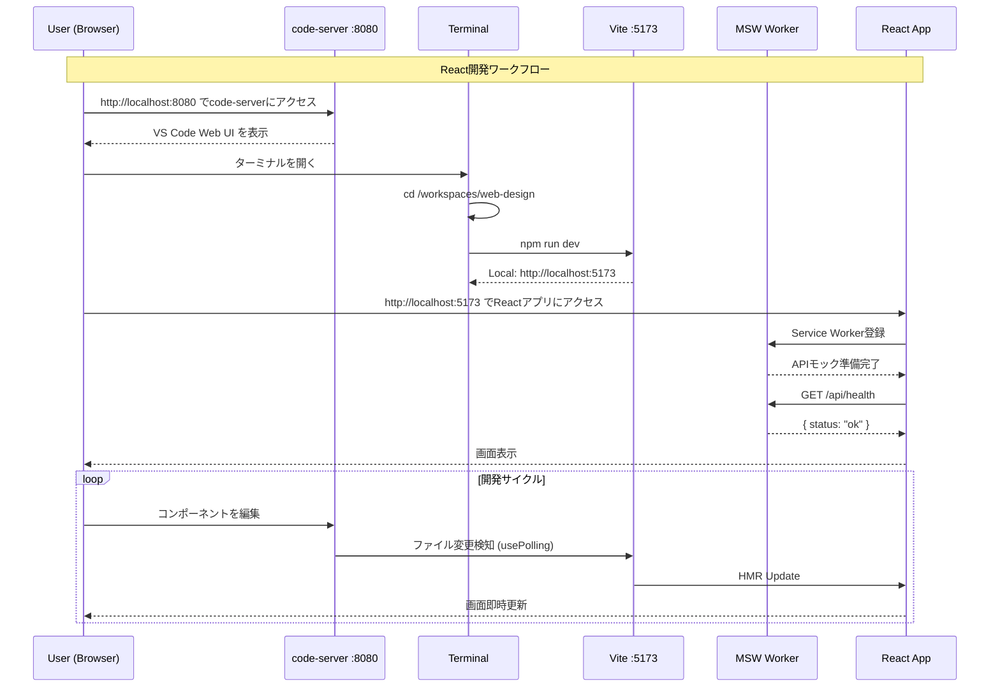
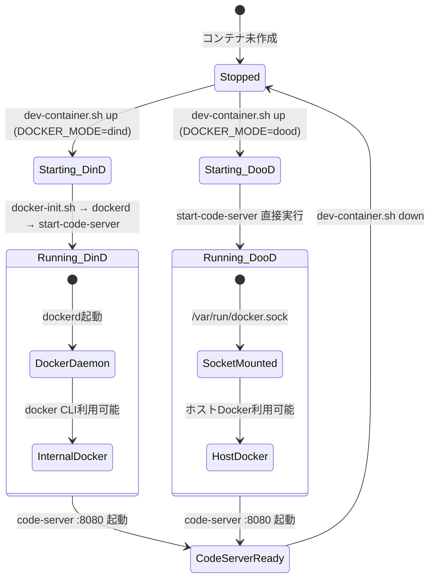
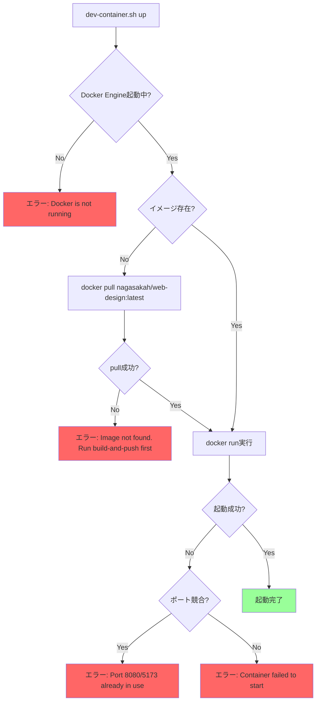
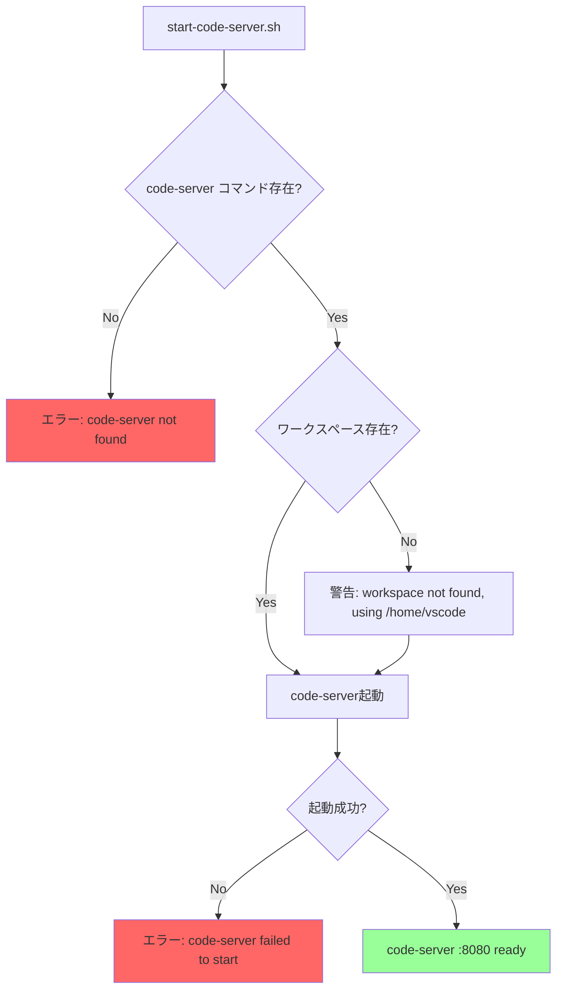

# 処理フロー設計

## 概要

| 項目 | 内容 |
|------|------|
| チケットID | WEB-DESIGN-001 |
| タスク名 | ウェブデザイン要件定義プロジェクト環境構築 |
| 作成日 | 2026-02-27 |

---

## 1. シーケンス図（修正前/修正後対比）

### 1.1 修正前：dev-processの起動フロー（tmux）

### 1.2 修正後：web-designの起動フロー（code-server）

### 1.3 変更点サマリー

| 項目 | 修正前 (dev-process) | 修正後 (web-design) | 理由 |
|------|---------------------|---------------------|------|
| 起動スクリプト | `start-tmux.sh` | `start-code-server.sh` | tmuxの代わりにcode-server |
| ユーザーインターフェース | tmuxターミナル | ブラウザベースVS Code | 要件定義レビューに最適 |
| アクセス方法 | `docker exec -it` | `http://localhost:8080` | ブラウザで即アクセス |
| ポートマッピング | なし | `-p 8080:8080 -p 5173:5173` | code-server + Vite |
| CMD | `start-tmux` | `start-code-server` | 起動コマンド変更 |
| ENTRYPOINT上書き(DooD) | `--entrypoint start-tmux` | `--entrypoint start-code-server` | DooD時の直接起動 |
| マウント | `.aws`, `.gitconfig`, `.ssh`, etc. | `.gitconfig`, `.ssh`, `.claude`, `.copilot` | `.aws`削除 |

---

## 2. start-code-server.sh 詳細フロー

---

## 3. dev-container.sh up コマンドフロー

---

## 4. プリビルドイメージ作成フロー

---

## 5. React開発ワークフロー

---

## 6. DooD/DinD切り替え状態遷移

---

## 7. エラーフロー

### 7.1 コンテナ起動エラーフロー

### 7.2 code-server起動エラーフロー

---

## 変更履歴

| 日付 | バージョン | 変更内容 | 変更者 |
|------|------------|----------|--------|
| 2026-02-27 | 1.0 | 初版作成 | Copilot |
