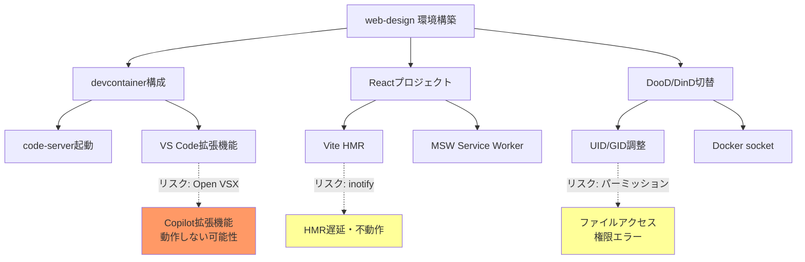

# 弊害検証計画

## 概要

| 項目 | 内容 |
|------|------|
| チケットID | WEB-DESIGN-001 |
| タスク名 | ウェブデザイン要件定義プロジェクト環境構築 |
| 作成日 | 2026-02-27 |

---

## 1. 副作用分析

### 1.1 副作用が発生しやすい箇所

| 箇所 | 影響度 | 発生可能性 | 検証方法 | 優先度 |
|------|--------|------------|----------|--------|
| GitHub Copilot拡張機能 (Open VSX制約) | 高 | 高 | code-server上でCopilot拡張の動作確認 | 高 |
| Vite HMR (bind mount環境) | 中 | 中 | ファイル変更時のホットリロード動作確認 | 高 |
| DooD時のUID/GID不一致 | 中 | 低 | DooD起動後のファイルパーミッション確認 | 中 |
| code-server拡張機能の互換性 | 中 | 中 | 各拡張機能の動作確認 | 中 |
| ポート競合 (8080, 5173) | 低 | 低 | ポート使用中に起動を試行 | 低 |

### 1.2 影響範囲マップ

---

## 2. 回帰テスト

### 2.1 実行すべき回帰テスト

新規プロジェクトのため既存機能への回帰テストは不要。ただし、dev-processから移植するスクリプトについて以下を確認する。

| テスト対象 | 確認内容 | 優先度 | 必須/推奨 |
|------------|---------|--------|-----------|
| dev-container.sh (移植版) | DinDモードでコンテナ起動・停止・ステータス確認 | 高 | 必須 |
| dev-container.sh (移植版) | DooDモードでコンテナ起動・停止 | 高 | 必須 |
| start-code-server.sh | UID/GID調整後のcode-server起動 | 高 | 必須 |
| build-and-push-devcontainer.sh | 2段階ビルドの成功 | 中 | 必須 |

### 2.2 回帰テストチェックリスト

- [ ] dev-container.sh up/down/status が正常動作
- [ ] DinDモードでdocker CLIが利用可能
- [ ] DooDモードでホストDockerが利用可能
- [ ] start-code-server.shでcode-serverが起動
- [ ] build-and-push-devcontainer.shでイメージビルド成功

---

## 3. パフォーマンス検証

### 3.1 検証項目

| 項目 | 目標値 | 許容値 | 測定方法 |
|------|--------|--------|----------|
| devcontainerビルド時間 | 5分以内 | 10分以内 | `time build-and-push-devcontainer.sh` |
| code-server起動時間 | 10秒以内 | 30秒以内 | コンテナ起動からHTTPレスポンスまで |
| Vite HMR反映時間 | 1秒以内 | 3秒以内 | ファイル変更から画面更新まで（usePolling時） |
| npm install時間 | 30秒以内 | 60秒以内 | `time npm install` (bind mount環境) |

### 3.2 パフォーマンスリスク

| リスク | 対策 | 備考 |
|--------|------|------|
| bind mount I/O遅延 | `usePolling` 設定でファイル監視 | Vite HMRに影響 |
| 拡張機能読込遅延 | 必要最小限の拡張機能に絞る (7個) | 起動時間に影響 |
| node_modules I/O | 初回スコープでは許容、必要ならnamed volume追加 | npm install速度に影響 |

---

## 4. セキュリティ検証

### 4.1 検証項目

| 項目 | 確認内容 | 検証方法 | チェック |
|------|----------|----------|----------|
| code-server認証 | `--auth none` が意図的であること | 設定ファイル確認、READMEに注意事項記載 | ⬜ |
| `--privileged` | DinD/DooD両方で使用されること | dev-container.shのフラグ確認 | ⬜ |
| Docker socket (DooD) | ホストDockerへのアクセス制御 | DooD時にchmod 666の影響確認 | ⬜ |
| VSIX手動インストール | 公式ソースからのダウンロード確認 | Dockerfile内のインストールコマンド確認 | ⬜ |

### 4.2 セキュリティリスク受容

| リスク | 影響 | 受容理由 |
|--------|------|----------|
| code-server認証なし | LAN内からアクセス可能 | ローカル開発環境専用、READMEに記載 |
| `--privileged` コンテナ | コンテナエスケープの可能性 | ローカル開発環境のため許容 |
| Docker socket共有 (DooD) | ホストDocker完全アクセス | 開発用のため許容 |

---

## 5. 互換性検証

### 5.1 環境互換性

| 環境 | 対応状況 | 確認方法 |
|------|----------|----------|
| macOS (Intel) | ✅ 対応 | linux/amd64イメージ |
| macOS (Apple Silicon) | ⚠️ エミュレーション | Rosetta 2経由で動作 |
| Linux (x86_64) | ✅ 対応 | ネイティブ実行 |
| Windows (WSL2) | ⚠️ 未検証 | WSL2 + Docker Desktop環境で要検証 |

### 5.2 ツールバージョン互換性

| ツール | 最低バージョン | 推奨バージョン | 確認方法 |
|--------|---------------|---------------|----------|
| Docker Engine | 20.10 | 24.x+ | `docker --version` |
| Docker Compose | 不要 | - | dev-container.sh使用 |
| devcontainer CLI | 0.50+ | 最新 | `devcontainer --version` |

---

## 6. GitHub Copilot Open VSX制約の検証

### 6.1 検証シナリオ

| No | シナリオ | 手順 | 期待結果 | フォールバック |
|----|----------|------|----------|---------------|
| 1 | VSIX直接インストール | Dockerfile内で `code-server --install-extension GitHub.copilot` | 拡張機能がインストールされる | シナリオ2へ |
| 2 | VSIX手動ダウンロード | GitHub ReleasesからVSIXをダウンロードし、`code-server --install-extension copilot.vsix` | 拡張機能がインストール・動作する | シナリオ3へ |
| 3 | Copilot CLI代替 | ターミナルから `github-copilot-cli` を使用 | CLIベースのAI支援が利用可能 | 許容（CLIのみ） |

### 6.2 検証結果テンプレート

| シナリオ | 結果 | 備考 |
|----------|------|------|
| VSIX直接インストール | ⬜ | |
| VSIX手動ダウンロード | ⬜ | |
| Copilot CLI代替 | ⬜ | |

---

## 7. 検証実行計画

### 7.1 実行順序

1. devcontainerビルド確認
2. code-server起動・アクセス確認
3. 拡張機能インストール確認（Copilot含む）
4. React開発ワークフロー確認（Vite HMR）
5. DinD/DooD動作確認
6. パフォーマンス測定
7. セキュリティ確認事項のチェック

---

## 8. ロールバック計画

| フェーズ | ロールバック方法 | 所要時間 |
|----------|------------------|----------|
| devcontainer構成変更 | gitでファイル切り戻し | 5分 |
| プリビルドイメージ | Docker Hubから以前のタグをpull | 10分 |
| Reactプロジェクト初期化 | `npm create vite@latest` で再作成 | 5分 |
| code-server不具合 | tmux構成にフォールバック（dev-processパターン） | 30分 |

---

## 9. 結果レポートテンプレート

### 9.1 検証結果サマリー

| 検証項目 | 結果 | 発見事項 | 対応状況 |
|----------|------|----------|----------|
| code-server起動 | ⬜ | | |
| 拡張機能インストール | ⬜ | | |
| Copilot動作 | ⬜ | | |
| Vite HMR | ⬜ | | |
| DinD動作 | ⬜ | | |
| DooD動作 | ⬜ | | |
| パフォーマンス | ⬜ | | |
| セキュリティ | ⬜ | | |

### 9.2 発見した問題

| No | 問題 | 重大度 | 対応方針 | 対応状況 |
|----|------|--------|----------|----------|
| | | | | |

---

## 変更履歴

| 日付 | バージョン | 変更内容 | 変更者 |
|------|------------|----------|--------|
| 2026-02-27 | 1.0 | 初版作成 | Copilot |
