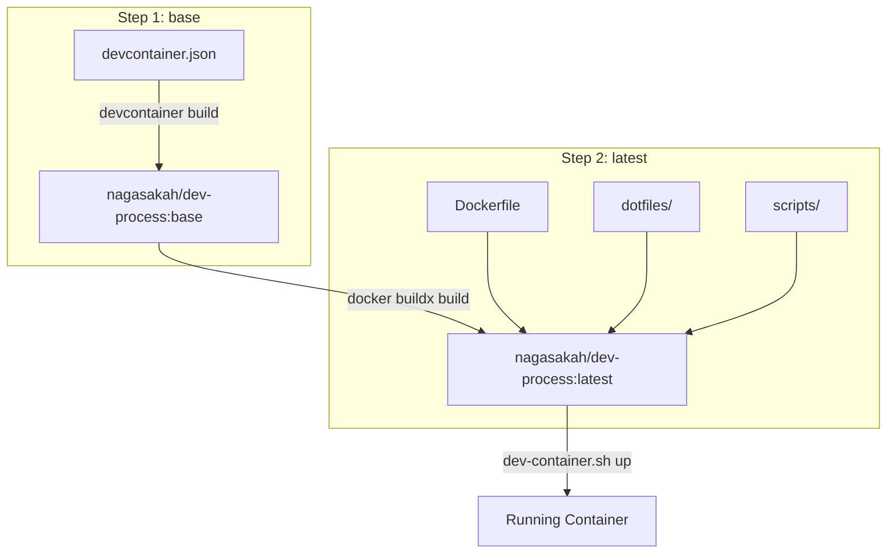
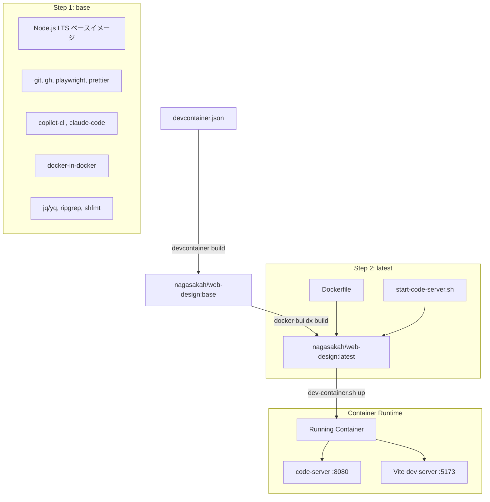
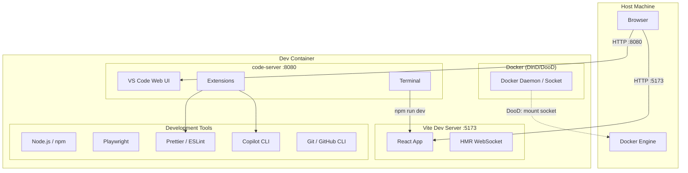

# アーキテクチャ調査

## 概要

dev-processリポジトリのdevcontainer構成を参考に、web-designリポジトリにcode-serverベースの開発環境を構築する。dev-processはdotnet + tmux構成だが、web-designではNode.js + code-server構成に変更し、React + Vite + TypeScriptの開発環境を提供する。

## 参照リポジトリ: dev-process のディレクトリ構造

```
dev-process/
├── .devcontainer/
│   ├── devcontainer.json        # devcontainer features定義
│   ├── Dockerfile               # プリビルドイメージからの追加レイヤー
│   ├── dotfiles/
│   │   ├── .tmux.conf           # tmux設定（コンテナ/ネスト検出含む）
│   │   └── .config/tmux/
│   │       └── cheatsheet.txt   # tmuxチートシート
│   ├── mssql-mcp/               # カスタムdevcontainer feature
│   │   ├── devcontainer-feature.json
│   │   └── install.sh
│   └── scripts/
│       ├── cplt                 # Copilot CLI ラッパー（tmux統合）
│       └── start-tmux.sh        # コンテナ起動スクリプト（ENTRYPOINT CMD）
├── scripts/
│   ├── dev-container.sh         # DooD/DinD切り替え・コンテナ管理
│   ├── build-and-push-devcontainer.sh  # プリビルドイメージ作成
│   └── ...
└── ...
```

## 修正対象リポジトリ: web-design の目標構造

```
web-design/
├── .devcontainer/
│   ├── devcontainer.json        # Node.js LTS + code-server features
│   ├── Dockerfile               # code-server起動用（start-tmux.sh → start-code-server.sh）
│   └── scripts/
│       └── start-code-server.sh # コンテナ起動スクリプト（code-server起動）
├── scripts/
│   ├── dev-container.sh         # DooD/DinD切り替え（dev-processから移植）
│   └── build-and-push-devcontainer.sh  # プリビルドイメージ作成
├── src/                         # React + Vite + TypeScript ソースコード
│   ├── App.tsx
│   ├── main.tsx
│   └── ...
├── e2e/                         # Playwright E2Eテスト
├── package.json
├── vite.config.ts
├── tsconfig.json
├── tailwind.config.js
└── README.md
```

## アーキテクチャパターン

### dev-process の構成パターン（2層ビルド）

dev-processは**2段階ビルド**パターンを採用：

1. **Step 1 (base)**: `devcontainer build` で `devcontainer.json` の features をビルド → `nagasakah/dev-process:base`
2. **Step 2 (latest)**: `Dockerfile` で base から追加レイヤー（dotfiles, scripts, pip ツール）→ `nagasakah/dev-process:latest`



### web-design に適用する構成パターン

同様の2段階ビルドを採用、ただしtmux関連をcode-server関連に置換：



## コンポーネント図



## レイヤー構成

| レイヤー | 責務 | dev-process | web-design |
|----------|------|-------------|------------|
| ベースイメージ | OS・ランタイム | `mcr.microsoft.com/devcontainers/dotnet:8.0` | `mcr.microsoft.com/devcontainers/javascript-node:lts` |
| Features | ツールチェーン | git, node, python, aws-cli, terraform, tmux, etc. | git, playwright, prettier, copilot-cli, etc. |
| Dockerfile | カスタマイズ | tmux設定, pip ツール, cplt | code-server起動スクリプト |
| 起動スクリプト | エントリポイント | `start-tmux.sh` (tmux 3ウィンドウ) | `start-code-server.sh` (code-server起動) |
| コンテナ管理 | 外部操作 | `dev-container.sh` (DooD/DinD) | `dev-container.sh` (DooD/DinD、移植) |

## 主要ファイル（参照: dev-process）

| ファイルパス | 役割 | web-designでの対応 |
|--------------|------|--------------------|
| `.devcontainer/devcontainer.json` | features定義（23個のfeature） | 必要なfeatureのみ選定して新規作成 |
| `.devcontainer/Dockerfile` | base → latest ビルド、ENTRYPOINT/CMD | code-server起動用に書き換え |
| `.devcontainer/scripts/start-tmux.sh` | コンテナ起動時のtmuxセッション作成 | `start-code-server.sh` に置換 |
| `.devcontainer/scripts/cplt` | Copilot CLIラッパー（tmux統合） | 不要（code-serverのターミナルで直接使用） |
| `.devcontainer/dotfiles/.tmux.conf` | tmux設定（prefix切替、pane操作） | 不要 |
| `scripts/dev-container.sh` | DooD/DinD切り替え、マウント管理 | ほぼそのまま移植（イメージ名変更、tmux→code-server） |
| `scripts/build-and-push-devcontainer.sh` | 2段階ビルド+push | イメージ名変更して移植 |

## 備考

- dev-processの `ENTRYPOINT ["/usr/local/share/docker-init.sh"]` はdocker-in-docker featureが提供するスクリプトで、DinDモード時のdockerd起動を担当する
- `CMD ["start-tmux"]` をweb-designでは `CMD ["start-code-server"]` に変更する
- dev-processのカスタムfeature `./mssql-mcp` はweb-designでは不要
- code-serverのdevcontainer featureは存在しないため、Dockerfile内で直接インストールする必要がある
