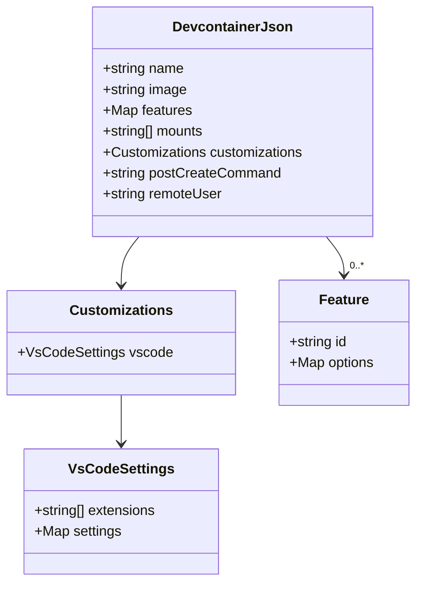
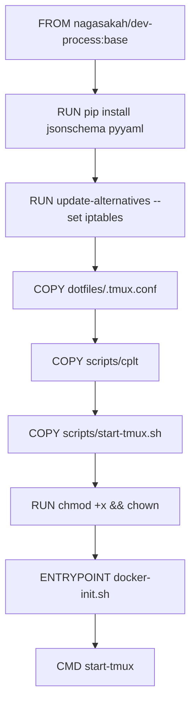
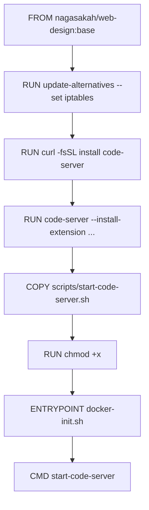
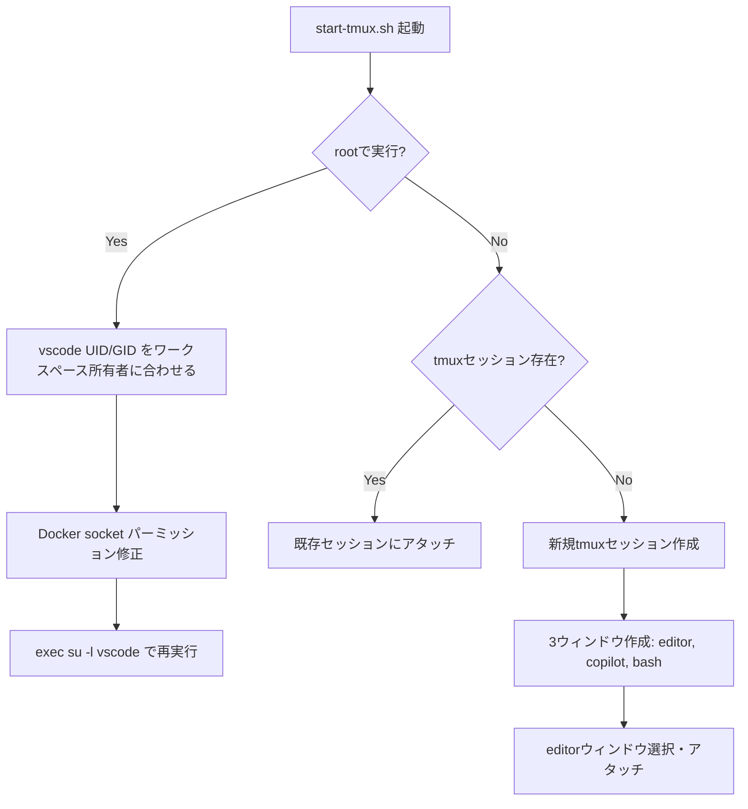
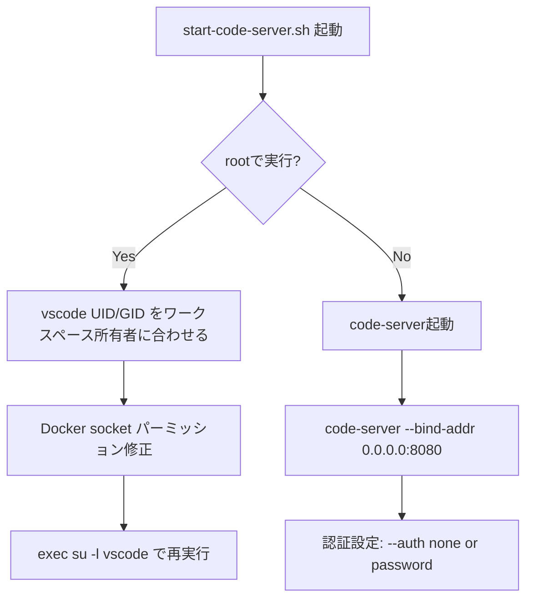

# データ構造調査

## 概要

web-designリポジトリは新規構築のため、既存のデータ構造は存在しない。本調査では、devcontainer構成ファイルの構造と、React + Vite + TypeScriptプロジェクトの初期データ構造を定義する。

## devcontainer構成の構造

### devcontainer.json の構造



### dev-process の devcontainer.json features（23個）

| Feature | 用途 | web-designで必要 |
|---------|------|-----------------|
| `git:1` | Git | ✅ (ベースイメージに含まれる可能性) |
| `github-cli:1` | GitHub CLI | ✅ |
| `node:1` (lts) | Node.js | ✅ (ベースイメージに含まれる) |
| `playwright:0` | E2Eテスト | ✅ |
| `python:1` (3.12) | Python | ❌ |
| `aws-cli:1` | AWS CLI | ❌ |
| `terraform:1` | Terraform | ❌ |
| `jqyq:0` | jq/yq | ✅ (project.yaml操作用) |
| `uv:1` | Python パッケージマネージャ | ❌ |
| `docker-in-docker:2` | DinDサポート | ✅ |
| `ripgrep:1` | 高速検索 | ✅ |
| `deno` | Deno | ❌ |
| `tmux-apt-get:1` | tmux | ❌ |
| `prettier:1` | コードフォーマッター | ✅ |
| `shfmt:1` | シェルスクリプトフォーマッター | ✅ |
| `neovim:0` | Neovim | ❌ |
| `copilot-cli:1` | GitHub Copilot CLI | ✅ |
| `claude-code:0` | Claude Code | ✅ |
| `./mssql-mcp` | MSSQL MCP Server | ❌ |

### web-design 用 devcontainer.json features（選定結果）

| Feature | 用途 |
|---------|------|
| `ghcr.io/devcontainers/features/github-cli:1` | GitHub CLI |
| `ghcr.io/schlich/devcontainer-features/playwright:0` | Playwright |
| `ghcr.io/larsnieuwenhuizen/features/jqyq:0` | jq/yq |
| `ghcr.io/devcontainers/features/docker-in-docker:2` | DinDサポート |
| `ghcr.io/jungaretti/features/ripgrep:1` | 高速検索 |
| `ghcr.io/devcontainers-community/npm-features/prettier:1` | Prettier |
| `ghcr.io/devcontainers-extra/features/shfmt:1` | shfmt |
| `ghcr.io/devcontainers/features/copilot-cli:1` | Copilot CLI |
| `ghcr.io/stu-bell/devcontainer-features/claude-code:0` | Claude Code |

## Dockerfile のデータフロー

### dev-process のDockerfile構造



### web-design のDockerfile構造（計画）



## start-tmux.sh の構造分析

start-tmux.shは以下の機能を持つ。web-designの `start-code-server.sh` に移植する際のベースとなる。



### web-design用 start-code-server.sh の構造（計画）



## VS Code拡張機能データ

### code-server にインストールする拡張機能一覧

| Extension ID | 名前 | 用途 |
|-------------|------|------|
| `GitHub.copilot` | GitHub Copilot | AIコード補完 |
| `GitHub.copilot-chat` | GitHub Copilot Chat | AIチャット |
| `dsznajder.es7-react-js-snippets` | ES7+ React Snippets | Reactスニペット |
| `dbaeumer.vscode-eslint` | ESLint | リンター |
| `esbenp.prettier-vscode` | Prettier | フォーマッター |
| `bradlc.vscode-tailwindcss` | Tailwind CSS IntelliSense | Tailwind補完 |
| `redhat.vscode-yaml` | YAML | YAML支援 |

## React + Vite プロジェクトの初期構造

```
src/
├── App.tsx                 # メインAppコンポーネント
├── App.css                 # Appスタイル
├── main.tsx                # Viteエントリポイント
├── index.css               # グローバルスタイル（Tailwind directives）
├── vite-env.d.ts           # Vite型定義
└── components/             # 共通コンポーネント
    └── .gitkeep
```

## 備考

- code-serverのdevcontainer featureは公式には `ghcr.io/devcontainers/features/` に存在しない
- code-serverは `curl -fsSL https://code-server.dev/install.sh | sh` でDockerfile内にインストールする方法が一般的
- 拡張機能はDockerfile内で `code-server --install-extension <id>` でプリインストール可能
- GitHub Copilot拡張機能はcode-serverでの動作に制約がある可能性がある（後述: リスク分析参照）
