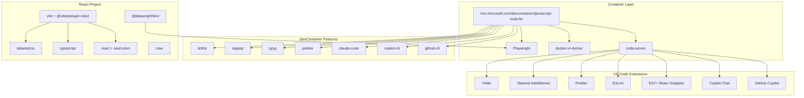
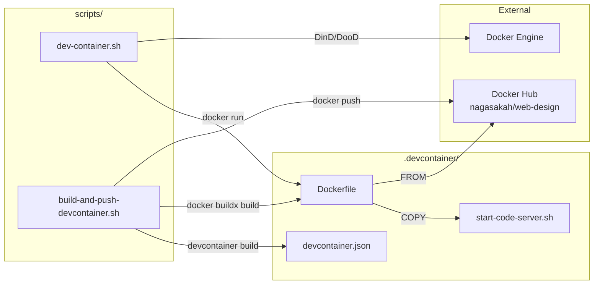

# 依存関係調査

## 概要

web-designリポジトリの構築に必要な依存関係を、devcontainer構成・Reactプロジェクト・開発ツールの3つの観点から分析する。

## 外部依存関係

### devcontainer features 依存

| Feature | バージョン | 提供元 | 用途 |
|---------|-----------|--------|------|
| `javascript-node:lts` | LTS | mcr.microsoft.com | ベースイメージ (Node.js含む) |
| `github-cli:1` | 1.x | ghcr.io/devcontainers | GitHub CLI |
| `playwright:0` | 0.x | ghcr.io/schlich | E2Eテスト |
| `jqyq:0` | 0.x | ghcr.io/larsnieuwenhuizen | JSON/YAML操作 |
| `docker-in-docker:2` | 2.x | ghcr.io/devcontainers | Docker DinD |
| `ripgrep:1` | 1.x | ghcr.io/jungaretti | 高速検索 |
| `prettier:1` | 1.x | ghcr.io/devcontainers-community | コードフォーマット |
| `shfmt:1` | 1.x | ghcr.io/devcontainers-extra | シェルフォーマット |
| `copilot-cli:1` | 1.x | ghcr.io/devcontainers | Copilot CLI |
| `claude-code:0` | 0.x | ghcr.io/stu-bell | Claude Code |

### Reactプロジェクト本番依存（dependencies）

| パッケージ | バージョン | 用途 |
|------------|-----------|------|
| `react` | ^19.x | UIフレームワーク |
| `react-dom` | ^19.x | React DOM レンダリング |
| `msw` | ^2.x | Mock Service Worker (APIモック) |

### Reactプロジェクト開発依存（devDependencies）

| パッケージ | バージョン | 用途 |
|------------|-----------|------|
| `typescript` | ^5.x | TypeScriptコンパイラ |
| `vite` | ^6.x | ビルドツール |
| `@vitejs/plugin-react` | ^4.x | Vite React プラグイン |
| `tailwindcss` | ^4.x | CSSフレームワーク |
| `@tailwindcss/vite` | ^4.x | Tailwind Vite統合 |
| `eslint` | ^9.x | リンター |
| `@playwright/test` | ^1.x | E2Eテスト |
| `@types/react` | ^19.x | React型定義 |
| `@types/react-dom` | ^19.x | ReactDOM型定義 |

### code-server 依存

| パッケージ | インストール方法 | 用途 |
|------------|-----------------|------|
| `code-server` | `curl -fsSL https://code-server.dev/install.sh \| sh` | ブラウザベースVS Code |

## 依存関係図

## 内部モジュール依存関係

### dev-container.sh の依存関係

### スクリプト間の依存

| モジュール | 依存先 | 依存理由 |
|------------|--------|----------|
| `dev-container.sh` | Docker Engine | コンテナ起動・管理 |
| `dev-container.sh` | `nagasakah/web-design:latest` | コンテナイメージ |
| `build-and-push-devcontainer.sh` | `devcontainer` CLI | ベースイメージビルド |
| `build-and-push-devcontainer.sh` | Docker Hub | イメージpush |
| `start-code-server.sh` | `code-server` | Web IDE起動 |
| `start-code-server.sh` | `/usr/local/share/docker-init.sh` | DinD初期化 |

## 循環依存の有無

- [x] 循環依存なし

新規プロジェクトのため循環依存は発生しない。依存関係は一方向の階層構造。

## バージョン制約・注意点

| 項目 | 制約内容 | 理由 |
|------|----------|------|
| Node.js | LTS (20.x or 22.x) | ベースイメージで決定 |
| Docker | 20.10+ | docker-in-docker feature要件 |
| Platform | linux/amd64 | dev-processと同様 |
| code-server | 最新安定版 | install.shで自動取得 |
| Playwright | ブラウザ依存バージョン | devcontainer featureで管理 |

## 備考

- dev-processは23個のfeaturesを使用しているが、web-designでは9個に絞り込み（Python, AWS, Terraform, tmux, Neovim, Deno, mssql-mcpを除外）
- code-serverはdevcontainer featureとしては公式提供されていないため、Dockerfile内でインストールする
- MSW (Mock Service Worker) はブラウザのService Workerを利用するため、code-server環境でのHTTPS要件に注意
